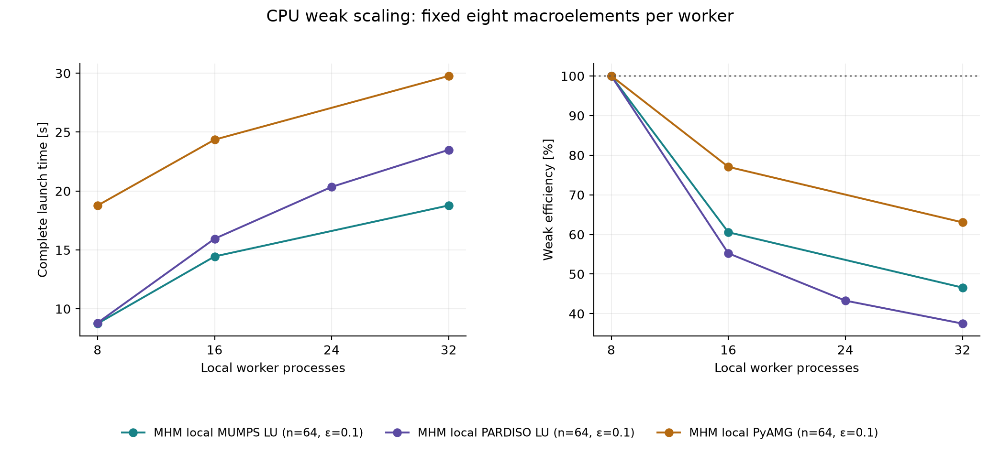
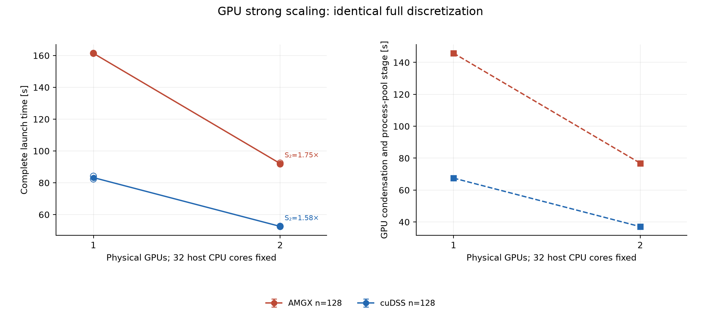

# Three-dimensional Darcy: CPU direct solvers and GPU local solves

This edition contains closed complete-workflow acquisitions and their executed-source,
resource, numerical-basis and physical-field provenance in [results.json](results.json).
The previous workspace/LU/AMG edition remains separate and unchanged. Historical
receipts reused as curve references are identified separately from new acquisitions.

The manufactured Darcy problem uses anisotropic multiscale permeability, homogeneous
pressure on the full exterior, local Q1 hexahedra and four Q1 modes on each unsplit
macroface. The material spatial period is ε=0.1. Domain Ω=(0,L)×(0,1)² has integer L;
macro width is 0.25. Pressure means follow the physical Dirichlet problem; there is
no imposed global zero mean. Physical Darcy flux is broken −K∇p, with no H(div)
or fine-cell conservation claim.

Complete launch clocks include setup, imports/native initialization, CPU/GPU pool
lifecycle, material assembly, fresh factors or hierarchies, transfers, all RHS solves,
device synchronization, ordered global work and field reconstruction. JIT compilation
is warmed separately. Physical norms and archives are outside competitive clocks.

CPU PARDISO comparisons state the suggested/observed MKL thread counts; local workers
use one native thread each. Classical PARDISO assembles native FEM on COMM_SELF and
permits a native pool of 32 throughout setup/assembly/solve, observes MKL32 at its sparse factor,
and has no MPI assembly decomposition; MHM32 assembles/solves in 32 spawned workers with
MKL1. Complete workflow comparisons retain their different assembly distributions and
executed environments, including each raw's SciPy version. They do not isolate a
solver-library or accelerator gain. GPU strong scaling fixes 32 host CPU cores. Heterogeneous
weak scaling grows from one GPU/16 host cores/L=1 to two GPUs/32 host cores/L=2,
retaining 64 macroelements and 16 host cores per GPU. Weak efficiency is T(base)/T(point).
GPU-process stage clocks are displayed separately from inclusive workflow clocks.

There are 46 selected raw receipts and 46 timed states.
The 40 new acquisitions each have their own physical norm control. Of six historical weak
samples, one has its own integrated norms and five retain null norms. All 32 new MHM states
have individual executed-basis and original-physical-row replay controls.
Reused curve baselines do not count as additional acquisitions. Configuration means
use all selected actual repetitions; extrema are observed ranges, not confidence intervals.

Each error marker belongs to that state's own integrated field. Missing norms remain
null. Pressure and vector-flux L2 norms remain separate; expanding-domain comparisons
also retain their norms divided by the square root of physical volume.

| Method | Permeability spatial period ε | n | L | Host CPU budget | GPUs | Workers/ranks | Samples | Mean complete time (s) | Observed range (s) |
| --- | ---: | ---: | ---: | ---: | ---: | ---: | ---: | ---: | ---: |
| Classical Q1 GAMG | 0.1 | 128 | 1 | 32 | 0 | 32 | 1 | 19.6763 | 19.6763–19.6763 |
| Classical Q1 GAMG | 0.1 | 192 | 1 | 32 | 0 | 32 | 1 | 65.3835 | 65.3835–65.3835 |
| Classical Q1 GAMG | 0.1 | 256 | 1 | 32 | 0 | 32 | 1 | 134.917 | 134.917–134.917 |
| Classical Q1 PARDISO LU | 0.1 | 64 | 1 | 32 | 0 | 1 | 2 | 27.0482 | 26.943–27.1534 |
| Classical Q1 PARDISO LU | 0.1 | 96 | 1 | 32 | 0 | 1 | 2 | 109.153 | 108.896–109.41 |
| Classical Q1 PARDISO LU | 0.1 | 128 | 1 | 32 | 0 | 1 | 1 | 351.072 | 351.072–351.072 |
| MHM local AMGX | 0.1 | 128 | 1 | 16 | 1 | 16 | 1 | 167.087 | 167.087–167.087 |
| MHM local AMGX | 0.1 | 128 | 1 | 32 | 1 | 32 | 2 | 161.353 | 161.259–161.447 |
| MHM local AMGX | 0.1 | 128 | 1 | 32 | 2 | 32 | 2 | 92.0829 | 91.7232–92.4427 |
| MHM local AMGX | 0.1 | 128 | 2 | 32 | 2 | 32 | 1 | 190.422 | 190.422–190.422 |
| MHM local AMGX | 0.1 | 192 | 1 | 32 | 2 | 32 | 1 | 235.615 | 235.615–235.615 |
| MHM local AMGX | 0.1 | 256 | 1 | 32 | 2 | 32 | 1 | 526.119 | 526.119–526.119 |
| MHM local MUMPS LU | 0.1 | 64 | 1 | 32 | 0 | 8 | 1 | 8.74676 | 8.74676–8.74676 |
| MHM local MUMPS LU | 0.1 | 64 | 2 | 32 | 0 | 16 | 1 | 14.4457 | 14.4457–14.4457 |
| MHM local MUMPS LU | 0.1 | 64 | 4 | 32 | 0 | 32 | 1 | 18.7764 | 18.7764–18.7764 |
| MHM local PARDISO LU | 0.1 | 64 | 1 | 32 | 0 | 1 | 1 | 43.0299 | 43.0299–43.0299 |
| MHM local PARDISO LU | 0.1 | 64 | 1 | 32 | 0 | 2 | 1 | 26.6546 | 26.6546–26.6546 |
| MHM local PARDISO LU | 0.1 | 64 | 1 | 32 | 0 | 4 | 1 | 14.8145 | 14.8145–14.8145 |
| MHM local PARDISO LU | 0.1 | 64 | 1 | 32 | 0 | 8 | 1 | 8.81014 | 8.81014–8.81014 |
| MHM local PARDISO LU | 0.1 | 64 | 1 | 32 | 0 | 16 | 1 | 6.16963 | 6.16963–6.16963 |
| MHM local PARDISO LU | 0.1 | 64 | 1 | 32 | 0 | 32 | 2 | 5.02379 | 4.95702–5.09056 |
| MHM local PARDISO LU | 0.1 | 64 | 2 | 32 | 0 | 16 | 1 | 15.9507 | 15.9507–15.9507 |
| MHM local PARDISO LU | 0.1 | 64 | 3 | 32 | 0 | 24 | 1 | 20.3517 | 20.3517–20.3517 |
| MHM local PARDISO LU | 0.1 | 64 | 4 | 32 | 0 | 32 | 1 | 23.4956 | 23.4956–23.4956 |
| MHM local PARDISO LU | 0.1 | 96 | 1 | 32 | 0 | 32 | 2 | 9.99463 | 9.96258–10.0267 |
| MHM local PARDISO LU | 0.1 | 128 | 1 | 32 | 0 | 32 | 1 | 21.5673 | 21.5673–21.5673 |
| MHM local PyAMG | 0.1 | 64 | 1 | 32 | 0 | 8 | 1 | 18.7695 | 18.7695–18.7695 |
| MHM local PyAMG | 0.1 | 64 | 2 | 32 | 0 | 16 | 1 | 24.3604 | 24.3604–24.3604 |
| MHM local PyAMG | 0.1 | 64 | 4 | 32 | 0 | 32 | 1 | 29.7701 | 29.7701–29.7701 |
| MHM local PyAMG | 0.1 | 128 | 1 | 32 | 0 | 32 | 1 | 50.6308 | 50.6308–50.6308 |
| MHM local PyAMG | 0.1 | 192 | 1 | 32 | 0 | 32 | 1 | 184.998 | 184.998–184.998 |
| MHM local PyAMG | 0.1 | 256 | 1 | 32 | 0 | 32 | 1 | 465.447 | 465.447–465.447 |
| MHM local cuDSS LU | 0.1 | 128 | 1 | 16 | 1 | 16 | 1 | 88.8314 | 88.8314–88.8314 |
| MHM local cuDSS LU | 0.1 | 128 | 1 | 32 | 1 | 32 | 2 | 83.2562 | 82.3285–84.184 |
| MHM local cuDSS LU | 0.1 | 128 | 1 | 32 | 2 | 32 | 2 | 52.5716 | 52.4159–52.7272 |
| MHM local cuDSS LU | 0.1 | 128 | 2 | 32 | 2 | 32 | 1 | 110.654 | 110.654–110.654 |
| MHM local cuDSS LU | 0.1 | 192 | 1 | 32 | 2 | 32 | 1 | 180.165 | 180.165–180.165 |
| MHM local cuDSS LU | 0.1 | 256 | 1 | 32 | 2 | 32 | 1 | 491.325 | 491.325–491.325 |

The measured one-spawn-process complete launch is the denominator. Worker axes use log2 spacing. Dotted curves give ideal T₁/P, speedup P and 100% efficiency. Open markers are actual raw samples; bars are observed extrema, not confidence intervals. The affinity exposes the declared host budget while native threads remain one per worker.

Integer x-domain lengths grow at fixed macro/local/trace resolution and permeability spatial period ε. Efficiency is the smallest acquired family's time divided by each point's time. MUMPS/PyAMG curves use separately identified previous-edition historical receipts; PARDISO uses the new acquisitions. Means use only actual repetitions of each configuration. Library versions and assembly distributions differ between these full workflows; the curves do not isolate a solver-library gain.

The left panel includes the full measured launch. Means use actual repetitions, whiskers show their observed extrema, and open markers identify raw samples; no confidence interval is estimated. The right is the separately clocked GPU-process stage inside those same acquisitions, including transfers, fresh factors/hierarchies, all RHS, synchronization and pool lifecycle.

Domain volume, local task count and host CPU budget double together. Each GPU retains 64 macroelements and 16 host cores. Weak efficiency uses T(base)/T(point), without an extra factor of two. Two devices permit a focused two-point observation, not an asymptotic multi-node claim.

GPU curves use two GPUs plus 32 host CPU cores; CPU curves use 32 host CPU cores without a GPU. The unit cube, permeability spatial period and each method's approximation conventions stay fixed as the fine grid changes. Times include each complete measured workflow. This is a grid-size sweep, not weak scaling or an equal-accuracy comparison; the actual classical conforming reference and MHM spaces differ.

Timing bars use configuration means; whiskers show observed sample extrema, not confidence intervals. Error markers use only the actual timed state's own integrated field and its own raw time. States without norms appear only in the timing panel. Classical PARDISO uses COMM_SELF native FEM assembly plus MKL32; MHM uses parallel spawn assembly/local solves. Executed environments and SciPy/native libraries are preserved per raw. These are full-workflow comparisons, not isolated backend or accelerator gains. Equal fine elements and CPU budgets do not imply equal approximation spaces or accuracy; GPU configurations add their explicitly stated devices.

Only sequential parent-stage wall clocks are stacked. Parallel worker sums are excluded. The residual clock interval is explicitly labeled launch/import/export/other rather than assigned to an unmeasured operation. Samples remain individually identified in results.json; phase stacks are not sums of separate median measurements.

Equal fine-element or CPU budgets do not establish equal MHM/classical accuracy.
The fixed macro/trace spaces can impose a pressure-error floor as local meshes refine.
These are finite node-local observations; two GPUs do not establish asymptotic or
multi-node scaling. Native libraries/factor profiles differ and are stated explicitly.
Large GPU cases without completed CPU counterparts report absolute throughput only.

[Gomes et al.](https://arxiv.org/abs/1703.10435) motivate independent local work;
the present hexahedral manufactured application differs from their cluster experiment.
[Penna et al.](https://doi.org/10.1002/cpe.5170) motivate workload-aware scheduling;
their performance gains are not assigned to this implementation.
