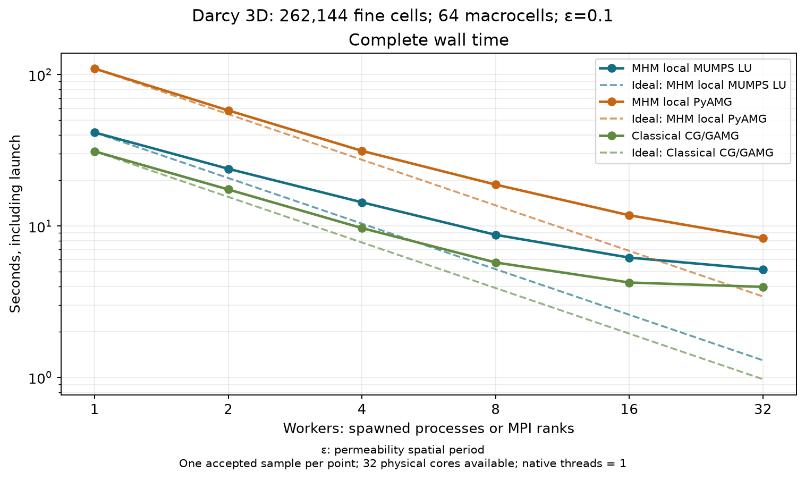
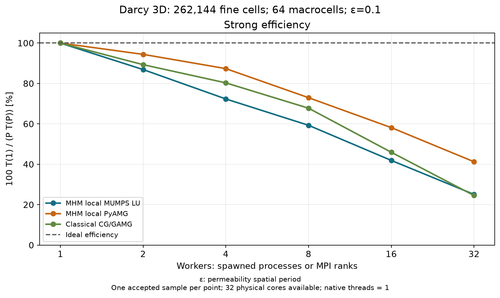
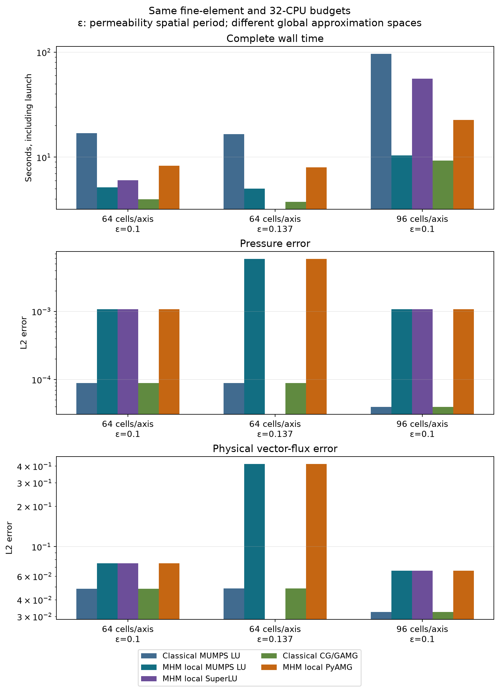

# Three-dimensional Darcy: reusable native workspaces, LU and AMG

This record accompanies the explicit-UFL
[introductory notebook](https://github.com/ipes-lncc/pymhm/blob/main/notebooks/introduction/darcy_3d_parallel_scalability.ipynb)
and [case description](https://ipes-lncc.github.io/pymhm/cases/darcy-3d-scalability/).
It contains actual complete-workflow samples with their physical data,
resource counts, software/source/lockfile digests, executed-basis archive
digests, replay controls and independent numerical checks in [results.json](results.json).

The analytical problem uses anisotropic multiscale permeability, full zero
pressure Dirichlet data, Q1 local hexahedra and unsplit Q1 macroface traces.
Periods 0.1 and 0.137 are distinct physical cases. Each macrocell assembles its
own material matrix and source and constructs its own factors or hierarchy.
Native geometry, spaces, UFL kernels and buffers can be reused within a
compatible worker; geometry-only trace/moment blocks contain no material.
There is no factor or response reuse between material operators.

Complete launch times include parent/child imports, native initialization,
setup, assembly, fresh solves, transfers, synchronization, global work and
reconstruction. They exclude subsequent physical norm integration, archives
and plots. Compiler warmup uses the existing cache; cold FFCx/JIT compilation
is a separate experiment. RSS values are process high-water marks, not a
measured simultaneous aggregate peak. Recorded acquisition digests identify
the actually executed source for each sample.

## Strong scaling

Strong scaling fixes the full period-0.1 unit-cube discretization: 262,144 fine
cells, 64 macrocells, Q1 volume/face spaces and 1,024 coupled coordinates.
Each MHM curve uses one spawned process as its denominator, with fresh imports
and worker setup. MHM configurations expose the same 32 physical cores with
one native thread per worker. The classical CG/GAMG curve uses its own one-MPI-
rank denominator and assigns one physical core per rank. Actual process/rank
counts are 1, 2, 4, 8, 16 and 32. A serial call without a spawned worker is a
different timing configuration.

| Local solver | Processes | Complete launch time (s) | Self-speedup | Efficiency (%) |
| --- | ---: | ---: | ---: | ---: |
| MHM MUMPS LU | 1 | 41.4881 | 1.000 | 100.00 |
| MHM MUMPS LU | 2 | 23.8736 | 1.738 | 86.89 |
| MHM MUMPS LU | 4 | 14.3390 | 2.893 | 72.33 |
| MHM MUMPS LU | 8 | 8.7468 | 4.743 | 59.29 |
| MHM MUMPS LU | 16 | 6.1865 | 6.706 | 41.91 |
| MHM MUMPS LU | 32 | 5.1665 | 8.030 | 25.09 |
| MHM PyAMG | 1 | 109.5554 | 1.000 | 100.00 |
| MHM PyAMG | 2 | 58.0224 | 1.888 | 94.41 |
| MHM PyAMG | 4 | 31.3542 | 3.494 | 87.35 |
| MHM PyAMG | 8 | 18.7695 | 5.837 | 72.96 |
| MHM PyAMG | 16 | 11.7759 | 9.303 | 58.15 |
| MHM PyAMG | 32 | 8.2986 | 13.202 | 41.26 |

Complete measured wall time and ideal T(1)/P references; markers identify acquired configurations.

Strong process self-speedup, with the ideal linear reference.

Strong efficiency S(P)/P: startup, transfers and global work remain in the total.

Complete workflow phase fractions and actual elapsed seconds; local/ordered assembly includes independent material solves and worker communication.

## Focused weak scaling

Within each curve, macro width is 0.25, fine-cell width is 1/64, the material
period and trace degree stay fixed, and both fine and macro cells per process
are constant. The x-domain expands through integer lengths. Four- and
eight-macrocell-per-process families remain separate. The baseline is the
smallest actually measured process count in that family, not an assumed
one-process run. Efficiency is its complete time divided by the measured
larger-domain time. Growth of the skeleton and global solve remains included.
These short curves establish focused node-local observations, rather than
asymptotic or multi-node weak scalability.

| Permeability spatial period, ε | Local solver | Macrocells / process | Processes | Box length | Fine cells | Coupled coordinates | Complete launch time (s) | Weak efficiency (%) |
| ---: | --- | ---: | ---: | ---: | ---: | ---: | ---: | ---: |
| 0.1 | MHM MUMPS LU | 8 | 8 | 1 | 262,144 | 1,024 | 8.7468 | 100.00 |
| 0.1 | MHM MUMPS LU | 8 | 16 | 2 | 524,288 | 1,984 | 14.4457 | 60.55 |
| 0.1 | MHM MUMPS LU | 8 | 32 | 4 | 1,048,576 | 3,904 | 18.7764 | 46.58 |
| 0.1 | MHM PyAMG | 4 | 16 | 1 | 262,144 | 1,024 | 11.7759 | 100.00 |
| 0.1 | MHM PyAMG | 4 | 32 | 2 | 524,288 | 1,984 | 20.0016 | 58.87 |
| 0.1 | MHM PyAMG | 8 | 8 | 1 | 262,144 | 1,024 | 18.7695 | 100.00 |
| 0.1 | MHM PyAMG | 8 | 16 | 2 | 524,288 | 1,984 | 24.3604 | 77.05 |
| 0.1 | MHM PyAMG | 8 | 32 | 4 | 1,048,576 | 3,904 | 29.7701 | 63.05 |
| 0.137 | MHM MUMPS LU | 4 | 16 | 1 | 262,144 | 1,024 | 6.3699 | 100.00 |
| 0.137 | MHM MUMPS LU | 4 | 32 | 2 | 524,288 | 1,984 | 13.5564 | 46.99 |

Focused weak complete wall time and efficiency; each legend identifies its fixed work per process.

## Cost and physical accuracy

| Permeability spatial period, ε | Fine cells per unit axis | Method | Processes / ranks | Complete launch time (s) |
| ---: | ---: | --- | ---: | ---: |
| 0.1 | 64 | Classical PETSc CG/GAMG | 32 | 3.9623 |
| 0.1 | 64 | Classical PETSc PREONLY/LU/MUMPS | 32 | 16.8697 |
| 0.1 | 64 | MHM MUMPS LU | 32 | 5.1665 |
| 0.1 | 64 | MHM PyAMG | 32 | 8.2986 |
| 0.1 | 64 | MHM SuperLU | 32 | 6.0051 |
| 0.137 | 64 | Classical PETSc CG/GAMG | 32 | 3.7496 |
| 0.137 | 64 | Classical PETSc PREONLY/LU/MUMPS | 32 | 16.6027 |
| 0.137 | 64 | MHM MUMPS LU | 32 | 5.0159 |
| 0.137 | 64 | MHM PyAMG | 32 | 7.9710 |
| 0.1 | 96 | Classical PETSc CG/GAMG | 32 | 9.2592 |
| 0.1 | 96 | Classical PETSc PREONLY/LU/MUMPS | 32 | 96.3061 |
| 0.1 | 96 | MHM MUMPS LU | 32 | 10.4146 |
| 0.1 | 96 | MHM PyAMG | 32 | 22.5916 |
| 0.1 | 96 | MHM SuperLU | 32 | 56.0215 |

At matched 32-physical-core and fine-element budgets, local MUMPS MHM is
3.27× faster than classical distributed MUMPS at 64 cells per unit
axis and 9.25× faster at 96. The period-0.137 LU comparison gives
3.31×. These are measured workflow ratios for different approximation
spaces, with the physical errors shown alongside them. They are not
equal-accuracy speedups.

Classical distributed CG/GAMG remains faster than both MHM local MUMPS and
MHM local PyAMG at the measured unit-cube resolutions. The favorable LU
comparison therefore does not establish an advantage over the best classical
solver measured here. Each timing point is an actual completed sample;
no confidence interval or variance estimate is inferred.

| Permeability spatial period, ε | Fine cells per unit axis | Approximation | Pressure L2 error | Physical vector-flux L2 error |
| ---: | ---: | --- | ---: | ---: |
| 0.1 | 64 | Conforming Q1 | 8.8900421e-05 | 4.8283419e-02 |
| 0.1 | 64 | MHM; macro4 / traceQ1 | 1.0714369e-03 | 7.5135753e-02 |
| 0.137 | 64 | Conforming Q1 | 8.9063230e-05 | 4.8612283e-02 |
| 0.137 | 64 | MHM; macro4 / traceQ1 | 5.8898023e-03 | 4.1392472e-01 |
| 0.1 | 96 | Conforming Q1 | 3.9629110e-05 | 3.2451356e-02 |
| 0.1 | 96 | MHM; macro4 / traceQ1 | 1.0801716e-03 | 6.6169010e-02 |

Fine-element and 32-CPU budget comparisons display time, pressure error and physical vector-flux error together. Approximation spaces differ. Empty solver slots are unmeasured configurations; absent field integrals are labeled explicitly.

Pressure and vector-flux errors are integrated separately against the exact
fields. Refining only local volume meshes with a fixed macro grid and Q1
trace leaves a pressure-error floor: the period-0.1 MHM pressure error stays
near 1.08e-3 while the flux error decreases. This is a local-resolution
performance sweep, not complete MHM convergence. The nonaligned period
changes both volume and face permeability and gives larger MHM field errors
in the same fixed trace space. Its interface-resolution study is a separate
experiment; the aligned case's accuracy is not transferred to these data. The conforming method's own refinement and quadrature
controls remain independent of the performance ratios.

## Numerical and acquisition controls

Fresh native assembly is compared with workspace assembly, including material
change-and-return, oriented trace maps, declared constant kernels, physical
moments and source/trace responses. Serial/process fields and persisted-basis
replay are checked. The nonaligned material has 64 distinct operators.
Original physical rows are checked independently of pressure/flux accuracy;
roundoff-scale constant-kernel quotients are recorded separately. No global
zero-mean pressure gauge is imposed with full Dirichlet data.

Independent conforming native references use the same operator, fine grid,
material and boundary conditions. Their source, direct/AMG agreement,
refinement and physical error quadrature are checked separately. These native
reference sources are independent from the MHM local adapter.

There is no accepted complete 128-per-axis or large GPU timing in this edition.
Small native accelerator controls verify availability and equations; they do
not establish a competitive complete-workflow GPU gain. The measured node-local
curves establish neither multi-node efficiency nor a matched reproduction of
published cluster measurements.
