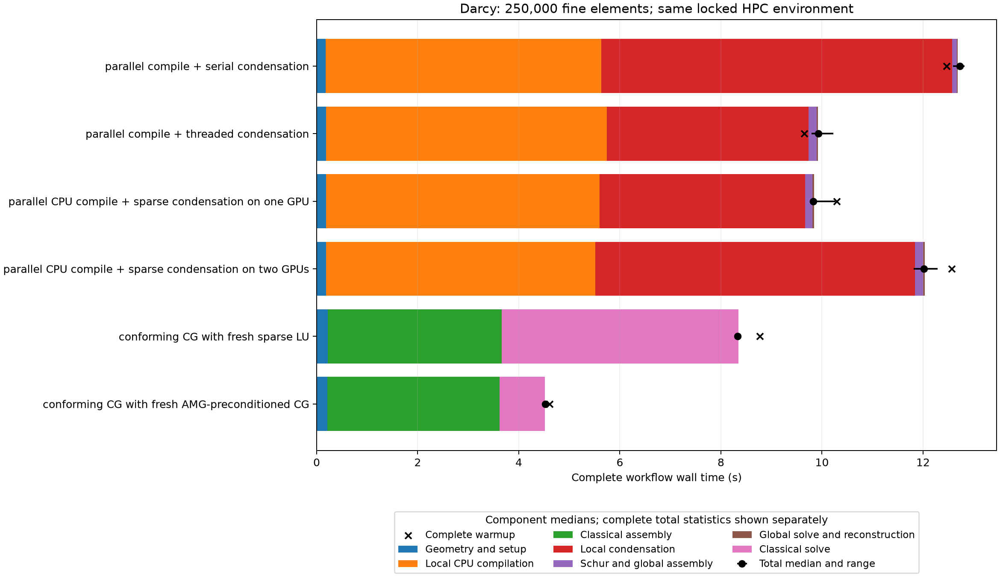
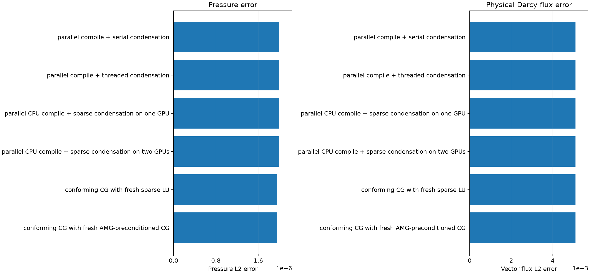
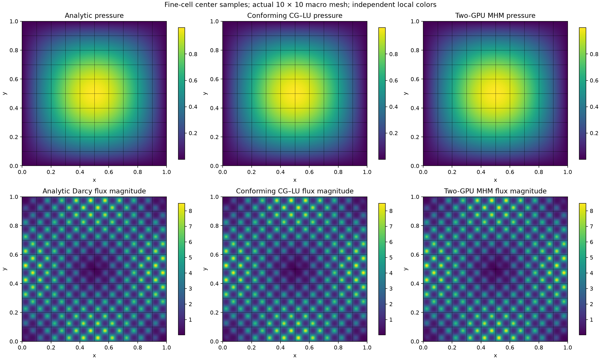
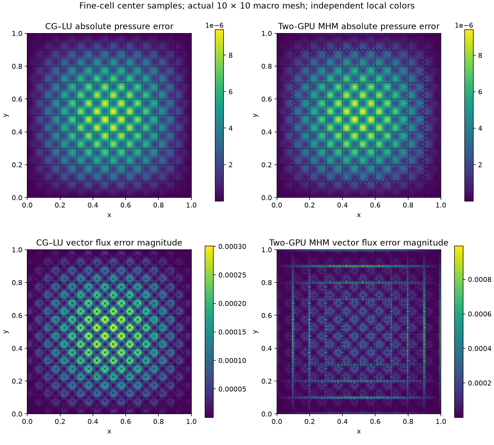

# Darcy condensation on one and two GPUs

This complete node-local comparison uses the explicit Darcy definitions in
[`darcy_parallel_scalability.ipynb`](../../../../notebooks/introduction/darcy_parallel_scalability.ipynb).
The same permeability, manufactured source and homogeneous pressure data are
used in all six routes. There are 100 macroelements, 50 × 50 local Q1 elements,
continuous P1 traces on four segments per macroface, 1,100 trace coordinates and
100 retained constants. The conforming Q1 references have the same 250,000 fine
elements and use independently assembled sparse LU or AMG-preconditioned CG.
Equal element counts do not make the approximation spaces identical.

| Complete workflow | Median (s) | Observed range (s) |
| --- | ---: | ---: |
| parallel compile + serial condensation | 12.7312 | 12.5936–12.8184 |
| parallel compile + threaded condensation | 9.9323 | 9.7955–10.2209 |
| parallel CPU compile + sparse condensation on one GPU | 9.8241 | 9.8233–10.2653 |
| parallel CPU compile + sparse condensation on two GPUs | 12.0204 | 11.8180–12.2896 |
| conforming CG with fresh sparse LU | 8.3301 | 8.3002–8.3584 |
| conforming CG with fresh AMG-preconditioned CG | 4.5209 | 4.5084–4.5417 |

All routes use the same locked HPC environment in one process. Each configuration
has a complete warmup followed by three fresh randomized repetitions. Complete
MHM timers include geometry, immutable face-length snapshots, compilation on eight
CPU workers, factorization, host/device transfers, synchronization, executor
shutdown, Schur/global assembly, global solution and local reconstruction. Native
BLAS/OpenMP threads are one. The staged CPU route with serial condensation still
compiles on eight workers; it is not a serial complete workflow. Compilation and
condensation do not overlap in this comparison. The separate CPU scalability
notebooks measure the rolling complete CPU pipeline.

The generic `condense_multi_gpu` API receives the unchanged compiled local
problems with devices `(0,)` or `(0, 1)`, four problems per bounded device batch,
and `solver="cudss"`. Every run creates fresh operators and factors. Native cuDSS
host entry is protected by the shared factorization owner, while device kernels
and transfers retain their ordinary stream behavior. Complete timings include
this host coordination. No isolated kernel timing or multi-node result is claimed.
The response-based global assembly route is valid here because all direct local
D/g and global equation terms are exactly zero; its matrix and fields are checked
against complete `MultiscaleProblem` assembly.

The recorded AMG-time/MHM-time ratios are 0.4602 for one GPU and
0.3761 for two GPUs. A ratio below one is a regression. The two-GPU
MHM/AMG analytic-error ratios are 1.022454 for pressure and
1.000375 for vector physical Darcy flux. These measured values qualify
the timing comparison; no general GPU speedup is inferred.

All original local/global equations, physical means, boundary data and CPU/GPU
field comparisons pass the recorded checks. Physical errors are absolute L2
norms on the full 500 × 500 fine partition with Gauss orders five and six.
The broken-gradient Darcy flux is not asserted to be H(div) conforming. Arrays
and executed nodal/retained bases are archived privately; their digests and
verified BLAS1/2 reconstruction and equivalent retained-sign replay are recorded.
Large coefficient archives and private acquisition drivers are excluded from this
compact publication. External physical diagnostics may be reused only for exact
state fingerprints; original equation and coefficient checks run after every
fresh stopped timer. No CPU/GPU bitwise agreement is claimed.

Initial Python/native library setup and all complete warmups remain separately
visible in the JSON provenance. Assembly/solve stages include all classical LU
and fresh AMG hierarchy/preconditioner setup. Solver tolerances remain rtol 1e-10
and atol zero. Accuracy integration, source hashing, plotting and archival are
uniformly outside measured timers. The JSON records versions, hardware, native
threads, random schedules, source/basis/lockfile digests, warmups and raw samples.

The spatial plots use fine-cell center samples, independent flat cell colors and
the actual macro mesh on analytic, numerical and error panels. The color field
does not merge reconstructed values across macrofaces. These center samples
display fields; the reported norms use the stated Gauss quadrature.
Center samples may underrepresent variation of the fine-cell gradient error.
The integrated vector flux error, rather than the center color scale, determines
the reported accuracy comparison.
Field sampling runs in the measured locked HPC environment and verifies its
executed nodal basis against the archived matrix. Rendering then draws these
sampled arrays in the locked introduction environment. It does not reevaluate
fields in a different native basis. No solve, reference or timed comparison is
recomputed during sampling or drawing.
Stage segments show individual medians; their sum need not equal the separately
plotted complete total median. Three repetitions provide an observed range,
not a confidence interval or a claim of statistical significance.

