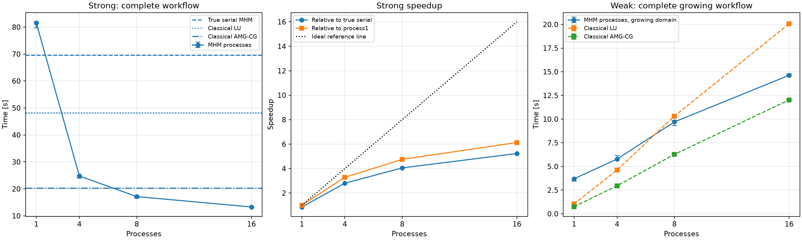

# Darcy: complete spawn-process workflows

These are the numerical records and figures from the fully executed
[process tutorial](../../../../notebooks/introduction/darcy_process_scalability.ipynb)
on 2026-10-04. `measurements.json` is an exact copy of its final output;
`execution_validation.json` checks the literal executed cells, source hashes,
sample counts, original equations and saved-basis replay. The seven figures
are exact copies of the notebook outputs. `SHA256SUMS` identifies every file.

The campaign has 23 separately recorded warm-ups and 69 measured workflows:
one warm-up and three fresh repetitions per configuration, with randomized
order within each repetition. Eleven scientific controls precede or accompany
the campaign separately. All samples remain in the record.

## Physical problem and approximation

The material is `K(x,y) = exp(sin(2*pi*x/0.1)*sin(2*pi*y/0.1))`, the exact
pressure is `sin(pi*x)*sin(pi*y)`, and the independently differentiated source
is `-div(K*grad(p))`. Pressure vanishes on the exterior of every tested
rectangle. The weak domains are `(0,L) x (0,1)` for integer `L = 1,4,8,16`;
physical coordinates, material period and analytical data stay fixed.

Executed UFL forms declare the local operator, source, constant kernel, mean
moments and signed interface coupling before the generic assembly kernels.
The notebook exports its literal provider dependencies once into a temporary
importable module and uses PyMHM's generic `backend="process"` with real
`spawn` workers. The study selects bounded, ordered rolling submission through
`pipeline=True`; the package's default atomic batches remain available.

The strong case has 100 macroelements on a 10 x 10 mesh, 100 x 100 local fine
rectangles per macroelement, Q1 local pressure, and eight continuous P1
segments per macroface. Its coupled MHM system has 2,080 unknowns. The matched
conforming Q1 references use the same one million fine rectangles and have
998,001 free unknowns after exterior pressure elimination. Local refinement
and every local solve remain part of the MHM cost.

The smaller case has 500 x 500 fine rectangles, 50 x 50 local refinement and
four trace segments. Weak scaling keeps 100 macroelements and 40,000 local
fine rectangles per process, with `H=0.1`, `h=0.005` and four trace segments;
it extends the physical rectangle instead of changing resolution.

## Inclusive timing and measured results

Each workflow constructs fresh geometry, providers, physical operators,
factors and complete local responses. `total` includes setup, fresh worker
startup/imports, serialization, complete response transfer, ordered global
assembly, pool join, global solve and reconstruction. Classical LU and AMG-CG
also receive fresh operators and factors. No response or solver factor is
reused between samples.

One-time parent imports (1.43177 s) and literal export/import (0.08804 s) are
reported separately. `cold_total` adds those shared notebook costs to a
workflow with the parent environment already initialized; it does not measure
a cleared DOLFINx JIT cache. Fresh worker imports are inside every process
workflow. Physical integration and scientific checks occur after its timer.

Strong medians and full three-sample ranges, in seconds:

| Method, one million fine rectangles | Median | Minimum | Maximum |
| --- | ---: | ---: | ---: |
| True serial MHM | 69.5312 | 69.4734 | 69.6088 |
| MHM, one spawn process | 81.5045 | 79.7030 | 81.9477 |
| MHM, four processes | 24.7724 | 23.9579 | 24.8142 |
| MHM, eight processes | 17.1400 | 16.5206 | 17.1876 |
| MHM, sixteen processes | 13.2868 | 13.2433 | 13.4280 |
| Fresh conforming LU | 48.1815 | 47.8659 | 48.3508 |
| Fresh conforming AMG-CG | 20.2472 | 20.1320 | 20.4239 |

Sixteen processes give 5.23 times the speed of true serial MHM, 3.63 times
the speed of conforming LU and 1.52 times the speed of conforming AMG-CG in
this case. One spawn process is slower than true serial execution. On
500 x 500 fine rectangles, process8/process16 medians are 6.1531/7.3855 s,
versus LU 8.1185 s and AMG-CG 4.5399 s: sixteen processes regress relative to
eight, and neither process configuration beats AMG-CG.

Weak medians, in seconds, include the larger global solve on every domain:

| Processes / rectangle length | MHM processes | Fresh LU | Fresh AMG-CG |
| ---: | ---: | ---: | ---: |
| 1 | 3.6913 | 1.0432 | 0.7450 |
| 4 | 5.7783 | 4.6160 | 2.9541 |
| 8 | 9.7036 | 10.3179 | 6.2766 |
| 16 | 14.6314 | 20.0744 | 12.0251 |

Weak time increases; measured weak efficiency is about 0.252 at sixteen
processes. AMG-CG is faster on every weak domain. These measurements describe
this workload and machine, and do not establish ideal scaling or a universal
advantage of MHM.




## Physical accuracy and replay

The conforming references independently refine through 200, 500 and 1,000
cells per unit axis. Pressure errors decrease with observed rates
1.99878/1.99977; physical vector-flux errors decrease with rates
0.99749/0.99952. Five- and seven-point tensor Gauss integration agree within
the declared relative `1e-3` and absolute `1e-12` criteria on a resolving
common partition.

In the strong case, MHM/CG-LU exact-error ratios are 1.002511 for pressure and
1.00004668 for physical Darcy flux. Serial-to-process physical differences
are `2.31384e-17` and `5.27699e-14`, respectively. All MHM operator, numerical
basis and global-coordinate digests match their serial controls exactly.
Reconstruction differs by at most `2.22045e-16`; every original local row
passes the unchanged solver criterion `rtol=1e-10, atol=0`. The largest
aggregated original-row relative residual is `2.60953e-12`.

The archived source/lifts, retained matrices, trace maps, physical geometry
and ordered native interval factors reproduce the represented fields.
Coefficient reconstruction and a consistent retained-basis sign rotation
pass with BLAS1 and BLAS2. The principal native-basis physical replay runs
under both settings: pressure/flux L2 differences are
`4.23973e-17`/`1.02120e-15`. Additional weak/crossover archives pass coefficient
reconstruction with both settings and a separate physical native-basis replay.
Archive digests and the stated roundoff bounds are in the records. The large
arrays are regenerated by the notebook under `build/introduction/` and are
excluded from this result directory.

Darcy flux here means the broken physical field `-K*grad(p)`. Its error panels
show the magnitude of the vector-flux error. Macro conservation and a raw
gradient reconstruction do not imply fine-cell conservation or H(div)
continuity. Every spatial panel overlays the actual macro mesh; independent
one-sided samples preserve macroface breaks and each panel has its own
colorbar.


[Pressure fields](figures/pressure_fields.png),
[Darcy flux fields](figures/flux_fields.png) and
[all strong stage costs](figures/strong_stage_costs.png) are available at their
original publication resolution.

## Reproducibility

The source notebook SHA256 is
`7fccf9f73578314f36242533339551f54d94c5a238effd0117bca8748b458269`;
the lockfile SHA256 is
`c54e433e408e8345516023d96526b305d09452a55d53c018ea6ea529535df9fd`.
All 175 Python runtime-owner hashes are recorded and unchanged across the
execution. The machine exposes 64 logical CPUs with affinity 0-63 and no
detected CPU quota. Parent and worker native thread limits are one; BLIS
2.0 and the OpenMP settings are recorded per sample. Versions are NumPy
2.5.3, SciPy 1.18.1, Basix/DOLFINx 0.9.0, PyAMG 5.3.0 and threadpoolctl 3.7.0.

Run the complete self-contained notebook with the checked lockfile:

```bash
pixi run -e introduction python scripts/run_notebooks.py notebooks/introduction/darcy_process_scalability.ipynb --timeout 1800
```

Numerical checks run in every execution. Hardware-specific timing values may
vary; the record includes raw samples, warm-ups, stage costs, CPU affinity,
native libraries, resource snapshots and source provenance for comparison.
