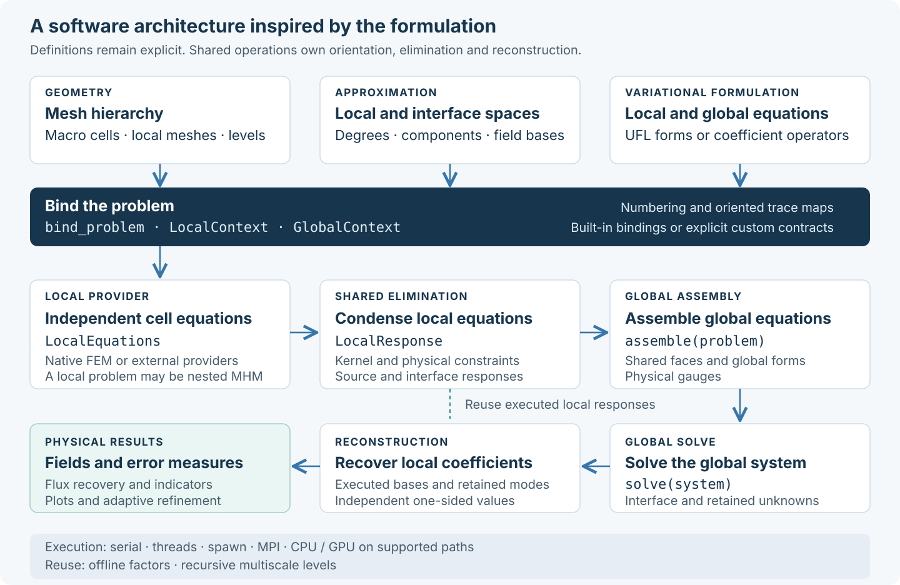

# Architecture

## General abstractions



The user's workflow defines meshes and spaces, writes local and global
equations, assembles, solves and evaluates physical fields. `bind_problem`
connects those definitions to the shared multiscale operations. Built-in
interface bindings provide numbering and orientation; custom spaces may supply
their own declared maps. Physical boundary variables and the mathematical
operator remain part of the user's equations.

A local provider supplies equations and ordinary field metadata. It can use
UFL/DOLFINx, PyMHM's finite-element operations, an external solver or another
multiscale problem. Condensation, ordered global reduction and reconstruction
have shared owners. Execution and solver settings select supported backends
without changing that mathematical interface; individual backends retain their
documented space, matrix and platform restrictions.

The reconstruction uses the executed local responses and basis descriptors.
Flux recovery and indicators consume the reconstructed fields; they can drive
another refinement cycle. Offline factors reuse unchanged operators, and nested
local problems repeat the same workflow at another scale.

Follow the [feature overview](tutorials/overview.md) for a first calculation,
the [method tutorials](tutorials/index.md) for formulations and
the [source-generated API](api.md) for exact contracts.

## Package responsibilities

The runtime is organized by numerical responsibility. Variational records,
element assembly, hybrid elimination, execution and linear solves have
independent owners. Predefined physical formulations compose
these operations and preserve the established discretizations and field data
contracts.

| Package | Responsibility |
| --- | --- |
| `core` | Mesh/space bindings, variational contexts, local equations, condensation, reconstruction and global hybrid assembly. |
| `fem` | Basix reference elements, scalar/vector operators, H(div) spaces, traces and material quadrature. |
| `meshes` | Geometry, incidence, local submeshes and conforming refinement. |
| `materials` | Material laws, discontinuous coefficients and separable source fields. |
| `_legacy.models` | Predefined Darcy, flow, elasticity, transport and wave formulations. |
| `methods` | Robin MH, three-field MH²M, MsHHO and residual Petrov–Galerkin constructions. |
| `recovery` | Equilibrated and moment-based physical flux reconstruction. |
| `estimators` | Field indicators and error estimators with their stated admissibility conditions. |
| `adaptivity` | Marking, refinement decisions and adaptive solve policies. |
| `linalg` | Sparse factors, block solves and separable iterative operators. |
| `execution` | Ordered CPU batches, MPI assembly and accelerator execution. |
| `backends` | Optional native space bindings, trace/global form adapters, compilation and reusable workspaces. |
| `io` | Mesh/material exchange and executed-source fingerprints. |
| `postprocessing` | Named fields with their executed basis, evaluation and optional visualization. |

The private `_legacy.models` subpackages contain the predefined physical
solvers used internally by the verified cases. User-written problems use the
generic variational interface. A geometry object stores topology and mappings; forms
declare its physical operator, and a solver or estimator consumes the resulting
operators without owning the basis construction. Scientific cases,
manufactured data, campaign helpers and publication plots belong outside the
runtime, with notebooks as their public entry points.

The root resolves exports on demand, and its `__init__.pyi` declares the typed
generic variational and numerical API. `__all__` and `dir(pymhm)` expose those
same infrastructure names. Physical and method-specific operations are
imported from their canonical submodules. Shared numerical operations likewise
import their owners directly. The main problem-definition path binds `MeshHierarchy`, an interface space
and user-written local/global forms with `bind_problem`. `LocalContext` and
`GlobalContext` supply representation details. Fully explicit `Equation`,
`LocalEquations` and `MultiscaleProblem` remain available; `assemble` and `solve`
operate on both descriptions. The [variational guide](variational.md) states their
mathematical conventions and compilation limits.

## Data and operations

Problem descriptions, execution settings, local responses and solutions are
separate objects. Numerical operations are free functions; the existing
`LocalProblem`, `LocalResponse` and `HybridSystem` methods delegate to the same
implementations. Both interfaces use the same represented operators, oriented
maps, executed retained bases and residual checks.

| Responsibility | Objects | Functions |
| --- | --- | --- |
| Bind mesh-associated problems | `MeshHierarchy`, `BoundInterface`, `BoundProblem`, `LocalContext`, `GlobalContext` | `bind_interface`, `bind_problem` |
| Declare custom coefficient conventions | `InterfaceSpace`, `TraceBinding` | `bind_local_equations` |
| Evaluate executed physical fields | `FieldDefinition`, `DiscreteField` | `solution_field`, `evaluate_field` |
| Describe local and global forms | `Equation`, `LocalEquations` | `columns`, `rows`, `compile_form`, `compile_local_equations` |
| Assemble a variational hierarchy | `MultiscaleProblem`, `NestedEquations` | `assemble`, `solve` |
| Reuse and recover an assembled hierarchy | `MultiscaleSystem`, `MultiscaleSolution` | `with_global_load`, `with_global_equation`, `solve_multiscale_system`, `reconstruct_multiscale`, `leaf_moment` |
| Describe fixed hybrid forms | `LocalForm`, `GlobalForm`, `HybridProblem` | `compile_local_forms`, `assemble_hybrid`, `solve_hybrid` |
| Execute independent cells | `ExecutionConfig`, callable provider | `iter_local`, `map_local` |
| Eliminate and reconstruct | `LocalResponse`, `SolverConfig` | `condense_local`, `energy_reconstruction`, `local_condensation_system`, `reconstruct_local`, `reconstruct_response` |
| Reduce and solve global equations | `HybridSystem`, `HybridSolution` | `local_global_contribution`, `assemble_hybrid_contributions`, `solve_hybrid_system`, `hybrid_mean_constraint` |

Each formula has one owner. Offline factors, GPU batching, refinement and
physical drivers reach that owner through object methods or the
free functions. A factorization remains an object with an explicit lifetime;
it owns native resources rather than defining the physical problem.

Within `core`, `contracts` owns validated coefficient records, `condensation`
owns constrained local elimination, `reconstruction` owns recovered local
coefficients, and `contributions` owns oriented sparse reduction. `system`
combines these operations for the assembled problem; `assembly` coordinates
ordered local providers. The classes in `contracts` and `system` store data
and offer methods that delegate to these same free functions.

`equations` owns the four variational blocks, ordered trial/test trace maps and
form compilation. `multiscale` composes those blocks with an additional global
equation, ordered execution and recursive reconstruction. It delegates local
elimination to the same numerical owners. `moments` owns reconstruction under
declared physical moments; its saddle solve belongs to `linalg.moments`.
The optional `backends.forms`
adapter assembles user-defined UFL matrices and vectors; it selects no physical
equation or boundary convention.

`MultiscaleSystem.solve`, `reconstruct` and `with_rhs` delegate to the
corresponding free functions. A global load update reuses the executed local
responses and their literal bases; retained source-compatibility rows remain
unchanged. Changing a volume source requires new local equations or explicitly
cached local factors. `OfflineMultiscaleSystem` owns those factors and updates
volume sources, local balance loads and the additional global functional while
preserving executed harmonic lifts, metadata and field maps. It is independent
of a physical problem or time integrator.
`with_global_equation` adds an independent operator and load after local
responses are available, including an explicitly assembled jump of reconstructed
fields. It returns a new system and preserves the executed bases and children.

## Mesh-associated variational contexts

`core.spaces` owns portable interface maps and the structural custom-space
contract. `core.context` binds macro/local meshes, user forms and declared
retained dimensions to the existing `MultiscaleProblem`; it implements no new
condensation or solver. A worker creates `LocalContext` for one macroelement,
compiles the user's independent pairings and releases local native bindings.
`GlobalContext` supplies interface boundary moments, selectors and supported
native global forms. Geometric signs are transported once; physical signs and
trial/test relations remain explicit.

`backends.spaces` binds supported portable meshes to user-selected native
spaces. Nodal coordinate conversion uses incidence and Basix reference
interpolation data. H(div)/H(curl) moment coordinates retain their declared
native conventions. `backends.traces` binds supported edge and triangular
traces and additional global interface UFL forms. Custom spaces may supply
those capabilities independently; unsupported couplings fail explicitly.

`postprocessing.fields` associates reconstructed vectors with named fields,
meshes, components, declared affine local/trace reconstructions and executed
basis descriptors.
Its free functions own evaluation and the solution's convenience `field`
method delegates to them. Independent one-sided values are preserved.

`ComponentTraceSpace` preserves a scalar interface layout and interleaves
Cartesian components. Tangential traces instead retain their declared physical
frames. The general trace integration owner supplies Gram operators, linear
functionals and projections in these same coordinates; it chooses no PDE or
physical boundary variable.

Built-in bindings and fully manual definitions share the same numerical
owners. See the [overview](tutorials/overview.md) for the principal workflow
and [custom interfaces](tutorials/custom-interface.md) for arbitrary numbering,
dense basis changes and explicitly supplied maps.

The [API qualification record](https://github.com/ipes-lncc/pymhm/tree/main/benchmarks/results/api-binding-20261006)
compares the explicit and contextual providers for the main Darcy, SPE10,
elasticity, MsHHO and MH²M examples. Both routes use the same current numerical
owners and unchanged physical data. Coefficients are compared in a common
physical basis; deterministic value and gradient samples additionally check
the native Lagrange field views. These controls establish agreement for those
examples, independently of their convergence and literature acceptance studies.
Local RAD and Stokes–Brinkman controls cover both Galerkin and USFEM operators,
boundary/interior macrocells and mild/extreme coefficients, including their
source, trace-lift and retained responses.

## Darcy formulations

Darcy providers compose the following public owners to distinguish approximation
spaces and boundary variables. Their discretizations preserve their respective
physical laws, spaces and coefficient conventions.

| Owner | Local approximation and scope |
| --- | --- |
| `fem.scalar.triangle`, `operators` and `tetrahedron` | Conforming local scalar pressure on triangles or tetrahedra, coupled by a physical normal-flux skeleton. |
| `fem.scalar.quadrilateral` | Tensor-product local pressure on Cartesian macrorectangles. |
| `fem.hdiv.rt_forms`, `rt_trace` and `mixed` | Raviart–Thomas Darcy flux and discontinuous pressure, with hybrid or classical conforming assembly. |
| `fem.hdiv.bdm_forms` and `mixed` | BDM flux with the declared normal restriction and interior enrichment, coupled to discontinuous pressure. |
| `fem.hdiv.mixed_3d`, `family_3d` and `mapped` | Mixed spaces on affine tetrahedra/prisms or mapped hexahedra, with their stated Piola and moment conventions. |
| `core.contracts`, `core.equations` and `core.subspaces` | Explicit analytical local-response spaces and declared moment complements. |
| `fem.scalar.quadrilateral` and `linalg.separable` | Classical Cartesian reference assembly and reusable separable operators. |
| `postprocessing.velocity` | Conversion of supported Darcy fields into physical transport velocities. |

Shared mixed assembly integrates supplied flux/divergence/pressure tables and
constructs the normal-flux saddle in one owner. Element families supply their
actual DOF maps, boundary moments and basis coordinates. They retain distinct
normal degrees, pressure spaces, kernels and physical gauges; selecting a
different family does not silently replace those contracts. See the
[scalar tutorials](tutorials/scalar.md) for the available variants and the
[Darcy API](api/darcy.md) for their parameters.

Coefficient evaluation belongs to `materials.evaluation`: scalar, vector and
SPD tensor fields use the declared point-major layouts and dimension-specific
validation. `fem.assembly.assemble_element_blocks` scatters supplied dense
blocks into the explicitly indexed row and column spaces. Repeated coordinates
are summed during sparse conversion. Physical models supply their quadrature,
coefficients and signed operators to these shared operations.

## Variational descriptions and providers

The primary variational interface declares both local equations:

$$
\begin{aligned}
a_K(u_K,v_K)+b_K(\lambda_K,v_K)&=L_K(v_K),\\
c_K(u_K,\mu_K)+d_K(\lambda_K,\mu_K)&=g_K(\mu_K).
\end{aligned}
$$

`LocalEquations` stores these independent blocks and their explicit trial/test
trace maps. `Equation` supplies additional global bilinear and linear terms in
the complete reduced coordinate order. `MultiscaleProblem` combines the forms,
ordered local items, a callable provider, trace and retained dimensions, fixed
coefficients and physical constraint rows. A local operator can be another
`MultiscaleProblem`, with its reduced coordinates serving as the parent local
basis. Recursive children leave boundary data and gauges to their parent.
`NestedEquations` additionally constrains child boundary trace coordinates
through an explicit oriented restriction and boundary reactions, using the
shared `core.nested` operation.

A provider returns `LocalEquations` or `CompiledLocalEquations`. It can use
assembled matrices, UFL/DOLFINx or another numerical package. The native
compiler accepts real linear and bilinear forms, including distinct trial/test
spaces, on single-rank meshes; local elimination needs a square local pivot.
`columns` and `rows` describe signed linear trace pairings without requiring
implicit cross-mesh assembly. Cross-mesh UFL integration requires explicit
entity maps. The [variational guide](variational.md) explains compilation,
retained modes, recursive limits and method-specific space conditions.

`LocalForm`, `GlobalForm` and `HybridProblem` describe a fixed hybrid
construction. `LocalForm` represents the
local source and trace columns but does not declare independent trial/test
pairings. `GlobalForm` describes the algebraic layout, boundary load and
constraints of that construction; it is not an arbitrary global UFL form.
Both interfaces delegate elimination and reconstruction to the same checked
owners.

`SolverConfig.local_solver` accepts a callable on the constrained matrix and
all source/trace/retained-mode right-hand sides. Every returned column must
satisfy the unchanged original residual criterion before decoding. A response
model must provide the operator, coordinates and complete response contract;
its implementation does not establish approximation accuracy or stability.
Portable metadata contains evaluation data, not live native meshes or factors.

Declared arrays preserve their stored precision. Native element tabulations
and DOLFINx assembly use binary64; retaining wider correction digits through a
solve requires the explicit `extended` refinement setting.

## Local operators

`LocalProblem(A, B, f, trace_dofs, kernel=Z, constraints=C)` represents

$$
A_K u_K+B_K\lambda_K=f_K,\qquad u_K=w_K+Z_Kc_K,\quad C_K^T w_K=0.
$$

The coupling already contains face orientation signs. The kernel is checked
against `A @ Z` and `A.T @ W`, where `left_kernel=W` defaults to `Z`.
Distinct left and right nullspaces are allowed when their respective constraint
pairings are nonsingular. For L2 orthogonality use `C=M @ Z`.
The represented floating-point actions of declared null modes are retained:
nonzero `A @ Z` or `A.T @ W` uses the complementary response below. Only exactly
vanishing represented actions permit the shorter kernel formula. Accumulation
uses wider precision where available and compensated sums otherwise.

`coarse_basis=Z` instead retains modes that need not be null vectors, with the
same nonsingular moment pairing. This prevents cancellation between large local
responses when reaction or Brinkman drag approaches zero. The operator is not
perturbed: the complementary solves include `A @ Z`, reconstruction uses
`E=Z-R @ A @ Z`, and the global system retains the equations tested against `Z`.
Here `R` denotes the constrained local solve. `kernel` and `coarse_basis` are
mutually exclusive. See the [elimination equations](theory/foundations.md#retaining-nearly-null-local-modes)
for the nonsymmetric blocks and reconstruction of integral constraints.

A constrained factorization solves all source and trace right-hand sides together.
`LocalResponse` stores the lifts. `HybridSystem` assembles sparse contributions,
solves the global system and reconstructs every local field. The independent
uncondensed block system is checked in tests to verify the signs of this process.

## Geometry and trace spaces

`TriangleMesh` copies and orients its cells, rejects degenerate and nonmanifold
connectivity, and records signed face incidence. `SkeletonSpace` accepts one
`FaceSpace` for each face. Each `FaceSpace` has arbitrary increasing breaks in
`[0,1]` and one degree per segment; bases are discontinuous Legendre polynomials.
With `continuous=True`, a nodal polynomial basis shares values at segment
endpoints within the same macroface. It does not identify endpoints belonging
to different macrofaces. Vector components are interleaved within each basis
mode. Constant traces are represented through `constant_coefficients()`, which
accounts for the different basis conventions.

Boundary integration splits at both local mesh vertices and skeleton breaks.
Thus local and skeletal partitions can differ for primal local spaces. Increasing
trace dimension without enriching local spaces can violate the discrete inf-sup
condition. Singular systems are errors; no diagonal shift or least-squares solve
is used to conceal them.

`PolygonMesh` retains original macroedges while triangulating local domains,
including simple nonconvex polygons. `PolyhedralMesh` represents convex cells
with planar polygonal faces: shared face triangulations and cell-center cones
define local tetrahedra, while `PolygonalSkeleton3D` keeps one P0 or P1 space
on each **original** face. Triangulating a quadrilateral face therefore does
not introduce independent multipliers on its two triangles. The
[polyhedral RAD cases](https://github.com/ipes-lncc/pymhm/blob/main/docs/cases/polyhedral-rad.md) exercise cubes and two prism
families; [polygonal cases](https://github.com/ipes-lncc/pymhm/blob/main/docs/cases/polygons.md) cover five planar families.

Mapped hexahedral RT fields use a trilinear geometry and contravariant Piola
transformation, with surface Jacobians in normal moments and the physical
Jacobian in divergence. Independent normal and interior degrees distinguish
the rectangular enriched RT spaces from a uniformly raised polynomial degree.
The [well studies](https://github.com/ipes-lncc/pymhm/blob/main/docs/cases/mapped-well.md) report geometric, normal-continuity
and physical-rate checks separately from pressure and flux approximation.

## Local backends

### Reference-element libraries

`pymhm.fem.reference` delegates reference-element creation, values,
Cartesian derivatives and entity transformations to
[Basix](https://docs.fenicsproject.org/basix/v0.11.0/python/index.html).
`ReferenceElementSpec` uses the library's own family, cell, degree and variant
names. `create_reference_element` records the native coefficient matrix after
dualization, its digest, mapping, polynomial set and backend version.
`tabulate_reference` supports the installed library's derivative orders and
element shapes; it applies no physical Piola map or global face orientation.
An explicit `dof_ordering` reorders both the archived coefficient matrix and
the full orientation maps into the executed coefficient order. Entity-local
maps keep their intrinsic order; `reference_entity_dofs` identifies their
global slots in that executed order.

```python
from pymhm.fem.reference import (
    ReferenceElementSpec, create_reference_element, tabulate_reference,
)

element = create_reference_element(
    ReferenceElementSpec("P", "triangle", 4, lagrange_variant="equispaced")
)
table = tabulate_reference(element, [[0.2, 0.3]], nderiv=2)
```

Basix supplies the built-in interval, triangular and tetrahedral Pk tabulations.
Nodal permutations preserve PyMHM's topological numbering; affine Jacobians map
Cartesian reference derivatives into physical coordinates. The public
barycentric derivative representation uses the extension
`p(lambda_1,...,lambda_d)`, with zero lambda_0 derivatives, on the unit-sum
hyperplane. Cartesian Qk bases use native interval factors in declared tensor
order.

At literally declared interpolation nodes, nodal values equal their Kronecker
rows. This applies the interpolation functional without a proximity threshold;
nearby points and derivatives use the executed native tables. Tetrahedral face
values use the exact topological support of the nodal trace. Scalar diffusion
contractions use a wider native real type where available. Platforms with
binary64 `longdouble` use compensated quadrature accumulation with bounded
workspace; boundary moments also use compensated summation. Matrix entries,
quadrature, coefficients and physical operators retain their declared conventions.

RT and BDM tabulations use native elements, transformed into the declared
normal/interior moment coordinates. Basix RT degree one denotes mathematical
RT0; simplicial BDM uses its vector polynomial degree. Restricted/enriched MHM
spaces retain the stated normal restriction and all prescribed bubble modes.
Their subspace maps, physical gauges, Piola transformations and face orientations
remain explicit PyMHM responsibilities. Prism spaces use native simplex and
interval polynomial factors. The persisted candidate-coordinate matrices retain
their meaning during field replay.

Conventional Legendre moment tests and declared monomial coordinates delegate
repeated value and derivative evaluation to Basix's orthogonal polynomial sets.
Their normalization and representation maps preserve existing coefficient
conventions. Exports of ascending-power coefficients are representation adapters
for archives; they do not provide a second finite-element tabulator. Three-layer
and elastic-wave archives record the executed native basis matrices. Persisted
coefficient archives use their declared basis representations during replay.

Basix is a runtime dependency loaded at element creation or polynomial
tabulation. DOLFINx, UFL, PETSc and MPI remain separate optional integrations.
The algebraic local-provider and global-assembly contracts do not depend on a
native element handle. The lockfile includes Windows packages; native execution
checks in this workspace run on Linux. FIAT/FInAT can participate through a local
provider or form compiler; a built-in FIAT adapter is not supplied.

### Local finite-element assembly

The built-in FEM assembly uses Basix reference bases. FEniCS
assembles the same `LocalProblem` from UFL forms. Arbitrary forms do not imply
that their discretizations have been analyzed or benchmarked. In particular,
H(div) normal boundary conditions are essential and require a correct lifting,
restriction or augmented formulation.

The native RT0 implementation augments flux and pressure with local boundary
pressure multipliers to prescribe normal flux from the MHM skeleton. It retains
one joint constant-pressure/boundary-pressure null mode. It is a flux-based MHM
local Neumann solve, not a pressure-trace hybridization relabeled as MHM.

The BDM2/P1 Darcy path uses the same flux-prescription principle with quadratic
normal moments and a discontinuous linear divergence space. Its trace breaks
must align with fine boundary edges. The mixed elasticity path uses a BDM2
stress row for each physical component, vector P1 displacement and scalar P1
rotation. Its retained rigid modes include the corresponding rotation
multiplier, and its constraints are physical displacement moments.
The enriched BDM and rectangular RT variants preserve their boundary normal
degree while adding zero-normal interior fields; their displacement and rotation
spaces follow the resulting divergence degree. See the
[mixed-family definitions](https://github.com/ipes-lncc/pymhm/blob/main/docs/cases/mixed-families.md) and
[rectangular weak-symmetry construction](https://github.com/ipes-lncc/pymhm/blob/main/docs/cases/elasticity-tensor-rt.md).

Primal Darcy, conservative RAD and backward Euler use a shared nodal Pk
tabulation, including physical gradients and Hessians. Displacement–pressure
GaLS and equal-order flow use their complete strong residuals; prescribed
coefficient derivatives enter the variable-material terms. A higher polynomial
degree does not automatically validate an arbitrarily enriched trace space.

`reconstruct_darcy_moments` in `pymhm.recovery.moments` recovers RT0, RT1
or RT2 fields from skeletal, averaged interior-face and volume moments. Its
source conservation is tested against continuous macro-local polynomials.
`equilibrate_flux` instead adds fine-cell balance constraints to a minimum-energy
RT0 correction. These reconstructions solve different mathematical problems.
`pymhm.estimators.darcy` builds a separate conforming Oswald potential and evaluates
the complete four-term energy estimator for identity diffusion. The fine
meshes must join conformingly, and boundary and continuous-test moments are
checked. Its explicit coefficient and boundary restrictions are part of the
API; the recovery is never silently used to replace a plotted original field.

Independent checks use [MSL_MHM with MSL_CG and MSL_Core](https://github.com/ipes-lncc/pymhm/blob/main/docs/cases/reference-comparison.md)
for primal P1 local problems and [NeoPZ](https://github.com/ipes-lncc/pymhm/blob/main/docs/cases/neopz.md) for RT0/P0 mixed
assembly. These comparisons match physical fields and trace spaces rather than
assuming that internal basis coefficients or retained pressure coordinates
have the same meaning in each implementation.
The [GaLS comparison](https://github.com/ipes-lncc/pymhm/blob/main/docs/cases/elasticity-reference.md) also checks displacement,
pressure, gradient and Cauchy stress against native MSL GaLS assembly.

## Physical global gauges

Local constraints select complements during elimination; they do not replace
physical global normalization. Pure-Neumann Darcy fixes one pressure mean.
Pure-traction elasticity fixes all three planar rigid-motion moments. Flow
pressure normalization depends on the boundary conditions and acts on the
complete reconstructed pressure, including contributions from retained modes.

For flow with pure traction and no advection, a semidefinite resistance can
leave only some translations unresisted. Automatic detection uses structurally
zero material columns. A rotated nullspace can be supplied with
`translation_kernel`; its independent columns are orthonormalized and checked
against the material using a componentwise residual scale. `mean_velocity`
cannot prescribe a resisted direction. A small positive coefficient is not
silently replaced by zero.

For conservative RAD with zero reaction and divergence-free velocity tangent
to the exterior boundary, a constant solution has an undetermined mean.
Its discrete representation also requires the half-advection Robin multiplier
to belong to the trace space. A continuous kernel alone does not imply a
discrete kernel for an incompatible trace choice. Gauges are checked against
the original assembled equations after solving.

## Solvers and parallel execution

Global and local solvers are selected independently. All backends check achieved
residuals, including multiple right-hand sides. SciPy and native direct backends
reuse local factorizations. CPU workers preserve result order; process execution
uses `spawn` on all platforms and limits native thread pools.

For SPD elliptic Neumann locals, AMG first projects each load onto the compatible
range, pins independent kernel coordinates, solves the nonsingular principal
system, and restores the physical mean. This preserves sparse matrices without a
dense rank update. AMG is not blindly applied to the indefinite global saddle or
to the local mixed Stokes/Darcy saddle matrices.
The current AMG adapters reject a general `coarse_basis`; its augmented local
system requires a supported direct solver. This restriction does not affect the
AMG path for elliptic locals with a true constant kernel.

PDE drivers can pass assembled local operators to workers for **condensation**,
or use a local factory to distribute assembly as well. `solve_darcy` and
`solve_darcy_bdm` assemble in the coordinator by default;
`parallel_assembly=True` constructs and condenses each macrocell in a worker.
The RT and affine H(div) Darcy solvers, flow, displacement–pressure elasticity
and conservative RAD use local factories.
`HybridSystem.from_local_factory(factory, items, ...)` additionally distributes
**local construction and condensation together**. Each worker calls the factory
once and factors that local problem once for its source and all trace lifts.
The parent assembles the global system from those completed responses.

A factory can return `LocalProblem` alone, or `LocalAssembly(problem, metadata)`.
The latter carries ordinary application data such as a local mesh or DOF map;
`system.local_metadata` preserves input order. Returning the mesh built in the
worker avoids rebuilding it sequentially for field reconstruction. This metadata
does not change the variational operator or the condensation algebra.

Process execution uses portable `spawn`, so the factory, inputs, and metadata
must be picklable. Construct and release native FEM, MPI, PETSc or CUDA resources
inside the worker, returning numerical arrays and ordinary metadata. The serial
and thread variants also accept closures. Exceptions propagate to the caller;
there is no automatic serial fallback. The global assembly and solve remain in
the parent process. See the [measured workloads](https://github.com/ipes-lncc/pymhm/blob/main/docs/performance.md) for costs of
startup, data transfer, local work, and the complete solve.

`solve_distributed` provides a separate MPI path: ranks own local cells, PETSc
owns global matrix rows, and MUMPS solves the distributed saddle matrix.
`OfflineHybridSystem` retains local/global factorizations for changing sources
and boundary values at a fixed operator. `LocalFactorCache` also reuses factors
across exactly identical constrained matrices.

GPU sparse direct solvers upload CPU matrices. The explicit batched GPU API
also provides resident affine P1 volume assembly and dense batched LU with
multiple RHS. `condense_multi_gpu` assigns bounded local batches to explicit
devices and uses sparse cuDSS for larger systems. Responses and ordinary
skeleton assembly return to the host; the separate MPI path owns distributed
global rows. See [execution contracts and measurements](execution.md).

## Extension contract

A new local formulation supplies its matrix, signed trace forms, load, kernel and
physical moments. Test its kernel and compatibility independently; then compare
condensed and uncondensed solutions. Add PDE patches, independently derived
sources, convergence and conservation diagnostics before adding a support claim.
