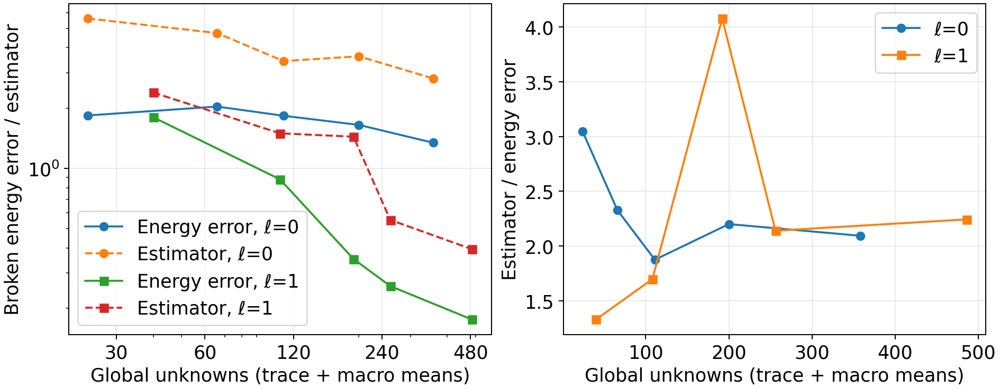
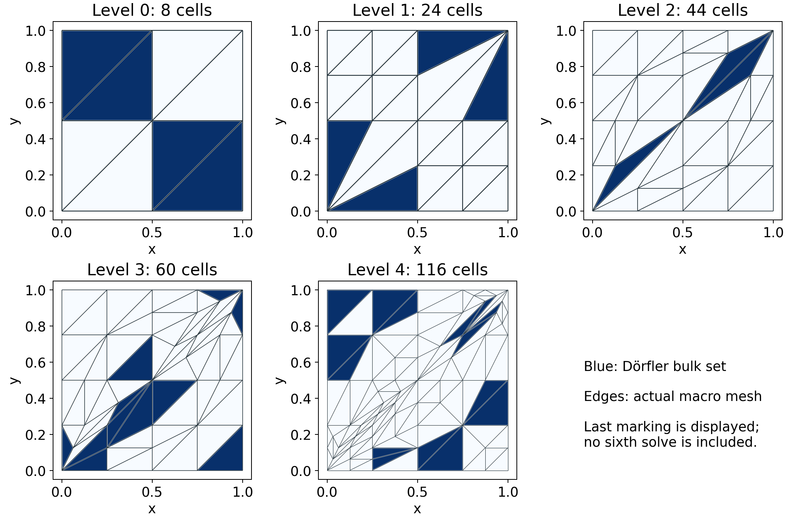
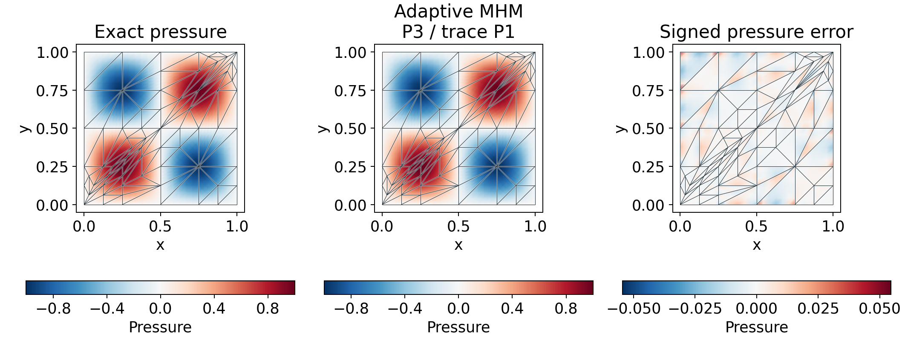

# Adaptive Darcy macro meshes

`solve_adaptive_darcy` combines the material-weighted energy estimator, bulk
marking and conforming triangular macro refinement. This is an original adaptive
policy using the reconstruction and estimator of
[Barrenechea et al. (2026)](https://doi.org/10.1137/24M1673073).
The example uses their smooth problem in §6.1; its adaptive meshes and marking
sequence are specified here rather than attributed to a published figure.

On the unit square,

$$
p=\sin(2\pi x)\sin(2\pi y),\qquad
 K=I,\qquad f=8\pi^2p,\qquad p|_{\partial\Omega}=0.
$$

## Estimator and refinement policy

Let \(s_h\) be the conforming Oswald potential and \(q_h^R\) the RT moment
reconstruction. The macro indicators use the weighted flux defect,
nonconformity, reconstructed-divergence defect and data oscillation:

$$
\begin{aligned}
\eta_K^2&=(\eta_{1,K}+\eta_{3,K}+\mathrm{osc}_K)^2+\eta_{2,K}^2,\\
\eta_{1,K}&=\|K^{-1/2}(K\nabla p_h+q_h^R)\|_K,\\
\eta_{2,K}&=\|K^{1/2}\nabla(p_h-s_h)\|_K.
\end{aligned}
$$

The remaining two terms carry the convex-cell Poincaré factor
\(\operatorname{diam}(K)/(\pi\sqrt{\alpha_K})\), where \(\alpha_K\) is a
certified lower material eigenvalue. The underlying
[estimator and reconstruction](https://github.com/ipes-lncc/pymhm/blob/main/docs/cases/reconstruction-moments.md) retain their
boundary-representability, continuous-test equilibrium and integration
requirements. Numerical quadrature is not interval arithmetic.

Both adaptive entry points accept `estimator_convention="published"` to use
the literal equations (5.3)–(5.7), with an unweighted L2 flux defect and
diameter/π in the divergence and oscillation terms. The default `"energy"`
uses the material weights above. The conventions coincide for this unit-diffusion
example; their heterogeneous meanings and coefficient scalings are
[documented separately](https://github.com/ipes-lncc/pymhm/blob/main/docs/cases/weighted-estimator.md#published-and-energy-normalized-conventions).
Changing that option changes marking values, not the finite-element PDE.

`mark_dorfler` selects the smallest number of cells whose squared indicators
sum to at least \(\theta\sum_K\eta_K^2\). Ties retain cell order. Selected
triangles undergo red refinement into four children. Closure promotes any
neighbor with two bisected edges to red refinement; single-edge neighbors use
two green children. Shared midpoint indices guarantee conformity. Existing
skeletal partitions follow their physical parent faces, while new interior
faces receive the requested degree and segmentation. Neumann classifications
and local ellipticity bounds follow the same ancestry.

This policy does not imply an error-contraction or optimal-complexity theorem.
Repeated green refinement does not provide a mesh-independent minimum-angle
guarantee. The campaign records the shape quality
\(4\sqrt3 |K|/\sum_{F\subset\partial K}|F|^2\), alongside the numerical error.

The alternative `macro_refiner=refine_longest_edge` follows longest-edge
propagation paths. It bisects a boundary edge or an edge longest in both
incident triangles, then repeats until every marked triangle has been
replaced. Every intermediate partition is conforming. The algorithm's
exact-arithmetic angle bound is half the initial minimum angle
([Rivara (1984)](https://doi.org/10.1002/nme.1620200412)); floating-point
coordinates remain subject to the mesh validity checks. Cell and face ancestry
is preserved through the entire propagation path. This geometric bound is
separate from any claim about estimator contraction.

```python
import numpy as np
from pymhm import TriangleMesh
from pymhm.adaptivity.darcy import solve_adaptive_darcy
from examples.formulations.application import darcy as solve_equations

result = solve_adaptive_darcy(
    TriangleMesh.unit_square(2), solve_step=solve_equations,
    iterations=5, theta=0.5,
    trace_degree=1, degree=3, reconstruction_degree=2,
    local_refinement=2, quadrature_order=10, estimator_order=10,
    source=lambda x: 8*np.pi**2*np.prod(np.sin(2*np.pi*x), axis=1),
)
print(result.totals)
```

`solve_step` receives the current mesh, oriented skeleton, physical data and
local partitions. The editable `application.darcy` helper composes the public
mathematical provider with generic assembly, pressure constraints and field
recovery. Users may supply their own callback with the same contract. The
shared adaptive owner retains marking, boundary ancestry and estimator checks.

A `local_mesh_factory(macro_mesh, cell_index)` may construct fresh
[material-fitted local meshes](unfitted.md) at each level. A fixed list of local
meshes cannot survive changing macro geometry and is rejected by the adaptive
wrapper. All fine meshes must form a globally conforming partition for potential
recovery. The current driver refines macro geometry while keeping local degree
and nominal local refinement fixed.

## Balancing local and macro refinement

`solve_balanced_adaptive_darcy` additionally compares
\(\|\eta_3+\mathrm{osc}\|_{\ell^2}\) with a declared multiple of
\(\sqrt{\|\eta_1\|_{\ell^2}^2+\|\eta_2\|_{\ell^2}^2}\).
When the former is larger, it doubles the local refinement uniformly; otherwise
it marks macroelements. Uniform local refinement preserves shared fine-edge
partitions. A three-argument factory `factory(mesh, cell, refinement)` can supply
a nested material-fitted local hierarchy. Returned `local_refinements`,
`decisions` and `stop_reason` state which operation was performed and whether a
local or macro budget terminated the loop.

These terms are refinement proxies, not an exact decomposition into local and
global discretization errors. In particular, the divergence term contains a
macro-diameter Poincaré bound and need not decrease under local refinement for
rough coefficients. The policy does not establish estimator contraction or
replace comparison with an independently refined reference. It stops explicitly
when the allowed local resolution is exhausted.

An optional `local_error_indicator(solution)` supplies a separate local-resolution
measurement. `estimate_darcy_local_refinement` uniformly red-refines each local
mesh, solves the same Neumann problem with the current skeletal flux, and measures
the material-weighted gradient difference through exact parent-child ancestry.
The source, material, pressure degree and trace data stay fixed. Pressure means
do not affect this seminorm. The returned `local_squared` values and `total`
measure an actual difference between two local approximations; interpreting it
as a local-error bound would additionally require a saturation estimate.
The [SPE10 adaptive case](spe10-adaptive.md) uses this option with material-fitted
local meshes, rather than identifying the divergence term with local error.

## Five-level numerical campaign

Both sequences start with eight macrotriangles and use \(\theta=0.5\),
local refinement 2, \(k=\ell+2\), and RT2 reconstruction. Assembly and estimator
integration use order 10; the energy error is independently integrated at orders
12 and 14. Global counts include skeletal coefficients and one retained pressure
mean per macrocell.

| Trace degree | Level | Macro cells | Global unknowns | Energy error | Estimator |
|---:|---:|---:|---:|---:|---:|
| 0 | 0 | 8 | 24 | 1.83747 | 5.59985 |
| 0 | 1 | 24 | 66 | 2.03506 | 4.73439 |
| 0 | 2 | 42 | 111 | 1.83059 | 3.43188 |
| 0 | 3 | 76 | 200 | 1.64864 | 3.62696 |
| 0 | 4 | 138 | 358 | 1.34303 | 2.81170 |
| 1 | 0 | 8 | 40 | 1.80008 | 2.39124 |
| 1 | 1 | 24 | 108 | 0.881408 | 1.49612 |
| 1 | 2 | 44 | 192 | 0.353029 | 1.43926 |
| 1 | 3 | 60 | 256 | 0.258595 | 0.553251 |
| 1 | 4 | 116 | 486 | 0.175916 | 0.394598 |



The P0 trace sequence is not monotone: its first refinement raises the energy
error, and a later refinement raises the estimator. This reflects the recorded
sequence of different hybrid spaces; these spaces are not asserted to be nested.
The P1 trace sequence reduces the measured energy error by a factor of about
10.2 over five solves. These observations are not universal convergence rates.



The last panel also displays the next marking set, but no sixth solve is included.
The lowest recorded shape quality in this sequence is 0.1271. Geometry closure
can refine cells outside the selected bulk set.



The exact and numerical pressures share a color scale. The error has its own
symmetric scale, and all panels retain the actual macro boundaries. Broken
fine-element values remain independent at interfaces.

## Reproduction and scope

```bash
pixi run --locked -e notebooks python -m examples.adaptive_darcy_campaign --collect
pixi run --locked -e notebooks python -m examples.adaptive_darcy_campaign
```

Records and sampled fields are in `examples/results/adaptive-darcy`.
[Notebook 39](../tutorials.md) presents the smooth adaptive example;
[Notebook 38](../tutorials.md) treats material-fitted local approximation.
Light CI checks cover conformity, ancestry, deterministic bulk marking, mixed
boundary transfer and the measured estimator bound on small analytical cases.
The five-level campaign is executed separately. No SPE10 adaptive result is
inferred from this smooth example.

## References

- Gabriel R. Barrenechea, Larissa Martins, Weslley Pereira, and Frédéric Valentin (2026). *An H(div; Ω)-Conforming Flux Reconstruction for the Multiscale Hybrid-Mixed Method*, Multiscale Modeling & Simulation 24(2), 399–428. [DOI: 10.1137/24M1673073](https://doi.org/10.1137/24M1673073).

- M. Cecilia Rivara (1984). *Algorithms for refining triangular grids suitable for adaptive and multigrid techniques*. International Journal for Numerical Methods in Engineering 20(4), 745–756. [DOI: 10.1002/nme.1620200412](https://doi.org/10.1002/nme.1620200412).
