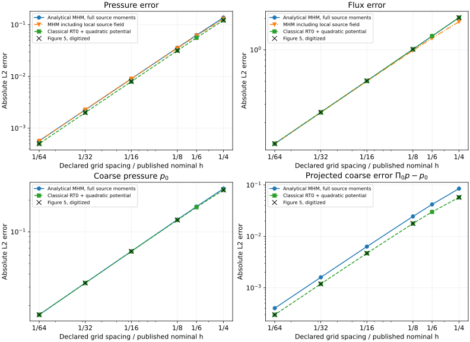

# Analytical Darcy lifts and source reconstruction

`solve_darcy_analytic` implements the lowest-order exact harmonic lifts of
[Harder, Paredes and Valentin (2013), §4.1](https://doi.org/10.1016/j.jcp.2013.03.019)
on affine triangles and tetrahedra. Each face carries a constant normal flux.
The permeability is a constant symmetric positive-definite tensor in each
local problem; the convenience solver uses one tensor throughout the domain.

## Local space and source terms

For centroid \(c_T\), covariance \(C_T\), and dimension \(d\), use

$$
1,\quad x_i-c_{T,i},\quad
\frac12\big[(x-c_T)^T K_T^{-1}(x-c_T)
 -\operatorname{tr}(K_T^{-1}C_T)\big].
$$

The nonconstant basis functions have zero physical mean. Multiplication of
their gradients by \(-K_T\) gives exactly the RT0 vector space. The harmonic
responses therefore have exact polynomial normal traces, independently of
the mesh used for the source response.

The complete pressure is \(p_h=p_0+p_\lambda+p_f\). The source lifting solves

$$
-\nabla\cdot(K_T\nabla p_f)=f-\Pi_0 f,\qquad
K_T\nabla p_f\cdot n=0,\qquad \int_Tp_f=0.
$$

It is zero for a constant source. For a variable source, continuous local Pk
elements approximate this Neumann problem. The global load retains the full
source moments against the exact harmonic lifts. In particular, the term
\(-(f,p_\mu)\) in equation (42) is retained.

The classical RT0/P0 mixed method omits that load correction. Its RT0 field can
also be integrated into a mean-preserving quadratic pressure using
`AnalyticDarcySpace.integrate_rt0`; this operation preserves the classical
pressure mean and does not supply the missing source correction. Section 4.1.1
expressly conditions its classical RT0 equivalence on neglecting that term.

## Cosine problem: six resolutions

On the unit square, prescribe

$$
p=\cos(2\pi x)\cos(2\pi y),\quad f=8\pi^2p,\quad
q=-\nabla p,\quad q\cdot n=0,\quad \int_\Omega p=0.
$$

The grids have \(n=4,6,8,16,32,64\) subdivisions in each coordinate and
\(2n^2\) macrotriangles, split on the lower-left to upper-right diagonal.
Each source problem uses P2 on four subtriangles. Harmonic fields remain exact
quadratics. Assembly uses Duffy order 10 and error integration order 12.
The record also includes order 12/14 integration and source refinements 4 and
8 on the coarsest published grid.



The two constructions produce the same trace-driven RT0 flux in this
experiment, but different coarse pressures. At \(n=4\), the projected coarse
pressure errors are 0.0852526 for analytical MHM and 0.0576301 for classical
RT0; Figure 5 gives approximately 0.0576425. The quadratic pressure errors are
0.137703 and 0.122537, respectively, while the digitized value is 0.122294.
Including the P2 source lifting changes the MHM pressure error to 0.130088.
At \(n=64\), the complete pressure and flux errors are \(5.67681\times10^{-4}\)
and 0.125872. At \(n=4\), increasing the source refinement from 4 to 8
changes the full pressure error from 0.130064 to 0.130051 and the full flux
error from 1.85356 to 1.85299. Increasing both quadrature orders changes the
six MHM error diagnostics by less than \(4\times10^{-15}\) relatively.

Thus the classical RT0 construction matches the plotted values, while the
full-source analytical MHM implements equation (42). These are distinct
discrete formulations for this nonconstant source. Matching the classical
curve is not evidence that the full-source method or its full physical flux
has reproduced Figure 5. The grid spacing \(1/n\) is also distinguished from
the macro diameter \(\sqrt{2}/n\); the original connectivity is unspecified.

## Independent checks

The automated checks use two- and three-dimensional anisotropic metric
quadratic patches with both prescribed pressure and pure Neumann data. They
verify the physical mean, every oriented face flux and the local basis means.
A nonconstant polynomial source is compared against the complete P2 MHM
assembly, including trace coefficients, retained means and reconstructed
pressure. These tests check the source correction independently of any
digitized figure.

Run the research campaign with:

```bash
pixi run -e notebooks python examples/verify_analytic.py
```

The unrounded record is `examples/results/analytic.json`; notebook
`43_analytical_darcy.ipynb` presents the numerical comparison. The
[publication comparison](reproduction.md) retains the digitized data and
the separately identified classical RT0 and primal P1 results.

## References

- Christopher Harder, Diego Paredes, and Frédéric Valentin (2013). *A family of Multiscale Hybrid-Mixed finite element methods for the Darcy equation with rough coefficients*, Journal of Computational Physics 245, 107–130. [DOI: 10.1016/j.jcp.2013.03.019](https://doi.org/10.1016/j.jcp.2013.03.019).
