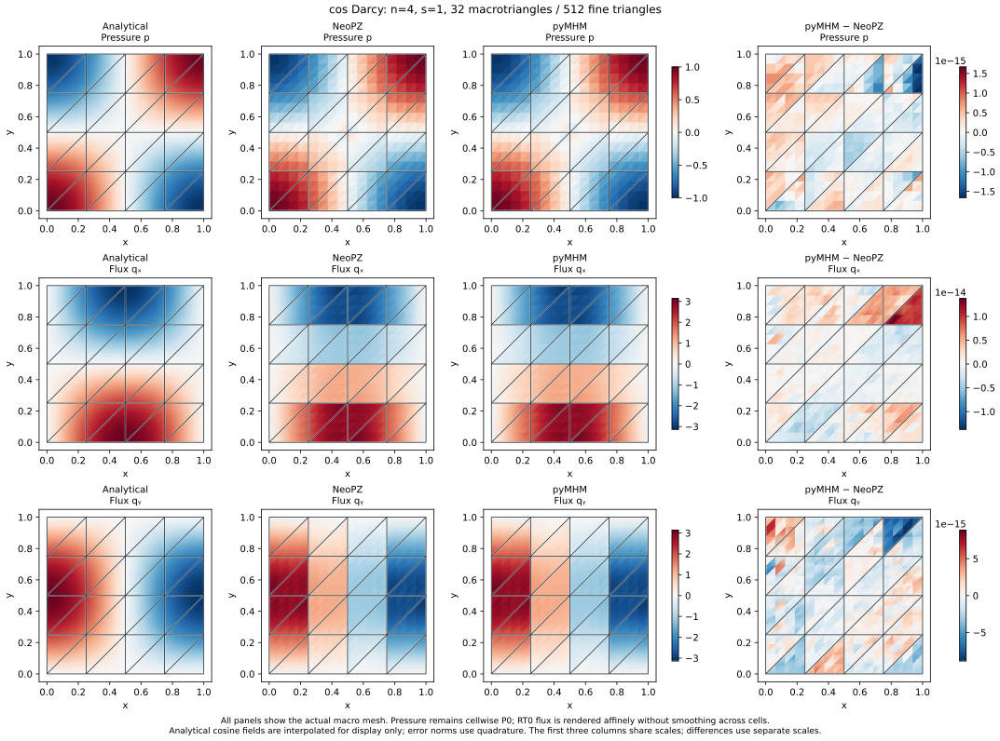

# Coarse cosine flux: matched reference computations

This comparison uses exactly the coarse discretization in the
[Darcy gallery](https://github.com/volpatto/pymhm/blob/main/docs/cases/darcy.md#physical-flux-retain-the-coarse-diagnostic):
32 macrotriangles, 512 fine triangles, and one constant normal-flux trace per
macroface. It checks complete physical fields, rather than comparing only
error norms or visual similarity.

## Problem and discrete spaces

On the unit square, with unit permeability,

$$
p=\cos(\pi x)\cos(\pi y),\qquad
\boldsymbol q=\pi\begin{pmatrix}
\sin(\pi x)\cos(\pi y)\\
\cos(\pi x)\sin(\pi y)
\end{pmatrix},\qquad f=2\pi^2p.
$$

The boundary pressure is the restriction of this **nonzero** analytical
pressure. It is imposed weakly through the global skeleton.

| Parameter | Value |
|---|---|
| Macro mesh | Four squares per axis; each split along its lower-left to upper-right diagonal |
| Local mesh | Four subdivisions per macroedge; 16 fine triangles per macrotriangle |
| Primal local space | Continuous P1 pressure inside each macrotriangle |
| Mixed local spaces | RT0 flux and P0 pressure on each fine triangle |
| Skeleton | One unsplit P0 segment per macroedge, including boundary edges |
| pyMHM quadrature | Duffy order 6 for assembly; order 8 for analytical errors; Gauss 5 for boundary moments |
| Error normalization | $\lVert q\rVert_{L^2}=\pi/\sqrt{2}$ and $\lVert p\rVert_{L^2}=1/2$ |

The separate [MSL sine comparison](https://github.com/volpatto/pymhm/blob/main/docs/cases/reference-comparison.md) uses crisscross
macrotriangles, P1 traces, a different local refinement, and homogeneous
boundary data. Its agreement does not establish agreement for this case.

## Primal comparison with MSL

The reference uses `msl_mhm`, `msl_cg`, and `msl_core` at the revisions listed
in the [MSL provenance](https://github.com/volpatto/pymhm/blob/main/docs/cases/reference-comparison.md#reference-code-and-revisions).
Its comparison adapter assembles the weak boundary functional
$\int_{\partial\Omega}g\,\psi_i\,ds$ using MSL's signed trace orientation and
native boundary quadrature. MSL supplies the local operators, global matrix,
spaces, and solve sequence. The boundary assembly is shared by the cosine and
sine comparison drivers.

Zero, constant, and affine pressure patches check this boundary assembly.
All have $f=0$; the affine pressure is $p=1+x+2y$, with flux $(-1,-2)$.
Numerical values, expression strings, and Lua callbacks are read from the
problem data and evaluated through the same adapter.

| Pressure | Trace degree / segments per face | Local subdivisions | MSL pressure L2 error | MSL flux L2 error |
|---|---|---:|---:|---:|
| Zero | P0 / 1 | 4 | 0 | 0 |
| Constant 1 | P0 / 1 | 4 | 1.67e-16 | 3.07e-15 |
| Affine | P1 / 1 | 4 | 1.07e-15 | 1.89e-14 |
| Affine | P1 / 2 | 8 | 1.20e-15 | 3.83e-14 |

For the cosine boundary data, **MSL reproduces the coarse primal
field**, including its visible macrocell structure:

| Quantity | MSL primal P1 | pyMHM primal P1 |
|---|---:|---:|
| Pressure L2 error | 0.0245727421091423 | 0.0245727421091422 |
| Raw flux L2 error | 0.497995938749214 | 0.497995938749214 |
| Relative flux L2 error | 22.41769345% | 22.41769345% |

All 480 broken pressure nodes and 512 fine triangles were matched by physical
coordinates. Exact P1 mass integration gives a pressure difference of
$9.39\times10^{-16}$ in L2. Exact P0 vector integration gives a raw flux
difference of **$7.98\times10^{-15}$**. Maximum differences are
$2.55\times10^{-15}$ at pressure nodes and $1.78\times10^{-14}$ in flux
components. No averaging across macrofaces enters the comparison.


The MSL forcing parameter is 8, requesting native integration degree 9;
its explicit boundary integration requests degree 8, giving five Gauss points
as in pyMHM. These integer parameters are not the same as a Duffy tensor-product
order. Analytical errors in the table are independently reintegrated using
Duffy order 8 on the exported fields.

## Mixed comparison with NeoPZ

The mixed reference uses native **NeoPZ** RT0/P0 assembly at revision
[`4c6b6d2`](https://github.com/labmec/neopz/tree/4c6b6d277ce097b97bfc8dea1b6725860f4fe05a),
with `EHDivConstant` order zero. The native operator is restricted to one
constant normal-flux trace per macroface using $T^{\mathsf T}AT$; the restricted
system is solved with SciPy, and the physical fields are reconstructed by
NeoPZ. This is separate from execution of an MSL mixed solver or NeoPZ's
historical MHM controller. The [NeoPZ comparison](https://github.com/volpatto/pymhm/blob/main/docs/cases/neopz.md) defines the spaces
and the restriction in detail.

| Quantity | NeoPZ restricted RT0 | pyMHM mixed RT0 |
|---|---:|---:|
| Pressure L2 error | 0.04034964721748132 | 0.04034964721748275 |
| Flux L2 error | 0.4857458152980587 | 0.4857458152980586 |
| Relative flux L2 error | 21.86624415% | 21.86624415% |

The full-field L2 differences are $1.46\times10^{-14}$ in pressure,
$6.94\times10^{-14}$ in flux, and $3.49\times10^{-14}$ in divergence.
The relative residual of the **restricted** native system is
$3.69\times10^{-15}$. Recomputed fine- and macrocell integrated conservation
defects are below $5.5\times10^{-16}$ in both implementations.



Native NeoPZ uses volume integration order 12 and boundary Gauss order 20
(11 points). Increasing pyMHM's volume quadrature from 6 to 10 changes the flux
by only $1.56\times10^{-15}$ in L2. The coarse flux error is not explained by
insufficient volume quadrature in this test.

## What the coarse pattern demonstrates

A constant trace on an entire macroface supplies very limited interface
resolution. In the mixed method, the reconstructed normal flux is constrained
to be constant there. For the primal method, this is the Neumann trace used
in the local solves; the raw gradient is not itself an H(div) field and need
not coincide pointwise with that trace.

The shared MSL adapter also verifies the following primal spaces against pyMHM.
The first three rows use identical macro and fine meshes; only the trace space
changes. The final row refines both the local mesh and the trace.

| Trace degree | Segments per macroface | Fine triangles | Relative flux L2 error, both codes | Flux field difference in L2 |
|---|---:|---:|---:|---:|
| P0 | 1 | 512 | 22.41769345% | 7.98e-15 |
| P0 | 2 | 512 | 10.10440143% | 7.79e-15 |
| P1 | 1 | 512 | 9.77863384% | 8.12e-15 |
| P1 | 2 | 2048 | 4.89687669% | 1.62e-14 |

Keep both meshes fixed and enrich only the mixed trace to four P0 segments
per macroface. The relative flux error drops from **21.8662% to 5.6697%**.
The enriched pyMHM and NeoPZ fluxes still agree to $2.32\times10^{-14}$ in L2.
This controlled experiment separates trace resolution from local refinement.
The [five-point refinement studies](https://github.com/volpatto/pymhm/blob/main/docs/cases/darcy-audit.md) examine both separately.

These comparisons establish agreement for the specified discrete problems.
The approximately 22% flux error remains substantial: agreement between codes
and conservation do not make this coarse discretization an accurate reference
solution. The figures display the one-sided numerical fields without smoothing.

## Archived evidence

`examples/results/coarse-cosine/` contains numerical field archives and full
precision reports. `primal-report.json` records the eight boundary and trace-space
checks and the shared MSL adapter digests; `mixed-report.json` records the
NeoPZ comparison. The mixed quadrature archive retains three samples per fine
triangle, sufficient to reconstruct its affine RT0 vectors; centroid-only
plots are not substituted for the full-field L2 comparison.

The figure reader performs no reference solves:

```bash
pixi run -e notebooks python examples/plot_reference_comparison.py
```
