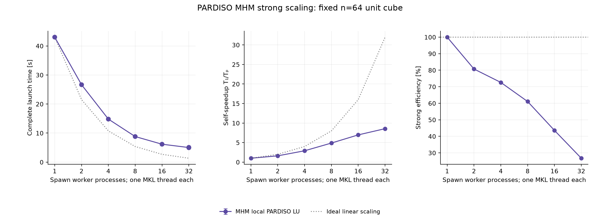
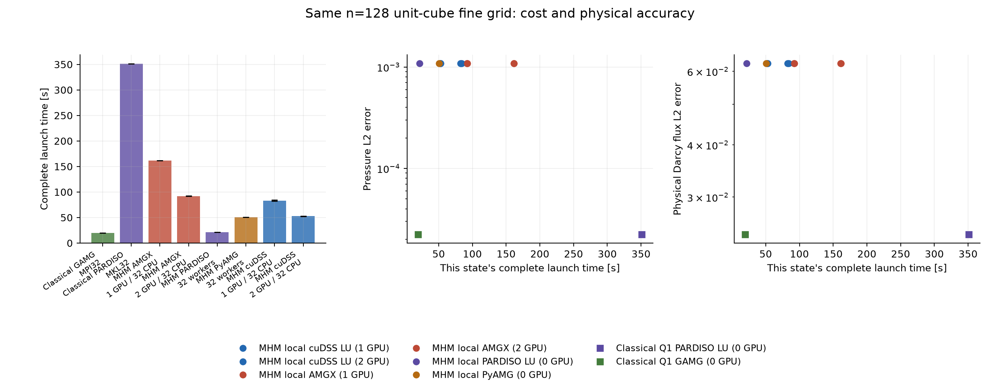

# Three-dimensional Darcy: CPU direct solvers and GPU local solves

The [introductory notebook](https://github.com/volpatto/pymhm/blob/main/notebooks/introduction/darcy_3d_parallel_scalability.ipynb)
defines the manufactured Darcy problem and the local/global mathematical forms.
This performance study extends that application with CPU PARDISO and independent
GPU local solves. The [immutable accelerator edition](https://github.com/volpatto/pymhm/tree/main/benchmarks/results/execution/introduction-3d-accelerators-20261005)
contains the selected raw acquisitions, their own numerical controls and the
plotted summaries. The [earlier workspace/LU/AMG edition](https://github.com/volpatto/pymhm/tree/main/benchmarks/results/execution/introduction-3d-workspace-lu-20261005)
retains its original results; its CPU weak observations appear as separately
identified historical references here.

## Physical problem and fixed approximation spaces

The [physical formulation](darcy-3d-scalability.md#physical-problem-and-two-material-periods)
specifies the anisotropic multiscale permeability, independent manufactured
source, exact pressure/flux and full exterior pressure boundary data. Here ε
means the permeability spatial period in physical coordinates. Every timed case
in this edition uses ε=0.1. It is fixed when
the domain grows; it is not a solver tolerance or a viscosity parameter.

The domain family is

$$
\Omega_L=(0,L)\times(0,1)^2,\qquad L\in\mathbb{N}.
$$

Macro width remains 0.25. A resolution parameter n gives n fine hexahedra per
unit direction and n/4 local cells per macro direction. Total fine cells are
Ln³, with 64L macroelements. Local pressures use Q1; each unsplit macroface has
four tensor-product Q1 trace modes. Neither the macro mesh nor the trace degree
changes in the larger local-grid experiments.

The classical conforming reference uses the same physical operator, material,
boundary data and fine Q1 grid. Its global conforming space differs from the MHM
space. Equal fine-element counts and CPU budgets therefore establish a workload
comparison, not equal pressure/flux accuracy. The fixed macro/trace spaces can
produce a pressure-error floor as local meshes refine.

The physical Dirichlet pressure gauge is preserved. There is no global zero-mean constraint:
the exact mean is (2/π)³ for L=1, (2/π)³/3 for L=3, and zero for L=2 or 4.
Local source/trace responses have zero physical volume moment; the retained
constant restores the local physical mean. The reported Darcy flux is the broken
physical field −K∇p_h, with no H(div) or fine-cell conservation claim.

## CPU and GPU workflows

Classical PARDISO uses native FEM assembly on MPI.COMM_SELF, followed by a sparse
PARDISO factorization with 32 suggested MKL threads. MHM PARDISO uses independent
spawned CPU workers, with one MKL thread per worker. The direct factor profile
is general LU, PARDISO mtype11; a local constrained Neumann system is indefinite
and is not assigned an SPD factor profile. A factor serves all right-hand sides
for its own macroelement and is rebuilt for another material matrix.

The classical acquisition permits 32 native threads throughout its setup,
assembly and solve block; the factorization receipts observe a MKL32 thread-pool
limit. Native FEM assembly on COMM_SELF is serial, with no MPI decomposition.
The introductory native call that limits threads only around factorization has
its own resource scope. Observed native pool limits describe available capacity,
rather than measuring the number of threads participating in every operation.

These resource conventions distinguish parallel factorization from distributed
FEM assembly. The earlier classical PETSc/GAMG and PETSc/MUMPS references use
MPI distributed assembly; local PyAMG and classical GAMG are different AMG
implementations. Raw receipts preserve the actual native environments, library
versions and observed thread settings. Cross-workflow timing differences do not
isolate a solver-library or accelerator effect.

For the GPU workflow, CPU workers first assemble the local UFL operators with
resident native workspaces. Independent GPU-owning processes then receive their
assigned operators, create fresh factors or AMG hierarchies and solve the source
and trace right-hand sides. Each process owns its native CUDA context and device
resources. Returned responses enter ordered global assembly, the global solve
and reconstruction through the same generic MHM interfaces.

Compatible native meshes, spaces, compiled forms and geometry-only blocks are
reused inside each worker. Material matrices and loads are assembled for each
macroelement. No numerical factor, hierarchy or response is reused across
different material matrices or acquisitions. The GPU-process stage is a phase
of this complete workflow, not a component measurement added to a separately
measured CPU median.

## Complete clocks and numerical acceptance

The edition contains 40 new acquisitions: 32 MHM states and eight classical
references. Each has its own integrated pressure and physical vector-flux norms.
Six historical CPU weak samples retain their original controls; one has its own
integrated norms and five retain null norms. They are separate observations from
the earlier edition.

The complete clock starts at the external parent launch. It includes interpreter
imports, native initialization, application setup, material assembly, CPU/GPU
pool creation and shutdown, scheduling/serialization, transfers, matrix analysis
and factor/hierarchy setup, all right-hand sides and residual corrections,
device synchronization, ordered global work and field reconstruction. Form
compilation is warmed separately; workers, material matrices and factors remain
fresh in every timed acquisition. Archive writing, physical error integration
and plotting follow the competitive clock.

Every accepted MHM acquisition records its original local operators,
source/trace responses, executed retained basis, coefficient vectors,
orientations and reconstructed physical fields. SHA-256 binds the whole state
and each executed retained basis. Its own post-timing control replays the field
with BLAS one/two threads and equivalent rank-one basis sign rotations, including
the trace orientation map. Physical volume moments, original kernel action and
each source/trace/reconstructed physical row have separate recorded controls.
Source/trace responses and the reconstructed original physical equations satisfy
the declared 1e−10 relative residual gate. The kernel action is measured at
operator scale, and declared physical volume moments retain their own absolute
discrepancies. The relative diagnostic for the retained action AZ uses a
right-hand side at roundoff scale; its small denominator can produce a sizable
ratio, which is recorded separately from the physical-row acceptance gate.
The executed retained basis remains part of the archived coefficient contract.
The coupled residual has a separate recorded gate.

Classical archives contain the actual physical Q1 nodal coefficients and their
integer-lattice coordinate convention. Native UFL replay integrates those
unchanged coefficients collectively. Their assembled-matrix residual belongs
to the acquisition; a field-only replay does not recompute an unpersisted matrix.

Pressure and physical vector-flux errors are integrated separately from these
algebraic checks. Each marker belongs to the same timed acquisition's own field.
MHM Gauss5→6 and native classical quadrature degree10→12 control pressure and
flux norm changes separately; higher orders are used when the relative change
exceeds 1e−6. A state without error integration retains null norms, with explicit
provenance. No error norm is copied from another state or repetition.

For expanding domains, the record retains both absolute errors and

$$
\begin{aligned}
e_p&=\frac{\lVert p_h-p_*\rVert_{L^2(\Omega_L)}}
{\sqrt{\lvert\Omega_L\rvert}},\\
e_q&=\frac{\lVert q_h-q_*\rVert_{L^2(\Omega_L)}}
{\sqrt{\lvert\Omega_L\rvert}}.
\end{aligned}
$$

Configuration summaries use arithmetic means of the actual selected
repetitions. Whiskers give observed extrema; they are not confidence intervals.
Each source/lockfile digest, resource allocation, native version, parameter set
and timing scope remains bound to its original raw acquisition.

## CPU strong scaling

The PARDISO strong family fixes the n=64 unit-cube discretization and varies
spawned workers through 1, 2, 4, 8, 16 and 32, with one MKL thread per worker. Its
denominator is the measured one-spawn-process complete launch. The wall-time,
self-speedup and efficiency panels include their corresponding ideal references.

<!-- measured-cpu-strong:begin -->

| Workers | Complete time [s] | Self-speedup | Efficiency [%] | Samples |
| --- | --- | --- | --- | --- |
| 1 | 43.03 | 1.00 | 100.0 | 1 |
| 2 | 26.65 | 1.61 | 80.7 | 1 |
| 4 | 14.81 | 2.90 | 72.6 | 1 |
| 8 | 8.81 | 4.88 | 61.1 | 1 |
| 16 | 6.17 | 6.97 | 43.6 | 1 |
| 32 | 5.02 [4.96, 5.09] | 8.57 | 26.8 | 2 |

At 32 workers the observed PARDISO self-speedup is 8.57×, with 26.8% strong efficiency. The same-grid direct comparisons use the complete workflows and resource conventions above:

| n | Fine hexahedra | Classical PARDISO [s] | MHM PARDISO [s] | Classical/MHM time |
| --- | --- | --- | --- | --- |
| 64 | 262,144 | 27.05 [26.94, 27.15] | 5.02 [4.96, 5.09] | 5.38 |
| 96 | 884,736 | 109.15 [108.90, 109.41] | 9.99 [9.96, 10.03] | 10.92 |
| 128 | 2,097,152 | 351.07 | 21.57 | 16.28 |

These ratios compare decomposition and assembly as well as factorization. The approximation spaces and physical errors differ; they are not gains at equal accuracy. Brackets give observed extrema of two actual repetitions.

<!-- measured-cpu-strong:end -->

## CPU weak scaling

The CPU family retains eight macroelements per worker, fixed local resolution
and fixed permeability spatial period. Worker counts 8, 16, 24 and 32 use integer
domain lengths 1, 2, 3 and 4 for PARDISO; historical MUMPS/PyAMG references retain
their actual 8, 16 and 32 acquisitions. Weak efficiency is

$$
\eta_{\mathrm{weak}}(P)=\frac{T(P_0)}{T(P)}.
$$

There is no extra factor P/P₀. Growing global work and communication remain in
the complete time. Historical curves preserve their separate source/resource
provenance and their measured efficiency losses.

<!-- measured-cpu-weak:begin -->

| Local solver | Workers | L | Complete time [s] | Weak efficiency [%] | $e_p$ | $e_q$ |
| --- | --- | --- | --- | --- | --- | --- |
| PARDISO | 8 | 1 | 8.81 | 100.0 | 1.0714e-03 | 7.5136e-02 |
| PARDISO | 16 | 2 | 15.95 | 55.2 | 1.0716e-03 | 7.5143e-02 |
| PARDISO | 24 | 3 | 20.35 | 43.3 | 1.0717e-03 | 7.5145e-02 |
| PARDISO | 32 | 4 | 23.50 | 37.5 | 1.0717e-03 | 7.5146e-02 |
| MUMPS (historical) | 8 | 1 | 8.75 | 100.0 | — | — |
| MUMPS (historical) | 16 | 2 | 14.45 | 60.5 | — | — |
| MUMPS (historical) | 32 | 4 | 18.78 | 46.6 | 1.0717e-03 | 7.5146e-02 |
| PyAMG (historical) | 8 | 1 | 18.77 | 100.0 | — | — |
| PyAMG (historical) | 16 | 2 | 24.36 | 77.0 | — | — |
| PyAMG (historical) | 32 | 4 | 29.77 | 63.0 | — | — |

<!-- measured-cpu-weak:end -->

## GPU strong and heterogeneous weak scaling

GPU strong scaling fixes the complete n=128 unit-cube discretization and 32 host
CPU cores while varying one/two physical GPUs. The two panels distinguish the
complete launch time from the GPU-process stage within the same acquisition.

<!-- measured-gpu-strong:begin -->

| Local solver | GPUs | Complete time [s] | GPU-process stage [s] | Self-speedup | Samples |
| --- | --- | --- | --- | --- | --- |
| cuDSS | 1 | 83.26 [82.33, 84.18] | 67.50 | 1.00 | 2 |
| cuDSS | 2 | 52.57 [52.42, 52.73] | 37.07 | 1.58 | 2 |
| AMGX | 1 | 161.35 [161.26, 161.45] | 145.78 | 1.00 | 2 |
| AMGX | 2 | 92.08 [91.72, 92.44] | 76.82 | 1.75 | 2 |

<!-- measured-gpu-strong:end -->

Heterogeneous weak scaling grows from one GPU with 16 host cores on L=1 to two
GPUs with 32 host cores on L=2. Each GPU retains 64 macroelements and 16 host cores;
local volume/trace resolution and material spatial period stay fixed. The
one-GPU weak base has its own acquisition and CPU budget; it is not a relabeled
32-host-core strong sample. Its efficiency is Tbase/Tnext, without a factor two.

<!-- measured-gpu-weak:begin -->

| Local solver | 1 GPU + 16 CPU, L=1 [s] | 2 GPUs + 32 CPU, L=2 [s] | Weak efficiency [%] |
| --- | --- | --- | --- |
| cuDSS | 88.83 | 110.65 | 80.3 |
| AMGX | 167.09 | 190.42 | 87.7 |

<!-- measured-gpu-weak:end -->

## Complete cost, field accuracy and workflow phases

Matched-grid panels place complete workflow times beside pressure and physical
Darcy flux errors. Every error marker uses that state's actual time and its own
integrated field; timing bars use the stated configuration statistic. GPU
configurations add their explicitly recorded devices to the host CPU budget.

<!-- measured-matched:begin -->

| n | Fine hexahedra | Classical CG/GAMG [s] | MHM PyAMG [s] | MHM cuDSS, 2 GPUs [s] | MHM AMGX, 2 GPUs [s] |
| --- | --- | --- | --- | --- | --- |
| 128 | 2,097,152 | 19.68 | 50.63 | 52.57 [52.42, 52.73] | 92.08 [91.72, 92.44] |
| 192 | 7,077,888 | 65.38 | 185.00 | 180.17 | 235.61 |
| 256 | 16,777,216 | 134.92 | 465.45 | 491.33 | 526.12 |

The classical distributed CG/GAMG workflow is faster than both GPU workflows on all three matched grids. At n=256, its complete time is 134.92s, compared with 465.45s for MHM PyAMG, 491.33s for MHM cuDSS and 526.12s for MHM AMGX. The two-GPU improvement relative to one GPU therefore does not establish a gain over the same-grid classical baseline.

| n | Method | Actual raw SHA prefix | Actual raw time [s] | $\lVert p_h-p_*\rVert_{L^2}$ | $\lVert q_h-q_*\rVert_{L^2}$ |
| --- | --- | --- | --- | --- | --- |
| 128 | Classical Q1 GAMG | 3e44ce886f | 19.68 | 2.23180e-05 | 2.44114e-02 |
| 128 | MHM local PyAMG | e96a7f6df5 | 50.63 | 1.08384e-03 | 6.26485e-02 |
| 128 | MHM local cuDSS LU (2 GPUs) | 0d6114a851 | 52.42 | 1.08384e-03 | 6.26485e-02 |
| 128 | MHM local AMGX (2 GPUs) | 10b3c1937a | 91.72 | 1.08384e-03 | 6.26485e-02 |
| 192 | Classical Q1 GAMG | 18731d3e3b | 65.38 | 9.92801e-06 | 1.63098e-02 |
| 192 | MHM local PyAMG | 2fdaacb2ec | 185.00 | 1.08666e-03 | 5.99788e-02 |
| 192 | MHM local cuDSS LU (2 GPUs) | d2e52126dd | 180.17 | 1.08666e-03 | 5.99788e-02 |
| 192 | MHM local AMGX (2 GPUs) | ae9771a328 | 235.61 | 1.08666e-03 | 5.99788e-02 |
| 256 | Classical Q1 GAMG | 7a585c500e | 134.92 | 5.58630e-06 | 1.22418e-02 |
| 256 | MHM local PyAMG | 07dc7c38a3 | 465.45 | 1.08768e-03 | 5.90100e-02 |
| 256 | MHM local cuDSS LU (2 GPUs) | 8e21607648 | 491.33 | 1.08768e-03 | 5.90100e-02 |
| 256 | MHM local AMGX (2 GPUs) | d1d1646c60 | 526.12 | 1.08768e-03 | 5.90100e-02 |

Each norm row above uses the first listed actual acquisition of that configuration, identified by its SHA prefix; its own clock is displayed separately from the configuration mean. The immutable JSON retains every repetition's own field norms and quadrature control. The fixed MHM macro/trace spaces retain the pressure-error floor while the classical fine-grid pressure error decreases.

<!-- measured-matched:end -->

The phase plot stacks sequential parent-stage wall clocks from one literal
acquired sample per configuration. It does not stack sums of parallel worker
times. The clock remainder is labeled launch/import/export/other, rather than
assigned to an unmeasured operation.

## Larger local-grid experiments and scope

The larger-grid sweep fixes the unit cube, macro/trace spaces and two-GPU/host
resource allocation while refining the local volume grid. It reports accepted
absolute time and fine-cell throughput. This is a grid-size sweep, not weak
scaling or an equal-accuracy comparison. A missing completed same-grid CPU
reference has no assigned accelerator speedup.

These finite node-local observations do not establish asymptotic or multi-node
scaling. The local/trace space distinction and fixed-trace pressure floor remain
scientific limitations. [Gomes et al.](https://arxiv.org/abs/1703.10435) motivate
independent MHM local work and CPU direct solvers; the present hexahedral
manufactured application differs from their cluster experiment.
[Penna et al.](https://doi.org/10.1002/cpe.5170) motivate workload-aware scheduling;
their reported gains are not assigned to this implementation.

[Intel PARDISO](https://www.intel.com/content/www/us/en/docs/onemkl/developer-reference-c/2025-0/pardiso.html),
[NVIDIA cuDSS](https://docs.nvidia.com/cuda/cudss/) and
[NVIDIA AMGX](https://github.com/NVIDIA/AMGX) describe the native solver
capabilities. Independent local device owners in this study differ from a
distributed global-matrix GPU solver. Executed bindings, profiles and resources
determine the verified scope of each recorded acquisition.
