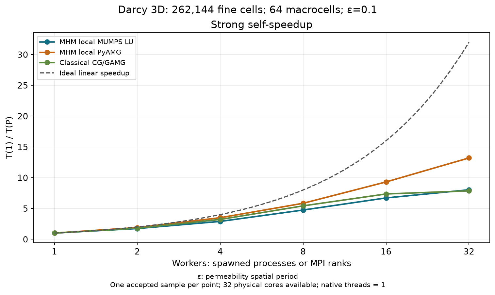
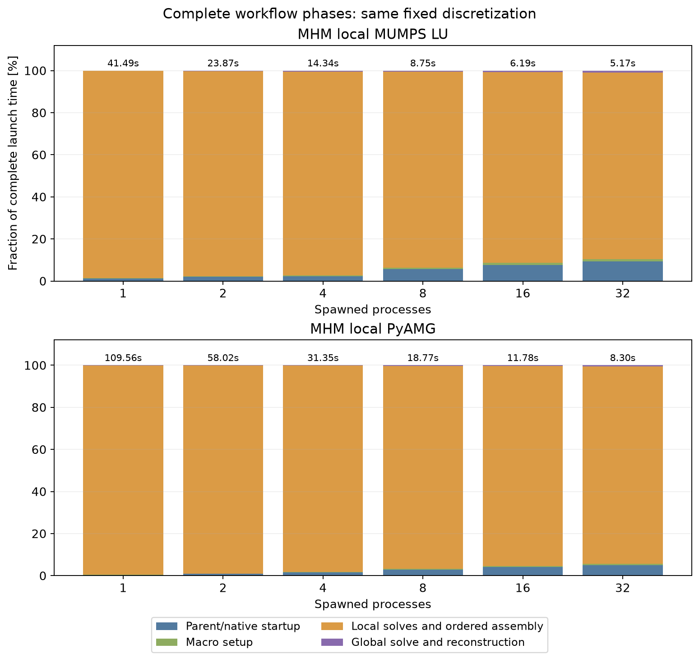
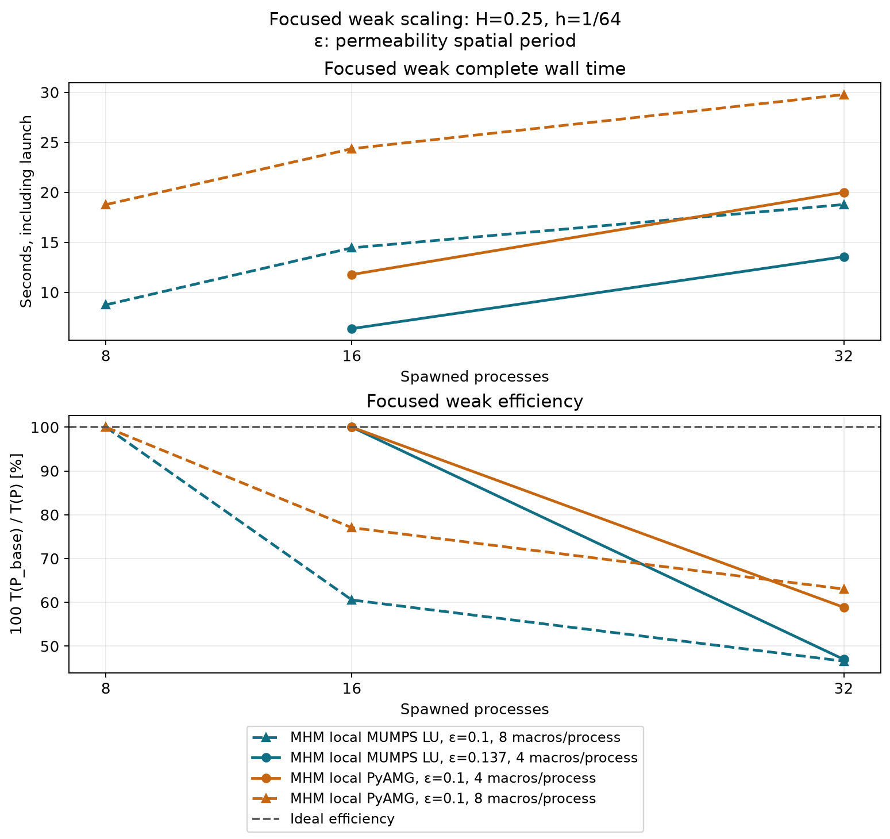

# Three-dimensional Darcy: native workspaces, LU and AMG

The [introductory notebook](https://github.com/ipes-lncc/pymhm/blob/main/notebooks/introduction/darcy_3d_parallel_scalability.ipynb)
defines the material, manufactured fields, local UFL forms, oriented trace
pairings, global equations, reference methods and physical norm integration in
executable cells. It introduces reusable native assembly resources after
showing the mathematical forms. A small default demonstration accompanies the
[recorded 3D campaign](https://github.com/ipes-lncc/pymhm/tree/main/benchmarks/results/execution/introduction-3d-workspace-lu-20261005).

The [CPU PARDISO and GPU extension](darcy-3d-accelerators.md) reports larger local
grids, CPU strong/weak scaling and one/two-GPU complete workflows. Its acquisitions
and field controls have separate immutable provenance.

## Physical problem and two material periods

On the box with integer length,

$$
\Omega_L=(0,L)\times(0,1)^2,
$$

solve

$$
\begin{aligned}
q&=-K\nabla p, & \nabla\cdot q&=f,\\
p&=0 &&\text{on }\partial\Omega_L.
\end{aligned}
$$

The manufactured fields and material are

$$
\begin{aligned}
p_*(x)&=\prod_{i=1}^3\sin(\pi x_i),\\
K(x)&=m_\varepsilon(x)D, &
m_\varepsilon(x)&=\exp\!\left(\prod_{i=1}^3\sin(2\pi x_i/\varepsilon)\right),\\
D&=\begin{pmatrix}2&0.3&0.2\\0.3&1.5&0.1\\0.2&0.1&1\end{pmatrix}, &
f&=\nabla\cdot(-K\nabla p_*).
\end{aligned}
$$

The tensor is symmetric positive definite. Its off-diagonal entries require
mixed pressure derivatives in the source. UFL differentiation and independently
derived analytical formulas specify the same physical operator and source.
Integer domain lengths preserve the exterior pressure data; the coefficient
wavelength remains fixed when the box expands.

Here ε is the permeability spatial period, measured in coordinate units.
The principal material period is 0.1 and the macro width is 0.25. The scalar
multiplier consequently equals one on every macroface, where its coordinate
factors contain sine values at integer multiples of five pi. This alignment
is a feature of these data and affects skeleton approximation. A separate
period-0.137 case removes that alignment. Its 64 material matrices are all
distinct; its timings and errors are reported separately. Neither material
case reuses numerical factors or local responses between macrocells.

## Local and global discretization

The unit cube has 64 macrohexahedra. Each contains a structured conforming Q1
local volume mesh. Fine counts of 64 or 96 per unit direction give 16 or 24
local cells per direction, hence 262,144 or 884,736 total fine hexahedra. The
independent conforming reference uses the same fine grid. The optional
128-per-direction configuration is not a completed measurement in this record.

Each unsplit macroface carries four tensor-product Q1 modes. The unit-cube
skeleton has 240 faces, 960 trace coordinates and 64 retained constants;
the coupled system has 1,024 coordinates. These spaces differ from the
conforming reference's global Q1 space. The local equations are

$$
\begin{aligned}
a_T(p_T,v)+b_T(v,\lambda)&=(f,v)_T,\\
a_T(p,v)&=\int_T K\nabla p\cdot\nabla v,\\
b_T(v,\lambda)&=\sum_{F\subset\partial T}s_{T,F}\int_F v\lambda_F.
\end{aligned}
$$

The sign maps the canonical face flux into each cell's outward orientation.
Increasing physical tangent coordinates define the same face basis on both
sides in this Cartesian application. Basix tabulates field and trace bases;
DOLFINx/UFL assembles the declared volume and face forms.

The local kernel is the constant function. Physical volume moments select
zero-mean source and trace responses; the retained constant restores the
physical cell mean. Full Dirichlet pressure data impose no global zero-mean
gauge: the exact unit-cube mean is nonzero. The global coupling tests pressure
continuity with the pairing `c=-b.T` and retains the constant compatibility
rows. `LocalEquations`, `Equation` and `MultiscaleProblem` perform condensation,
assembly and reconstruction without a physical-model constructor.

The Darcy flux evaluated here is the broken field `-K grad(p_h)`. It is not
an H(div) reconstruction. Macro conservation of oriented trace moments does
not imply pointwise interface continuity or fine-cell conservation. Field
plots overlay the actual macro mesh and retain independent one-sided values.

## Reuse native resources without reusing material solves

A process or concurrent thread owns its native workspace. The cache key
includes volume and trace degrees, local topology/resolution, quadrature,
physical cell extents and dtype. Compatible calls reuse the local mesh, finite
element spaces, compiled UFL kernels and assembly buffers. Pickle transfers
only declarations, and the executor closes native resources after running
work completes. Incompatible keys build another bounded workspace.

For every macrocell, the application updates physical geometry and the
material's declared UFL constants, then assembles a fresh material matrix and
source. Returned arrays own their data. Each material matrix gets its own
factorization or AMG hierarchy and source/trace solves. No material parity,
periodicity or response basis is used as a cache key.

Only unsigned trace and volume-moment blocks are reused here: their UFL forms
contain geometry but no material coefficient. Face signs and global indices
are applied anew for each macrocell. This application-specific independence
must be rechecked for Robin or material-weighted coupling forms; the generic
backend makes no such assumption.

Independent native controls compare fresh and reused matrices, loads,
oriented couplings, kernels, physical moments, retained bases, source/trace
responses and full reconstructed fields. They include a material change and
return, nonaligned coefficients, concurrent threads and spawned processes.
The record preserves original physical equations and executed basis digests,
so replay does not recompute an arbitrarily oriented nullspace.

## Solvers and measured timing scope

Direct local solves use SciPy SuperLU or PETSc/MUMPS on `MPI.COMM_SELF`. A
factorization serves the source and 24 trace right-hand sides of one macrocell;
it is rebuilt for another material matrix. CPU PyAMG uses the shared Neumann
projection, coordinate pinning and physical-moment restoration owner. Its
original-row refinement stays inside that owner and timer. A hierarchy serves
multiple right-hand sides within a solver call; additional refinement passes
can rebuild a hierarchy. The coupled global problem retains sparse direct
algebra rather than an elliptic AMG preset.

The independent classical comparison uses distributed PETSc/MUMPS LU or
PETSc CG/GAMG on the same grid, material, source and full Dirichlet data.
Thirty-two physical cores are available to the large parallel configurations,
with one native thread per process or MPI rank. A serial classical large-grid
LU measurement is not present. Classical GAMG and local PyAMG are different
AMG implementations and solve different global algebraic structures.

Reported complete times start at the parent launch and include interpreter
imports, native initialization, geometry and forms, fresh material assembly,
solver setup, response transfers, synchronization, shared-face accumulation,
worker shutdown, global solution and reconstruction. Error integration,
archive writing and plotting occur afterward. Compiler warmup populates the
existing cache; measurements include fresh workers but exclude cold FFCx/JIT
compilation. Raw records also retain the solver-pipeline time and startup
cost separately. Per-process RSS high-water marks do not establish a
simultaneous aggregate memory peak.

Each accepted configuration is an actual completed sample. Timing windows
separate competing project workloads. The measurements do not establish
statistical variance, multi-node scaling or a large GPU speedup. The optional
one-/two-GPU local-condensation procedure has a separate timing scope; no
accepted large GPU timing is available in this edition.

## Strong scaling

Strong scaling fixes the full period-0.1 unit-cube discretization: 262,144 fine
cells, 64 macrocells, Q1 volume/face spaces and 1,024 coupled coordinates.
Each MHM curve uses one spawned process as its denominator, with fresh imports
and worker setup. MHM configurations expose the same 32 physical cores with
one native thread per worker. The classical CG/GAMG curve uses its own one-MPI-
rank denominator and assigns one physical core per rank. Actual process/rank
counts are 1, 2, 4, 8, 16 and 32. A serial call without a spawned worker is a
different timing configuration.

| Local solver | Processes | Complete launch time (s) | Self-speedup | Efficiency (%) |
| --- | ---: | ---: | ---: | ---: |
| MHM MUMPS LU | 1 | 41.4881 | 1.000 | 100.00 |
| MHM MUMPS LU | 2 | 23.8736 | 1.738 | 86.89 |
| MHM MUMPS LU | 4 | 14.3390 | 2.893 | 72.33 |
| MHM MUMPS LU | 8 | 8.7468 | 4.743 | 59.29 |
| MHM MUMPS LU | 16 | 6.1865 | 6.706 | 41.91 |
| MHM MUMPS LU | 32 | 5.1665 | 8.030 | 25.09 |
| MHM PyAMG | 1 | 109.5554 | 1.000 | 100.00 |
| MHM PyAMG | 2 | 58.0224 | 1.888 | 94.41 |
| MHM PyAMG | 4 | 31.3542 | 3.494 | 87.35 |
| MHM PyAMG | 8 | 18.7695 | 5.837 | 72.96 |
| MHM PyAMG | 16 | 11.7759 | 9.303 | 58.15 |
| MHM PyAMG | 32 | 8.2986 | 13.202 | 41.26 |

Complete measured wall time and ideal T(1)/P references; markers identify acquired configurations.

Strong process self-speedup, with the ideal linear reference.

Strong efficiency S(P)/P: startup, transfers and global work remain in the total.

Complete workflow phase fractions and actual elapsed seconds; local/ordered assembly includes independent material solves and worker communication.

## Focused weak scaling

Within each curve, macro width is 0.25, fine-cell width is 1/64, the material
period and trace degree stay fixed, and both fine and macro cells per process
are constant. The x-domain expands through integer lengths. Four- and
eight-macrocell-per-process families remain separate. The baseline is the
smallest actually measured process count in that family, not an assumed
one-process run. Efficiency is its complete time divided by the measured
larger-domain time. Growth of the skeleton and global solve remains included.
These short curves establish focused node-local observations, rather than
asymptotic or multi-node weak scalability.

| Permeability spatial period, ε | Local solver | Macrocells / process | Processes | Box length | Fine cells | Coupled coordinates | Complete launch time (s) | Weak efficiency (%) |
| ---: | --- | ---: | ---: | ---: | ---: | ---: | ---: | ---: |
| 0.1 | MHM MUMPS LU | 8 | 8 | 1 | 262,144 | 1,024 | 8.7468 | 100.00 |
| 0.1 | MHM MUMPS LU | 8 | 16 | 2 | 524,288 | 1,984 | 14.4457 | 60.55 |
| 0.1 | MHM MUMPS LU | 8 | 32 | 4 | 1,048,576 | 3,904 | 18.7764 | 46.58 |
| 0.1 | MHM PyAMG | 4 | 16 | 1 | 262,144 | 1,024 | 11.7759 | 100.00 |
| 0.1 | MHM PyAMG | 4 | 32 | 2 | 524,288 | 1,984 | 20.0016 | 58.87 |
| 0.1 | MHM PyAMG | 8 | 8 | 1 | 262,144 | 1,024 | 18.7695 | 100.00 |
| 0.1 | MHM PyAMG | 8 | 16 | 2 | 524,288 | 1,984 | 24.3604 | 77.05 |
| 0.1 | MHM PyAMG | 8 | 32 | 4 | 1,048,576 | 3,904 | 29.7701 | 63.05 |
| 0.137 | MHM MUMPS LU | 4 | 16 | 1 | 262,144 | 1,024 | 6.3699 | 100.00 |
| 0.137 | MHM MUMPS LU | 4 | 32 | 2 | 524,288 | 1,984 | 13.5564 | 46.99 |

Focused weak complete wall time and efficiency; each legend identifies its fixed work per process.

## Cost and physical accuracy

| Permeability spatial period, ε | Fine cells per unit axis | Method | Processes / ranks | Complete launch time (s) |
| ---: | ---: | --- | ---: | ---: |
| 0.1 | 64 | Classical PETSc CG/GAMG | 32 | 3.9623 |
| 0.1 | 64 | Classical PETSc PREONLY/LU/MUMPS | 32 | 16.8697 |
| 0.1 | 64 | MHM MUMPS LU | 32 | 5.1665 |
| 0.1 | 64 | MHM PyAMG | 32 | 8.2986 |
| 0.1 | 64 | MHM SuperLU | 32 | 6.0051 |
| 0.137 | 64 | Classical PETSc CG/GAMG | 32 | 3.7496 |
| 0.137 | 64 | Classical PETSc PREONLY/LU/MUMPS | 32 | 16.6027 |
| 0.137 | 64 | MHM MUMPS LU | 32 | 5.0159 |
| 0.137 | 64 | MHM PyAMG | 32 | 7.9710 |
| 0.1 | 96 | Classical PETSc CG/GAMG | 32 | 9.2592 |
| 0.1 | 96 | Classical PETSc PREONLY/LU/MUMPS | 32 | 96.3061 |
| 0.1 | 96 | MHM MUMPS LU | 32 | 10.4146 |
| 0.1 | 96 | MHM PyAMG | 32 | 22.5916 |
| 0.1 | 96 | MHM SuperLU | 32 | 56.0215 |

At matched 32-physical-core and fine-element budgets, local MUMPS MHM is
3.27× faster than classical distributed MUMPS at 64 cells per unit
axis and 9.25× faster at 96. The period-0.137 LU comparison gives
3.31×. These are measured workflow ratios for different approximation
spaces, with the physical errors shown alongside them. They are not
equal-accuracy speedups.

Classical distributed CG/GAMG remains faster than both MHM local MUMPS and
MHM local PyAMG at the measured unit-cube resolutions. The favorable LU
comparison therefore does not establish an advantage over the best classical
solver measured here. Each timing point is an actual completed sample;
no confidence interval or variance estimate is inferred.

| Permeability spatial period, ε | Fine cells per unit axis | Approximation | Pressure L2 error | Physical vector-flux L2 error |
| ---: | ---: | --- | ---: | ---: |
| 0.1 | 64 | Conforming Q1 | 8.8900421e-05 | 4.8283419e-02 |
| 0.1 | 64 | MHM; macro4 / traceQ1 | 1.0714369e-03 | 7.5135753e-02 |
| 0.137 | 64 | Conforming Q1 | 8.9063230e-05 | 4.8612283e-02 |
| 0.137 | 64 | MHM; macro4 / traceQ1 | 5.8898023e-03 | 4.1392472e-01 |
| 0.1 | 96 | Conforming Q1 | 3.9629110e-05 | 3.2451356e-02 |
| 0.1 | 96 | MHM; macro4 / traceQ1 | 1.0801716e-03 | 6.6169010e-02 |

Fine-element and 32-CPU budget comparisons display time, pressure error and physical vector-flux error together. Approximation spaces differ. Empty solver slots are unmeasured configurations; absent field integrals are labeled explicitly.

Pressure and vector-flux errors are integrated separately against the exact
fields. Refining only local volume meshes with a fixed macro grid and Q1
trace leaves a pressure-error floor: the period-0.1 MHM pressure error stays
near 1.08e-3 while the flux error decreases. This is a local-resolution
performance sweep, not complete MHM convergence. The nonaligned period
changes both volume and face permeability and gives larger MHM field errors
in the same fixed trace space. Its interface-resolution study is a separate
experiment; the aligned case's accuracy is not transferred to these data. The conforming method's own refinement and quadrature
controls remain independent of the performance ratios.

## Literature and scope

[Gomes et al. (2017)](https://arxiv.org/abs/1703.10435) separate independent local
response construction from the coupled global solve, with MPI ownership and
distributed algebra. Their published 3D experiment has different coefficients,
tetrahedral P2 spaces, face partitions and cluster resources. This Q1
hexahedral analytical application is not a reproduction of that timing table;
the simplex error estimates are not asserted for these cube spaces.

[Penna et al.](https://doi.org/10.1002/cpe.5170) investigate cost-aware scheduling
for heterogeneous MHM work. Their measured gains do not transfer to uniform
local meshes without a matching experiment. The present curves use bounded
node-local process execution, and establish no multi-node or large GPU gain.
The [execution guide](../execution.md) specifies resource ownership and cleanup.
