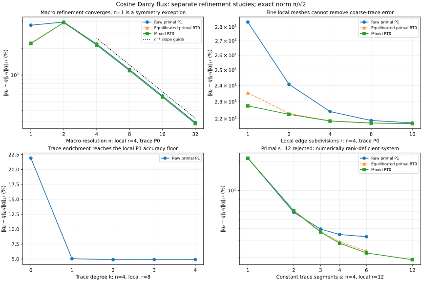
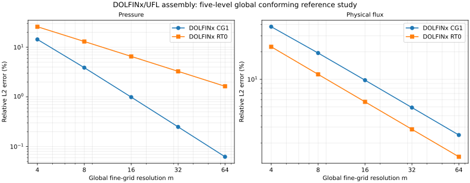
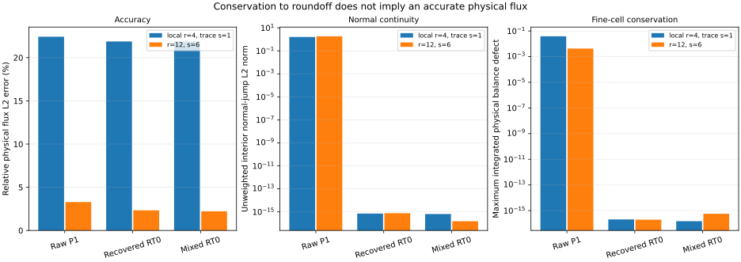

# Darcy flux accuracy and independent verification

The coarse cosine example has a **22.42% relative physical flux error** with
primal P1 locals and **21.87%** with mixed RT0/P0 locals. Its visible mosaic
contains a substantial discretization error. Neither a small algebraic residual
nor exact local conservation establishes flux accuracy.

Independent DOLFINx/UFL assembly reproduces the native pyMHM primal solution, and an
independently assembled global DOLFINx RT0 solution agrees with the fully
resolved mixed MHM flux to about `6e-15` in L2. Separate refinement studies
identify the coarse normal-flux trace as the dominant approximation limit in
this configuration. The comparisons verify physical fields, local assembly
and hybrid condensation for the equations, meshes and spaces specified below.

The recorded reference runtime is [DOLFINx 0.9.0](https://docs.fenicsproject.org/dolfinx/v0.9.0/python/),
identified in `examples/results/darcy-audit.json`. The reference forms were
assembled independently in UFL. These checks did not execute MSL, MFEM, or the
software used for the 2019 article. Separate
[MSL](https://github.com/ipes-lncc/pymhm/blob/main/docs/cases/reference-comparison.md) and [NeoPZ](https://github.com/ipes-lncc/pymhm/blob/main/docs/cases/neopz.md) pages report those code comparisons.

## Problem, norms and reproducibility

On the unit square, use unit permeability, full analytical Dirichlet pressure,

$$
p=\cos(\pi x)\cos(\pi y),\quad
q=\pi(\sin(\pi x)\cos(\pi y),\cos(\pi x)\sin(\pi y)),\quad
f=2\pi^2p.
$$

The analytical norms are \(\|p\|_{L^2}=1/2\) and
\(\|q\|_{L^2}=\pi/\sqrt2\). Every flux error below compares the **physical
vector field**, including the affine variation of RT0 inside each fine
triangle. It is not an error in face coefficients, a centroid-only metric, or
a visualization interpolation error.

A macro resolution `n` creates `2n²` triangles. Each macrotriangle has `r²`
fine triangles. The trace has degree `k` on `s` equal segments of each
macroface. Independent changes to `n`, `r`, `k`, and `s` answer different
approximation questions. All native studies use assembly Duffy order 6 and
error Duffy order 8. The UFL references use their own quadrature degree 16.

The numerical measurements are available in
`examples/results/darcy-audit.json`. Render its figures from those records:

```bash
pixi run -e notebooks python examples/plot_darcy_audit.py
```

The [complete numerical record](../figures/darcy-audit/metrics.json) includes
absolute and relative pressure/flux norms, individual skeleton projection
errors, all continuity and balance diagnostics, package versions and rejected
configurations. These are analytical verification experiments. The separate
[published-result comparisons](reproduction.md) use the publication's problem
and explicitly stated recovery space.

## Four separate approximation studies



### Macro refinement converges

Keep `r=4`, `k=0`, `s=1`. Both the primary mixed flux and the reconstructed
primal flux converge as the macro mesh resolves the normal trace. The five
levels `n=2,4,8,16,32` approach first-order physical flux convergence.

| n | Primal absolute L2 | Primal relative (%) | Mixed absolute L2 | Mixed relative (%) | Recovered relative (%) |
| ---: | ---: | ---: | ---: | ---: | ---: |
| 1 | 0.812468 | 36.5739 | 0.506554 | 22.8029 | 22.8029 |
| 2 | 0.881408 | 39.6773 | 0.869678 | 39.1493 | 39.1739 |
| 4 | 0.497996 | 22.4177 | 0.485746 | 21.8662 | 21.8695 |
| 8 | 0.256523 | 11.5476 | 0.249545 | 11.2335 | 11.2339 |
| 16 | 0.129226 | 5.8172 | 0.125627 | 5.6552 | 5.6552 |
| 32 | 0.0647346 | 2.9141 | 0.062921 | 2.8324 | 2.8324 |

The `n=1` mesh is a symmetry exception: the exact normal flux vanishes on the
outer square and on its diagonal `x=y`, so one constant trace represents the
exact skeleton flux. Refinement to `n=2` creates additional interfaces with
nonconstant exact normal flux and initially increases the error. Fitting a
convergence slope through that exceptional first mesh would be misleading.

### Fine local refinement reaches a trace-error floor

Keep `n=4`, `k=0`, `s=1` and refine only the local triangles.

| r | Primal relative flux error (%) | Mixed relative flux error (%) | Recovered relative flux error (%) |
| ---: | ---: | ---: | ---: |
| 1 | 28.3695 | 22.7540 | 23.5496 |
| 2 | 24.0849 | 22.2548 | 22.3061 |
| 4 | 22.4177 | 21.8662 | 21.8695 |
| 8 | 21.8965 | 21.7488 | 21.7490 |
| 16 | 21.7558 | 21.7180 | 21.7181 |

Increasing `r` from 4 to 16 scarcely changes the error: the local solves cannot
represent normal flux that is excluded from their imposed skeleton space.
A fine local mesh alone is therefore insufficient for this example.

### Higher trace degree removes most of that error

Keep `n=4`, `r=8`, `s=1` and change only the primal trace degree.

| Trace degree k | Primal absolute flux L2 | Primal relative flux error (%) |
| ---: | ---: | ---: |
| 0 | 0.486418 | 21.8965 |
| 1 | 0.112107 | 5.0466 |
| 2 | 0.108558 | 4.8868 |
| 3 | 0.108873 | 4.9010 |
| 4 | 0.108903 | 4.9024 |

The change from constant to linear trace is effective. Further trace-degree
increases reach the accuracy limit of these fixed P1 locals, with small
nonmonotonic error differences between degrees 2–4.
The present RT0 mixed adapter and equilibrated reconstruction require aligned
piecewise constant traces; this study makes no higher-degree claim for them.

### Subdividing macrofaces enriches both formulations

Keep `n=4`, `r=12`, `k=0`; change only the number `s` of constant trace segments.

| Segments s | Primal relative flux error (%) | Mixed relative flux error (%) | Recovered relative flux error (%) |
| ---: | ---: | ---: | ---: |
| 1 | 21.7928 | 21.7261 | 21.7261 |
| 2 | 5.9061 | 6.1306 | 6.1923 |
| 3 | 3.9445 | 3.6686 | 3.7366 |
| 4 | 3.4604 | 2.8070 | 2.9007 |
| 6 | 3.2849 | 2.2188 | 2.3266 |
| 12 | Rejected | 1.8894 | — |

At `s=12` the continuous P1 local response does not support an invertible global
multiplier system on this mesh: the numerical rank check rejects the solve.
The mixed RT0 trace remains admissible. The multiplier space must be compatible
with the local trace response for the reduced system to have full rank.

The [main Darcy gallery](https://github.com/ipes-lncc/pymhm/blob/main/docs/cases/darcy.md#an-enriched-computation) compares `r=12,s=6`
with the coarse `r=4,s=1` configuration and labels their physical error norms.

## Independent assembly and physical-field checks

### Global DOLFINx reference solutions

Global CG1 and RT0/DG0 problems are assembled directly from UFL, using DOLFINx
DOF orientation and quadrature. Their linear systems are solved independently
of MHM condensation. CG1 imposes the analytical pressure at boundary nodes;
RT0/DG0 uses the mixed weak Dirichlet boundary term. These spaces differ, so
this table does not imply equal approximation quality at equal computational
cost.

| Global fine resolution m | CG1 pressure L2 | CG1 flux L2 | RT0/P0 pressure L2 | RT0 flux L2 |
| ---: | ---: | ---: | ---: | ---: |
| 4 | 0.0718409 | 0.838548 | 0.129452 | 0.505467 |
| 8 | 0.0194065 | 0.431798 | 0.065274 | 0.252094 |
| 16 | 0.00495424 | 0.217536 | 0.0327031 | 0.125949 |
| 32 | 0.00124524 | 0.108975 | 0.0163597 | 0.0629614 |
| 64 | 0.000311732 | 0.0545137 | 0.00818089 | 0.0314791 |



For the **same fully resolved discrete mixed space**, compare MHM
`n=4,r=4,s=4` against global DOLFINx RT0 on `m=16`. DOLFINx evaluates its own
physical Piola-transformed vectors at independently located quadrature points.
The L2 difference between these two numerical flux fields is **5.67e-15**;
the largest sampled component difference is **2.21e-14**. Their physical flux
errors against the analytical field are both **0.12594855825928**.
This checks physical RT0 extraction as well as assembly and coupling; equal
linear-solver residuals alone would not establish it.

### Primal UFL system without condensation

A separate DOLFINx/UFL implementation assembles each local stiffness, force, signed
trace coupling and boundary integral, then solves the **entire broken-field /
multiplier saddle system**. It does not call the native element assembly or
MHM local condensation. The cosine Dirichlet case produces a `536 × 536` system.
Relative to native `n=4,r=4,s=1`, the maximum pressure-coefficient difference is
**4.71e-14** and the maximum trace-coefficient difference is **1.11e-13**.
The independently integrated pressure and flux errors are respectively
**0.024572742109141** and **0.497995938749215**.

A second check uses `cos(2πx)cos(2πy)`, homogeneous Neumann flux, one global
zero-mean constraint, `n=4,r=1,s=1`. Its `137 × 137` monolithic UFL system agrees
with native pressure and trace coefficients within **8e-15**. Independently
integrated errors are **0.111429264520227** for pressure and
**2.419076650196461** for flux. This supports the separate published-result
comparison's distinction between P1 locals and the RT0/quadratic construction.
It does not itself reproduce a published error curve.

The native FEM checks compare these physical fields and monolithic assemblies
with `1e-10` tolerances and require the optional DOLFINx dependencies.

## Continuity, conservation and accuracy are distinct

The normal-jump diagnostic is

$$
J(q_h)^2=\sum_{F\text{ interior fine face}}
\int_F(q_h^+\cdot n^+ + q_h^-\cdot n^-)^2\,ds.
$$

It includes fine interior and macro-interface faces, counted once, without
mesh-size weighting. The balance diagnostic is the maximum of
\(\left|\int_{\partial T}q_h\cdot n_T-\int_T f\right|\), with source
integrals recomputed independently. It is not a norm of the algebraic residual.



For the coarse configuration, raw P1 flux has jump norm **1.59901** and
maximum fine-cell balance defect **0.0383059**. Mixed and equilibrated RT0
fields have normal jumps and balance defects near roundoff, while retaining
approximately **22%** flux error. Conservative does not mean accurate.

The raw P1 gradient is constant within each fine triangle, so it cannot balance
a nonzero source pointwise or cellwise. Its unweighted jump norm need not
improve monotonically under trace enrichment, even as its physical L2 error
falls. Skeleton measures also change with mesh refinement. The full record
therefore retains both macro and fine-interior jump components rather than
using that quantity as a substitute for an exact-field error.

Equilibration converges in the macro-refinement study and enforces its intended
continuity and balance constraints. It does **not** guarantee a reduction of
the exact physical L2 error: the `r=12,s=2` experiment is a counterexample to
such a claim.
