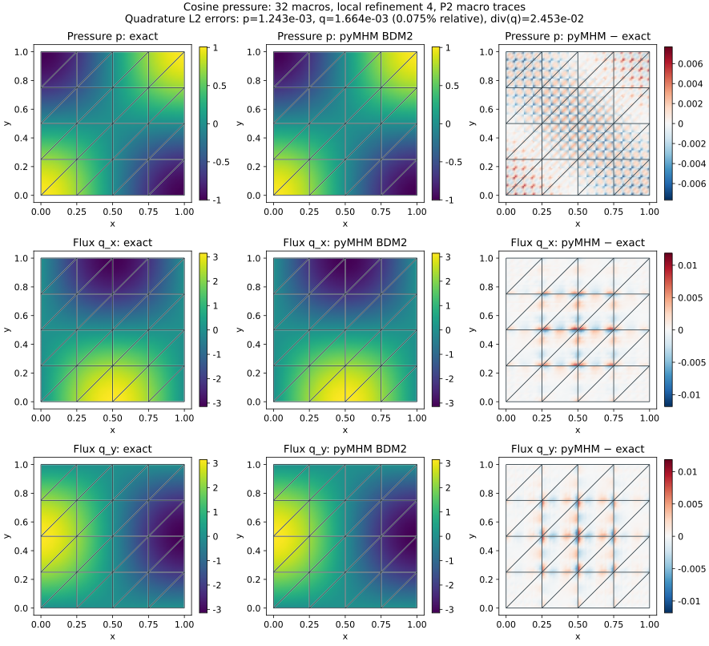
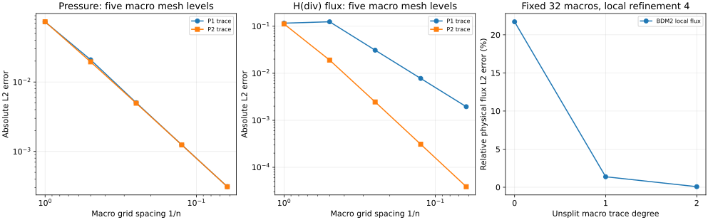

# Quadratic H(div) Darcy flux

By default, `solve_darcy_bdm` uses BDM2 flux and discontinuous P1 pressure on each fine
triangle. It restricts normal flux to an independently selected macroface
space while retaining the full interior BDM2 moments. This implements a
higher-order mixed-local option within the framework of
[Durán et al. (2019)](https://doi.org/10.1016/j.cma.2019.05.013).
The divergence space is exactly P1.

P0, P1 and P2 traces are supported, including subface partitions aligned with
fine edges. The default is an unsplit P1 trace on every macroface. The
contravariant Piola transform and oriented Legendre normal moments are shared
with the [mixed elasticity implementation](https://github.com/ipes-lncc/pymhm/blob/main/docs/cases/mixed-elasticity.md).

```python
from pymhm import TriangleMesh
from examples.formulations.application import bdm_darcy as solve_darcy_bdm

solution = solve_darcy_bdm(
    TriangleMesh.unit_square(4),
    permeability=[[2.0, 0.3], [0.3, 1.0]],
    source=-6.0,
    dirichlet=lambda x: x[:, 0] ** 2 + x[:, 1] ** 2,
)
```

For this quadratic pressure and constant tensor, the exact physical flux is
linear and belongs to BDM2. The returned P1 pressure is the cellwise L2
projection, so its error is not zero. A separate cubic-pressure test reproduces
an exact quadratic anisotropic flux and verifies all pressure projection
coefficients.

Permeability can also be a scalar field or a physical-coordinate callback
returning SPD tensors. Tests cover a spatially varying anisotropic tensor and
an aligned contrast of 1000. `neumann` specifies outward physical flux on
selected exterior faces; remaining faces prescribe pressure weakly. Pure
Neumann problems require compatibility and impose `mean_pressure`.

## The coarse cosine problem

The general interface accepts `degree=k, enrichment=n`, with integer \(k\geq1\)
and \(n\geq0\). It retains normal degree \(k\), all zero-normal bubbles of
BDM\(_{k+n}\), and complete discontinuous pressure \(P_{k+n-1}\). Macro traces
may have degree up to \(k\), on aligned subsegments. Thus increasing `enrichment`
changes the local divergence space while leaving normal degree fixed. Polynomial
checks cover \(k=1,2,3,4\), enrichment through three, anisotropic tensors,
mixed boundary data and pure-Neumann physical means. These checks do not imply
uniform conditioning at arbitrary degree. The following recorded campaigns
use the default BDM2/P1 family throughout.

On the unit square, take

$$
p=\cos(\pi x)\cos(\pi y),\qquad
q=\pi(\sin(\pi x)\cos(\pi y),\cos(\pi x)\sin(\pi y)),
$$

$$
K=I,\qquad f=2\pi^2p.
$$

The boundary pressure is its nonhomogeneous analytical trace. The following
study fixes the same 32 diagonal macrotriangles and local refinement four,
then changes only the unsplit macro trace degree.

| Trace degree | Pressure L2 error | Physical flux L2 error | Relative flux error |
|---:|---:|---:|---:|
| P0 | 0.0246683 | 0.482252 | 21.7090% |
| P1 | 0.00159046 | 0.0305446 | 1.37499% |
| P2 | 0.00124306 | 0.00166354 | 0.0748858% |

The high-order local space alone does not resolve a coarse constant normal
trace. Enriching the trace substantially improves flux accuracy in this case.
No smoothing or gradient recovery is applied to the BDM2 field.



Every panel overlays the actual macrotriangulation. Exact and numerical fields
share color scales. Fine-cell values remain independent where tangential flux
or pressure can jump. Quadratic flux is sampled on nine display triangles per
fine cell; quadrature error norms are evaluated independently of this display.

## Five mesh levels



The macro grid resolutions are \(n=1,2,4,8,16\), each with local refinement two.
Both P1 and P2 macro traces use the same BDM2/P1 local spaces. At the finest
level, the P2-trace pressure error is \(3.10970\times10^{-4}\) and flux error
is \(3.87505\times10^{-5}\). This is an analytical convergence study, not a
claim to reproduce a published table.

All three P1 moments of \(\operatorname{div}q-f\) vanish in each fine cell up to
solver precision. `fine_equilibrium_residuals()` exposes those moments;
`fine_conservation_residuals()` sums them to the constant cell balance.
`normal_flux_residuals()` checks every BDM normal moment against the signed
skeleton. These are distinct from strong divergence error: on the fixed
32-macro/refinement-four case it is 0.0245284 for all three trace degrees,
because \(\operatorname{div}q\) is the P1 projection of the nonpolynomial source.

## Independent verification

A DOLFINx/UFL integration test assembles the full conforming **Basix BDM2/P1**
Darcy operator independently, with an anisotropic tensor, quartic pressure
data, nonzero Dirichlet trace, and non-exact finite-element fields. Full
fine-edge P2 macro traces make the discrete spaces identical. Flux and pressure
agree with the condensed pyMHM result within \(3\times10^{-11}\) and
\(3\times10^{-12}\), respectively. Polynomial patches, pure-Neumann gauges,
partial Neumann conditions, trace orientations, and source moments are also
checked in the portable test suite.

Regenerate these package-owned analytical cases with:

```console
pixi run --locked -e notebooks python -m examples.plot_darcy_bdm
```

The [numerical records](https://github.com/ipes-lncc/pymhm/blob/main/examples/results/darcy-bdm.json)
state meshes, quadratures, trace degrees and physical errors. External reference
solver sources are not needed to execute this gallery.

## References

- Omar Durán, Philippe R. B. Devloo, Sônia M. Gomes, and Frédéric Valentin (2019). *A multiscale hybrid method for Darcy’s problems using mixed finite element local solvers*, Computer Methods in Applied Mechanics and Engineering 354, 213–244. [DOI: 10.1016/j.cma.2019.05.013](https://doi.org/10.1016/j.cma.2019.05.013).
