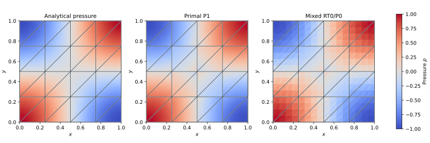
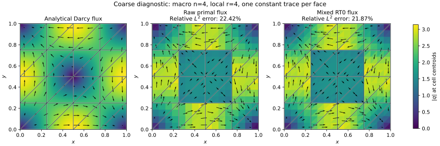
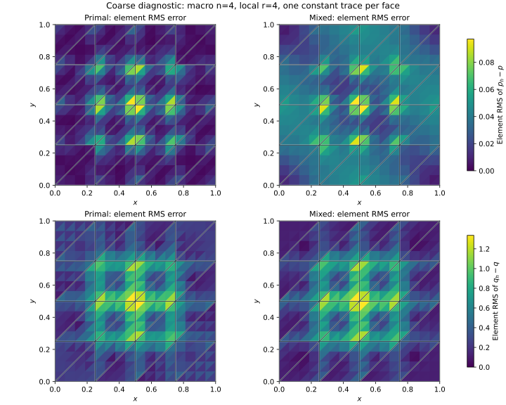
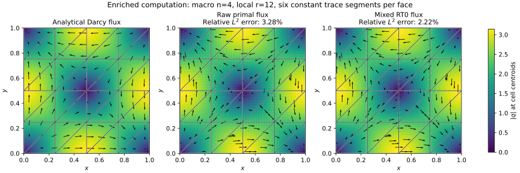
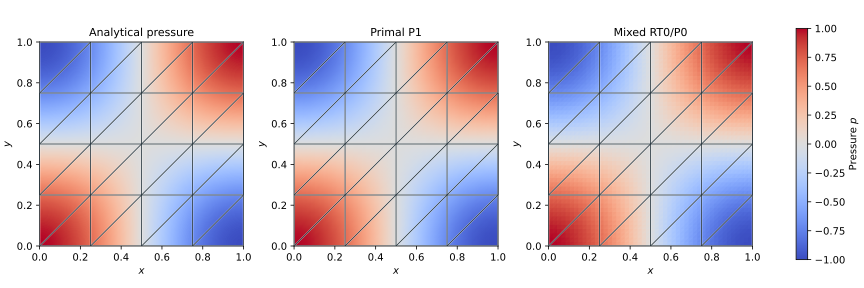
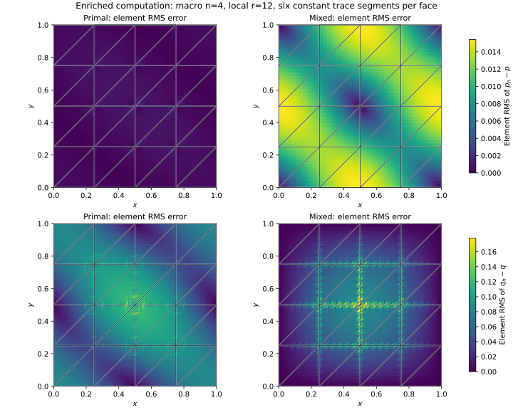
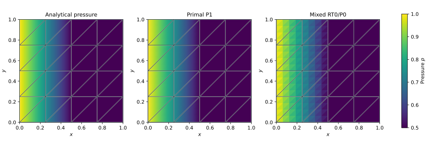
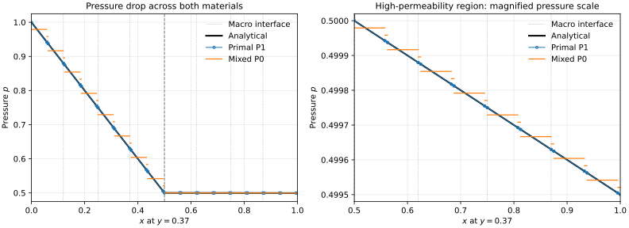
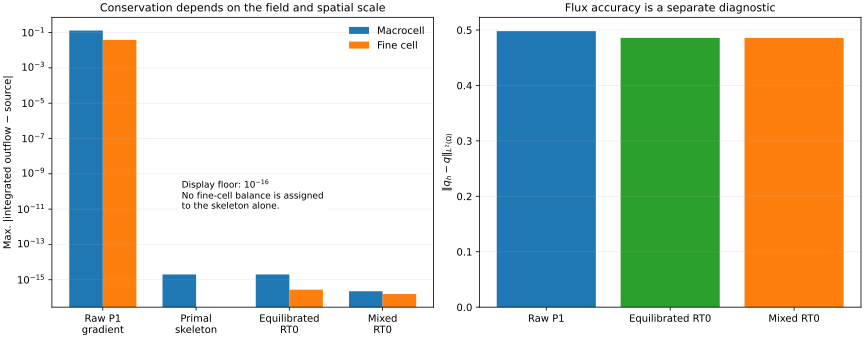
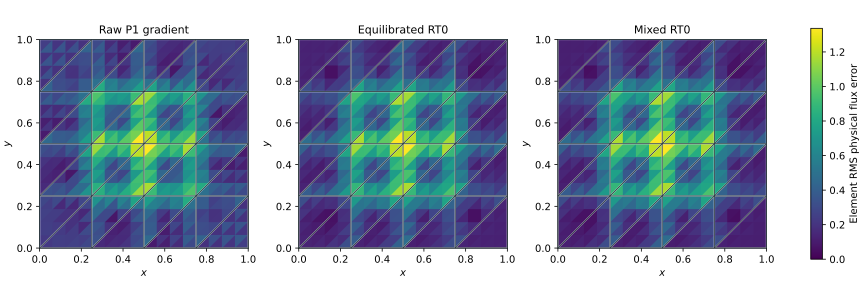

# Darcy flow and heterogeneous media

These cases compare the native primal P1 and mixed RT0/P0 local formulations
against analytical pressure and physical Darcy flux. They also distinguish
conservation of the skeleton unknown from conservation of the reconstructed
field. All problems use

$$
q=-K\nabla p,\qquad \nabla\cdot q=f
$$

on the unit square, with analytical pressure prescribed on its entire boundary.
The [theory](../theory.md) explains the trace sign and local elimination;
[verification](../verification.md) reports additional refinement levels.

Both local formulations and the flux reconstruction on this page are executed
by pyMHM's native NumPy/SciPy backend. Their reference fields are analytical
expressions. The separate [DOLFINx assembly verification](https://github.com/ipes-lncc/pymhm/blob/main/docs/cases/darcy-audit.md),
[MSL primal comparison](https://github.com/ipes-lncc/pymhm/blob/main/docs/cases/reference-comparison.md), and [NeoPZ mixed comparison](https://github.com/ipes-lncc/pymhm/blob/main/docs/cases/neopz.md)
identify the external implementations used for additional checks.

## Smooth pressure: compare both local formulations

For unit permeability, choose

$$
\begin{aligned}
p(x,y)&=\cos(\pi x)\cos(\pi y),\\
q(x,y)&=\pi\bigl(\sin(\pi x)\cos(\pi y),
                  \cos(\pi x)\sin(\pi y)\bigr),\\
f(x,y)&=2\pi^2\cos(\pi x)\cos(\pi y).
\end{aligned}
$$

This analytical problem appears in
[Durán et al. (2019)](https://doi.org/10.1016/j.cma.2019.05.013).
The present triangular discretization and local spaces differ from the paper's
numerical experiments; the figures verify the specified problem rather than
reproduce its tables.

The coarse discretization uses a `4 × 4` macro square grid split into **32 macro
triangles**, four subdivisions along each local edge, and **512 fine triangles**.
The normal-flux trace is constant on each macroface. Both formulations use the
same meshes, boundary data and quadrature: Duffy order 6 for assembly and order 8
for independent error integration.

### Pressure

The analytical solution has alternating positive and negative corner regions
and vanishes on the two midlines. All three panels use the same pressure scale.
The primal pressure is piecewise linear inside each macrocell; the mixed
pressure is piecewise constant on fine triangles. Broken macro traces remain
separate when plotting, and P0 pressure is not interpolated into a smooth field.



<a id="physical-flux-retain-the-coarse-diagnostic"></a>

### Physical flux on the coarse mesh

The relative L2 flux errors are **22.42%** (primal) and **21.87%** (mixed).
The visible mosaic includes a substantial approximation error. A small solver
residual and a conservative RT0 field do not establish a sufficiently resolved
solution. The [independent accuracy study](https://github.com/ipes-lncc/pymhm/blob/main/docs/cases/darcy-audit.md) quantifies the separate
effects of macro, local and trace refinement.
The [matched coarse-case reference computations](https://github.com/ipes-lncc/pymhm/blob/main/docs/cases/coarse-cosine.md) compare this
specific discretization with MSL and NeoPZ, using the same nonzero weak
Dirichlet pressure data.

The vector field is directed down the pressure gradient. Colors show its
magnitude, while arrows show its direction and relative size using the same
arrow scale in all panels. Numerical magnitudes and arrows are evaluated at
fine-cell centroids; the analytical panel is sampled independently. In
particular, the centroid display does not show the full affine variation of an
RT0 field inside a triangle.



### Error location and integrated norms

Each map shows an element root-mean-square error,

$$
e_T(v)=\left(\frac{1}{|T|}\int_T |v_h-v|^2\,dx\right)^{1/2}.
$$

The pressure panels share a color scale, and the flux panels share another.
These are errors integrated over each element, rather than errors sampled only
at nodes or centroids. The global norm satisfies
\(\|v_h-v\|_{L^2(\Omega)}^2=\sum_T |T|e_T(v)^2\).



| Local formulation | Pressure L2 error | Physical flux L2 error |
| --- | ---: | ---: |
| Primal P1 | 2.457274e-2 | 4.979959e-1 |
| Mixed RT0/P0 | 4.034965e-2 | 4.857458e-1 |

The smaller P1 pressure error must be interpreted together with its richer
pressure space. The mixed formulation has a slightly smaller flux error in this
run. A single grid does not establish a convergence rate or a general ordering
between the two formulations.

### An enriched computation

Retain the same 32 macrotriangles and problem data, refine each local edge into
12 parts, and divide each macroface into six constant trace segments. This gives
4608 fine triangles and reduces the relative physical flux error to **3.28%**
for primal P1 and **2.22%** for mixed RT0. The plot keeps the numerical fields
unsmoothed, with identical scales within each comparison.







The improvement requires enriching the trace. Refining only the local triangles
leaves a flux-error plateau near 22%. Five-point macro, local and trace studies,
normal-jump diagnostics, and independent DOLFINx/UFL checks are reported in the
[Darcy flux verification study](https://github.com/ipes-lncc/pymhm/blob/main/docs/cases/darcy-audit.md). The separate
[published-result comparisons](reproduction.md) distinguish analytical
verification from reproduction of an article's actual error curves.

## Permeability contrast of 1000

A fitted vertical interface separates two constant permeabilities:

$$
K(x)=\begin{cases}1,&x<1/2,\\1000,&x>1/2,\end{cases}
\qquad
p(x)=\begin{cases}1-x,&x\leq1/2,\\
\frac12-\frac{x-1/2}{1000},&x>1/2.
\end{cases}
$$

Pressure is continuous, its slope changes by a factor of 1000, and the exact
physical flux is \(q=(1,0)\) everywhere. Thus \(f=0\), including across the
interface in the distributional sense. Exact pressure is prescribed on **all
four sides**, using Dirichlet data also on the top and bottom boundaries.

The material interface coincides with macro and fine edges. P1 can represent
the piecewise affine pressure exactly, and RT0 can represent its constant flux.
The mixed P0 pressure retains its expected cell-average representation error.



The right-hand pressure drop is only \(5\times10^{-4}\), so a second profile
panel magnifies this scale. The profile at \(y=0.37\) shows each P0 segment
with its own endpoint limits, without interpolating across jumps. Primal P1
segments coincide with the analytical curve to plotting precision.



| Local formulation | Pressure L2 error | Physical flux L2 error |
| --- | ---: | ---: |
| Primal P1 | 1.130122e-16 | 5.278423e-13 |
| Mixed RT0/P0 | 1.041667e-2 | 4.159053e-13 |

For this diagonal triangular grid with fine spacing
\(h=1/(4\cdot4)=1/16\), the analytical P0 projection error is

$$
\|p-\Pi_0p\|_{L^2(\Omega)}
=\frac{h}{6}\sqrt{1+10^{-6}}
=1.0416671875\times10^{-2}.
$$

It agrees with the computed mixed pressure error. The plotting script checks
this agreement numerically. The remaining primal pressure and both flux errors
are at floating-point accuracy for this fitted problem; they are not reported
as exact zeros. This case does not test cut-cell integration, arbitrary
coefficient contrast, or robustness on unfitted meshes.

## Conservation: skeleton, raw gradient and recovered field

Return to the cosine problem, whose source is nonzero. The raw primal flux
\(-\nabla p_h\) is constant on each fine triangle, so its fine-cell divergence
is zero there. It cannot balance a nonzero cell source, even though the MHM
skeleton satisfies the macrocell balance equations.

`equilibrate_flux` reconstructs an RT0 field by a constrained minimum-energy
correction, matching the prescribed skeleton normal flux and the assembled
source integral on each fine cell. The separately solved pyMHM mixed problem
instead constructs its RT0 flux as a primary unknown. These are different procedures.

The plotted defect on a cell \(T\) is

$$
d_T=\int_{\partial T}q_h\cdot n_T\,ds-\int_T f\,dx.
$$

Macrocell and fine-cell bars report \(\max_T|d_T|\) on their respective
partitions. Source integrals use assembly quadrature, so the diagnostic measures
the discrete balance equations. A skeleton alone has no fine-interior flux
field; consequently, its fine-cell defect is left unspecified.



| Field or trace | Maximum macrocell defect | Maximum fine-cell defect |
| --- | ---: | ---: |
| Raw primal gradient | 1.304109e-1 | 3.830590e-2 |
| Primal skeleton | 2.220446e-16 | Not defined |
| Equilibrated RT0 field | 2.402592e-16 | 1.977585e-16 |
| Mixed RT0 field | 1.665335e-16 | 1.370432e-16 |

The logarithmic chart uses a display floor of \(10^{-16}\); unmodified values
are retained in the metrics file. Conservative fields still have approximation
error: the recovered flux has L2 error **0.4858182**, compared with **0.4979959**
for the raw primal gradient and **0.4857458** for the mixed flux.



The modest improvement in this case is an observation, not a guarantee that
every conservative reconstruction reduces the L2 error. This minimum-energy
RT0 correction is also distinct from the higher-order moment construction
discussed in the [literature catalogue](../literature.md).

## Reproduce and export

From the repository checkout, run:

```bash
pixi run --locked -e notebooks python -m examples.plot_darcy_cases
```

The script limits numerical thread pools to one thread and writes ten SVG
figures, ten PNG figures and [machine-readable metrics](../figures/darcy/metrics.json).
Use `--macro-resolution`, `--local-refinement` and `--output-directory` to
generate another experiment. Macro resolution must be even so that the material
interface remains fitted. Changing these parameters changes the measured
values; the tables above describe the default run. The enriched comparison
keeps `r=12,s=6` while using the requested macro resolution.

The analytical panels use a separate display grid. Error maps and norms use
quadrature on the actual finite elements. The SVG and PNG files share the same
computed data and are suitable for inspection or export.

## References

- Omar Durán, Philippe R. B. Devloo, Sônia M. Gomes, and Frédéric Valentin (2019). *A multiscale hybrid method for Darcy’s problems using mixed finite element local solvers*, Computer Methods in Applied Mechanics and Engineering 354, 213–244. [DOI: 10.1016/j.cma.2019.05.013](https://doi.org/10.1016/j.cma.2019.05.013).
