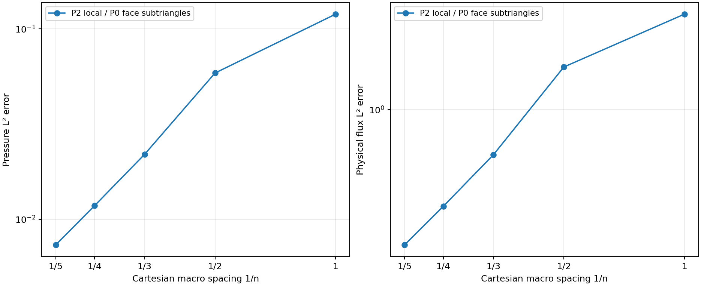
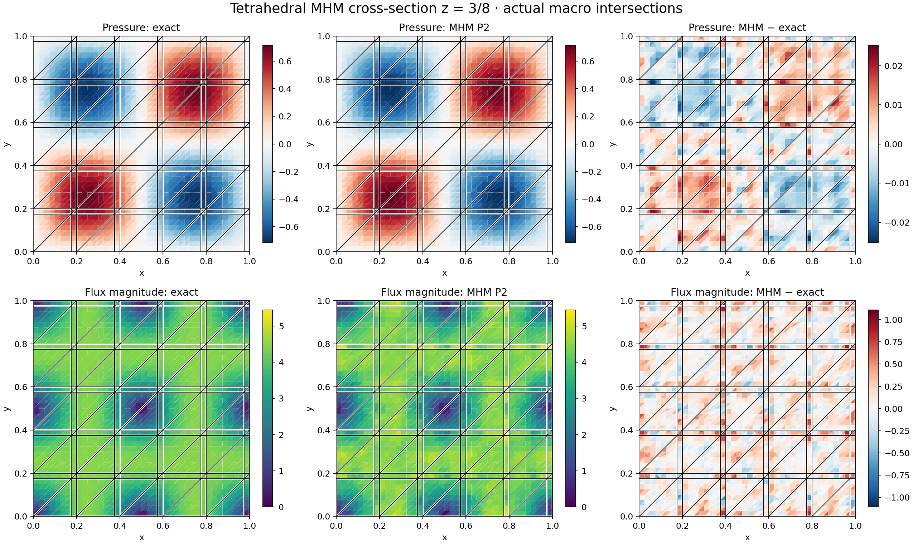

# Three-dimensional tetrahedral Darcy

The native three-dimensional primal MHM solver uses straight-sided tetrahedral
macrocells, continuous local Pk pressure, and independent Bernstein Pk normal
flux densities on triangular subdivisions of each macroface. It solves

$$
q=-K\nabla p,\qquad \nabla\cdot q=f,
$$

with symmetric positive-definite scalar or tensor permeability. Pressure data
are imposed weakly through skeletal moments. Prescribed Neumann data are outward
physical normal fluxes; pure Neumann problems require compatible data and one
physical volume mean. The raw field `-K grad(p)` is generally broken across
macrofaces. Conservation concerns the oriented skeleton flux, and does not
assert fine-cell conservation of that raw gradient.

Positive local degrees are supported. The [general tetrahedral Pk study](https://github.com/ipes-lncc/pymhm/blob/main/docs/cases/tetra-pk.md)
includes independent P5/P6 element checks and a P5/P2 estimator campaign.

```python
from pymhm.meshes.tetrahedron import TetraMesh
from pymhm.fem.traces.triangle_3d import TriangularSkeleton
from pymhm._legacy.models.darcy.primal_3d import solve_darcy_3d

mesh = TetraMesh.unit_cube(2)
skeleton = TriangularSkeleton(mesh, subdivisions=2)
solution = solve_darcy_3d(
    mesh,
    skeleton=skeleton,
    degree=2,
    local_refinement=4,
    source=1.0,
    dirichlet=0.0,
)
```

`subdivisions=2` creates four constant trace modes on each macroface;
`subdivisions=4` creates sixteen. A sequence can assign different subdivisions
per face. Local refinement and skeletal subdivisions are dyadic, and the fine
boundary triangulation must resolve the trace partition. These counts describe
mesh subdivisions, not polynomial degree. Local P2 functions include topologically
shared edge midpoints; P3/P4 also share topologically identified face nodes.
`TriangularSkeleton(mesh, degree=1)` selects three linear nodal modes per
subtriangle, independently of the local degree. Refinement preserves triangular interface alignment and
oriented normals without merging geometrically close unrelated vertices.

This convenience solver uses affine tetrahedral Pk local spaces for any positive
degree; [P5/P6 native checks and a P5/P2 study](https://github.com/ipes-lncc/pymhm/blob/main/docs/cases/tetra-pk.md) document the
general-degree evaluation. Separate interfaces provide
[star-shaped polyhedral macrocells](https://github.com/ipes-lncc/pymhm/blob/main/docs/cases/star-polyhedra.md) and
[three-dimensional H(div) mixed local families](mixed-well-geometries.md).
Curved tetrahedral geometry is not part of this primal solver. The [MPI assembly interface](../execution.md) accepts
generic local algebra, while this convenience driver exposes serial, thread
and spawned-process local factories with a single-process global solve.
The [three-dimensional RAD case](https://github.com/ipes-lncc/pymhm/blob/main/docs/cases/rad3d.md) uses the same geometric and polynomial
spaces with the conservative Robin formulation and local P4/face P1 degrees.

## Explicit face and volume partitions

`TriangularSkeleton(mesh, degree=k, face_partitions=parts)` accepts one conforming
triangulation per original macroface. Each entry has shape `(nsub, 3, 3)`, with
three barycentric coordinates per vertex in the order `mesh.faces[face]`.
Subtriangles can have different areas and independently ordered vertices.
`face_partition(face)` returns the active triangles and `face_weights(face)`
returns their positive fractions of the original face area. The uniform
`subdivisions` setting remains available and does not replace explicit geometry.

`solve_darcy_3d(..., local_meshes=locals)` accepts one `TetraMesh` per macrocell.
Containment, total volume and the complete exterior envelope are checked;
matching total volume alone cannot authorize a hole or an unmatched interior
face. Every local exterior triangle must lie in exactly one skeletal
subtriangle. An explicit mesh therefore needs no dyadic refinement count, but
must resolve the actual face partition. Local spaces still need sufficient
trace rank; geometric alignment alone does not establish stability.

Boundary loads, macro conservation, MsHHO face moments and the three-dimensional
stress/flux consumers use the subtriangle area fractions. Tests include a
nonuniform face fan with fractions 0.5, 0.2 and 0.3, anisotropic affine and
quadratic pressure, mixed and pure Neumann data, canonical RT reconstruction,
and ordered thread/process assembly. The quadratic check has varying normal
flux and distinguishes the physical weighted mean from an unweighted average.

## Sinusoidal cube problem

The analytical field is

$$
p(x,y,z)=\sin(2\pi x)\sin(2\pi y)\sin(2\pi z),\qquad
f=12\pi^2p,\qquad K=I,
$$

on the unit cube with homogeneous pressure data. This is the PDE in the 3D
performance example of [Gomes et al., §5](https://arxiv.org/abs/1703.10435).
The present study uses Freudenthal macrotriangulations and deterministic local
red refinement: six macrotetrahedra per Cartesian cube, 64 fine tetrahedra and
165 P2 unknowns per macrocell, with four P0 trace subtriangles per macroface.
The paper uses different TetGen meshes. Consequently this is an analytical
convergence verification of the same PDE and polynomial families, not a
reproduction of its cluster timing table.

| Cartesian subdivisions | Macro tetrahedra | Fine tetrahedra | Pressure L² error | Physical flux L² error |
| ---: | ---: | ---: | ---: | ---: |
| 1 | 6 | 384 | 1.19499965e-1 | 1.83603984 |
| 2 | 48 | 3,072 | 5.86591114e-2 | 1.31206785 |
| 3 | 162 | 10,368 | 2.19302284e-2 | 7.50342855e-1 |
| 4 | 384 | 24,576 | 1.17889403e-2 | 5.40942569e-1 |
| 5 | 750 | 48,000 | 7.34105258e-3 | 4.23102134e-1 |



[Convergence figure as SVG](../figures/darcy3d/convergence.svg).
Both local and trace mesh diameters decrease as the macro mesh is refined.
The study does not isolate a pure polynomial-degree or pure skeleton-refinement
rate. The largest macrocell flux/source imbalance is below `6e-16`; the largest
condensed backward residual is below `3e-16`. Positive Duffy-product quadrature
uses order five for assembly and six for volumetric errors. At the finest level,
order eight changes pressure and flux error norms by less than `2e-13` in
absolute value. This checks the reported error integration; it is not a
substitute for discretization refinement.



[Field figure as SVG](../figures/darcy3d/fields.svg).
Black lines with white outlines mark intersections of the actual tetrahedral
macro mesh with the plane. Each cut fine-cell polygon displays the value at its
own centroid; no averaging combines opposite sides of an interface. The same
sampling and color limits are used for exact and numerical panels, and signed
differences use a centered scale. These flat polygon displays approximate the
visualization of P2 fields; the error norms above integrate the full polynomial
and its gradient throughout the volume.

## Verification and mesh exchange

Light tests cover geometric volume/orientation and surface divergence identities,
positive polynomial quadrature, anisotropic affine patches, an exactly represented
quadratic potential, mixed and pure Neumann data, physical gauges, invalid trace
partitions, and equality with a directly assembled uncondensed saddle system.
Thread and spawn-process results coincide with serial fields. Native optional
tests compare the P1/P2 volume matrices and loads with independent DOLFINx/UFL
assembly on a distorted tetrahedron, matching DOFs by coordinates.

`pymhm.io.tetrahedral.read_tetra_mesh` and `write_tetra_mesh` exchange linear tetrahedra
through meshio, including integer material and triangular-face IDs and finite
point/volume fields. A native VTU roundtrip verifies geometry, tags and fields.
Gmsh tetrahedral files can be imported through meshio; this does not add a
three-dimensional CAD-generation wrapper. Higher-order geometric cells, prisms,
hexahedra and polyhedra are explicitly rejected by this tetrahedral reader.

```bash
pixi run --locked -e test-core python examples/solve_darcy3d.py
pixi run -e notebooks python examples/plot_darcy3d.py
pixi run -e fem pytest tests/test_tetrahedral.py -m fem
pixi run -e meshing pytest tests/test_meshing3d.py -m meshing
```

[Acquisition record](https://github.com/ipes-lncc/pymhm/blob/main/examples/results/darcy3d.json)
and notebook `29_darcy3d.ipynb` retain the discretization, source hashes and checks.
