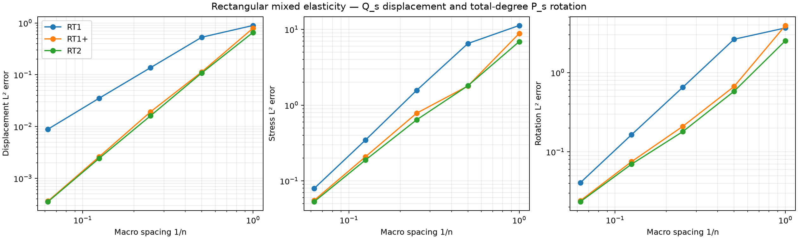
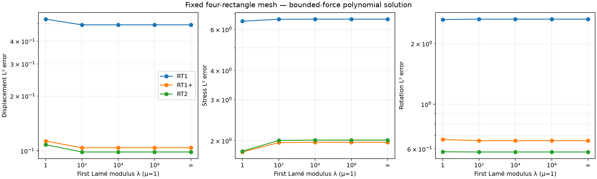
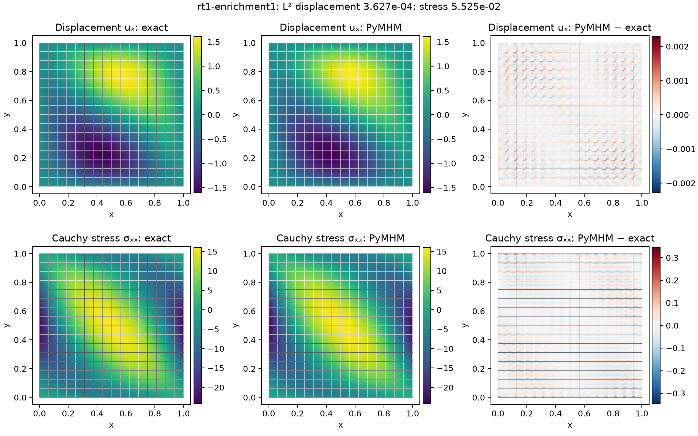

# Rectangular mixed elasticity

`solve_elasticity_tensor_rt` implements the quadrilateral weak-symmetry family
of [the 2021 MHM elasticity paper](https://doi.org/10.1051/m2an/2021013),
Table 1 and section 4.3.2. For normal degree \(k\geq1\) and interior enrichment
\(n\geq0\), put \(s=k+n\). Each stress row retains RT normal moments through
Pk and all zero-normal interior modes of
\(Q_{s+1,s}\times Q_{s,s+1}\). Displacement is discontinuous \(Q_s^2\),
whereas the independent rotation uses **total-degree** \(P_s\).
Replacing that rotation space by Qs would change the published pair.

The default RT1/Q1/P1 pair contains the rigid motions. RT0/Q0/P0 is not offered
as a mixed-elasticity family. Local stress normal degree, interior enrichment
and macroface resolution remain independent. The default skeleton uses P1 on
interior macrofaces and full fine-edge Pk on the external boundary; custom
traces must have degree at most k and fine-edge-aligned segmentation.

```python
from pymhm.meshes.cartesian import CartesianMacroMesh
from pymhm._legacy.models.elasticity.stress_tensor import solve_elasticity_tensor_rt

solution = solve_elasticity_tensor_rt(
    CartesianMacroMesh(4), degree=1, enrichment=1,
    local_refinement=2, lame_lambda=1.e8,
    source=(1., 0.),
)
```

The geometry is an axis-aligned Cartesian rectangle mesh. Bilinear, curved or
arbitrary quadrilateral mappings are outside this implementation. Lamé data
may be scalar or callable; declared Cartesian material discontinuities must
align with the fine rectangles. Ordinary callback discontinuities require the
same alignment and appropriate integration from the caller.

Stress is the full Cauchy tensor, with H(div) continuity row by row. Its skew
part is constrained through P_s moments and is not removed pointwise.
The multiplier is negative physical traction; rotation approximates
\((\partial_y u_x-\partial_x u_y)/2\). The finite-modulus hydrostatic identity,
exact infinite-lambda pressure gauge and pure-traction rigid moments follow
[the mixed-elasticity conventions](https://github.com/ipes-lncc/pymhm/blob/main/docs/cases/mixed-elasticity.md). The implementation uses
the same stable bulk-compliance operation as the triangular families.

`evaluate` returns displacement, full stress, stress divergence and rotation.
`errors` integrates their L2 errors, using the Frobenius norm of the full stress.
`fine_force_residuals`, `weak_symmetry_residuals`,
`normal_traction_residuals` and `equilibrium_residuals` distinguish fine force
moments, weak symmetry, represented normal traces and macro force/moment balance.
These diagnostics test discrete identities; they do not quantify approximation
error by themselves.

The [HPC4e geological cross-section](hpc4e.md) uses the same family with the
original heterogeneous material samples, 16 × 8 macrorectangles and 32 × 32
fine rectangles per macrocell. Four P1 skeleton resolutions reproduce the
discretizations of the article's section 6.2.

## Independent verification and numerical campaigns

Tests cover affine fields, a quadratic solenoidal field, finite and infinite
lambda, nonzero mean pressure, heterogeneous smooth moduli, mixed traction and
pure traction. Three native DOLFINx/UFL tests independently assemble compliance,
divergence, asymmetry and load. Physical basis evaluation transforms Basix RT
functions into the normal/interior basis and restricts the Qs rotation to Ps.
This verifies the whole operator for RT1, RT1-plus and RT2.

The original bounded-force polynomial field from
`examples/elasticity_data.py` is acquired on five grids
\(n=1,2,4,8,16\), one fine rectangle per macrocell. RT1, RT1-plus and RT2 retain
P1 interior macro traces; RT2 has P2 exterior traces. These declared spaces
are not a historical table reproduction. A second study fixes four rectangles
and varies \(\lambda=1,10^2,10^4,10^8,\infty\), with \(\mu=1\).
Force and exact fields stay compatible and bounded in that limit. Finite
errors on this fixed coarse space document the observed locking behavior;
they do not establish robustness for every heterogeneous contrast.







```bash
pixi run --locked -e test-core python examples/solve_elasticity_tensor_rt.py --degree 1 --enrichment 1
pixi run -e notebooks python examples/plot_elasticity_extensions.py
```
