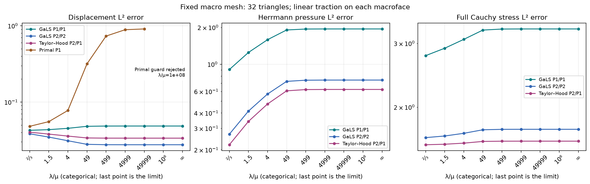
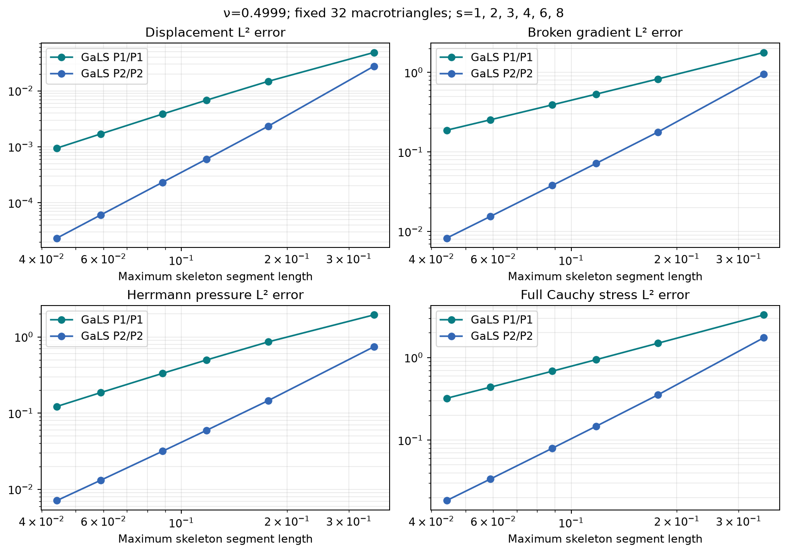
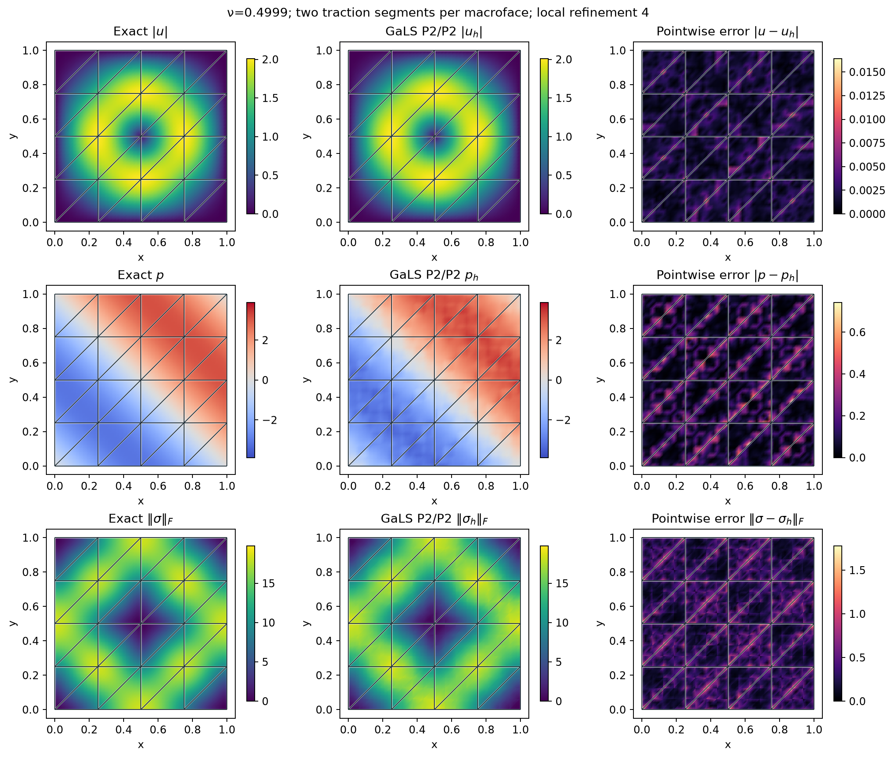

# Mixed elasticity and near incompressibility

`solve_elasticity` uses the displacement–Herrmann-pressure formulation.
Native GaLS supports P1/P1, P2/P2 and P3/P3 local fields; Taylor–Hood supports
P2/P1 and P3/P2. Each macrotriangle retains two translations and one rotation.
The displacement-only P1 formulation is selected with `formulation="primal"`.

These native pyMHM experiments compare against exact fields, using bounded
forces as the first Lamé modulus grows. The analytical family agrees with the
MSL GaLS elasticity case. The curves below are not an independent execution
of MSL or a digitized reproduction of the article's figures.
The separate [MSL GaLS field comparison](https://github.com/ipes-lncc/pymhm/blob/main/docs/cases/elasticity-reference.md) reports
matched runs of both implementations, including higher-order local spaces.

## Formulation and constraints

For constant shear modulus $\mu>0$ and first Lamé modulus $\lambda>0$,

$$
\sigma=2\mu\varepsilon(u)-pI,\qquad
-\nabla\cdot\sigma=f,\qquad
\nabla\cdot u+\lambda^{-1}p=0.
$$

Thus $p=-\lambda\nabla\cdot u$. With `lame_lambda=np.inf`, the pressure
compliance is zero. The discrete divergence equation is weak; it does not
imply pointwise zero divergence. `compressibility_l2()` measures
$\|\nabla\cdot u_h+p_h/\lambda\|_0$ directly.

The GaLS residual is $R(u,p)=2\mu\nabla\cdot\varepsilon(u)-\nabla p$.
Stabilization adds $-\sum_T\alpha h_T^2(R(u,p),R(v,q))_T$ to the bilinear
form and $+\sum_T\alpha h_T^2(f,R(v,q))_T$ to the load. The default $\alpha$
is half the admissible bound computed from the finite-element inverse
inequality, without using an exact solution or a reference error.
`stabilization_alpha` can prescribe another coefficient strictly inside that
bound. Taylor–Hood has no GaLS stabilization.

Local stability also requires a compatible traction space. With a linear trace
on each segment, GaLS requires at least four fine intervals per segment for
P1/P1, two for P2/P2, and one for P3/P3. Segment endpoints must align with the
fine boundary mesh. The sufficient degree/refinement conditions follow
Lemma 4.5 of the [Gomes, Pereira and Valentin (2024, preprint v1)](https://arxiv.org/abs/2403.16890v1).
Insufficient pairs are rejected before solving; enriching only the trace does
not guarantee stability.

The multiplier is negative Cauchy traction, $-\sigma n$, while `neumann` accepts
physical outward traction $\sigma n$ on selected boundary faces. For a fully
prescribed displacement boundary, finite compressibility fixes

$$
\int_\Omega p=-\lambda\int_{\partial\Omega}g\cdot n.
$$

At infinite $\lambda$, boundary volume flux must vanish and `mean_pressure`
sets one global pressure gauge. A pure traction problem uses three prescribed
`rigid_moments`; an unbalanced force or moment is rejected. There are no
independent pressure gauges on macrocells.

## Exact family and printed benchmark conventions

Write $s=\sin(\pi x)\sin(\pi y)$, $c=\cos(\pi(x+y))$ and
$\beta=\mu/(\lambda+\mu)=1-2\nu$. On the unit square, let

$$
u_0=\begin{pmatrix}
(\cos(2\pi x)-1)\sin(2\pi y)\\
(1-\cos(2\pi y))\sin(2\pi x)
\end{pmatrix},\qquad
u=u_0+\beta s\begin{pmatrix}1\\1\end{pmatrix},
$$

$$
p=-\mu(1-\beta)\pi\sin(\pi(x+y)),
$$

$$
f=4\mu\pi^2\begin{pmatrix}
(2\cos(2\pi x)-1)\sin(2\pi y)\\
(1-2\cos(2\pi y))\sin(2\pi x)
\end{pmatrix}
+\mu\pi^2(2\beta s-c)\begin{pmatrix}1\\1\end{pmatrix}.
$$

Displacement vanishes on the boundary and pressure has zero mean. The force
stays bounded as $\beta\to0$, while the limiting pressure remains nonzero.
This bounded-load family isolates the effect of the incompressible limit.

The printed §6 data contain a factor mismatch: the displacement correction
has amplitude $\beta/2$, while its pressure uses amplitude $\beta$; the force
also mixes these amplitudes. The equations above use the consistent
amplitude-one MSL family. `TrigonometricElasticityData(pressure_amplitude=0.5)`
provides the literal printed displacement **with its own consistently derived
pressure and force**. Independent derivative tests check both choices against
$-\nabla\cdot\sigma=f$.

The additional `ElasticityData` polynomial family uses a bubble streamfunction
and exact integral checks for displacement and elastic energy. Its solenoidal
variant has identical displacement and force for every $\lambda$, providing
another independent locking test.

## Material sweep

The macro mesh has 32 triangles and one discontinuous linear traction segment
per macroface. GaLS P1/P1 uses local refinement 4; GaLS P2/P2 and Taylor–Hood
P2/P1 use refinement 2. The two GaLS choices have the same displacement nodal
count per macrotriangle. The sweep contains seven paper Poisson ratios,
$\lambda/\mu=10^8$, and the incompressible limit, with $\mu=1$.



The horizontal positions are categorical material cases. Slopes on this axis
are not convergence rates. Primal points are omitted where the residual or
rank checks are not satisfied; the primal formulation does not support
infinite $\lambda$.

| Method | u error at ν=0.2 | u error at ν=0.4999 | u error at λ/μ=10⁸ | u error at λ=∞ | p error at λ=∞ |
| --- | ---: | ---: | ---: | ---: | ---: |
| GaLS P1/P1 | 4.26018e-02 | 4.84871e-02 | 4.84915e-02 | 4.84915e-02 | 1.94455e+00 |
| GaLS P2/P2 | 3.83619e-02 | 2.75474e-02 | 2.75440e-02 | 2.75440e-02 | 7.42739e-01 |
| Taylor–Hood P2/P1 | 4.02032e-02 | 3.36057e-02 | 3.36035e-02 | 3.36035e-02 | 6.22550e-01 |
| Primal P1 | 4.80492e-02 | 8.89556e-01 | guard rejected | unsupported | unsupported |

## Six skeleton and fine-mesh refinements

Here $\nu=0.4999$ and the same 32 macrotriangles stay fixed. Each macroface has
$s=1,2,3,4,6,8$ traction segments. Local refinement is $4s$ for P1/P1 and
$2s$ for P2/P2. The maximum segment length is $H_E=\sqrt{2}/(4s)$.
This experiment refines the skeleton and the local spaces together, rather
than changing the macro partition. Assembly uses quadrature order 8 and
error integration uses order 10.



### GaLS P1/P1

| Segments s | Local refinement | u L² | Broken gradient L² | p L² | Full stress L² | u rate |
| ---: | ---: | ---: | ---: | ---: | ---: | ---: |
| 1 | 4 | 4.84871e-02 | 1.78513e+00 | 1.94418e+00 | 3.28867e+00 | — |
| 2 | 8 | 1.47882e-02 | 8.29422e-01 | 8.60290e-01 | 1.49289e+00 | 1.713 |
| 3 | 12 | 6.80138e-03 | 5.33722e-01 | 4.97414e-01 | 9.43204e-01 | 1.916 |
| 4 | 16 | 3.84791e-03 | 3.91327e-01 | 3.32307e-01 | 6.83745e-01 | 1.980 |
| 6 | 24 | 1.69984e-03 | 2.54030e-01 | 1.85750e-01 | 4.37848e-01 | 2.015 |
| 8 | 32 | 9.47632e-04 | 1.87693e-01 | 1.22177e-01 | 3.20943e-01 | 2.031 |

### GaLS P2/P2

| Segments s | Local refinement | u L² | Broken gradient L² | p L² | Full stress L² | u rate |
| ---: | ---: | ---: | ---: | ---: | ---: | ---: |
| 1 | 2 | 2.75474e-02 | 9.48487e-01 | 7.42557e-01 | 1.73741e+00 | — |
| 2 | 4 | 2.33828e-03 | 1.78339e-01 | 1.45890e-01 | 3.53934e-01 | 3.558 |
| 3 | 6 | 6.01218e-04 | 7.18449e-02 | 5.92959e-02 | 1.47138e-01 | 3.350 |
| 4 | 8 | 2.32281e-04 | 3.79187e-02 | 3.15993e-02 | 7.96268e-02 | 3.306 |
| 6 | 12 | 6.05702e-05 | 1.54700e-02 | 1.31487e-02 | 3.37680e-02 | 3.315 |
| 8 | 16 | 2.33518e-05 | 8.23171e-03 | 7.11226e-03 | 1.84762e-02 | 3.313 |

Rates use $\log(E_i/E_{i+1})/\log(s_{i+1}/s_i)$ because the segment counts
are not all related by a factor of two. They describe this measured sequence,
not a universal superconvergence claim.


These observed errors assess the stated spaces and triangulations. They do
not certify every heterogeneous material or mesh, and they do not reproduce
the article's stabilization coefficients or all its configurations. Stress
is the full tensor $2\mu\varepsilon(u_h)-p_hI$, without substituting a
deviatoric or projected quantity.

## Fields and one-sided profiles

The displayed case uses P2/P2, $\nu=0.4999$, two traction segments per
macroface and local refinement 4. Exact and numerical panels share a color
scale within each quantity. Errors are vector/tensor norms or absolute
pressure differences. Every panel shows the actual macrotriangulation.




The profile follows $y=0.37$. Each macrocell contributes its own endpoint
values; opposite traces are neither averaged nor smoothed. Maps sample each
finite element separately, whereas norms use physical quadrature directly.
This stress field is not an equilibrated H(div) reconstruction. The mixed
stress–displacement–rotation method remains a distinct formulation.

## Reproduce

```python
import numpy as np
from pymhm import TriangleMesh
from examples.formulations.application import elasticity as solve_elasticity

solution = solve_elasticity(
    TriangleMesh.unit_square(4),
    formulation="gals", degree=1,
    lame_lambda=np.inf, lame_mu=1.0,
    source=(1.0, 0.0), local_refinement=4,
    mean_pressure=0.0,
)
```

```bash
pixi run --locked -e notebooks python -m examples.plot_elasticity --workers 4
pixi run --locked -e notebooks python -m examples.plot_elasticity --reuse-results
pixi run --locked -e notebooks notebooks-run notebooks/elasticity/07_elasticity.ipynb
```

The first command performs solves and saves JSON, sampled fields and PNG/SVG
figures. The second redraws those stored data without PDE solves. Use
`--workers 1` for serial execution. Worker tests compare assembly,
condensation and reconstructed fields between serial, thread and process
execution, including a picklable analytical body-force function.

The separate P1 baseline in `examples/plot_scalar_elasticity.py` uses
`formulation="primal"`. It uses $\lambda=\mu=1$ and five macro meshes; that
moderately compressible experiment alone cannot establish resistance to
locking. See [the theory](../theory.md) and
[the literature catalog](../literature.md) for the other elasticity families.

## References

- Antônio Tadeu Azevedo Gomes, Weslley da Silva Pereira, and Frédéric Valentin (2024). *A low-order locking-free multiscale finite element method for isotropic elasticity*, arXiv preprint, version 1, 25 March 2024. [arXiv: 2403.16890v1](https://arxiv.org/abs/2403.16890v1).
