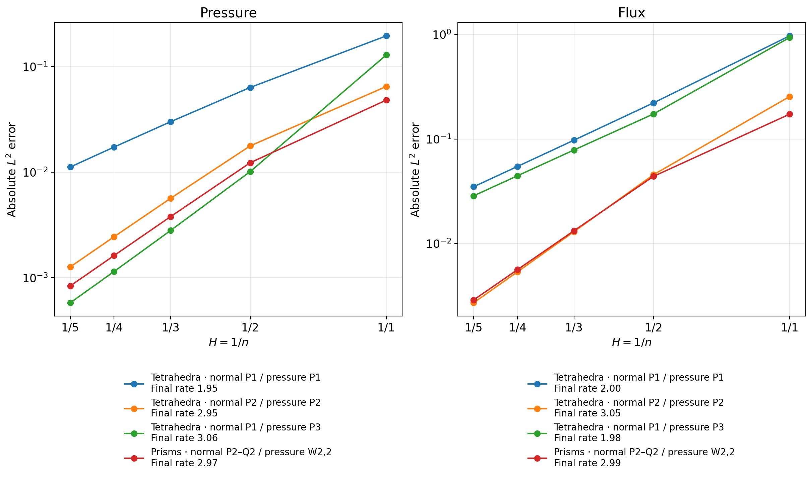
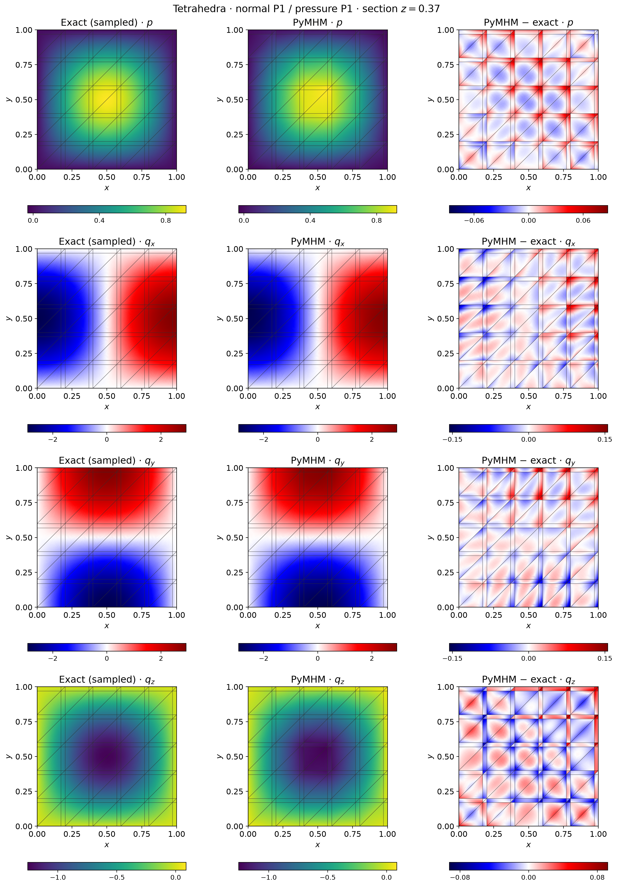
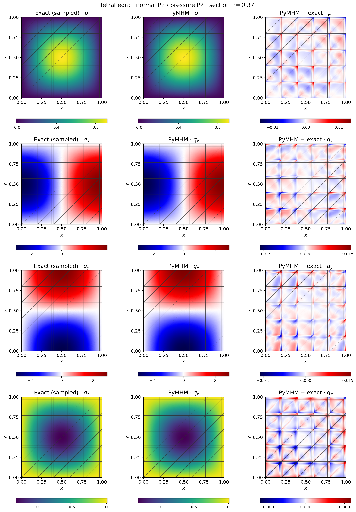
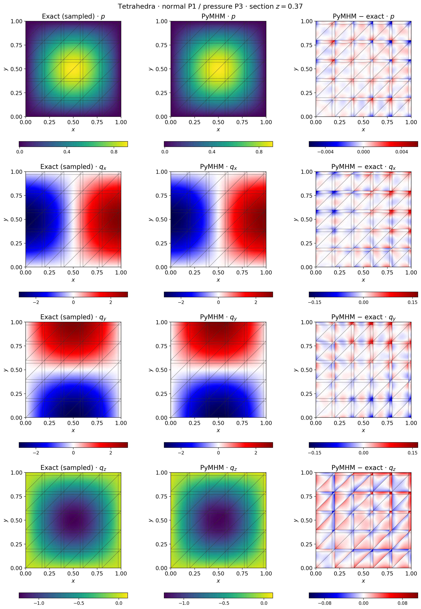
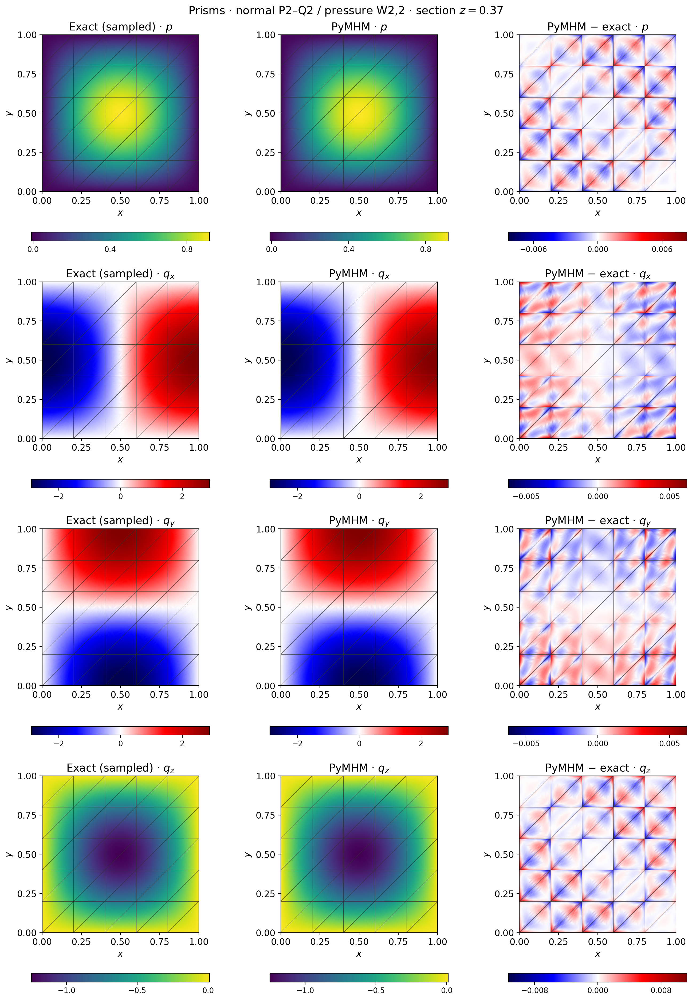

# Independent normal and interior orders in three dimensions

`HDiv3DFamily` and `solve_darcy_hdiv3d` separate the normal polynomial degree
from the complete interior divergence space. Adding zero-normal bubbles changes
local approximation without adding macroface unknowns. Enriching a normal trace
changes a different part of the discrete problem. The [well comparisons](mixed-well-geometries.md)
include independent NeoPZ verification for their stated lower-order spaces.
The higher orders below are checked against exact fields and native Basix operators.

## Local spaces

For tetrahedra, pressure degree \(p\) and retained normal degree \(k\), with
\(0\leq k\leq p+1\), define

$$
\begin{aligned}
V_{p,k}(T)&=\{v\in[P_{p+1}(T)]^3:
                    v\cdot n_F\in P_k(F)\text{ on every face }F\},\\
\operatorname{div}V_{p,k}(T)&=P_p(T).
\end{aligned}
$$

On a prism, horizontal components belong to
\([P_{p+1}(\triangle)\otimes P_p(I)]^2\), and the vertical component belongs to
\(P_p(\triangle)\otimes P_{p+1}(I)\). Retained normals are \(P_k\) on triangular
faces and \(Q_k\) on rectangular faces, with \(0\leq k\leq p\). Pressure and
divergence use the complete space \(W_{p,p}=P_p(\triangle)\otimes P_p(I)\).

Every zero-normal bubble of the declared parent space is retained. Physical
Piola maps, face orientation and normal moments are applied before local
condensation. A macro trace can further restrict these local normal spaces.
Here `p` is the cell pressure degree and `k` is the normal-flux degree on each
face. A triangular `Pk` face has `(k+1)(k+2)/2` moments; a rectangular `Qk` face
has `(k+1)^2`, since its degree is at most `k` in each of the two coordinates.
Different faces have independent polynomial blocks. Adjacent cells share the
canonical normal-flux moments of their common face, with opposite outward signs.
The selected tetrahedral flux spaces have 18, 44 and 57 modes for `(p,k)` equal
to `(1,1)`, `(2,2)` and `(3,1)` respectively; the `(2,2)` prism has 75 modes.

The global skeletal coordinate in this mixed formulation represents physical
normal-flux moments. A distinct local multiplier represents face pressure.
The retained constant-pressure coordinate is a pressure amplitude; its physical
integral also depends on the executed retained basis and the cell volume.
The geometry is affine; this construction does not assert support for curved
prisms or pyramids. Full matrix rank is not evidence of a uniform inf-sup
constant as polynomial orders increase.

Complete parent normal polynomials determine the face restrictions. Rectangular
parent-face tests use Basix orthogonal interval polynomials. A weighted QR
change of the interior Nedelec tests also transforms the prescribed moment
right-hand sides, preserving the declared interior coordinates. Bubble
normalization uses positive diagonal factors to fix their orientation. The
executed basis matrix remains part of each archived coefficient vector.

## Five-level analytical comparison

The unit cube has \(K=I\), zero prescribed pressure, and

$$
p=\sin(\pi x)\sin(\pi y)\sin(\pi z),\qquad
q=-\nabla p,\qquad f=3\pi^2p.
$$

Each macrocell is one affine fine cell. Resolutions are \(n=1,2,3,4,5\), with
\(6n^3\) tetrahedra or \(2n^3\) prisms. All macroface normal modes of the stated
family are retained. Assembly uses order 12. Independent error rules 12 and 13
agree within \(2.7\times10^{-10}\) in the coarsest case and to floating-point
precision on finer meshes. These are analytical verification cases rather than
historical figure reproductions.

The level `n` counts equal intervals on each edge of the unit cube. The local
refinement is `r1`: each macrocell contains one fine cell. These labels describe
different mesh scales. The computed flux is an H(div) field obtained with the
physical Piola map; it is distinct from the raw gradient of the discontinuous
cell pressure. Fine-cell equilibrium means equality of all declared pressure
test moments of its divergence and the source, rather than pointwise equality
with a nonpolynomial manufactured source.



| Geometry and orders | Pressure L2 error at n=5 | Final rate | Flux L2 error at n=5 | Final rate |
|---|---:|---:|---:|---:|
| Tetrahedron, p=1, k=1 | 1.11701e-2 | 1.951 | 3.48926e-2 | 2.003 |
| Tetrahedron, p=2, k=2 | 1.26533e-3 | 2.946 | 2.70823e-3 | 3.051 |
| Tetrahedron, p=3, k=1 | 5.78561e-4 | 3.058 | 2.85690e-2 | 1.979 |
| Prism, p=2, k=2 | 8.35752e-4 | 2.969 | 2.88195e-3 | 2.988 |

The tetrahedral rows separate the roles of these spaces. Increasing interior
order to \(p=3\) improves pressure, but keeping normal degree one retains a
second-order flux limitation in this sequence. Increasing both to degree two
yields third-order pressure and flux. An inaccurate coarse normal space cannot
be repaired solely by adding local bubbles.

The maximum original physical block backward error is
\(2.342\times10^{-14}\); the full uncondensed original saddle residual is
at most \(5.269\times10^{-13}\), relative to its physical right-hand side.
The blocks distinguish constitutive flux rows, pressure/divergence balance
rows and normal-flux/trace rows. These are coefficient-row algebraic checks.
The physical L2 errors of pressure, H(div) flux and divergence are integrated
and reported separately using the terminal order-13 rule.

## Pressure and flux components

Horizontal sections are at \(z=0.37\). The full pressure and physical flux
polynomials are evaluated on six subdivisions of each triangular fan of a
fine-cell section. Exact and numerical fields use the same display vertices.
Each fine cell owns its vertices, so display interpolation never averages
independent traces across an interface. Dark lines show the original macro mesh
intersections. Differences have separate symmetric scales. The volume norms
are independently reintegrated from the archived coefficients and executed
basis before the section fields are exported.






## Verification and reproduction

Portable tests check normal duality, divergence range, orientation, polynomial
patches and complete interior bubbles. Native Basix tests independently compare
tetrahedral polynomial operators and prismatic tensor-product spaces, including
pressure orders two and three. Persisted fields include the executed basis
matrix alongside coefficients, so evaluation does not depend on a new nullspace
orientation.

The whole 20-case comparison uses a dedicated reference driver built on
FEniCS/Basix 0.9.0. Acquisition runs in 16 independent process groups, each
with one native thread during its solves. It independently constructs the
restricted parent flux
spaces, pressure bases, quadrature, source and boundary terms, and solves the
full uncondensed saddle system. It shares the linear-solver arithmetic with
`pymhm`; both sets of fields are evaluated in their own executed bases.
The maximum relative differences are \(7.052\times10^{-14}\) in pressure,
\(4.620\times10^{-13}\) in physical flux and \(4.773\times10^{-13}\) in
divergence. The native full-original residual is at most
\(1.549\times10^{-12}\), against the declared \(10^{-10}\) criterion.
Its interface multiplier represents pressure; comparison uses the physical
fields, independently of the global normal-flux coordinates of `pymhm`.

The reference source audit identifies
[Basix revision 19555f5](https://github.com/FEniCS/basix/tree/19555f5b629b4090b14014f9db5f2c9ac80984f9).
The verification record separately identifies the executed Python modules and
compiled Basix binary by digest. Literal field replay with one and two BLAS
threads and coherent saved bubble-basis changes verify the persisted data
contract. The comparison certifies these finite affine discretizations;
uniform inf-sup estimates and general material coefficients require separate
analysis and verification.

Four additional nonhomogeneous controls prescribe \(p=1+x-y+z\) on the
complete exterior, with \(f=0\) and physical \(q=(-1,1,-1)\). Both the
condensed and independent uncondensed formulations reproduce these fields.
The largest pressure and flux errors of the condensed solve are
\(1.4\times10^{-13}\) and \(9.0\times10^{-13}\), respectively; the
independent reference also checks the zero physical divergence.

```bash
pixi run --locked -e notebooks python -m examples.solve_core_extensions hdiv3d
pixi run --locked -e notebooks python -m examples.sample_core_sections hdiv3d
pixi run --locked -e notebooks python -m examples.plot_core_extensions hdiv3d
```

The 20-case record is `examples/results/core-extensions/hdiv3d.json`, accompanied
by field archives, source hashes and quadrature checks.
The display replay and reintegrated volume norms are recorded separately in
`examples/results/core-extensions/hdiv3d-field-sampling.json`.
The independent whole-case evidence is available in
[the verification record](../figures/core-extensions/hdiv3d-native-verification.json).
