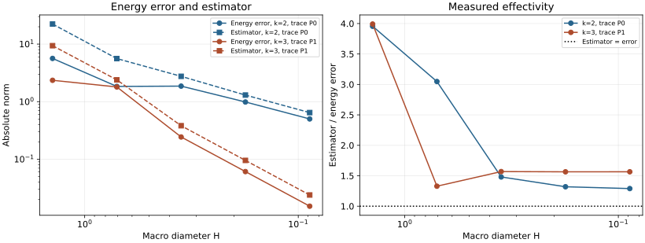
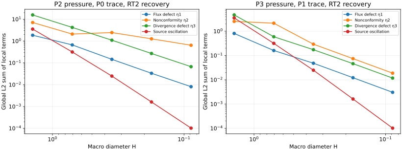
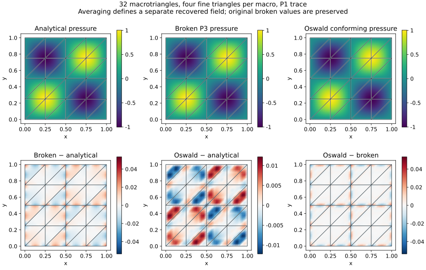
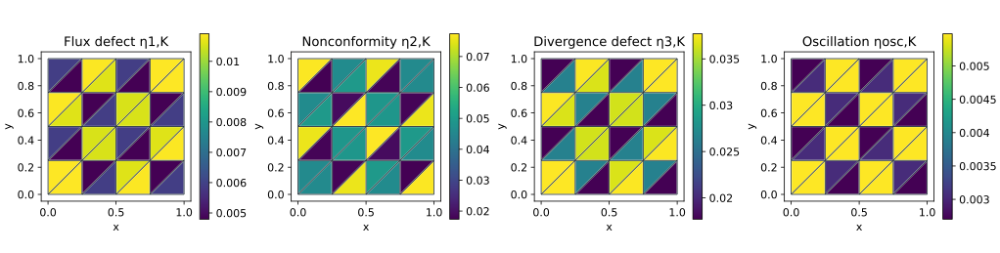

# Conforming potential and an energy-error estimator

The scalar estimator in `pymhm.estimator` implements the unit-diffusion case of
Section 5 in [Barrenechea et al.](https://doi.org/10.1137/24M1673073).
It combines the [RT moment reconstruction](https://github.com/volpatto/pymhm/blob/main/docs/cases/reconstruction-moments.md) with a
continuous recovered potential. The original broken MHM solution is preserved.
This implementation assumes identity diffusion, homogeneous Dirichlet data,
convex triangular macrocells and a globally conforming union of the fine meshes.

## Four separately measured contributions

Write \(p_h\) for the primal MHM field, \(q_h\) for its recovered RT flux and
\(I_{\mathrm{OS}}p_h\) for the Oswald potential. At an interior Lagrange node,

$$
(I_{\mathrm{OS}}p_h)(z)=\frac{1}{\#\mathcal T_z}
\sum_{T\in\mathcal T_z}p_h|_T(z).
$$

The average counts incident **fine triangles**, including repeated values from
one macrocell. Boundary nodes are set to zero. For a uniform polynomial degree
and matching fine edges this defines a continuous finite-element function in
\(H^1_0(\Omega)\). The recovered potential and the original broken field
are displayed as separate mathematical quantities.

Let \(\Pi_{K,m}\) denote the L2 projection onto continuous piecewise Pm functions
on the fine triangulation of macrocell \(K\). It is not the discontinuous
cellwise projection. With \(H_K=\operatorname{diam}(K)\), the four terms are

$$
\begin{aligned}
\eta_{1,K}&=\|\nabla p_h+q_h\|_{0,K},\\
\eta_{2,K}&=\|\nabla(p_h-I_{\mathrm{OS}}p_h)\|_{0,K},\\
\eta_{3,K}&=\frac{H_K}{\pi}
 \|\Pi_{K,m}(\operatorname{div}q_h)-\operatorname{div}q_h\|_{0,K},\\
\eta_{\mathrm{osc},K}&=\frac{H_K}{\pi}\|f-\Pi_{K,m}f\|_{0,K}.
\end{aligned}
$$

The full indicator is

$$
\eta^2=\sum_K(\eta_{1,K}+\eta_{3,K}+\eta_{\mathrm{osc},K})^2
       +\sum_K\eta_{2,K}^2.
$$

For the theorem's hypotheses and exact integration,
\(\|\nabla(p-p_h)\|_{0,\mathcal P}\leq\eta\). The constant \(H_K/\pi\)
uses convexity of each macrocell. The hypotheses include local degree
\(k\geq\ell+2\) and \(\ell\leq m\leq k\), where \(\ell\) is the skeletal
degree. The implementation accepts general nonnegative RT orders \(m\)
subject to these space conditions and adequate quadrature. The five-level
campaigns below use RT2 reconstruction; their numerical evidence does not
extend automatically to every supported order.

Neither an arbitrary SPD coefficient nor nonzero boundary data is accepted
under this formula. In particular, a coefficient-dependent energy bound must
not be inferred from the unweighted unit-diffusion flux norm. More general
coefficient weights and boundary liftings require their own derivation.

## API and numerical safeguards

```python
from pymhm import TriangleMesh, solve_darcy
from pymhm.estimator import estimate_darcy_error

solution = solve_darcy(
    TriangleMesh.unit_square(4), degree=2,
    source=lambda x: x[:, 0], quadrature_order=8,
)
estimate = estimate_darcy_error(
    solution, homogeneous_dirichlet=True, degree=2, quadrature_order=10,
)
print(estimate.total)
print(estimate.local_squared)
```

`homogeneous_dirichlet=True` is a required declaration: `DarcySolution` does
not retain its original boundary specification. The estimator additionally
checks the computed zero Dirichlet moments on exterior macrofaces; it does
not demand pointwise zero boundary values from the broken MHM field.
Nonmatching fine boundaries, incompatible local/trace degrees, nonidentity
coefficients and failed continuous-test equilibrium are rejected.

`equilibrium_defect` records the source-minus-divergence moment defect on each
macrocell. Estimator projections and norms use the requested quadrature, and
`energy_error(exact_gradient, order=...)` uses independent error quadrature.
The recovered flux stores its own quadrature order for subsequent projection
diagnostics. Assembly and diagnostic quadratures control different errors:
the source load remains determined by the assembly rule.

The theorem assumes exact integration. These outputs are floating-point,
quadrature-based estimates, checked against analytical errors in the examples;
they are not interval-certified bounds. The complete estimator includes source
oscillation and the nonzero divergence-projection defect. Omitting either term
would be a different estimator.

## Five macro meshes

The analytical problem is the sine case from Section 6.1:

$$
p=\sin(2\pi x)\sin(2\pi y),\qquad
f=8\pi^2p,\qquad q=-\nabla p.
$$

The macro mesh has \(2n^2\) diagonal triangles for
\(n=1,2,4,8,16\), each subdivided into four fine triangles. We compare
\((\ell,k,m)=(0,2,2)\) and \((1,3,2)\).
Assembly and estimator quadrature use Duffy order 10; independent energy and
pressure errors use order 12. These are declared package calculations of the
published analytical problem, not a claim of equality with the article's tables.





Effectivity is \(\eta/\|\nabla(p-p_h)\|\), using the actual broken gradient.
A value above one is the expected upper-bound behavior. Coarse preasymptotic
errors need not decrease monotonically. Component curves are norms of local
terms, while the full estimator combines them by the formula above.

| n | P2/P0 energy error | P2/P0 estimator | Effectivity | P3/P1 energy error | P3/P1 estimator | Effectivity |
| ---: | ---: | ---: | ---: | ---: | ---: | ---: |
| 1 | 5.63376 | 22.2834 | 3.95533 | 2.34914 | 9.3771 | 3.99172 |
| 2 | 1.83747 | 5.59985 | 3.04758 | 1.80008 | 2.39124 | 1.32841 |
| 4 | 1.86087 | 2.75421 | 1.48006 | 0.24349 | 0.381949 | 1.56865 |
| 8 | 0.986555 | 1.30158 | 1.31932 | 0.0609796 | 0.0954082 | 1.56459 |
| 16 | 0.50101 | 0.646038 | 1.28947 | 0.0152811 | 0.0239186 | 1.56524 |

The largest continuous-test equilibrium moment norm in these ten runs is
\(6.98\times10^{-14}\). Estimator quadrature refinement and a cubic exact
triangle bubble are separate regression checks.

## Original and recovered fields



The displayed case has 32 macrotriangles, P3 primal pressure, P1 skeletal
traces and RT2 recovery. The first row shares a color scale; the second row
uses separate signed-error scales. Every panel overlays the actual macro mesh.
The Oswald potential is continuous and has the prescribed zero boundary trace.
This property alone does not guarantee that its L2 error is smaller for every
problem.



Each colored macrotriangle shows its integrated local norm, without dividing
by its area. These indicators provide cellwise quantities for mesh marking.
The example uses prescribed meshes and does not implement an adaptive
refinement loop or establish contrast-uniform efficiency. The article's
efficiency estimates contain mesh-ratio and additional flux/oscillation terms.

```console
pixi run -e notebooks python examples/plot_estimator.py
pixi run -e notebooks python examples/plot_estimator.py --reuse-results
```

The first command solves and archives `examples/results/estimator.json` and
sampled potential fields. The second redraws those records without solving.
Notebook `20_darcy_estimator.ipynb` runs a small consistency check and displays
the preserved five-level figures.
