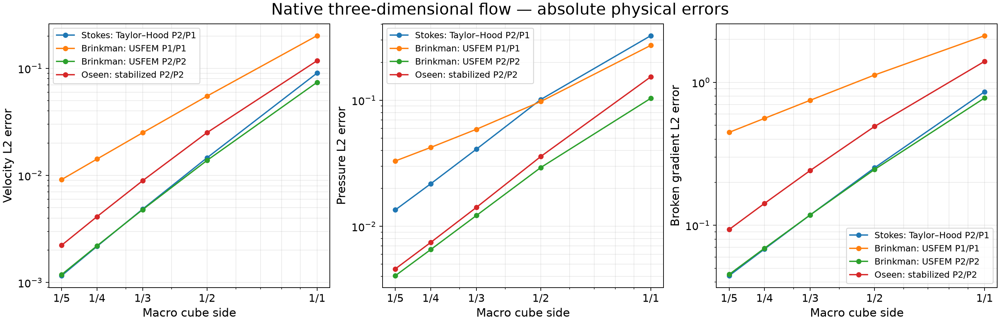
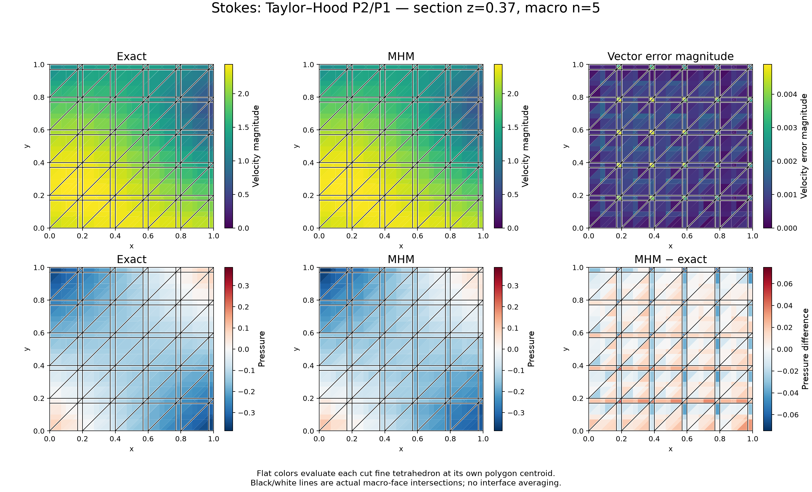

# Three-dimensional Stokes, Brinkman and Oseen

`solve_flow_3d` solves incompressible flow on affine tetrahedral macrocells with
independent conforming local meshes. It supports Taylor–Hood velocity/pressure
pairs P2/P1 through P4/P3, equal-order USFEM P1/P1 through P4/P4, and the
residual-stabilized Oseen form. This page reports an original three-dimensional
manufactured-solution study. The formulations of
[Araya et al. (2017)](https://doi.org/10.1016/j.cma.2017.05.027) and
[Araya et al. (2021)](https://doi.org/10.1007/s10444-020-09833-8) admit dimension three; their
historical two-dimensional numerical figures are separate evidence.

## Operator and physical conventions

The velocity and pressure satisfy

$$
-\nu\Delta\boldsymbol u
+(\nabla\boldsymbol u)\boldsymbol\beta
+\boldsymbol\Gamma\boldsymbol u+\nabla p=\boldsymbol f,
\qquad \nabla\cdot\boldsymbol u=0.
$$

Viscosity is a positive constant. Stokes has zero resistance and convection;
Brinkman accepts a nonnegative scalar or symmetric nonnegative 3-by-3 resistance
tensor, including pointwise callbacks. Taylor–Hood also accepts variable
convection. Stabilized Oseen uses a constant scalar resistance. Callbacks for
convection require their analytical divergence; stabilized Oseen additionally
requires a declared upper bound for its magnitude.

Advection uses a skew form with the correction
$-(\nabla\cdot\boldsymbol\beta)(\boldsymbol u,\boldsymbol v)/2$.
Consequently, `traction` supplies the outward natural **pseudotraction**

$$
\boldsymbol t
=(\nu\nabla\boldsymbol u-pI)\boldsymbol n
-\tfrac12(\boldsymbol\beta\cdot\boldsymbol n)\boldsymbol u.
$$

This is the vector-Laplacian convention, rather than symmetric Cauchy traction.
The global multiplier has the opposite sign. `traction_components[face][i]`
prescribes one Cartesian component; every unspecified component receives weak
Dirichlet velocity. Full and componentwise declarations must not overlap.

Pressure has a global mean gauge when no prescribed traction component has a
nonzero normal component. Tangential slip traction alone does not determine the
pressure datum. Local velocity translations are retained with physical volume
moments, including arbitrarily small positive resistance. For pure-traction
Stokes, three means choose the velocity representative; rotations are not kernel
modes of the grad-grad operator. With semidefinite resistance, only unresisted
free directions admit means. A rotated translation kernel must be declared and
is checked against the material.

For convection with translation gauges, exterior tangency is necessary but not
sufficient: the normal convection trace must also be representable in every
skeletal face space. The implementation checks that condition at face quadrature
points and rejects an incompatible discrete gauge. It does not replace a small
positive resistance by zero.

## Local forms and skeletal approximation

`tetra_flow_operators` provides the local matrix, body load, nodal coordinates and
physical moments independently of the MHM solver. Velocity components are
interleaved at their nodes; pressure coefficients follow. The pressure test
row uses a minus sign, giving symmetric Stokes/Brinkman saddle blocks.

USFEM includes both the negative momentum-residual product and the corresponding
source term. With

$$
R(\boldsymbol u,p)=-\nu\Delta\boldsymbol u
+\boldsymbol\Gamma\boldsymbol u+\nabla p,
$$

the contribution is $-\sum_\tau\delta_\tau(R(\boldsymbol u,p),R(\boldsymbol v,q))_\tau$.
The scalar inverse constant is computed from physical polynomial derivatives:

$$
m_\tau=\min\{1/3,C_\tau\},\qquad
C_\tau h_\tau^2\|\Delta v_h\|_{0,\tau}^2
\leq\|\nabla v_h\|_{0,\tau}^2.
$$

The default `tensor-2025` coefficient uses the largest resistance eigenvalue
sampled over each fine tetrahedron. `minimum-2017` instead uses a declared global
lower eigenvalue bound; `pointwise-2017` applies that formula to the smallest
pointwise eigenvalue. These choices have the same zero-resistance limit, but
are distinct for heterogeneous tensors. The global-minimum choice alone does
not ensure coercivity in a high-contrast material. Material jumps must be
resolved by the local tetrahedra and quadrature; this API does not perform
Cartesian material-cut integration in three dimensions.

Stabilized Oseen includes opposite convection signs in its trial and adjoint-test
momentum residuals, the consistent load contribution, and positive grad-div
stabilization. It uses the parameters of [Araya et al. (2021)](https://doi.org/10.1007/s10444-020-09833-8), equations (25)–(27). The strict
coercivity hypothesis is $\gamma-\nabla\cdot\boldsymbol\beta/2>0$; an algebraic
solution alone does not establish that hypothesis or a discrete inf-sup bound.

`TriangularSkeleton` supplies independent Bernstein Pk coefficients on each triangular
macroface subdivision. Its scalar modes are interleaved into three multiplier
components. Face partitions and local refinements must align and use dyadic
subdivisions. The default P1 face modes use local refinement four with P1
velocity, or refinement two with higher-degree velocity. Numerically deficient
local/trace pairs are rejected without a diagonal perturbation.

## Manufactured fields and recorded discretizations

The exact fields on the unit cube are

$$
\begin{aligned}
u_1&=\sin(\pi z)+\cos(\pi y),\\
u_2&=\sin(\pi x)+\cos(\pi z),\\
u_3&=\sin(\pi y)+\cos(\pi x),\\
p&=(x-\tfrac12)(y-\tfrac12)+(z-\tfrac12).
\end{aligned}
$$

Here $\nabla\cdot\boldsymbol u=0$, $\Delta\boldsymbol u=-\pi^2\boldsymbol u$,
and the exact pressure mean is zero. The force is derived directly from the
strong equation. Exact velocity is prescribed on the entire boundary.

Each Cartesian macrocube is divided into six tetrahedra. Five resolutions use
$n=1,2,3,4,5$ macrocubes per coordinate. All studies use P1 face modes without
face subdivision and retain the published local formulation while changing the
macro mesh.

| Study | Local pair | Local edge refinement | Material and convection |
| --- | --- | ---: | --- |
| Stokes | Taylor–Hood P2/P1 | 2 | $\nu=1$, $\Gamma=0$, $\beta=0$ |
| Brinkman | USFEM P1/P1 | 4 | $\nu=0.2$, variable SPD tensor, $\beta=0$ |
| Brinkman | USFEM P2/P2 | 2 | Same operator and skeleton as P1/P1 |
| Oseen | Stabilized P2/P2 | 2 | $\nu=0.1$, $\gamma=2$, $\beta=(1+x,0.5+y,0.25+z)$ |

The Brinkman tensor is

$$
\Gamma(x,y,z)=(1+0.5x+0.25z)
\begin{pmatrix}2&0.2&0.1\\0.2&3&0.4\\0.1&0.4&4\end{pmatrix}.
$$

Both Brinkman runs use `tensor-2025`. The Oseen study declares the global bound
$\|\beta\|\leq3$; its coercivity margin is $2-3/2=1/2$.
This bound is explicit, rather than inferred from sampled maxima.

Assembly uses Duffy-product order six. Absolute velocity, pressure and broken
velocity-gradient errors are integrated separately with orders seven and eight.
The recorded maximum relative quadrature difference accompanies every row.
Raw divergence is measured independently; it need not vanish pointwise even
though constant pressure tests conserve the integrated divergence per macrocell.



## One-sided fields

The section is $z=0.37$. Each intersected fine tetrahedron is colored using its
own field value at the section-polygon centroid. Exact and numerical panels use
the same range; the velocity error panel displays the full vector error
magnitude. Pressure differences retain their sign. Black/white lines show the
actual intersections of macrofaces. No interface smoothing or color clipping
is applied.




## Verification and reproduction

Portable tests cover affine incompressible fields with every supported degree,
nonhomogeneous boundary data, semidefinite and small positive resistance,
pressure and velocity gauges, slip components, segmented faces and spawn/thread
execution. Ten native DOLFINx/UFL comparisons independently assemble every matrix
and load entry, including physical Hessians, opposite adjoint convection signs,
variable tensors and all stabilization selections. Their inverse constants are
computed with an independent monomial basis.

```python
from pymhm.fem.traces.triangle_3d import TriangularSkeleton
from examples.formulations.application import flow as solve_flow_3d
from pymhm.meshes.tetrahedron import TetraMesh

mesh = TetraMesh.unit_cube(2)
solution = solve_flow_3d(
    mesh,
    skeleton=TriangularSkeleton(mesh, degree=1),
    formulation="taylor-hood",
    degree=2,
    local_refinement=2,
    source=(1.0, 0.0, 0.0),
)
```

```bash
pixi run --locked -e test-core pytest -q tests/test_flow3d.py
pixi run --locked -e fem pytest -q tests/test_flow3d_fenics.py
pixi run --locked -e test-core python -m examples.solve_flow3d --workers 4
pixi run --locked -e notebooks python -m examples.plot_flow3d
```

The [campaign record](../figures/flow3d/campaign.json) identifies operators,
spaces, quadrature, source digests and archived local coefficients. Reported
elapsed times include concurrent workstation activity and are not a scaling
benchmark. This study verifies smooth 3D cases; it does not certify arbitrary
rough coefficients, tetrahedral inf-sup constants, adaptive estimators, or
Navier–Stokes nonlinear/time integration.

## Measured errors

| Formulation | Velocity L2, n=5 | Pressure L2, n=5 | Broken H1, n=5 | Last velocity L2 rate |
|---|---:|---:|---:|---:|
| stokes-th2 | 0.00115738 | 0.0135 | 0.0444007 | 2.828 |
| brinkman-usfem1 | 0.00914351 | 0.0329875 | 0.446775 | 1.980 |
| brinkman-usfem2 | 0.00118515 | 0.00405953 | 0.045311 | 2.772 |
| oseen-p2 | 0.00222632 | 0.00459557 | 0.093462 | 2.761 |

The last rate uses the two finest macro meshes. All four velocity, pressure and gradient errors decrease over the five reported meshes. The Brinkman P1 and P2 configurations have different local refinements; this comparison therefore does not isolate polynomial degree at a fixed local mesh. The measured rates do not establish a uniform stability bound. The largest order-seven/order-eight norm discrepancy is 5.25e-11. Absolute errors use the complete physical unit-cube volume, with a zero pressure mean.

## References

- Rodolfo Araya, Christopher Harder, Abner H. Poza, and Frédéric Valentin (2017). *Multiscale hybrid-mixed method for the Stokes and Brinkman equations—The method*, Computer Methods in Applied Mechanics and Engineering 324, 29–53. [DOI: 10.1016/j.cma.2017.05.027](https://doi.org/10.1016/j.cma.2017.05.027).

- Rodolfo Araya, Cristian Cárcamo, Abner H. Poza, and Frédéric Valentin (2021). *An adaptive multiscale hybrid-mixed method for the Oseen equations*, Advances in Computational Mathematics 47, article 15. [DOI: 10.1007/s10444-020-09833-8](https://doi.org/10.1007/s10444-020-09833-8).
