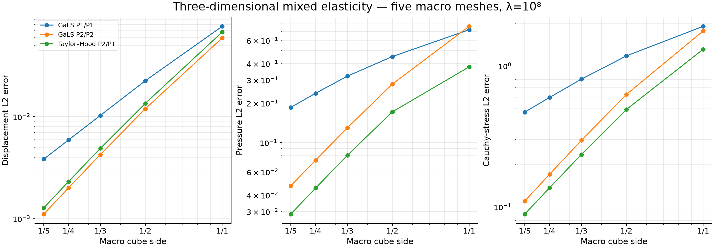
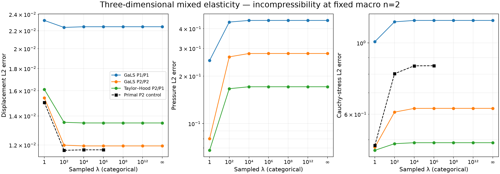

# Nearly incompressible elasticity in three dimensions

`solve_elasticity_gals_3d` implements the displacement–pressure GaLS formulation
of [Gomes, Pereira and Valentin, L19](../literature.md#l19-low-order-locking-free-elasticity-2024), whose analysis admits
$d=2,3$. Continuous tetrahedral local spaces are $[P_k]^3/P_k$, $k=1,\ldots,4$;
the alternative Taylor–Hood spaces use $[P_k]^3/P_{k-1}$, $k=2,\ldots,4$.
The tests below are original three-dimensional manufactured cases. The numerical
examples printed in L19 use two-dimensional geometries.

## Operator and physical constraints

The sign convention is Herrmann pressure and symmetric Cauchy stress:

$$
p=-\lambda\,\nabla\cdot u,
\qquad \sigma=2\mu\varepsilon(u)-pI,
\qquad -\nabla\cdot\sigma=f.
$$

The unstabilized local bilinear form is

$$
a_K((u,p),(v,q))=
(2\mu\varepsilon(u),\varepsilon(v))_K
-(p,\nabla\cdot v)_K-(q,\nabla\cdot u)_K
-(\lambda^{-1}p,q)_K.
$$

GaLS subtracts the product of complete strong stress residuals:

$$
\begin{aligned}
a_K^{\mathrm{GaLS}}&=a_K-
\alpha_K\sum_{\tau\subset K}h_\tau^2
(\nabla\cdot\sigma(u,p),\nabla\cdot\sigma(v,q))_\tau,\\
\ell_K(v,q)&=(f,v)_K+
\alpha_K\sum_{\tau\subset K}h_\tau^2
(f,\nabla\cdot\sigma(v,q))_\tau.
\end{aligned}
$$

For variable shear the residual includes $2\varepsilon(u)\nabla\mu$.
The implementation requires its analytical gradient and certified bounds
`shear_bounds=(mu_lower, mu_upper, grad_mu_upper)`. These bounds are also checked
at quadrature points. The local inverse constant $C_I$ is computed from the
physical tetrahedral strain and divergence matrices modulo the six rigid modes.
The default parameter is half the upper bound

$$
0<\alpha_K<
\frac{\mu_{\min}C_I}
{2(\mu_{\max}^2+h_K^2\lVert\nabla\mu\rVert_{\infty,K}^2)}.
$$

No triangular inverse constant is transferred into the tetrahedral operator.
Material interfaces need fitted local tetrahedra; coefficient callbacks do not
activate a geometric cut rule in this solver.

All six infinitesimal rigid motions are retained: three translations and three
rotations about the physical volume centroid. The skeleton has three Cartesian
negative-traction components on each triangular $P_1$ face partition. The default
local refinement is four for $P_1$ and two for higher order. Aligned dyadic face
subdivisions are supported. A numerical rank check rejects invisible trace
modes; it does not prove an inf-sup bound for every tetrahedral mesh.

Unspecified exterior faces receive weak displacement data. `traction` prescribes
the physical outward Cauchy traction $\sigma n$, not grad-grad pseudotraction.
A fully displacement-prescribed boundary imposes the exact integrated identity

$$
\int_\Omega\frac{p}{\lambda}
=-\int_{\partial\Omega}g\cdot n.
$$

The boundary integral uses the same assembled face moments as the global system.
Only at $\lambda=\infty$ is a pressure mean a gauge. Pure traction prescribes six
integrated displacement moments and fixes pressure through traction. The raw
reconstructed Cauchy stress is not asserted to be globally $H(\mathrm{div})$.

## A bounded-forcing exact family

The domain is the unit cube. Put $b(t)=t(1-t)$ and define

$$
\begin{aligned}
u_0&=\nabla\times(0,0,8b(x)b(y)b(z)),\\
p&=\cos(\pi x)\cos(\pi y)\cos(\pi z),\\
u&=u_0+\frac{\nabla p}{3\pi^2\lambda},
\qquad \mu=1+\frac{x}{4}+\frac{z}{8}.
\end{aligned}
$$

Then $\nabla\cdot u=-p/\lambda$ and the pressure has zero mean. With
$\lambda^{-1}=0$ the displacement becomes exactly solenoidal. The force is
derived analytically as

$$
f=-\mu\Delta u_0+
(1+2\mu/\lambda)\nabla p
-(\nabla u+\nabla u^T)\nabla\mu.
$$

Thus its magnitude does not grow with $\lambda$. Central differences of the exact
stress independently verify this derivative formula. The full, nonhomogeneous
exact displacement is prescribed on the exterior.

The refinement study uses $n=1,2,3,4,5$ Cartesian macro cubes per axis, split into
six tetrahedra per cube, with $P_1$ macroface traces. The three local choices are
GaLS $P_1/P_1$ with refinement four, GaLS $P_2/P_2$ with refinement two, and
Taylor–Hood $P_2/P_1$ with refinement two. The value is $\lambda=10^8$.
All reported errors are absolute physical volume norms. Assembly uses order
seven. Independent error rules seven/eight for P1 and eight/nine for P2 are
recorded with each accepted field; their relative difference must be below
$10^{-8}$.

At $n=5$ the measured errors and the rates between $n=4$ and $n=5$ are:

| Local family | Displacement $L^2$ error | Pressure $L^2$ error | Stress $L^2$ error | Last displacement / pressure / stress rates |
| --- | ---: | ---: | ---: | --- |
| GaLS P1/P1 | 0.00383044 | 0.185271 | 0.469457 | 1.94 / 1.11 / 1.07 |
| GaLS P2/P2 | 0.00110756 | 0.0469092 | 0.109891 | 2.65 / 2.01 / 1.95 |
| Taylor–Hood P2/P1 | 0.00127336 | 0.0286093 | 0.0888144 | 2.67 / 2.03 / 1.92 |

All three error sequences decrease on these five meshes. The P1 pressure and
stress errors remain appreciable at the final resolution. Higher local order
reduces both, but this family does not rank one formulation best in every norm:
GaLS P2 has the smaller displacement error, while Taylor–Hood has the smaller
pressure and stress errors. The rates describe this finite sequence with fixed
P1 skeletal degree, not an inf-sup or asymptotic-rate certificate.



The fixed-mesh study uses $n=2$ and
$\lambda=1,10^2,10^4,10^6,10^8,10^{12},\infty$.
The primal displacement control uses $P_2$, refinement two, the same data and
finite $\lambda=1,10^2,10^4,10^6$. Its raw stress is evaluated by its own
constitutive law; it has no independent pressure unknown. The control explicitly
uses `local_refinement_precision="extended"`: local corrections accumulate in
extended precision, with the same original-equation residual criterion. At
$\lambda=10^6$, its displacement and stress errors are 0.0116972 and 0.849382.
The primal stress error increases from 0.480604 at $\lambda=1$ and levels off on
these fixed spaces. This is a sensitivity
experiment at fixed spaces, not a general proof of locking-free convergence.



The elementwise inverse inequality is evaluated on the physical strain-energy
quotient. Its numerical rank must separate exactly six rigid modes; a geometry
whose positive modes cannot be resolved at the stated spectral threshold is
rejected rather than assigned an uncertified stabilization constant.

## Exact and numerical fields

The section is $z=0.37$. Flat colors evaluate each actual cut fine tetrahedron at
its polygon centroid. Exact and numerical panels share their color scale;
vector-error magnitude and signed pressure error have separately labeled scales.
The black/white lines show real macro-face intersections. Values from different
macrocells are never averaged across their common face.


## Independent checks and reproduction

Eight DOLFINx/UFL local comparisons verify every matrix and load entry on an
oblique tetrahedron, including all implemented orders, variable shear,
compressibility and the full residual. UFL differentiates the Cauchy stress
independently. Physical tests also cover affine patches, a nonzero-pressure
family approaching incompressibility, all six rigid moments, mixed boundaries,
variable Lamé coefficients, and serial/thread/spawn parity.

```bash
pixi run --locked -e test-core python examples/solve_gals3d.py --workers 4 --primal-refinement-precision extended
pixi run -e notebooks python examples/solve_gals3d.py --primal-only \
  --primal-refinement-precision extended --output examples/results/gals3d/primal
pixi run -e notebooks python examples/plot_gals3d.py
pixi run -e fem pytest tests/test_gals3d_fenics.py
```

[Notebook 55](https://github.com/volpatto/pymhm/blob/main/notebooks/elasticity/55_gals3d.ipynb)
checks an incompressible patch and replays the archived fields and figures.
The acquisition JSON records source hashes for each acquisition batch, actual
spaces, stabilization bounds, quadrature comparisons and field digests.
`--resume` validates all completed archives and requires identical operator and
analytic-data sources before reusing checkpoints. Elapsed acquisition time includes
concurrent machine activity and is not a scalability measurement.
