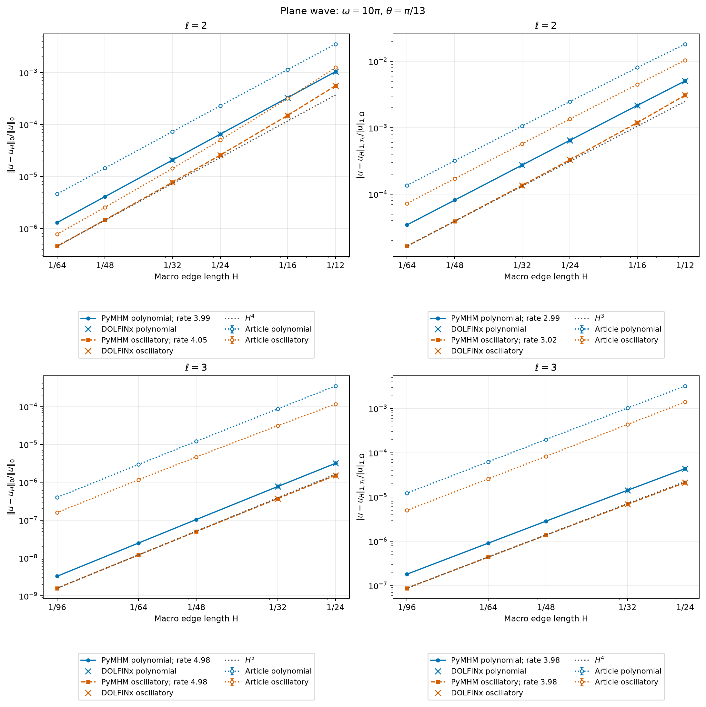
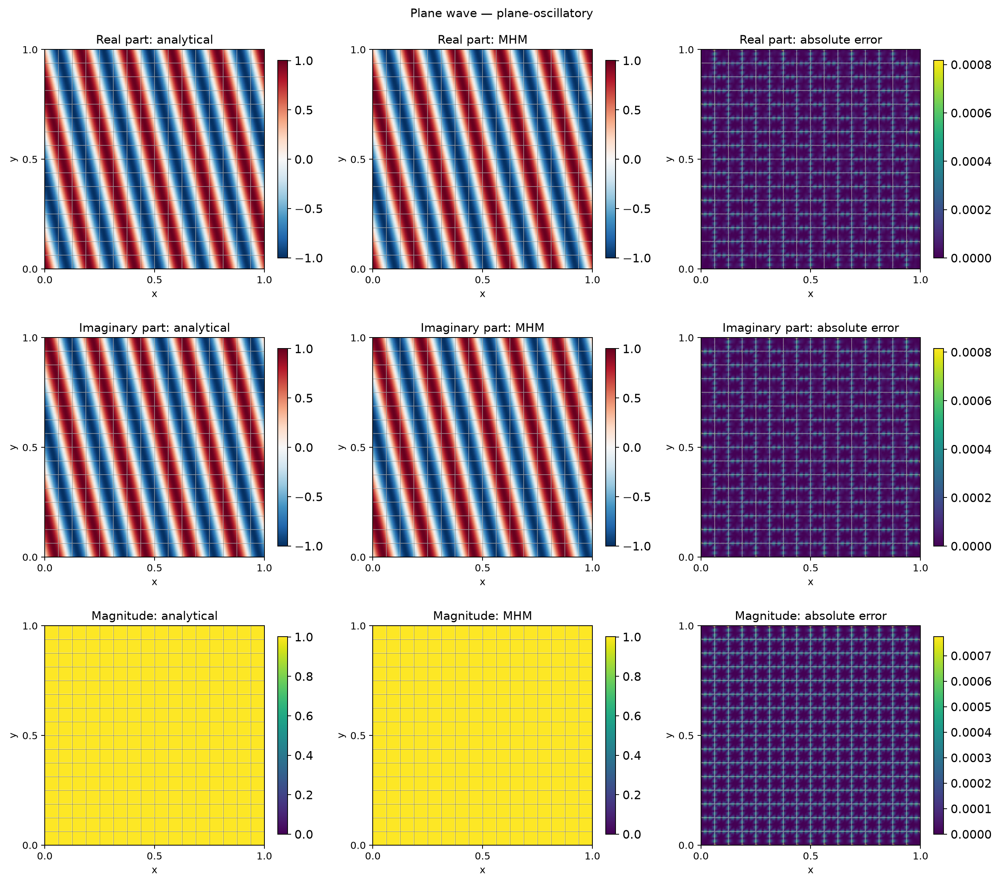
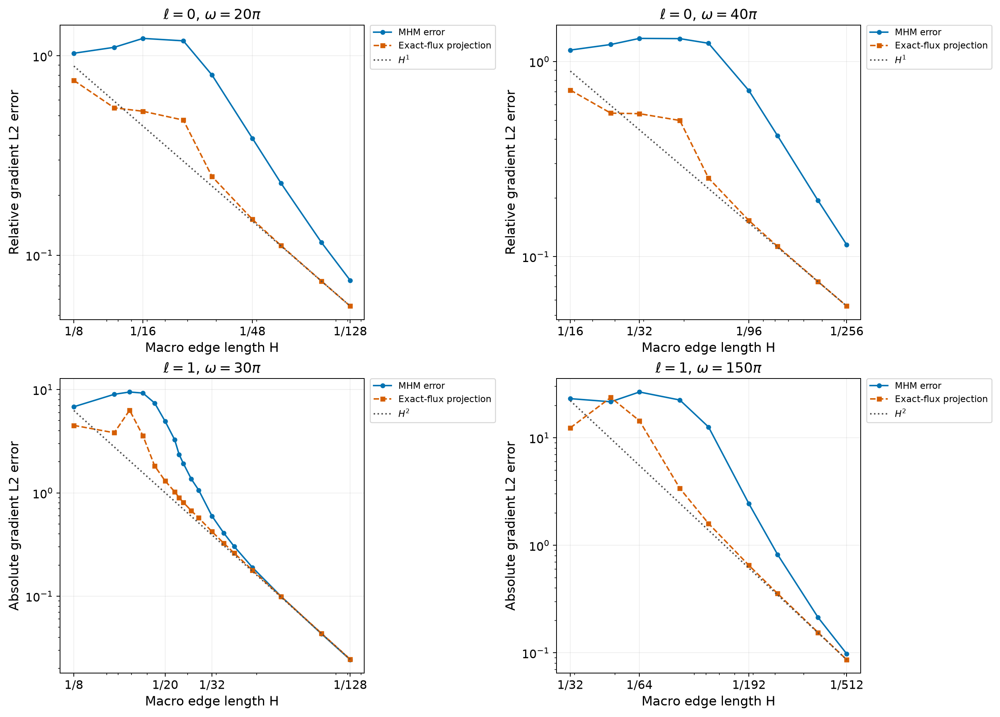

# Helmholtz waves and perfectly matched layers

`solve_helmholtz` implements the two-dimensional scalar MHM formulation of
[Chaumont-Frelet and Valentin (2020)](https://doi.org/10.1137/19M1255616), using
independent local Helmholtz inverses and a complex skeletal problem. Triangular
and polygonal macrocells use continuous local Pk elements; Cartesian macrocells
use Qk elements. Face degree, face subdivisions and local refinement are
independent choices.

## Physical and algebraic conventions

The acoustic pressure is complex. With positive density $\rho$, bulk modulus
$\kappa$ and angular frequency $\omega>0$, the equation and physical flux are

$$
-\nabla\cdot(\rho^{-1}\nabla u)-\omega^2\kappa^{-1}u=f,
\qquad q=-\rho^{-1}\nabla u.
$$

On an absorbing boundary, the prescribed datum is

$$
\rho^{-1}\partial_nu-i\omega(\kappa\rho)^{-1/2}u=g_A,
\qquad
q\cdot n=-i\omega(\kappa\rho)^{-1/2}u-g_A.
$$

This convention follows the weak form in Equation (2.4) and the explicit
incident-wave datum in Section 6.2 of the
[Chaumont-Frelet and Valentin (2019)](https://inria.hal.science/hal-01698914v2).
Neumann data prescribe the outward physical flux. Dirichlet data enter through
their weak face moments. Absorbing and Neumann subsets must be disjoint; the
remaining exterior faces use Dirichlet data. The default selects the entire
exterior boundary as absorbing. Use `absorbing=None` for a Dirichlet/Neumann
problem.

`PolynomialNeumannTrace` declares polynomial physical flux data directly:

$$
g_N(t)=\sum_{j=0}^{m}c_j L_j(2t-1),\qquad 0\leq t\leq1.
$$

The parameter increases from the first to the second vertex of
`mesh.faces[face]`; the complex coefficients already represent the outward
physical flux $q\cdot n$. For example, the following datum is affine along
one exterior macroface:

```python
from pymhm import PolynomialNeumannTrace

neumann = {face: PolynomialNeumannTrace((0.2 + 0.1j, -0.03j))}
```

Pass this mapping to `solve_helmholtz`, with absorbing and Neumann faces
disjoint. Affine transformations to face subsegments retain the declared
degree and set all higher coefficients structurally to zero. Polynomial
trace restriction therefore preserves a declared degree-$m$ datum whenever
the smaller face space contains it. A genuinely nonzero omitted mode is
rejected regardless of its amplitude.

Scalar and callback boundary data remain supported. Generic callbacks have
no declared polynomial degree and use the executed quadrature projection;
restriction requires their resulting discrete coefficients to belong to
the smaller trace space. Data constant at every executed face quadrature
point use the basis's constant representation. This integration convention
does not establish that an arbitrary callback is constant between samples.

For a local space with boundary coupling $B_K$, the complex local operator is

$$
\begin{aligned}
a_K(u,v)={}&(\rho^{-1}\nabla u,\nabla\overline v)_K
-\omega^2(\kappa^{-1}u,\overline v)_K\\
&-i\omega\langle(\kappa\rho)^{-1/2}u,\overline v\rangle_{\partial K\cap\Gamma_A}.
\end{aligned}
$$

The skeletal unknown represents $q\cdot n$ on nonabsorbing faces. Its orientation
changes on the two sides of an interior macroface. The local reconstruction and
assembled problem are

$$
u_K=A_K^{-1}(f_K-B_K\lambda),
\qquad
\left(\sum_KB_K^TA_K^{-1}B_K\right)\lambda
=\sum_KB_K^TA_K^{-1}f_K-g_D.
$$

Absorbing-face coefficients are fixed to zero because their impedance and load
already belong to $A_K$ and $f_K$. No constant pressure mode or mean gauge is
introduced at positive frequency. Complex matrices are represented exactly by
interleaved real and imaginary blocks; the operator is generally complex
symmetric, **not Hermitian positive definite**.

`conservation_residuals()` evaluates each assembled complex constant-test
equation, including impedance flux. This macro balance is distinct from
fine-cell conservation or an H(div)-conforming reconstructed field.

## Resolution and material assumptions

Local resonances and incompatible trace spaces are rejected by the shared rank
and original-equation residual checks. These checks do not establish wave
accuracy. The analysis also requires nonresonant local problems, sufficient
local approximation and a frequency-dependent global resolution condition.
For convex interior macrocells, the condition $\omega H_K/c_K<\pi$ is a
sufficient local condition in the constant-material setting, with
$c_K=\sqrt{\kappa/\rho}$ and $H_K$ the diameter. It is not a universal accuracy
criterion or a necessary condition for an individual discrete inverse.

Scalar callbacks, Cartesian cellwise materials and isotropic `PlanarMaterial`
inputs are supported. Explicit material interfaces split volume and boundary
quadrature, including independent density and modulus partitions. This changes
integration, not the local approximation space: a continuous polynomial on an
uncut fine element cannot represent an arbitrary material-induced derivative
jump. An anisotropic tensor cannot be passed as a scalar acoustic density.

`helmholtz_skeleton(..., oscillatory=True)` implements the real span of the
exponential trace functions in Section 5. Its orthonormal coordinate matrices
are deterministic and saved with the experiment fields. Polynomial and
oscillatory traces have the same number of coefficients in each comparison.

## Plane and outgoing Hankel waves

The unit-square studies use $\rho=\kappa=1$, $f=0$, and analytical absorbing data:

$$
\begin{aligned}
u_{\mathrm{plane}}(x,y)&=
\exp\!\left(i\omega(x\cos\theta+y\sin\theta)\right),\\
u_{\mathrm{Hankel}}(x,y)&=
H_0^{(1)}\!\left(\omega\sqrt{(x-1.5)^2+(y-0.5)^2}\right).
\end{aligned}
$$

The plane-wave refinement sequence uses the frequency $\omega=10\pi$ and
angle $\theta=\pi/13$ of Section 6.3. For $\ell=2$, six square grids use
$n=12,16,24,32,48,64$ cells per direction; for $\ell=3$, five grids use
$n=24,32,48,64,96$. Local Q$_{\ell+2}$ elements use a $2\times2$ subdivision
of each macrocell. These local spaces are explicitly selected: Sections
6.1–6.3 do not specify a second-level discretization. Here $H=1/n$ is the
macro edge length, and the macro diameter is $\sqrt2/n$.




| Face degree | Basis | Finest n | Relative pressure L2 | Relative gradient L2 |
|---|---|---:|---:|---:|
| 2 | Polynomial | 64 | 1.30047e-6 | 3.44183e-5 |
| 2 | Oscillatory | 64 | 4.56319e-7 | 1.64739e-5 |
| 3 | Polynomial | 96 | 3.30054e-9 | 1.80717e-7 |
| 3 | Oscillatory | 96 | 1.59577e-9 | 8.74003e-8 |

The plots include all **44 published markers**, extracted from the PDF's
vector paths with independently calibrated logarithmic axes. The declared
coordinate interval gives at most 0.283% graphical uncertainty. The final
published-to-computed error ratios are 3.55/1.70 for pressure and 3.93/4.40
for the gradient at $\ell=2$ (polynomial/oscillatory). At $\ell=3$ they are
120.6/99.8 and 67.6/57.1, respectively. Thus the asymptotic orders agree,
but the error amplitudes do not. The unspecified historical finite local
spaces prevent treating these results as a quantitative reproduction of
Figures 6.6–6.7.
[The extracted values and their intervals](../figures/helmholtz/published-convergence.json)
retain the original coordinates and the corresponding PyMHM records.

The angular study contains **256 directions for each configuration and basis**,
as in Section 6.2: $(\ell,\omega,H)=(2,20\pi,1/11)$ and
$(4,40\pi,1/21)$. The two bases have identical numbers of skeletal degrees
of freedom within each comparison.


The polynomial gradient-error maxima are 0.157928 and 0.00521541 for
$\ell=2$ and $\ell=4$, respectively. These values do **not** quantitatively
match the approximately 0.021 and 0.022 peaks printed in Figure 6.5.
The printed local discretization is unavailable; the discrepancy is not
resolved by the following $r=2,4,8$ local-resolution controls.
Accordingly, these are verified calculations with the stated inputs, not a
completed reproduction of the printed error ordinates.


At $\theta=\pi/13$, the relative gradient errors are:

| Trace degree | Basis | $r=2$ | $r=4$ | $r=8$ |
|---:|---|---:|---:|---:|
| 2 | Polynomial | 0.0538611 | 0.0539237 | 0.0539349 |
| 2 | Oscillatory | 0.0626927 | 0.0628351 | 0.0628407 |
| 4 | Polynomial | 0.00400911 | 0.00401787 | 0.00401881 |
| 4 | Oscillatory | 0.00101542 | 0.000995336 | 0.000995704 |

Here only the local subdivision changes. The macro mesh, trace space,
frequency and source remain fixed. The small $r=4$ to $r=8$ increments
show that further local refinement does not remove the observed
discrepancy with the published amplitudes at this direction.

At the coordinate directions, the exact normal trace belongs to both skeletal
spaces. The remaining error is the finite local approximation error: for
$\ell=2$, it falls from 0.0124188 to 0.000808348 on changing $r=2$ to $r=4$;
for $\ell=4$, it falls from 0.000279193 to 0.000004593.
Directions between the exact ones can retain a skeletal error. An oscillatory
basis is not uniformly more accurate at every propagation angle.

An independent **DOLFINx 0.9.0/UFL** application checks twelve complete hybrid
systems: both published $(\ell,\omega,H)$ configurations, both trace families,
and $\theta=0,\pi/13,\pi/4$. It assembles the volume, impedance, incident-wave
load and oriented face coupling independently, then solves the full complex
saddle matrix with SciPy SuperLU, without condensation. Its polynomial and
trigonometric trace coordinates and Cartesian face numbering are independent
of PyMHM's coordinates. The larger systems contain 78,729 complex unknowns.
The maximum difference between physical pressure coefficients is
$5.02\times10^{-11}$; independently integrated relative pressure and gradient
errors differ by at most $7.80\times10^{-13}$ and $2.46\times10^{-13}$.
The [native verification record](../figures/helmholtz/native-global-verification.json)
identifies versions, source digests, all twelve configurations and the original
equation residuals. These checks verify the stated finite discretization;
they do not identify the unknown historical discretization or remove the
published-curve discrepancies above.

A second [DOLFINx/UFL comparison](../figures/helmholtz/native-convergence-verification.json)
uses the convergence problem itself: $\omega=10\pi$, $\theta=\pi/13$,
two local subdivisions and Q$_{\ell+2}$ fields. It checks both trace families
at $n=12,16,24,32$ for $\ell=2$ and at $n=24,32$ for $\ell=3$.
The largest uncondensed system has 131,840 complex unknowns. The independently
integrated relative pressure and gradient errors differ from PyMHM by at most
$9.17\times10^{-14}$ and $1.05\times10^{-14}$, respectively.
On the final refinement interval, the independent pressure/gradient orders
are 3.991/2.991 (polynomial) and 4.186/3.094 (oscillatory) for $\ell=2$;
for $\ell=3$ they are 4.909/3.923 and 4.898/3.924.
These agree with the expected asymptotic orders $\ell+2$ and $\ell+1$ for
this smooth solution. The records identify the verified DOLFINx 0.9.0 release,
its installed build and the separately written full-system assembly.

The separate outgoing-Hankel and PML studies retain their explicitly stated
analytical data and grids. Their fields below use common physical scales.

All pressure and gradient norms use complex absolute squares at physical
quadrature points. The displayed weighted error is

$$
\frac{
\bigl(\|\nabla(u-u_h)\|_{0,\mathcal T_H}^2
+\omega^2\|u-u_h\|_{0,\Omega}^2\bigr)^{1/2}}
{\bigl(\|\nabla u\|_{0,\Omega}^2
+\omega^2\|u\|_{0,\Omega}^2\bigr)^{1/2}}.
$$

Assembly uses ten Gauss points per coordinate and error integration uses twelve.
Real and imaginary components retain their signs. Each analytical, numerical
and error map shows the actual macro mesh and preserves independent local
samples on its interfaces.





## Pollution and the exact-flux interpolant

Section 6.1 separates the error of the MHM solution from that of the local
lifting of the projected analytical normal flux. For the outgoing Hankel
solution, define

$$
\begin{aligned}
\lambda&=-\nabla u\cdot n,\\
u_{\mathrm{INT}}&=T(\Pi_H\lambda)+\widetilde T(g),\\
E_{\mathrm{MHM}}&=\|\nabla(u-u_H)\|_{0,\mathcal T_H},\\
E_{\mathrm{INT}}&=\|\nabla(u-u_{\mathrm{INT}})\|_{0,\mathcal T_H}.
\end{aligned}
$$

The projection is the facewise L2 projection in the oriented trace basis.
Absorbing faces contribute through the original impedance load. The
interpolant uses the same finite local inverse as the computed MHM field;
it is neither a best approximation nor a separate global solve.


The four frequency/degree pairs are $(\ell,f)=(0,10),(0,20),(1,15),(1,75)$,
where $\omega=2\pi f$. Local Q$_{\ell+3}$ fields use two subdivisions per
macro direction; these finite local spaces are selected explicitly because
the article does not specify them. Assembly, error integration and face
projection use 12, 16 and 24 Gauss points per coordinate, respectively.

For the highest-frequency pair $(\ell,f)=(1,75)$, an
[independent DOLFINx/UFL full-system comparison](../figures/helmholtz/native-hankel-verification.json)
uses the same Q4 local space, two local subdivisions and analytical impedance
data on every exterior face. At $n=16,32,64$, relative differences in pressure
and its broken gradient are below $9.4\times10^{-10}$,
$6.0\times10^{-14}$ and $9.2\times10^{-13}$, respectively.
The $n=64$ system contains 347,904 complex unknowns. The native assembly uses
an independent 24-point integration of the nonpolynomial boundary load;
both the finite local spaces and that quadrature convention are recorded.
This verifies the selected discrete Hankel problem, independently of whether
its unspecified historical local spaces coincide with those of the article.

The sampled threshold is the largest recorded edge length for which
$E_{\mathrm{MHM}}\leq3E_{\mathrm{INT}}$ holds at every finer attempted
resolution. Rejected local inverses interrupt this suffix. For example,
$\omega=30\pi$ and square edge $H=1/30$ place an interior Neumann problem
at its first continuous eigenfrequency. That grid is not an admissible
intermediate point in a verified suffix. Neither a finite sampled suffix
nor a nonsingular discrete matrix proves the condition at all unsampled
mesh sizes.




The refined sequences resolve the transition from pollution-dominated errors
to ratios approaching one. The following thresholds concern the attempted
admissible sequence, with the stated finite local spaces; they are not
continuous bounds on all possible macro meshes.

| Trace degree $\ell$ | Frequency $f$ | Attempted admissible grids | Finest $n$ | Sampled suffix threshold $H$ | Finest error ratio |
|---:|---:|---:|---:|---:|---:|
| 0 | 10 | 9 | 128 | $1/48$ | 1.35 |
| 0 | 20 | 9 | 256 | $1/192$ | 2.06 |
| 1 | 15 | 18 | 128 | $1/32$ | 0.992 |
| 1 | 75 | 9 | 512 | $1/256$ | 1.134 |

At $(\ell,f)=(1,75)$ and $n=512$, the absolute broken-gradient errors are
$0.09786$ for MHM and $0.08630$ for the exact-flux interpolant. The finer
$n=256,384,512$ grids all satisfy the factor-three criterion. For $f=15$,
the rejected $n=30$ local inverse separates the sampled admissible suffix
from the coarser grids, even when a coarser error ratio is below three.
The [sequence records](../figures/helmholtz/stability-comparison.json)
preserve every sampled value and its executed acquisition provenance.

## Diagonal PML coordinates

Section 3.3 supplies the coordinate-transformed variant. For stretches $s_x,s_y$
with positive real and nonnegative imaginary parts, the implementation uses

$$
D=\operatorname{diag}(s_y/s_x,s_x/s_y),\qquad d=s_xs_y,
\qquad
-\nabla\cdot(\rho^{-1}D\nabla u)-\omega^2\kappa^{-1}du=f.
$$

`pml_stretch` is opt-in and requires `absorbing=None`. Dirichlet or transformed
conormal data can be prescribed on the exterior. The source is the right-hand
side of this transformed equation. Combining it with an untransformed
impedance condition is not part of this API.

An original manufactured verification chooses $\omega=10\pi$, $s_y=1$ and

$$
\begin{aligned}
s_x(x)&=1+\frac{150i}{\omega}(x-0.6)_+^2,\\
u(x,y)&=\exp\!\left(i\omega x-50(x-0.6)_+^3\right).
\end{aligned}
$$

This field has zero transformed source and analytical Dirichlet data. The
study uses local Q4 and constant face traces. Its five main grids have
$n=16,20,24,28,32$, satisfying $\omega H_K<\pi$ in the undamped region.
These norms measure discretization error for this stated transformed problem;
they do not measure an unbounded-domain PML truncation error.


The profile at $y=0.473$ evaluates the archived Q4 polynomials on the $n=24$
macro mesh, with independent incident values at fine and macro interfaces.
Vertical lines mark that field's actual macro intersections.


## Verification and use

The portable tests cover complex quadratic solutions under absorbing,
Dirichlet, Neumann and mixed boundary conditions; independent uncondensed
complex algebra; physical macro balances; planar and Cartesian material
integration; local resonance rejection; and portable process assembly. Eight
native DOLFINx/UFL comparisons verify P1/P3 and Q1/Q3 local matrices and loads,
with and without complex PML coefficients. The PML and Hankel analytical data
are also checked independently by differentiation.

```bash
pixi run -e notebooks python -m examples.helmholtz_campaign --workers 8
pixi run -e notebooks python -m examples.plot_helmholtz
```

The [numerical records](../figures/helmholtz/comparison.json) declare the executed
spaces, physical norms and source digests. Notebook
`61_helmholtz.ipynb` provides a small complex patch and displays these records.
The heterogeneous Marmousi experiment in Section 6.4 is not reproduced by
these analytical-wave studies: its historical material preprocessing, point
source, reference grid and sampled error definition require a separate matched
data acquisition.

## Marmousi II: published experiment and material identification

Section 6.4 and Table 6.1 of the
[Chaumont-Frelet and Valentin (2019)](https://inria.hal.science/hal-01698914v2) specify a
$10{,}240\,\mathrm{m}\times2{,}560\,\mathrm{m}$ domain, material arrays on a
$2048\times512$ Cartesian grid, $\kappa=\rho c_p^2$, and a frequency of
$20\,\mathrm{Hz}$, so $\omega=40\pi\,\mathrm{s}^{-1}$. The unit point source
acts as $v\mapsto v(5000,50)$. The top boundary is Dirichlet; the other three
sides use the first-order absorbing condition. The published reference uses
continuous triangular P4 elements, with two triangles in each square of the
$2048\times512$ material grid.

The MHM configurations are explicit:

| Macro side $H$ (m) | Cartesian macro grid | Local element | Local grid in each macrocell | Local cell side (m) |
|---:|---:|---|---:|---:|
| 20 | $512\times128$ | Q3 | $8\times8$ | 2.5 |
| 40 | $256\times64$ | Q3 | $16\times16$ | 2.5 |
| 80 | $128\times32$ | Q3 | $32\times32$ | 2.5 |

Table 6.1 measures pressure on a $513\times129$ sampling grid. Its quantity is

$$
E_{\mathrm{sample}}=
\left(
\frac{\sum_{i=1}^{513}\sum_{j=1}^{129}
\left\lvert u_{\mathrm{ref}}(x_i,z_j)-u_H(x_i,z_j)\right\rvert^2}
{\sum_{i=1}^{513}\sum_{j=1}^{129}
\left\lvert u_{\mathrm{ref}}(x_i,z_j)\right\rvert^2}
\right)^{1/2}.
$$

This sampled relative error is distinct from a quadrature-integrated physical
L2 norm. The printed MHM values below are **published percentages**, not
PyMHM results.

| $H$ (m) | $\ell=0$ | $\ell=1$ | $\ell=2$ | $\ell=3$ | $\ell=4$ |
|---:|---:|---:|---:|---:|---:|
| 20 | 138 | 2.90 | 0.13 | 0.11 | 0.03 |
| 40 | 225 | 45.1 | 1.47 | 0.37 | 0.20 |
| 80 | 161 | 154 | 44.8 | 4.12 | 0.33 |

The public [Marmousi II dataset description](https://ahay.org/RSF/book/data/marmousi2/paper_html/node2.html)
identifies the velocity and density SEG-Y files. The examined files contain
$13601\times2801$ samples. Their native values use km/s and g/cm³, respectively;
conversion to m/s and kg/m³ multiplies each by 1000. The image comparison uses
nominal 1.25 m spacing over a $17\,\mathrm{km}\times3.5\,\mathrm{km}$ domain.
The archive's processing example instead writes 1.249 m; that convention is
recorded separately and cannot be distinguished from these article rasters.

The [material-identification record](../figures/helmholtz/marmousi-identification.json)
contains the primary download URLs, SHA-256 digests, image dimensions, all 270
fixed-size crop candidates and four correlations per candidate. The search
retains the stated $10.24\,\mathrm{km}\times2.56\,\mathrm{km}$ dimensions and
varies only the crop origin in 5 m steps. At its best origin $(3395,515)$ m,
the pattern correlations are:

| Native field | Figure 6.8, titled velocity | Figure 6.9, titled density |
|---|---:|---:|
| P-wave velocity | 0.780816 | 0.992889 |
| Density | 0.983439 | 0.784447 |

The stronger crossed association concerns the displayed patterns. It does
**not** establish an interchange of density and velocity in the historical
numerical operator. The horizontally symmetric crop beginning at $(3380,520)$ m
also has high crossed correlations, 0.989650 and 0.980906. One image pixel spans
approximately 20.65 m horizontally and 23.27 m vertically under the stated
computational dimensions; the 15 m horizontal separation of these candidates
is smaller than one pixel. These are image-localization scales, not statistical
confidence intervals. The printed coordinate ticks suggest approximately
$9\,\mathrm{km}\times2\,\mathrm{km}$, adding a distinction between the displayed
axes and the computational dimensions stated in the text.

Thus the images support an approximate central subfield, while the historical
$2048\times512$ coefficient arrays remain unidentified. Literal reproduction
of Table 6.1 requires those arrays, their crop/resampling and cell-versus-node
conventions, and the sampling rule on macro interfaces. The point source,
boundary conditions, local Q3 spaces and classical P4 reference must also be
matched. No material coefficient has been adjusted to reproduce the images,
and this geometric evidence is not a numerical reproduction of Table 6.1.

The [Marmousi point-source case](marmousi.md) specifies the selected coefficient
arrays, executes independent classical refinements and compares their complex
pressure and physical flux. It uses the published operator and numerical
spaces while keeping the unresolved historical data conventions explicit.

## References

- Théophile Chaumont-Frelet, and Frédéric Valentin (2020). *A Multiscale Hybrid-Mixed Method for the Helmholtz Equation in Heterogeneous Domains*. SIAM Journal on Numerical Analysis 58(2) 1029-1067. [DOI: 10.1137/19M1255616](https://doi.org/10.1137/19M1255616).

- Théophile Chaumont-Frelet and Frédéric Valentin (2019). *A multiscale hybrid-mixed method for the Helmholtz equation in heterogeneous domains*. HAL author manuscript, version 2, submitted 16 April 2019. [HAL: hal-01698914v2](https://inria.hal.science/hal-01698914v2). The journal publication is SIAM Journal on Numerical Analysis 58(2), 1029–1067 (2020), [DOI: 10.1137/19M1255616](https://doi.org/10.1137/19M1255616).
