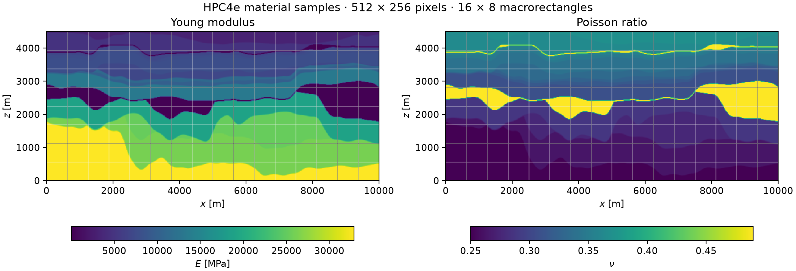

# Heterogeneous geomechanics: HPC4e

[Devloo et al. (2021), section 6.2](https://doi.org/10.1051/m2an/2021013)
consider a vertical cross-section of the HPC4e geological model under gravity.
This case uses the published rectangular weak-symmetry MHM family, the original
material samples and the four skeleton resolutions of Figures 10 and 11.

## Physical data and approximation spaces

The domain is \([0,10000]\times[0,4500]\) m. The horizontal coordinate is \(x\),
and \(z\) increases upward. The bottom is fixed, while the top and both lateral
sides have zero traction. The body force is \((0,-9.81\rho)\) N/m³. Plane-strain
Lamé moduli follow from the Young modulus and Poisson ratio:

$$
\mu=\frac{E}{2(1+\nu)},\qquad
\lambda=\frac{E\nu}{(1+\nu)(1-2\nu)}.
$$

The material arrays come from
[`labmec/MHM`, revision `f978f29d657d28fe58bcea20fabee68953093482`, `Data_13_Set`](https://github.com/labmec/MHM/tree/f978f29d657d28fe58bcea20fabee68953093482/Data_13_Set).
`VE`, `VPoisso` and `Vden` contain Young modulus in Pa, Poisson ratio and density
in kg/m³, respectively. Their 512 × 256 samples already include the saturated-clay
layers with \(E=15\) MPa, \(\nu=0.49\) and \(\rho=1760\) kg/m³. Every sampled
value is retained, including intermediate interface samples. File depth indices
are reversed once to obtain upward height. Checksums pin all three arrays.




| Quantity | Published experiment and PyMHM setting |
|---|---|
| Macro partition | 16 × 8 rectangles |
| Local partition | 32 × 32 rectangles per macrocell; 512 × 256 globally |
| Stress | Row-wise RT1 with normal degree 1 |
| Displacement | Discontinuous Q1² |
| Rotation multiplier | Total-degree P1 |
| Interior enrichment | Zero |
| Skeleton | P1 on each of \(2^\ell\) subfaces; \(\ell=0,1,2,3\) |
| Material integration | Pixel-aligned fine cells, tensor Gauss rule of order 4 |
| Classical reference | Independent DOLFINx/UFL weak-symmetry mixed RT1 and RT2 |

The rotation is P1, **not tensor-product Q1**. Stress symmetry is enforced in
rotation moments; pointwise symmetrization would change the field. The bottom
displacement and zero normal stress on the other boundaries use the corresponding
mixed weak and essential conditions. Three rigid modes per macrocell are retained
in the condensed system.

Computations use \(x'=x/10^4\), \(u'=u/10^4\), \(\sigma'=\sigma/10^8\),
\(E'=E/10^8\) and \(f'=10^4 f/10^8\). Thus the stress plots are in MPa and
displacement plots are in metres. Scaling the modulus without scaling the force
would change physical displacement.

## Published stress profiles

The diagnostic line is exactly \(z=2250.25\) m. The coarse skeleton restricts
traction transmission and can produce large stress oscillations. The expected
published behavior is progressive agreement with the classical curve when the
skeleton is refined, with the local grid and polynomial spaces held fixed.


The comparison samples the red curves directly from the embedded publication
raster. Calibration uses the plotted coordinate axes. Each interval contains the
visible line thickness plus two pixels vertically; two pixels horizontally
correspond to 17.094 m. Columns with disconnected red bands are omitted. The
numerical profile is evaluated across the horizontal interval, retaining its
one-sided fine-cell values and exact piecewise-quadratic extrema. Interval overlap measures consistency with the raster,
not a continuum error bound. Nominal differences and the number of overlapping
intervals are preserved in `examples/results/hpc4e/published-profile-comparison.json`.

| Skeleton level | Global unknowns | Intervals agreeing | Nominal RMS difference [MPa] |
|---|---:|---:|---:|
| 0 | 1376 | 139 / 139 | 1.550 |
| 1 | 2368 | 141 / 141 | 1.868 |
| 2 | 4352 | 143 / 144 | 1.372 |
| 3 | 8320 | 143 / 143 | 1.138 |

Overall, 566 of 567 sampled intervals overlap. The remaining level-2 interval
is separated by 0.427 MPa. These raster intervals are too wide horizontally to
certify narrow fine-cell extrema: the reconstructed PyMHM profile retains sharp
features that the published plotting resolution may not resolve. Agreement at
the sampled intervals therefore does not assert equality of every peak or
pointwise agreement over the entire line.

## Independently assembled reference

DOLFINx/UFL assembles the single-level stress/displacement/rotation system on the
same material-aligned grid. Basix RT degrees 2 and 3 correspond here to mathematical
RT1 and RT2. Displacement is discontinuous Q1² or Q2², and rotation has total
degree 1 or 2. The displacement condition is imposed weakly; zero traction is
imposed on all normal stress moments of the other boundaries. The RT1 acquisition
uses Intel MKL PARDISO with explicit symmetric matching. The RT2 acquisition uses
PETSc/MUMPS pivoted symmetric-indefinite LDLt. Both use five symmetric Ruiz
congruences. Residuals are checked against the complete unscaled UFL matrix,
including the equations omitted by triangular storage during factorization.
The reference does not use the PyMHM local matrices or condensation.

The two classical degrees and an RT2 spatial refinement check reference
sensitivity independently of MHM skeleton refinement. Polynomial field conversion is verified at independent
physical points, including normal orientation and stress divergence. Errors use
quadrature on a common material-resolved partition and the full nonsymmetric
stress tensor. In addition to L2 norms, the compliance norm is

$$
\|\tau\|_C^2=\int_\Omega
\frac{\operatorname{dev}\tau:\operatorname{dev}\tau}{2\mu}
+\frac{(\operatorname{tr}\tau)^2}{4(\mu+\lambda)}.
$$

The classical acquisitions satisfy the original-equation and physical checks:

| Space and grid | Unknowns | Original residual of exported field | Relative force-equilibrium residual | Relative energy/work discrepancy |
|---|---:|---:|---:|---:|
| RT1, 512 × 256 | 3,542,016 | 8.18e−13 | 2.82e−13 | 2.26e−14 |
| RT2, 512 × 256 | 7,868,928 | 1.06e−12 | 2.46e−13 | 6.70e−15 |
| RT2, 1024 × 512 | 31,466,496 | 4.32e−12 | 4.86e−13 | 7.71e−14 |

The fine RT2 system uses four MPI ranks and MUMPS out-of-core LDLt. Five
symmetric Ruiz congruences precede factorization; an explicit extended-precision
defect correction reaches a relative residual of \(2.31\times10^{-15}\) in the
original equations. The table reports the separately verified float64 exported
field. The maximum simultaneous resident memory observed by the acquisition
monitor was 107.18 GiB. The sum of the four individual rank peaks is 119.69 GiB;
these quantities have different definitions. This is a concurrent scientific
acquisition, not a parallel-performance measurement.

The reference has two distinct resolution checks. Increasing the classical
degree from RT1 to RT2 on 512 × 256 cells changes stress by **1.96681%**,
displacement by **0.149563%**, rotation by **4.34295%** and compliance norm by
**4.79411%**, relative to RT2 on that grid. Refining RT2 from 512 × 256 to
1024 × 512 gives:

| Norm | Relative classical refinement increment |
|---|---:|
| Stress L2 | 1.119129% |
| Displacement L2 | 0.010589% |
| Rotation L2 | 2.864135% |
| Compliance | 3.113395% |

The finer RT2 field supplies the denominators in this table and in the MHM
comparisons below. These are measured increments, not upper bounds on the
continuum error. Reference sensitivity remains material for the finest MHM
field, particularly for compliance and rotation; the numerical reference is
not an exact solution.

Against RT2 on **1024 × 512** cells, the four published MHM skeletal spaces give:

| Skeleton level | Stress L2 difference | Displacement L2 difference | Rotation L2 difference | Compliance difference |
|---|---:|---:|---:|---:|
| 0 | 25.424% | 12.955% | 33.773% | 30.256% |
| 1 | 18.310% | 7.056% | 24.503% | 21.859% |
| 2 | 5.579% | 1.160% | 12.352% | 9.474% |
| 3 | 4.159% | 0.625% | 8.203% | 7.339% |

Tensor Gauss orders four and five agree to \(2.05\times10^{-14}\) relative
for these displacement, stress, rotation and compliance differences, including
the RT2 spatial-refinement comparison. The integration grid resolves all
material pixels and both fields. Divergence differences are about
\(1.9\times10^{-10}\) in dimensionless L2; their quadrature changes, normalized
by the reference divergence norm, are at most \(3.83\times10^{-17}\).
The [spatial-refinement and MHM records](../figures/hpc4e/reference-spatial-refinement.json)
and [degree-refinement records](../figures/hpc4e/reference-refinement.json)
include absolute norms and input checksums.


The separate same-space RT1 comparison is:

| Skeleton level | Stress L2 difference | Displacement L2 difference | Compliance difference |
|---|---:|---:|---:|
| 0 | 25.355% | 12.808% | 29.855% |
| 1 | 18.197% | 6.917% | 21.307% |
| 2 | 5.141% | 1.029% | 8.085% |
| 3 | 3.544% | 0.493% | 5.440% |

These are relative differences from the classical RT1 field, with its norm in
the denominator. The same-space complementary-energy identity is

$$
\|\sigma_{\rm MHM}-\sigma_{\rm RT1}\|_C^2
=\|\sigma_{\rm MHM}\|_C^2-\|\sigma_{\rm RT1}\|_C^2.
$$

It holds here to \(3.29\times10^{-14}\) relative to the total compliance energy,
and \(1.12\times10^{-11}\) relative to the energy difference. This tests the
nested discrete stress spaces, equilibrium and weak-symmetry constraints. It
is not a bound on the error relative to the continuum solution, and it must not
be applied automatically between RT1 and RT2 rotation/displacement spaces.


The profiles and signed field panels compare MHM against the independently
assembled RT2 baseline on 1024 × 512 cells. The signed maps use symmetric-log color scales, with a linear interval
within 1% of each scale limit. Compared fields share limits; difference panels
have their own symmetric scales. No values are clipped. Spatial field maps sample
the centres of the common 1024 × 512 fine-cell partition; the reported norms
use quadrature rather than these samples. Each sample uses its owning cell
polynomial, without averaging across interfaces.


## Algebraic and physical checks

Fine-cell force moments, macro force and moment balance, represented normal
traction continuity and weak stress symmetry are checked separately. These
identities assess the discrete equations; they do not replace the classical
reference or the published-profile comparison.

An additional complete RT1, \(\ell=0\) solve compares SciPy SuperLU and Intel MKL
PARDISO's symmetric-indefinite factorization. Relative differences are
\(2.49\times10^{-9}\) in stress L2 and \(1.26\times10^{-8}\) in compliance norm.
Both solvers satisfy the same physical residual gate. These numbers describe
backend agreement; concurrent execution times are not a controlled speedup study.

The small automated tests use polynomial patches to verify dimensional scaling,
material orientation, canonical odd normal moments and analytical L2/compliance
integrals. The full geological acquisitions are research cases outside the CI
suite.

## Reproduction

```bash
pixi install -e intel
pixi run --locked -e test-core python examples/solve_hpc4e_mhm.py --download --segments 1 2 4 8 --workers 8
pixi run -e fem python examples/solve_hpc4e_reference.py --degree 1 --factorization pypardiso-symmetric-matching --solver-python .pixi/envs/intel/bin/python --equilibration symmetric --threads 4
pixi run -e fem python examples/solve_hpc4e_reference.py --degree 2 --factorization ldlt --equilibration symmetric --threads 4 --workspace-limit-mb 80000
pixi run --locked -e test-core python examples/compare_hpc4e.py
pixi run --locked -e test-core python examples/compare_hpc4e_fields.py --workers 4
pixi run -e fem mpiexec -n 4 python examples/solve_hpc4e_reference.py \
  --nx 1024 --ny 512 --degree 2 --factorization ldlt \
  --equilibration symmetric --mpi --threads 2 --refinement-precision extended \
  --workspace-limit-mb 17500 --out-of-core-directory build/tmp/hpc4e-mumps-ooc
pixi run --locked -e test-core python examples/compare_hpc4e_fields.py --workers 2 \
  --reference build/results/hpc4e/classical-rt2-1024x512-mumps.npz \
  --approximations build/results/hpc4e/classical-rt2-512x256-mumps.npz \
    build/results/hpc4e/mhm-s1.npz build/results/hpc4e/mhm-s2.npz \
    build/results/hpc4e/mhm-s4.npz build/results/hpc4e/mhm-s8.npz \
  --orders 4 5 --output examples/results/hpc4e/reference-spatial-refinement.json
pixi run -e notebooks python examples/plot_hpc4e.py \
  --reference build/results/hpc4e/classical-rt2-1024x512-mumps.npz
```

The dataset manifest records the public data source, revision and checksums.
Numerical records identify the approximation spaces and source hashes. The
reference implementation described in the paper is NeoPZ; the newly assembled
classical fields shown here are DOLFINx/UFL results and are identified accordingly.
