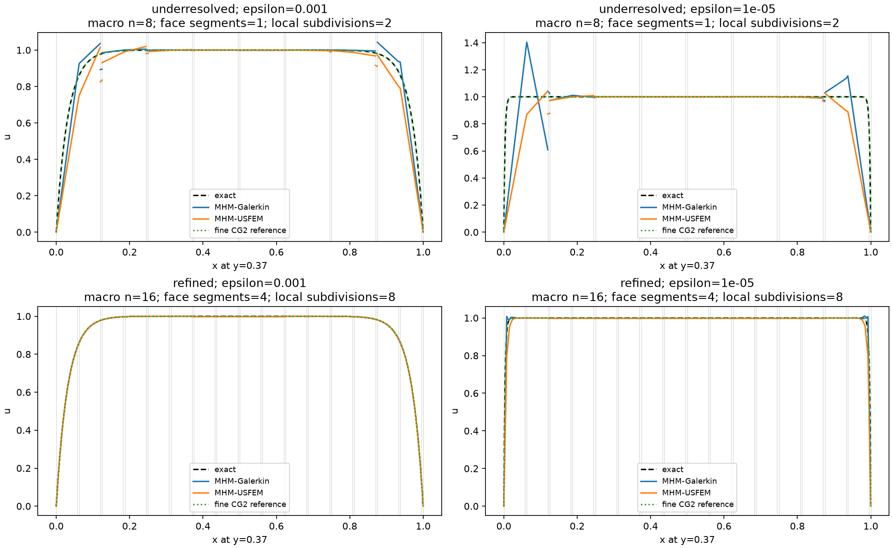
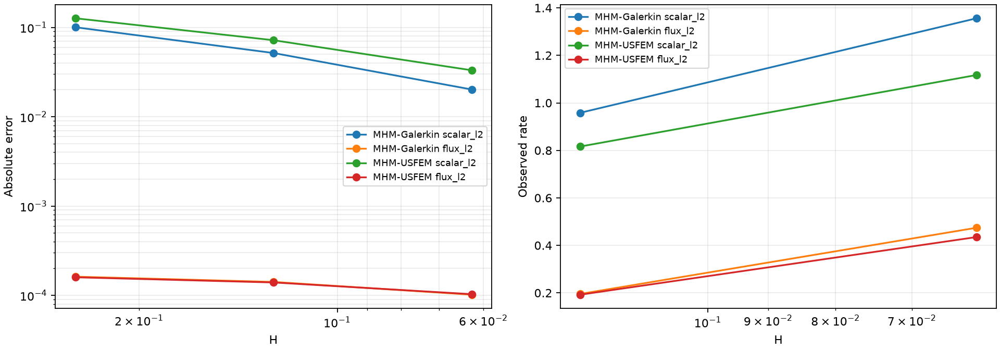
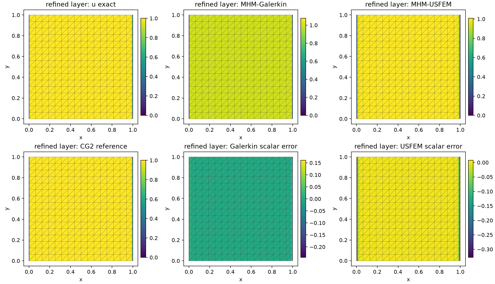
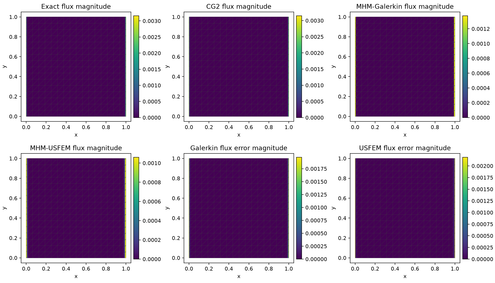
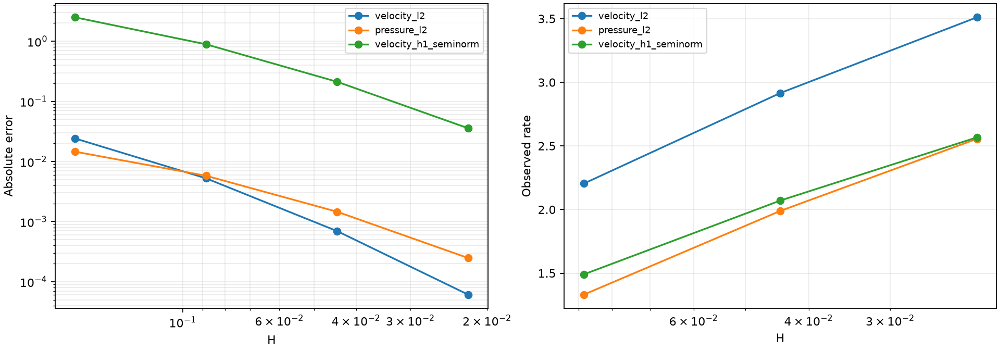
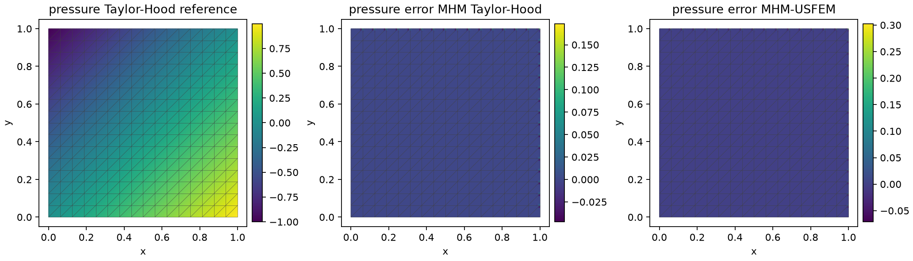

# Reaction–diffusion and Brinkman boundary layers

The two introductory notebooks declare their physical data, local UFL forms,
oriented skeletal equations, boundary conditions and reference assemblies in
executable cells. Scalar reaction–diffusion and incompressible Brinkman flow
have different operators and stabilization parameters. Their profiles are
therefore assessed as separate physical cases.

## Scalar reaction–diffusion

The [RAD notebook](https://github.com/ipes-lncc/pymhm/blob/main/notebooks/introduction/mhm_usfem_rad.ipynb)
uses the analytical problem of
[Santiago, Valentin and Martins (2025)](https://doi.org/10.55592/cilamce2025.v5i.14270):

$$
\begin{aligned}
-\epsilon\Delta u+u&=1,\\
u\big\vert_{x=0,1}&=0,
&(-\epsilon\nabla u)\cdot n\big\vert_{y=0,1}&=0.
\end{aligned}
$$

The layer width is of order $\sqrt\epsilon$. P1 functions on affine triangles
have zero element Laplacian. For unit reaction and constant diffusion, the
negative USFEM residual pairing reduces the mass matrix and source by the same
factor. In a reaction-dominated element of diameter $h_T$,

$$
\begin{aligned}
A_T&=\epsilon K_T+(1-\tau_T)M_T,
&F_T&=(1-\tau_T)F_T^{\rm Gal},\\
\tau_T&=\frac{h_T^2/3}{h_T^2/3+2\epsilon},
&\frac{\epsilon}{1-\tau_T}&=\epsilon+\frac{h_T^2}{6}.
\end{aligned}
$$

This algebraic identity explains why an unresolved stabilized profile can have
a broader layer while reducing nodal oscillations. Stabilization does not
guarantee a discrete maximum principle or improvement in every physical norm.
The notebook reports scalar and physical-flux errors together with extrema.

The coarse profile uses 128 macrotriangles, two local subdivisions per macro
edge and one P0 coordinate on each full macroface. At $\epsilon=10^{-5}$, its
fine diameter is approximately 0.0884, versus a layer width of 0.00316.
The separate resolution family uses four P0 subfaces and eight local
subdivisions per macro edge. This supplies the additional red refinement
required for the P1/P0 option of the cited scalar theorem. Its finest mesh has
512 macrotriangles. The boundary data are imposed strongly on vertical nodes;
horizontal flux data and interior continuity moments remain explicit.

The article's Figure 2 uses 512 macrotriangles and four P0 face segments, but
does not specify the historical connectivity sufficiently to reconstruct every
local mesh. The declared SW–NE red-refined mesh and strong boundary enforcement
are identified explicitly; this is a comparison with the published physical
case and approximation requirements, rather than a literal figure reproduction.
The classical CG2 references resolve the same operator and mixed boundary data
on several finer meshes, with their errors checked against the exact solution.
For the severe layer, the reference refines the x direction through 256, 512
and 1024 intervals while retaining 16 y intervals; the exact field is independent
of y. Its finest scalar and flux L2 errors are $2.4000\times10^{-5}$ and
$6.0713\times10^{-7}$.

For $\epsilon=10^{-5}$, the measured scalar L2 errors and nodal overshoots are:

| Macro divisions | Galerkin scalar L2 | USFEM scalar L2 | Galerkin overshoot | USFEM overshoot |
| --- | ---: | ---: | ---: | ---: |
| 4 | 0.10038 | 0.12652 | 0.39720 | 0.02040 |
| 8 | 0.05166 | 0.07185 | 0.29711 | 0.01569 |
| 16 | 0.02018 | 0.03312 | 0.07594 | 0.00688 |

These rows use four face segments and eight local subdivisions. Both methods
converge along this sequence. USFEM reduces the nodal overshoot substantially,
while its scalar L2 error remains larger. At the finest level, physical-flux L2
errors are $1.0181\times10^{-4}$ for Galerkin and $1.0318\times10^{-4}$ for USFEM.
These are about 57.3% and 58.0% of the exact flux L2 norm, respectively: the
severe layer's flux remains underresolved despite the much improved profile.
With $\epsilon=10^{-3}$ on the same finest mesh, neither method overshoots;
scalar L2 errors are $8.3179\times10^{-4}$ and $1.2263\times10^{-3}$, respectively.
The severe layer is still represented by relatively few local cells. These
measurements establish refinement and the stabilization tradeoff, rather than
uniform asymptotic accuracy in the singular limit.

The top panels retain the coarse resolution control; the bottom panels use
the finest declared resolution family. Exact and independently assembled fine
CG2 reference values accompany both. Interface markers show macroface crossings,
and incident reconstructions retain their independent one-sided values.

## Incompressible Brinkman flow

The [Brinkman notebook](https://github.com/ipes-lncc/pymhm/blob/main/notebooks/introduction/stokes_brinkman_boundary_layer.ipynb)
uses the operator and analytical data in Section 3.1.2 of
[Araya et al. (2016)](https://www.ci2ma.udec.cl/pdf/pre-publicaciones2/2016/pp16-15.pdf):

$$
\begin{aligned}
-\nu\Delta\boldsymbol u+\gamma\boldsymbol u+\nabla p&=\boldsymbol f,
&\nabla\cdot\boldsymbol u&=0,\\
\nu&=10^{-2}, &\gamma&=1,\\
\boldsymbol u_*(x,y)&=(y-g(y),\ x-g(x)), &p_*(x,y)&=x-y,\\
g(s)&=\frac{e^{(s-1)/\nu}-e^{-1/\nu}}{1-e^{-1/\nu}}.
\end{aligned}
$$

Velocity is prescribed on the whole exterior. The reconstructed pressure has
one global zero-volume-mean constraint. The vector-Laplacian convention uses
pseudostress and its oriented pseudotraction; symmetric Cauchy stress defines
a different local boundary operator.
The displayed local provider assumes positive drag. Zero drag requires explicit
translational local kernels and their global compatibility equations.

On the declared global face normal $n_F$, the multiplier convention is

$$
\lambda_F=(-\nu\nabla\boldsymbol u+pI)n_F.
$$

It is the negative of the physical vector-Laplacian traction
$(\nu\nabla\boldsymbol u-pI)n_F$.

The literature comparison uses one triangle per local problem, unsplit
degree-$\ell$ macrofaces and equal-order local P$_{\ell+2}$/P$_{\ell+2}$ spaces.
The diameter $H=\sqrt2/n$ is recorded separately from Cartesian macro spacing.
The negative full momentum-residual stabilization and its matching load use
an inverse constant calculated on the actual polynomial space. The shared
[`laplacian_inverse_bound`](../api/elements.md) operation supplies this quotient;
the notebook also verifies the resulting matrix inequality independently.

Taylor–Hood comparisons use four local subdivisions per macro edge, giving
each two-dimensional local triangulation an interior vertex. This meets the
mesh condition for the standard mixed approximation described by
[Araya et al. (2025)](https://doi.org/10.1137/24M1649368). Its equal-order
USFEM comparison uses the same local velocity mesh and skeletal space. A
separate eight-subface/eight-subdivision control measures the effect of further
resolution; its changed skeletal space is not used to validate the unsplit
polynomial family's rates.

The 2017 experiment reports asymptotic velocity L2 rates $\ell+2$ and pressure
and velocity-gradient rates $\ell+1$, with loss of order on coarse unresolved
layers. The notebook measures these quantities separately, including fine-cell
divergence and macro mass balance. Broken pseudostress is reported in L2;
an H(div) stress reconstruction or its convergence rate is not inferred.
Independently assembled conforming Taylor–Hood references use the same source,
exterior velocity and physical pressure gauge on three progressively finer
meshes. The exact fields remain the primary error reference.

The polynomial family matches the stated local and skeletal degrees. Historical
mesh connectivity and numerical inverse constants are not fully specified by
the 2017 paper, so agreement with its individual plotted values is not asserted.

The finest executed member of each polynomial family gives:

| Trace degree | Local pair | Macro divisions | Velocity L2 | Pressure L2 | Gradient seminorm |
| --- | --- | ---: | ---: | ---: | ---: |
| 0 | P2/P2 | 128 | 0.006055 | 0.0091404 | 1.8739 |
| 1 | P3/P3 | 64 | 0.00097682 | 0.0022061 | 0.38196 |
| 2 | P4/P4 | 64 | 6.0896e-05 | 0.00024764 | 0.03569 |

The last measured slopes are listed in velocity/pressure/gradient order.

| Trace degree | Last macro refinement | Measured slopes | Literature asymptotic orders |
| --- | --- | --- | --- |
| 0 | 64 to 128 | 1.84/0.97/0.88 | 2/1/1 |
| 1 | 32 to 64 | 2.50/1.65/1.58 | 3/2/2 |
| 2 | 32 to 64 | 3.51/2.56/2.57 | 4/3/3 |

These measurements show approach to the reported asymptotic orders; the
executed gradient and higher-degree sequences still include pre-asymptotic
layers. Literature orders are asymptotic targets; the tables report the
slopes of the declared executed sequence.

The profile comparison uses the separately declared eight-subface control;
the polynomial-family field panels use its finest P4/P4 member. Both are
identified explicitly rather than pooling their approximation spaces.

The conforming reference at 128 divisions has velocity and pressure L2
errors of approximately 2.6332e-4 and 1.2303e-5. Its own convergence is
checked independently, and the exact solution remains the error reference.

Current numerical records and source/basis provenance are available in the
[layer publication](https://github.com/ipes-lncc/pymhm/tree/main/examples/results/introduction-layers).

## Independent discrete checks

Native DOLFINx tests assemble complete uncondensed hybrid systems and compare
them with the generic `Equation`, `LocalEquations` and `MultiscaleProblem`
condensation path. Facet-normal pairings are assembled independently of the
package's trace integrator. Scalar controls cover both layer parameters,
Galerkin and USFEM, and homogeneous and nonhomogeneous boundary data.
Vector controls cover rigid rotation and a quadratic divergence-free velocity
with affine pressure, the full stabilized source, nonzero pressure mean and
the joint pressure/normal-multiplier shift. These invariants test boundary
conventions, orientation and reconstruction in addition to algebraic residuals.

Saved states retain the executed local basis matrices and their digests.
Replay uses those matrices consistently and checks one and two BLAS threads.
Spatial panels retain the actual macro mesh; profiles retain independent
incident values at macroface crossings.

## References

- Juan Felipe Pacazuca Santiago, Frédéric Valentin, and Larissa Martins (2025). *A Multiscale Hybrid-Mixed Method with Local Stabilization*. Proceedings of the Ibero-Latin American Congress on Computational Methods in Engineering, CILAMCE 2025, volume 5, article 14270; published online 18 March 2026. [DOI: 10.55592/cilamce2025.v5i.14270](https://doi.org/10.55592/cilamce2025.v5i.14270).

- Rodolfo Araya, Christopher Harder, Abner H. Poza, and Frédéric Valentin (2016). *Multiscale hybrid-mixed method for the Stokes and Brinkman equations—The method*. Universidad de Concepción, CI²MA, Preprint 2016-15. [Institutional preprint](https://www.ci2ma.udec.cl/pdf/pre-publicaciones2/2016/pp16-15.pdf). The journal publication is Computer Methods in Applied Mechanics and Engineering 324, 29–53 (2017), [DOI: 10.1016/j.cma.2017.05.027](https://doi.org/10.1016/j.cma.2017.05.027).

- Rodolfo Araya, Christopher Harder, Abner H. Poza, and Frédéric Valentin (2025). *Multiscale Hybrid-Mixed Methods for the Stokes and Brinkman Equations—A Priori Analysis*, SIAM Journal on Numerical Analysis 63(2), 588–618. [DOI: 10.1137/24M1649368](https://doi.org/10.1137/24M1649368).
