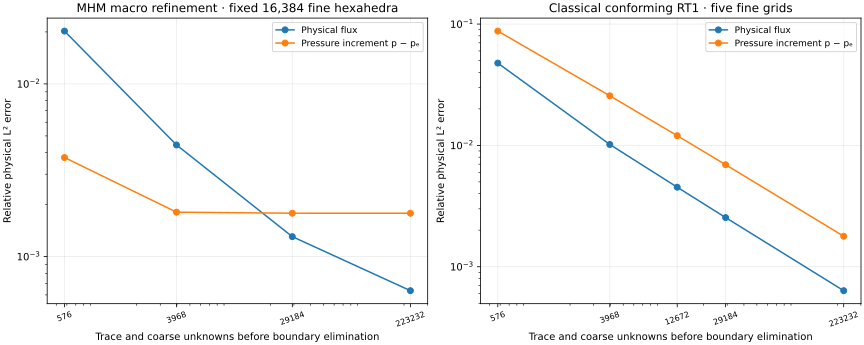
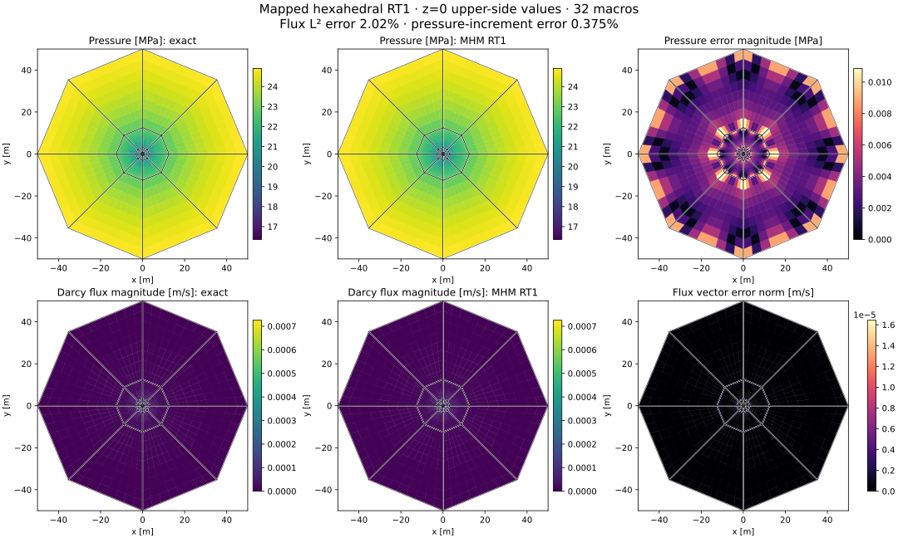
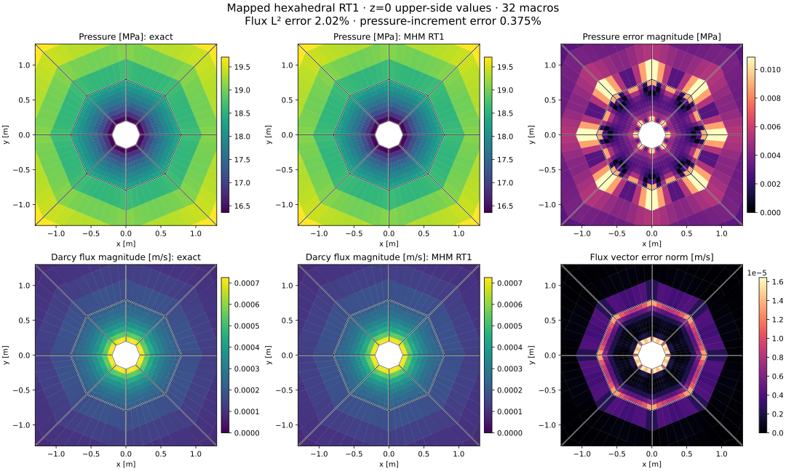
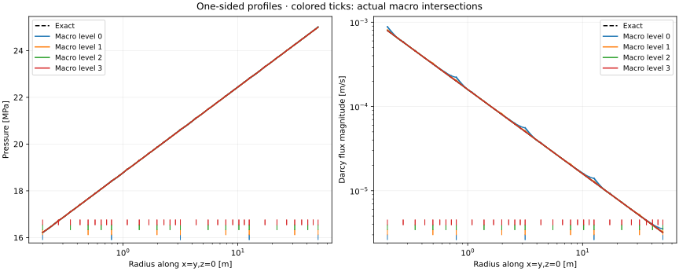

# Mapped hexahedral RT flow around a well

`solve_darcy_mapped_rt` provides a three-dimensional mixed MHM formulation on
conforming trilinear hexahedra. It uses tensor-product Raviart–Thomas fluxes,
local discontinuous pressure and oriented normal-flux moments on quadrilateral
macrofaces. The RT1 configuration is the hexahedral family used in
[Durán et al. (2019), §7.4](https://doi.org/10.1016/j.cma.2019.05.013). This is an H(div) formulation in three dimensions;
it is distinct from a tetrahedral primal pressure approximation.

## Mapping, spaces and physical equations

Let \(F_K:[0,1]^3\to K\) be a trilinear map, with Jacobian \(J\). The flux and its
divergence satisfy the contravariant Piola identities

$$
q(F_K(\widehat x))=\frac{J\widehat q}{\det J},\qquad
\operatorname{div}q(F_K(\widehat x))=
\frac{\widehat{\operatorname{div}}\widehat q}{\det J}.
$$

For RT1, the reference vector space is
\(Q_{2,1,1}\times Q_{1,2,1}\times Q_{1,1,2}\), and pressure is the ordinary
scalar pullback of \(Q_{1,1,1}\). Each oriented face has four integral Legendre
normal moments. On a genuinely nonaffine cell, the divergence belongs to
\(Q_1/\det J\); it does **not** generally lie in the scalar-pullback pressure
space. The discrete equations enforce all pressure-tested divergence/source
moments, including the constant test giving fine-cell mass conservation.

A `HexSkeleton` prescribes a piecewise tensor-polynomial **reference-face flux
density**. Its pullback corresponds to a physical normal density divided by the
surface Jacobian. Subfaces must align with the local reference grid, and their
degree must not exceed the local RT degree. The implementation preserves face
orientations and tensor-coordinate permutations. When the skeleton resolves
every fine normal trace, local condensation yields the classical globally
conforming mixed discretization; changing macro grouping then leaves the
physical fields unchanged.

The constitutive equation is \(K^{-1}q+\nabla p=0\). Permeability may be a positive
scalar, SPD tensor, or physical-coordinate callback. Heterogeneous interfaces
must be resolved by the cells/integration. Dirichlet pressure is weak data;
Neumann input is the physical outward normal flux. A pure Neumann problem uses
the physical integral of pressure as its gauge. Local flux and pressure units
are balanced by an exact symmetric change of coordinates, and physical fields
are restored before error or conservation measurements. The returned
`physical_residuals` separately checks constitutive, divergence and prescribed
normal-moment equations through a blockwise backward-error criterion.

`HexMesh` checks tensor connectivity, opposite outward orientations and positive
sampled Jacobians. The latter is not a proof of global injectivity for arbitrary
warped input meshes. The present geometry maps have straight-edged polygonal
faces; exact cylindrical or general CAD surfaces are a separate capability.

## Dupuit–Thiem data and declared reservoir geometry

The analytical case uses the physical parameters in [Durán et al. (2019)](https://doi.org/10.1016/j.cma.2019.05.013), Table 1:

| Quantity | Value |
|---|---:|
| Reservoir height \(H\) | 10 m |
| Well / exterior radius | 0.2 / 50 m |
| Permeability \(\kappa\) | \(10^{-13}\) m² |
| Viscosity \(\eta\) | 0.001 Pa·s |
| Exterior pressure \(p_e\) | 25 MPa |
| Rate parameter \(Q\) | 0.01 m³/s |

The exact pressure and Darcy flux are

$$
p=p_e+\frac{Q\eta}{2\pi\kappa H}\log(r/r_e),\qquad
q=-\frac{Q}{2\pi H}\frac{(x,y,0)}{r^2}.
$$

Here positive \(Q\) denotes production: pressure is lower at the well, the
outward rate through the inner boundary is \(+Q\), and the exterior rate is
\(-Q\). This follows directly from \(q=-(\kappa/\eta)\nabla p\) and agrees with
the pressure trend in Figure 14. The printed analytical expression has the
opposite sign for the positive rate listed in Table 1; the physical convention
used here is explicit.

As in §7.4, analytical pressure is imposed on both the inner and outer lateral
boundaries, while the top and bottom are impermeable. The rate is a parameter
of the analytical Dirichlet data, rather than a separately imposed Neumann
condition. On the polygonal boundary, the exact pressure is evaluated at the
actual physical position; it is not replaced by a circular-boundary constant.

The macro grid has eight azimuthal sectors and four radial bands, giving 32
hexahedra. The five declared radii are approximately
\(0.2,0.795270729,3.162277660,12.574334297,50\) m. These logarithmically spaced
radii define an original explicit geometry. The paper's printed graded-distance
expression \(2^{-m}r_w\), \(m=1,\dots,5\), does not determine radii spanning its
stated domain. Figure 12 establishes the topology but not unique numerical
radii, so identical historical geometry is not asserted.

## Fixed fine grid and macro refinement

The four macro factors are 1, 2, 4 and 8, with local refinements 8, 4, 2 and 1.
Thus all four runs share 16,384 fine hexahedra. The last is the classical mixed
RT1 limit. This follows the scale relation of §7.4 while retaining the explicit
radial geometry above. A second study refines the classical RT1 grid through
five fine factors, 1, 2, 3, 4 and 8. Physical volume norms, quadrature checks,
integrated boundary rates and source/flux balances are recorded for each run.

| Macro cells | Trace + coarse unknowns before boundary elimination | Relative pressure-increment error | Relative flux error |
|---:|---:|---:|---:|
| 32 | 576 | 0.37456% | 2.02284% |
| 256 | 3,968 | 0.18077% | 0.44303% |
| 2,048 | 29,184 | 0.17828% | 0.13043% |
| 16,384 | 223,232 | 0.17824% | 0.06345% |

The independently refined classical grids have flux errors of 4.7694%, 1.0174%,
0.4522%, 0.2541% and 0.06345%. At the finest level, the integrated extraction rate
is 0.009999995731 m³/s, compared with the exact 0.01 m³/s. The maximum fine-cell
pressure-tested divergence moment is below \(5.0\times10^{-16}\). The pressure
error at fixed fine resolution approaches a local-discretization floor; further
macro refinement primarily improves the flux in this study.

Pressure-increment errors are normalized by \(\|p-p_e\|_{L^2}\), and flux errors
by \(\|q\|_{L^2}\). Records also contain absolute norms and the error normalized
by \(\|p\|_{L^2}\); the latter can look small because of the 25 MPa background.
The original units are retained throughout.

The spatial panels and profiles use fresh acquisitions of the same declared
geometry, physical data, RT1/Q1 spaces and quadrature orders as the recorded
study. Historical numerical records remain unchanged. The
[field replay receipt](../figures/mapped-well/current-field-replay.json) records
the original and new coefficient digests, checks immutable source identities,
and compares the independently integrated physical norms and boundary rates.
Each field is evaluated from its own archived fine-cell connectivity and
coefficients with the canonical tensor-product RT1 basis and Piola mapping.
The fresh finest replay has a maximum pressure-tested divergence moment of
\(6.57\times10^{-16}\) m³/s, or \(6.57\times10^{-14}\) relative to the prescribed
rate. Its maximum physical block backward residual is
\(1.71\times10^{-11}\), below the unchanged \(10^{-10}\) acceptance criterion.
These fresh diagnostics are recorded separately from the historical values
quoted above.

The plots use the upper incident cells at \(z=0\), with independent fine-cell
centroid samples and the actual macro intersections. Pressure and flux are not
smoothed across interfaces. Exact/numerical panels share scales; the final
column shows the scalar pressure error or the norm of the vector flux difference.
The physical L2 errors are integrated over volumes, independently of the display
samples.

The profiles follow \(x=y,z=0\) from the incident azimuthal sector below
\(\pi/4\). Fine intervals are drawn separately, and colored ticks identify
actual radial macro boundaries. This preserves one-sided pressure and tangential
flux values instead of averaging along a macroface.

## Verification and reproducibility

The core tests verify Piola divergence by Cartesian differentiation, canonical
normal moments, the divergence theorem, shared-face rotations, sources,
Dirichlet/Neumann signs, pressure gauges, physical-unit invariance and equivalence
of fully resolved macro partitions. Independent DOLFINx/UFL tests compare complete
RT0, RT1 and RT2 mixed matrices and loads on a nonaffine hexahedron with a variable
anisotropic tensor. These establish operator consistency; they do not replace
mesh refinement or prove parameter-independent stability on arbitrary maps.

The original acquisition and replay drivers are `examples/solve_mapped_well.py`
and `examples/plot_mapped_well.py`. Numerical fields, physical diagnostics and
source/field digests are archived in `examples/results/mapped-well/`.
Notebook `44_mapped_well.ipynb` displays the recorded studies. The oscillatory
three-dimensional coefficient of Problem 5 in [Durán et al. (2019)](https://doi.org/10.1016/j.cma.2019.05.013) and its historical field profiles
are not part of this analytical campaign.

The global retained saddle can be resolved with an explicit `global_rtol` and
`global_refinement_precision="extended"`. Defaults preserve double-precision
behavior. Extended correction accumulation requires a wider long-double type;
the physical mixed-block acceptance criterion remains unchanged. A stricter
linear-solver target is a numerical accuracy request, not a guarantee of an
attainable physical residual for every parameter scale.

## References

- Omar Durán, Philippe R. B. Devloo, Sônia M. Gomes, and Frédéric Valentin (2019). *A multiscale hybrid method for Darcy’s problems using mixed finite element local solvers*, Computer Methods in Applied Mechanics and Engineering 354, 213–244. [DOI: 10.1016/j.cma.2019.05.013](https://doi.org/10.1016/j.cma.2019.05.013).
