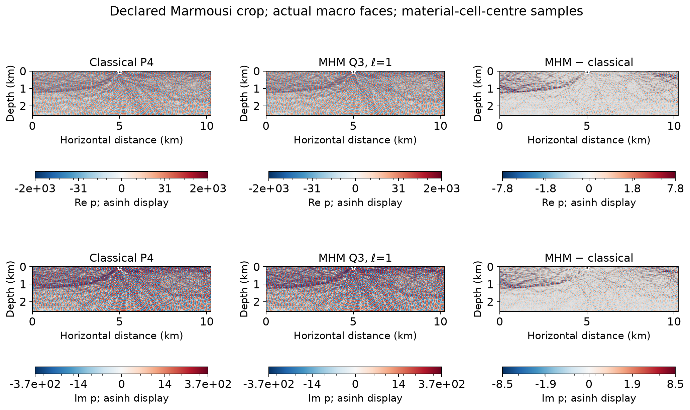
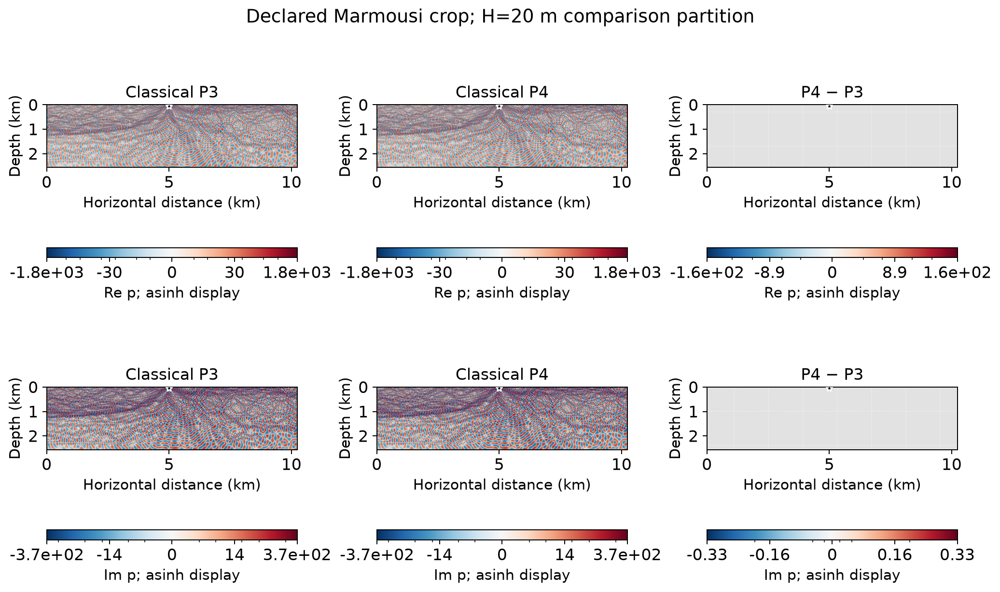
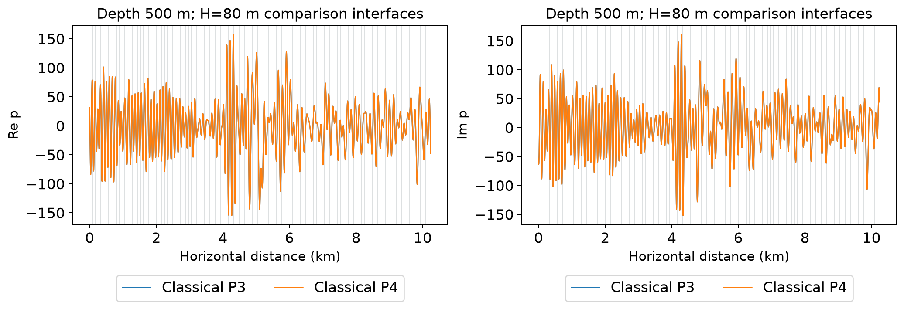

# Marmousi acoustic point source

This experiment solves the heterogeneous acoustic problem described in
Section 6.4 of [Chaumont-Frelet and Valentin (2020)](https://doi.org/10.1137/19M1255616)
using a declared subdomain of the primary Marmousi II data. The physical
domain, frequency, source position and local polynomial families follow that
section. The material arrays are an explicitly selected input: they have
**not** been identified with the historical arrays used in Table 6.1.

The [image-registration evidence](helmholtz.md#marmousi-ii-published-experiment-and-material-identification)
and its numerical record explain this distinction. Similarity of a printed
material image does not establish equality of its cellwise coefficients.

## Equation, units and material data

Let $x$ denote horizontal distance and $z$ depth, both in metres:

$$
\begin{aligned}
\Omega&=(0,10240)\times(0,2560),\\
-\nabla\cdot(\rho^{-1}\nabla p)
  -\omega^2\kappa^{-1}p&=\delta_{(5000,50)},\\
\omega&=2\pi(20\ {\rm Hz}),\qquad \kappa=\rho c^2.
\end{aligned}
$$

The top boundary $z=0$ has $p=0$. The other three sides use the outgoing
first-order condition

$$
\rho^{-1}\partial_n p
  -\mathrm{i}\omega(\rho\kappa)^{-1/2}p=0.
$$

The right-hand side is a unit point-evaluation functional in this equation;
there is no calibration to a measured source amplitude. It is assembled
at the source point without replacing the Dirac distribution by a Gaussian
or a finite well. The complex pressure and both of its real and imaginary
parts are retained.

The primary dataset is [Marmousi II, Martin, Wiley and Marfurt
(2006)](https://doi.org/10.1190/1.2172306). The input files are the
[compressional velocity](https://ahay.org/data/marm2/vp_marmousi-ii.segy)
and [density](https://ahay.org/data/marm2/density_marmousi-ii.segy) SEG-Y
records. Their SHA-256 digests are verified before extraction and included
in each numerical record.

The original $13601\times2801$ arrays have spacing 1.25 m. The selected
crop has origin $(3395,515)$ m in the primary coordinates and
$2048\times512$ cells of width 5 m. Each material-cell centre coincides
with a primary sample. No interpolation or cell averaging is used.
The decoded velocity is converted from km/s to m/s, density from
g/cm$^3$ to kg/m$^3$, and $\kappa$ is stored in pascals. In this crop,

$$
\begin{aligned}
1589.9992&\leq\rho\leq2626.9999\ {\rm kg/m^3},\\
1027.9999&\leq c\leq4699.9998\ {\rm m/s},\\
1.6802853\times10^9&\leq\kappa\leq5.8030422\times10^{10}\ {\rm Pa}.
\end{aligned}
$$

These values retain the decoded primary samples; rounding here is only
for presentation.

## Classical reference and field verification

The independent classical application uses DOLFINx/UFL on the
pixel-conforming southwest-to-northeast triangular mesh. Coefficients are
cellwise constant and integrated without averaging across material
interfaces. Continuous equispaced $P_k$ pressures are represented by two
real components.

Writing the complex matrix as $A-\mathrm{i}C$, multiplication of the
imaginary test equation by $-1$ gives the exactly equivalent real system

$$
\begin{pmatrix}A&C\\C&-A\end{pmatrix}
\begin{pmatrix}\operatorname{Re}p\\\operatorname{Im}p\end{pmatrix}
=
\begin{pmatrix}\operatorname{Re}f\\-\operatorname{Im}f\end{pmatrix}.
$$

Five symmetric Ruiz congruences precede the PETSc/MUMPS indefinite
$LDL^\mathsf{T}$ factorization. Acceptance uses the original physical
equations after Dirichlet elimination, including the stored coefficients;
the equilibration does not change the operator or add damping.

Four polynomial levels have been acquired on the same 2,097,152 triangles:

| Classical space | Complex pressure unknowns | Original-equation residual | Relative native/replayed pressure norm difference |
|---|---:|---:|---:|
| $P_1$ | 1,051,137 | $7.06\times10^{-12}$ | $7.99\times10^{-15}$ |
| $P_2$ | 4,199,425 | $2.06\times10^{-11}$ | $2.69\times10^{-14}$ |
| $P_3$ | 9,444,865 | $2.96\times10^{-11}$ | $1.80\times10^{-14}$ |
| $P_4$ | 16,787,457 | $6.15\times10^{-11}$ | $1.40\times10^{-14}$ |

The native/replayed comparison checks the physical $L^2$ norm reconstructed
from MPI field archives against the independently assembled UFL integral.
This is a field-replay verification, not a discretization-error estimate.

Light native checks verify complex constant fields with homogeneous and
layered density, the impedance sign, exact Dirichlet values, and a point
load against an independently assembled complex conforming matrix.
An independent native $P_3$ constant-field problem also checks the condensed
MHM $Q_3$ solution with nonzero pressure and absorbing boundary data.
The postprocessor also recovers non-affine complex $P_4$ polynomials and
nonzero analytical pressure and gradient integrals.

## MHM configuration and comparison conventions

The executable MHM configuration uses quadrilateral macroelements,
continuous local $Q_3$ pressures and polynomial conormal traces. For the
three macro widths in Table 6.1:

| Macro width $H$ | Macro grid | Local subdivisions per direction | Local complex pressure unknowns per macro |
|---:|---:|---:|---:|
| 20 m | $512\times128$ | 8 | 625 |
| 40 m | $256\times64$ | 16 | 2,401 |
| 80 m | $128\times32$ | 32 | 9,409 |

All three choices have local cell width 2.5 m and resolve every material
interface. The driver archives the full local fields; trace degree is a separate
input. These are configuration specifications, not assertions that every
entry of the published table has been reproduced.

The [transcribed published table](../figures/marmousi/published-table.json)
records all fifteen MHM values from Table 6.1 of the author manuscript,
checked against the printed table. For example, $H=20$ m and trace degree
$\ell=1$ give a published sampled-pressure difference of **2.90%**.
This number refers to the article's material arrays and reference solution;
the present selected crop is a separate, fully specified input.

For a point source on a macro interface, the discrete load is allocated
by the incident angular sectors, preserving its total unit strength.
Here $H=20$ m and $H=40$ m place the source on a vertical macroface:
each of its two incident macros receives half of the functional. For
$H=80$ m the source lies inside one macro, which receives the full unit
functional. This is the declared broken-space loading convention; the
article does not specify that allocation on macro interfaces.

The article's comparison samples a uniform $513\times129$ grid. This is
an **unweighted discrete norm**, distinct from a physical volume norm.
The MHM pressure is broken; a sampling point on an interior macro vertex
can have four incident values. The acquisition preserves all four
one-sided conventions without averaging them. The historical selection
at such points is not stated in the table.

For classical refinement, complex $L^2$ pressure differences use the complete
domain. Gradient, acoustic flux $q=-\rho^{-1}\nabla p$ and positive graph-norm
comparisons instead use the fixed punctured domain

$$
\Omega_*=\Omega\setminus
\bigl((4975,5025)\times(25,75)\bigr).
$$

The excluded square has side 50 m, contains the point source, and is exactly
aligned with the material pixels at every polynomial level. The graph norm is

$$
\lVert v\rVert_{\rm graph}^2
=\int_{\Omega_*}\rho^{-1}\lvert\nabla v\rvert^2
 +\omega^2\kappa^{-1}\lvert v\rvert^2.
$$

The graph norm is not the indefinite Helmholtz bilinear form. Every
relative reference increment uses the finer polynomial field as its
denominator. With a two-dimensional point source, the continuum pressure
does not have finite global $H^1$ norm. Fixing the excluded physical region
keeps these derivative comparisons meaningful as the reference is refined.
Neither the global pressure comparison nor the published sampling grid removes
points around the source.

The measured consecutive reference increments are:

| Polynomial levels | Global pressure $L^2$ | Global sampled pressure | Cutout gradient | Cutout acoustic flux | Cutout graph norm |
|---|---:|---:|---:|---:|---:|
| $P_1\to P_2$ | 108.610% | 109.129% | 107.139% | 106.907% | 106.914% |
| $P_2\to P_3$ | 0.398720% | 0.378786% | 0.632198% | 0.638839% | 0.521159% |
| $P_3\to P_4$ | 0.0785754% | 0.00548487% | 0.0404000% | 0.0412093% | 0.0289480% |

Orders 6 and 8 agree to $3.1\times10^{-13}$ relative in the integrated
differences, including the smallest final increment. The large first increment
remains despite small algebraic residuals; the two smaller increments measure
the effect of further polynomial resolution on the same material mesh. These are numerical refinement
differences, not certified upper bounds on the remaining reference error.
The [reference-refinement record](../figures/marmousi/classical-convergence.json)
retains all norms, denominators, data and field digests.

## MHM H20 with a linear conormal trace

The acquired $H=20$ m, $\ell=1$ configuration has 65,536 quadrilateral
macroelements, 625 complex local $Q_3$ coefficients per macro and 261,888
free complex skeletal unknowns. Its original-equation residual is
$2.84\times10^{-14}$ and its maximum macro balance defect is
$9.41\times10^{-15}$. The independent $P_4$ baseline above resolves the
same declared coefficient arrays, boundary conditions and point functional.

| Difference from classical P4 | Relative value |
|---|---:|
| Global pressure $L^2$ | 2.69345% |
| Cutout gradient | 3.02698% |
| Cutout acoustic flux | 3.03693% |
| Cutout graph norm | 2.87459% |

These differences use 8,388,608 common triangles, resolving both the
MHM local rectangles and the classical triangles. Quadrature orders 8 and
10 agree within $1.2\times10^{-14}$ relative. The pressure norm remains
global; all derivative norms use the same fixed physical cutout above.
The last classical flux increment, 0.0412%, is much smaller than this MHM
flux difference, but it remains a refinement diagnostic rather than a
certified error bound.

The unweighted $513\times129$ sample norm is sensitive to the incident
macro selected at an interface. Here the signs select the incident side
in horizontal and depth coordinates, respectively:

| Incident side | Sampled pressure difference |
|---|---:|
| $(-1,-1)$ | 2.77705% |
| $(-1,+1)$ | 2.68221% |
| $(+1,-1)$ | 2.94883% |
| $(+1,+1)$ | 2.79895% |

The published Table 6.1 value, 2.90%, falls inside this interval. Numerical
proximity does not identify the article's material arrays or its incident
sampling convention. No crop, amplitude or side selection is adjusted to
make one row equal that number.
The [MHM acquisition](../figures/marmousi/mhm-H20-ell1.json) and
[physical comparison](../figures/marmousi/mhm-H20-ell1-vs-classical-p4.json)
retain the exact archive digests and all four sample conventions.

These maps sample the centres of the original material cells. Their common
pressure scales include the complete native nodal extrema; the difference
scale includes all plotted differences. The one-sided profiles below use
independent values at each intersected macroface, at depth 505 m, away from
the point source.

## Material, complex fields and profiles

The two overlay partitions below are the specified $H=20$ m and $H=80$ m
MHM comparison meshes. The displayed pressure fields remain **classical**
$P_3$ and $P_4$ solutions. The star marks the point source.

The signed real and imaginary maps retain every native nodal value, including
the source node. Color limits include the full nodal ranges, with a shared
scale for the two references in each row. The difference is evaluated on
the $P_4$ nodal grid. The displayed asinh transform has linear width 1;
colorbar ticks give original field values. It changes the display only,
without clipping or normalizing the pressure coefficients.

Profiles at depth 500 m avoid the source and use linear amplitude axes.
Vertical markers show the $H=80$ m comparison-face intersections.

## Execution

Download the two linked primary SEG-Y files into a data directory. The
loader requires the verified files and does not download them implicitly.
The following commands acquire and inspect the classical $P_1$ level:

~~~bash
pixi run -e fem mpiexec -n 4 python -m examples.marmousi_reference \
  --data build/data/marmousi --degree 1
pixi run -e notebooks python -m examples.marmousi_fields \
  examples/results/marmousi/classical-p1.json --data build/data/marmousi
~~~

The MHM driver exposes the published macro/local configuration explicitly:

~~~bash
pixi run -e notebooks python -m examples.marmousi_campaign \
  --data build/data/marmousi --H 20 --trace-degree 1 --workers 8
~~~

This complete MHM configuration has tens of millions of local complex
coefficients and dense local response maps. The trace-family driver can
store these responses in independently verified batches and release them
before the global factorization. Reconstruction reads the original response
coefficients without changing precision, quadrature or the discrete operator.
Field records include material provenance, executed-source hashes,
archive digests and original-equation residuals.

For a fixed macro width, the five polynomial conormal spaces are nested.
The trace-family driver prepares degree four once and uses the exact
coefficient injection $T_\ell$ to solve

$$
\begin{aligned}
S_\ell&=T_\ell^\mathsf{T}S_4T_\ell,
&b_\ell&=T_\ell^\mathsf{T}b_4,\\
p_K&=p_K^f-L_K(T_\ell\lambda_\ell).
\end{aligned}
$$

Here the real and imaginary coordinates remain interleaved. The original
local matrices, source responses and trace lifts are shared; the absorbing
boundary functional and the prescribed trace coordinates use the same
restriction. All five degrees use volume and boundary quadrature order nine.
Structural zero entries in the stored boundary couplings are omitted without
changing their action. Reconstruction checks the original local equations,
and the global residual tests the stated degree-$\ell$ trace equations.

The [trace-family verification](../figures/marmousi/trace-family-verification.json)
compares restricted and direct solutions for all five degrees on small
physical Marmousi patches at each of the three macro widths. The largest
relative pressure difference is $6.63\times10^{-14}$ and the largest relative
trace difference is $4.83\times10^{-14}$. These checks establish equivalence
of the reuse procedure, not equality with the article's historical inputs.
The corresponding command is

~~~bash
pixi run -e intel python -m examples.marmousi_trace_family \
  --data build/data/marmousi --H 20 --workers 8 --solver pypardiso \
  --response-store build/checkpoints/marmousi-H20 --response-batch-size 1024
~~~

Each checkpoint binds the physical configuration, executed source hashes and
response-array digests. Resumption requires the same contract and verifies
every committed batch before reusing it. An interrupted, uncommitted batch is
recomputed. The portable `scipy` solver is also supported; the Intel command
above selects the nonsymmetric real PARDISO factorization of the interleaved
complex equations. Omitting `--response-store` keeps the responses in memory.

The archived fields and primary material data generate the gallery with

~~~bash
pixi run -e notebooks python -m examples.plot_marmousi --data build/data/marmousi
~~~

[Notebook 72](https://github.com/ipes-lncc/pymhm/blob/main/notebooks/waves/helmholtz/72_marmousi.ipynb)
checks a nonzero analytical field and reads the archived norms and figures
without executing the full reference solves.
