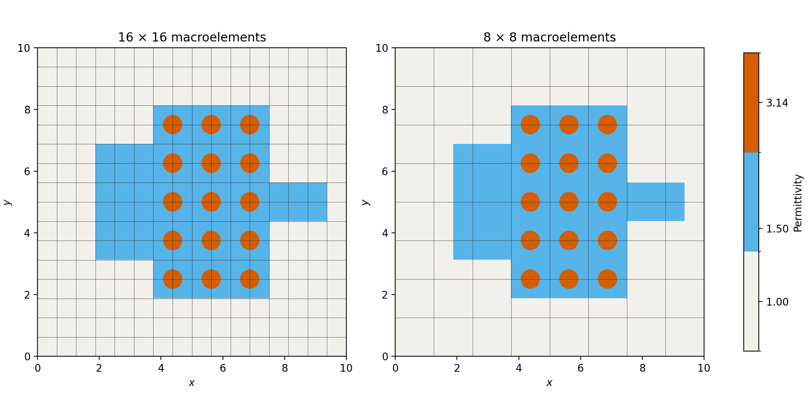
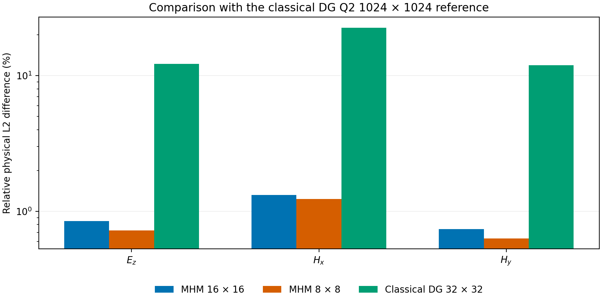
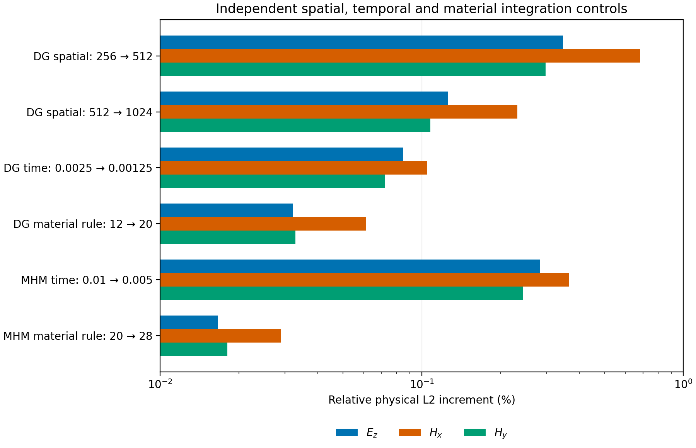
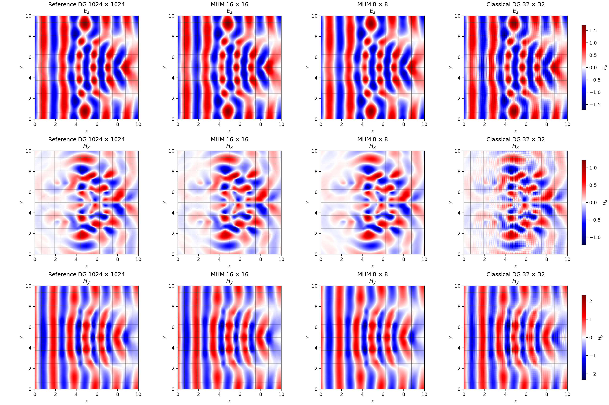
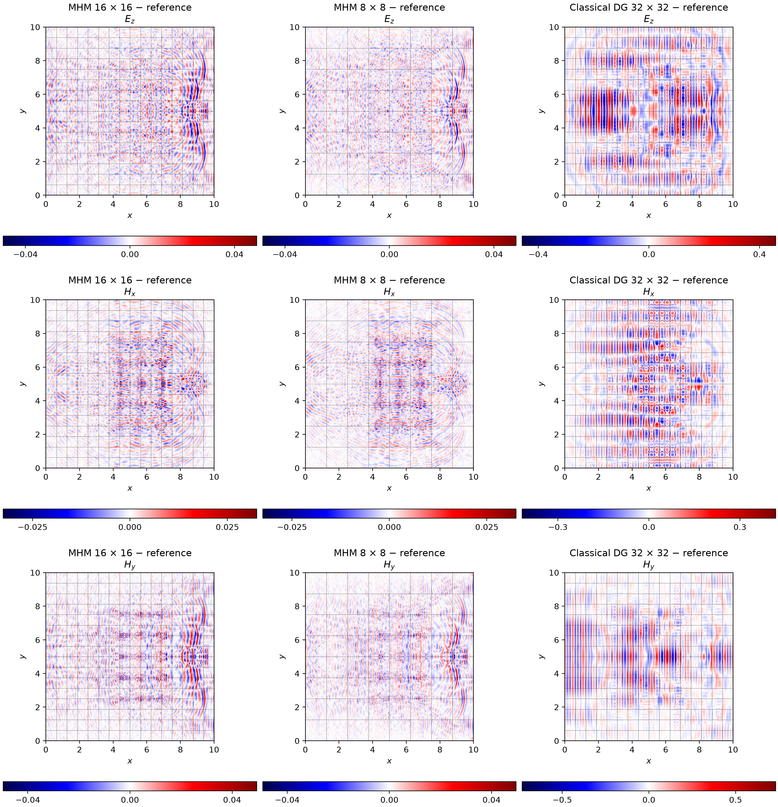
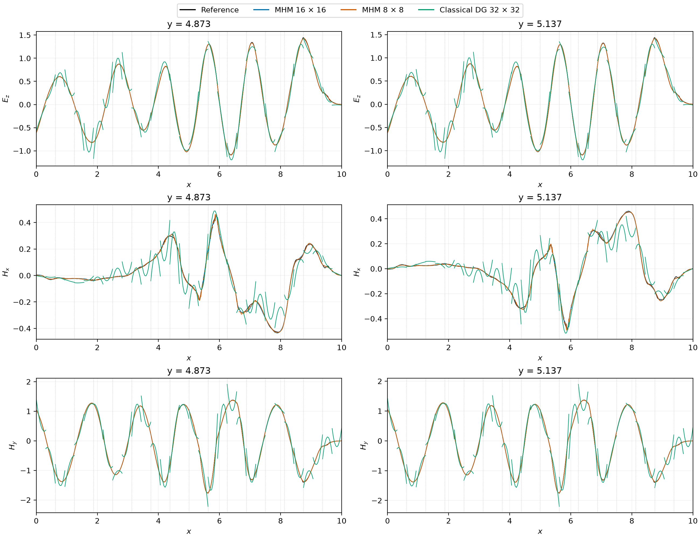

# Maxwell propagation through a photonic device

This case uses the geometry, materials and MHM spaces of Section 6.3 in
[Lanteri, Paredes, Scheid and Valentin (2018)](https://doi.org/10.1137/16M110037X).
The local method is central-flux DG Q2 on Cartesian quadrilaterals, coupled
through linear tangential traces. The field acquisition includes both coarse
meshes from the article and a separately refined classical DG calculation.

## Geometry, materials and incident wave

The domain is $[0,10]^2$. The silica device is the union of the rectangles
$[3.75,7.5]\times[1.875,8.125]$,
$[1.875,3.75]\times[3.125,6.875]$ and
$[7.5,9.375]\times[4.375,5.625]$.
Fifteen circular inclusions have radius $0.3125$ and centres in

$$
\begin{aligned}
x_c&\in\{4.375,5.625,6.875\},\\
y_c&\in\{2.5,3.75,5,6.25,7.5\}.
\end{aligned}
$$

Relative permittivity is 1 in air, 1.5 in silica and 3.14 in the inclusions;
magnetic permeability is 1. These values are used directly as permittivities,
without squaring them as refractive indices. Circular interfaces are sampled
by the declared cell quadrature; increasing the quadrature order supplies a
separate integration check. The Cartesian field spaces are unchanged.



The panels show the same pointwise material distribution. Only the overlaid
macro partition changes between the published $16\times16$ and $8\times8$
configurations; these are coefficient maps, not electric-field solutions.

The article specifies incident frequency $f=0.5$, absorbing exterior
conditions and final time $16/\sqrt2$. Phase, amplitude, initial fields and
turn-on are not specified sufficiently to reconstruct a unique transient.
This comparison declares a causal unit-amplitude wave travelling in the
positive $x$ direction:

$$
\begin{aligned}
s&=t-x,\\
E_i(t,x,y)&=\mathbf1_{s\geq0}\sin(\pi s),\\
H_i&=(0,-E_i),\\
E(0)&=H(0)=0,\\
E_z-(H\times n)&=(1-n_x)E_i\\
&\quad\text{on }\partial\Omega.
\end{aligned}
$$

The identical boundary and initial data are applied to every MHM and
classical calculation. These declared data permit a quantitative numerical
comparison; they do not establish that the historical incident transient
was identical.

## Approximation spaces and comparisons

| Method | Macro grid | Local fine grid per macro | Tangential trace | Global trace unknowns |
|---|---:|---:|---|---:|
| MHM, first published configuration | $16\times16$ | $8\times8$ Q2 DG | P1 on 8 segments per face | 8704 |
| MHM, second published configuration | $8\times8$ | $16\times16$ Q2 DG | P1 on 16 segments per face | 4608 |

Both configurations contain the same $128\times128$ fine quadrilateral
partition, with 147456 electric coefficients before condensation. Their
published macro step is $\Delta t=0.01$. Comparisons retain the staggered
times $t_E=11.315$ and $t_H=11.31$; they do not compare fields at different
time coordinates merely because each is the final stored snapshot.

The classical reference uses an original independent matrix-free central-DG
Q2 assembly. Fine-grid resolutions, quadrature orders and time steps are
varied separately. Its mass, derivative and boundary operators agree with
small independently assembled native systems; it does not invoke the MHM
local or global operators. Classical DG has no macro partition. Overlays
on its plots identify the MHM comparison grid.

Componentwise differences are integrated on the common partition of both
grids, using the actual discontinuous Q2 polynomials. Three Gauss points per
coordinate integrate their squared differences exactly. The combined norm is

$$
\begin{aligned}
\|e\|^2&=\|E_z-E_{z,\mathrm{ref}}\|_{L^2}^2\\
&\quad+\|H_x-H_{x,\mathrm{ref}}\|_{L^2}^2\\
&\quad+\|H_y-H_{y,\mathrm{ref}}\|_{L^2}^2.
\end{aligned}
$$

It is an unweighted physical field norm. A refined numerical solution is
not an exact solution. Its spatial, temporal and material-integration
increments determine how precisely it can assess MHM error.

The finest classical calculation has $1024\times1024$ Q2 cells,
9437184 electric coefficients and $\Delta t=0.00125$. The retained reference
measurements use float64 matrix-free time integration with CuPy on an NVIDIA
GeForce RTX 3060. The displayed fields use the same discretization and physical
times, acquired on an NVIDIA RTX A5000; their recomputed component norms agree
with every percentage in the table below. The field-display record identifies
this acquisition separately from the retained measurements.
At $256\times256$, the full CPU and GPU trajectories give a final combined
field difference of $2.95\times10^{-15}$; independent small-matrix checks
also cover mass inversion, derivatives and absorbing-boundary forcing.
This verifies the two classical implementations of the same discretization.

| Calculation | Relative $E_z$ difference (%) | Relative $H_x$ difference (%) | Relative $H_y$ difference (%) | Combined difference (%) |
|---|---:|---:|---:|---:|
| MHM $16\times16$, $\Delta t=0.01$ | 0.8478 | 1.3238 | 0.7385 | 0.8346 |
| MHM $8\times8$, $\Delta t=0.01$ | 0.7235 | 1.2309 | 0.6320 | 0.7241 |
| Classical DG $32\times32$, $\Delta t=0.01$ | 12.2021 | 22.6121 | 11.9173 | 13.0122 |

All denominators in this table use the finest classical field. Separate
controls quantify changes in space, time and material quadrature:

| Control | Fixed parameters | Combined relative increment (%) |
|---|---|---:|
| Classical $256\to512$ cells per coordinate | $\Delta t=0.0025$, 12-point material rule | 0.3558 |
| Classical $512\to1024$ cells per coordinate | $\Delta t=0.00125$, 12-point material rule | 0.1270 |
| Classical $\Delta t:0.0025\to0.00125$ | $512\times512$ cells, 12-point material rule | 0.0800 |
| Classical material rule $12\to20$ | $256\times256$ cells, $\Delta t=0.0025$ | 0.0352 |
| MHM $\Delta t:0.01\to0.005$ | $16\times16$ macros, published spatial spaces | 0.2704 |
| MHM material rule $20\to28$ | $16\times16$ macros, $\Delta t=0.01$ | 0.0184 |





The summary plots display the retained norm measurements at their declared
staggered times. Refinement increments compare two numerical calculations;
they are not errors against an exact solution.
Each increment uses the second configuration as its denominator, at the
same staggered physical times. The last spatial increment is about six
times smaller than the MHM differences, but remains measurable. These
increments are refinement evidence, not rigorous upper bounds on reference
error. The temporal control also shows that the published MHM time step
contributes to the total discrepancy. No time extrapolation or phase
alignment is applied.

The numerical records retain field digests, integration partitions and
componentwise norms:
[field comparisons](../figures/maxwell-nanoguide/comparison.json),
[refinement controls](../figures/maxwell-nanoguide/refinement-controls.json)
and [CPU/GPU equivalence](../figures/maxwell-nanoguide/dg-device-verification.json).

## Fields and one-sided profiles

The panels retain the signed electric and magnetic components. Every row
uses a shared field scale. The two MHM difference panels share a scale;
the coarse classical DG difference has a separately labelled, larger scale. These
images sample the actual cell polynomials at display pixels. The physical
norms above use quadrature, rather than those pixels.





The two horizontal sections avoid mesh vertices and preserve both incident
traces at fine-cell boundaries. Dotted lines mark the 16-by-16 macro
partition; alternate lines also bound the 8-by-8 partition. The coarse
classical DG solution has visible jumps and oscillations that are much
smaller in the two MHM solutions.



The [field-display record](../figures/maxwell-nanoguide/field-display.json)
identifies the complete coefficient arrays, executed operators, physical times
and recomputed component norms used by these maps and profiles. The tabulated
comparisons and refinement controls retain their original acquisition digests.

The publication uses the geometry and spaces declared here. Its unspecified
incident-wave phase and turn-on prevent an unqualified comparison of the
detailed phase and amplitude of the historical images.


```bash
pixi run --locked -e test-core python -m examples.maxwell_nanoguide --help
pixi run --locked -e notebooks python -m examples.maxwell_nanoguide_results --records-only
```

The record-only command regenerates the material and norm-summary figures
without rerunning either solver. Regenerating the field maps and profiles with
`--plot` additionally requires the complete Q2 coefficient archives named in
the comparison record. Those large field arrays are not bundled with the
package or notebook companion.

## References

- Stéphane Lanteri, Diego Paredes, Claire Scheid, and Frédéric Valentin (2018). *The Multiscale Hybrid-Mixed method for the Maxwell Equations in Heterogeneous Media*. Multiscale Modeling & Simulation 16(4) 1648-1683. [DOI: 10.1137/16M110037X](https://doi.org/10.1137/16M110037X).
