# Initial convergence studies

These studies use short refinement series for the implemented case families.
Each series states what changes: macro resolution, local resolution, trace
segments or time step. Other problem data and approximation choices remain
fixed within that series. The measured errors are reported separately for each
physical field; original algebraic row norms have their own normalization and
are not described as physical L2 residuals.

Analytical cases measure errors against their independently differentiated
manufactured solutions. Cases without an exact solution report either successive
increments or differences to a common finer numerical level, as declared in
each record and figure. These use the executed approximation bases. Field
norms shown alongside increments are distinct from errors. Their short refinement series
does not certify a resolved reference or replace a matched literature
reproduction.

The numerical catalogue and figures below are generated from accepted executed
records. They include source identities, integration rules, original-equation
checks and a conclusion for each series. A series whose error or increment does
not decrease retains that measured result and its limitation.

## Refinement notation

`n` is the resolution parameter of the explicitly identified macro mesh;
`r` refines the local mesh inside each macrocell; `s` divides each original
macroface into trace segments. The degree of a trace polynomial applies on each
segment. A fixed-local-mesh trace study is distinct from macro or local
convergence. Three coarse levels need not reach the asymptotic regime.

## Reproducibility

Use the checked-in Pixi lockfile. The scalar norm-only studies are acquired with
`examples/minimal_scalar_convergence.py`; the Darcy and wave studies use their
case-specific minimal drivers. Norm-only records do not contain replayable
coefficient vectors. Records that contain coefficients also identify their
executed numerical bases. Rendering consumes the completed records and does
not solve the PDE again. Regenerate figures from the public norm records with:

```bash
pixi run --locked -e notebooks python -m examples.plot_initial_convergence \
  --output build/initial-convergence-figures
```

The [overview notebook](https://github.com/ipes-lncc/pymhm/blob/main/notebooks/convergence/73_initial_convergence.ipynb)
checks the catalogue identities and displays representative completed series.

## Remaining scientific limits

The original HPC4e matched reproduction remains pending. SPE10 Brinkman has
one accepted conforming resolution; its next level exceeded the stated memory
budget, so no reference convergence or MHM agreement is claimed. Their
[geometry, spaces and acquisition limits](https://github.com/ipes-lncc/pymhm/blob/main/examples/results/minimal-convergence/flow-elasticity/limitations.json)
are recorded separately. Mixed-well refinement has two accepted levels.

The SPE10 Darcy-flux increments and the periodic H1 controls are not resolved.
The Oseen internal-layer divergence error increases across the initial meshes.
The nanoguide study uses the independent DG method; Three layers provides a
temporal control on a fixed spatial mesh; Marmousi uses the explicitly stated
crop. These observations retain their narrower method and geometry provenance.

Complete historical table reproductions, fully refined references, broad
parameter and performance sweeps, and notebooks requiring those absent fields
remain separate work. The five detailed comparisons in the
[case index](index.md) retain their own verification scope.

## Numerical catalogue

| Study | Refinement | Observed conclusion |
| --- | --- | --- |
| [Robin hybrid method](#scalar-mh) | Macro n=2,4,8; fixed local and trace choices per series | All reported field errors decrease on these three levels. |
| [MH2M analytical pressure](#scalar-mh2m) | Macro n=2,4,8; fixed local and trace choices per series | All reported field errors decrease on these three levels. |
| [Tensor RT family, face degree 1](#scalar-tensor-rt-k1) | Macro n=2,4,8; fixed local and trace choices per series | All reported field errors decrease on these three levels. |
| [Tensor RT family, face degree 2](#scalar-tensor-rt-k2) | Macro n=2,4,8; fixed local and trace choices per series | All reported field errors decrease on these three levels. |
| [Tensor RT family, face degree 3](#scalar-tensor-rt-k3) | Macro n=2,4,8; fixed local and trace choices per series | All reported field errors decrease on these three levels. |
| [Polygonal advection–diffusion](#scalar-polygons) | Macro n=2,4,8; fixed local and trace choices per series | All reported field errors decrease on these three levels. |
| [RAD analytical boundary layer](#scalar-rad-layer) | Macro n=2,4,8; fixed local and trace choices per series | All reported field errors decrease on these three levels. |
| [SUPG analytical transport layer](#scalar-transport-layer) | Macro n=2,4,8; fixed local and trace choices per series | All reported field errors decrease on these three levels. |
| [Unfitted Darcy trace refinement](#darcy-unfitted) | Fixed 16 macro triangles, local P8/r4; trace P1 with s=1,2,4 | Pressure and Darcy-flux errors decrease across three trace partitions. |
| [PGMHM enriched pressure and Darcy flux](#darcy-pgmhm) | P3 locals/P1 traces; alpha=0.1; macro n=2,4,8 | Three initial smooth-problem resolutions have decreasing enriched field errors. |
| [UNUSUAL reaction-diffusion](#darcy-unusual) | P1 locals/P0 traces; local r=2; macro n=2,4,8 | Separate scalar and diffusion-flux errors decrease on three smooth-problem meshes. |
| [SPE10 Model 2, layer 36](#darcy-spe10) | Fixed 6x11 macros and continuous P1/s2 trace; Q1 local r=4,8,16 | Pressure increments decrease; relative Darcy-flux increments exceed unity and increase. |
| [Quarter obstacle classical reference refinement](#darcy-quarter-obstacle) | Existing conforming NeoPZ RT0/P0 levels r=4,8,16,32 | Three successive physical pressure and Darcy-flux increments decrease on four classical meshes. |
| [Mixed Darcy well, two accepted levels](#darcy-mixedwell) | Fixed octagonal annulus and macro factor 1; tetrahedral H(div)/P1, F=1,2 | Two accepted resolutions have completed pressure and Darcy-flux norms; F4 did not close within its resource limit. |
| [Helmholtz plane wave](#wave-helmholtz) | Spatial n=8,12,16; Q 4/r 2, face P 2 | Exact pressure errors 5.306e-3 to 3.291e-4 and gradient errors 0.5076 to 0.06821. |
| [Equation (53) analytical elastic wave](#wave-elastic-wave) | Spatial n=1,2,3; vector P 3/r 2, face P 1; dt=0.005, final time 0.025 s | Separate displacement, velocity and stress errors decrease over all three initial levels. |
| [Maxwell nanoguide: independent DG study](#wave-nanoguide) | DG Q 2 n=16,32,64; complete device; H time 5.0, E time 5.0025 | Electric increments decrease 1.485 to 0.2692 and magnetic increments 1.998 to 0.2964 against n 64. |
| [Three layers: conforming temporal study](#wave-three-layer) | Fixed continuous vector P 3, h=8 m; dt=0.004/0.002/0.001 s, final time 0.3 s | Displacement increments decrease 5.490e-8 to 1.101e-8 and velocity increments 5.695e-6 to 1.155e-6. |
| [Marmousi: explicit 160x 80 m crop pilot](#wave-marmousi) | Macro H=80/40/20 m; Q 3/P 1; fixed 2.5 m fine mesh on primary SI data | Pressure increments decrease 9795 to 959.7 against the H 20 numerical comparison level. |
| [Random-coefficient transport: initial temporal increments](#transport-random-temporal) | Fixed 2048 triangles and CGP3; dt=0.001, 0.0005, 0.00025; T=0.005 | Concentration L2 and gradient increments decrease when the time step is halved. |
| [Periodic coefficient: Q1 increments and MHM local sensitivity](#periodic-local-reference) | Q1 n=256..4096; fixed macro8x8/P0 MHM local r128/256, s=1..32 | Q1 increments decrease; full H1 and MHM local increments still show unresolved field accuracy. |
| [Analytical Stokes, Brinkman and Oseen in 3D](#flow3d) | Macro n=1,2,3; Stokes TH P2/r2, Brinkman USFEM P1/r4 and P2/r2, Oseen P2/r2; triangular P1 skeleton | Separate velocity, pressure and velocity gradient errors decrease in all four fixed formulation series. |
| [Nearly incompressible GaLS elasticity in 3D](#gals3d) | Macro n=1,2,3; GaLS P1/r4 and P2/r2, Taylor-Hood P2/r2; lambda=1e8 and variable shear | Displacement, Herrmann pressure, stress and displacement gradient errors decrease in all three fixed-space series. |
| [Weak-symmetry anisotropic elasticity in 2D](#initial-elasticity2d) | Macro n=1,2,4; triangles/polygons BDM2/P1/P1, rectangles RT1/Q1/total-P1; r1; quadrature 8/9/10 | Separate displacement, Cauchy stress, weak rotation and stress divergence errors decrease across all three families. |
| [Anisotropic primal elasticity in 3D](#primal-elasticity3d) | Macro n=1,2,3; selected primal P3/r1 finite space; analytical Kelvin stiffness (1+x+2y+3z)*SPD | Displacement errors decrease 1.0870 to 0.1244 and raw symmetric stress errors 102.23 to 26.98. |
| [AFW weak-symmetry mixed elasticity in 3D](#mixed-elasticity3d) | Macro n=1,2,3; selected BDM3/P2/P2, local r1, triangular P2 negative-traction skeleton; incompressible lambda infinity | Displacement, physical Cauchy stress, axial weak rotation and stress divergence errors decrease over all three initial levels. |
| [Analytical stabilized Stokes in 2D](#stokes2d) | Macro n=2,4,8; selected USFEM P3/r1 with piecewise P1 pseudo-traction skeleton | Velocity, pressure, velocity gradient errors and divergence decrease over the three initial levels. |
| [Analytical Oseen with P1 skeleton in 2D](#oseen2d-trace) | Macro n=2,4,8; selected stabilized P3/r1, trace P1, smooth data and viscosity 1 | Velocity, pressure, velocity gradient errors and divergence decrease over the three initial levels. |
| [Analytical Oseen viscosity variants in 2D](#oseen2d-viscosity) | Macro n=2,4,8; stabilized P3/r1 with trace P1; selected viscosities 1 and 0.01 | Velocity, pressure, velocity gradient errors and divergence decrease for both selected viscosities. |
| [Oseen boundary, internal-layer and variable-advection data in 2D](#oseen2d-data) | Macro n=2,4,8; stabilized P3/r1, trace P1; boundary-layer viscosity 0.01, internal-layer viscosity 0.001, variable-advection viscosity 1 | Velocity, pressure and velocity gradient errors decrease in all three series; internal-layer divergence increases from 0.1926 to 0.2822. |
| [Oscillatory mixed elasticity in 2D](#elasticity-l18-oscillatory) | Fixed macro H=1/4 and 32 triangular macrocells; face segments s=1,2,4, local r=2s; BDM2/P1/P1, trace P1, enrichment 0 | Displacement, Cauchy stress, weak rotation and stress divergence errors decrease for the original oscillatory geometry and data. |

<a id="scalar-mh"></a>

### Robin hybrid method

All reported field errors decrease on these three levels.

Initial observations on explicitly constructed meshes; three levels do not establish asymptotic rates, uniform stability or a matched historical reproduction. Raw gradients and H(div) Darcy fluxes retain their distinct conventions.

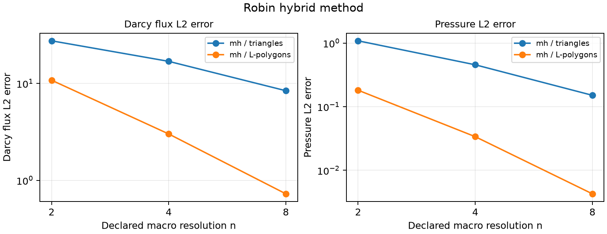

[Numerical record](https://github.com/ipes-lncc/pymhm/blob/main/examples/results/minimal-convergence/scalar-mh/study.json)


<a id="scalar-mh2m"></a>

### MH2M analytical pressure

All reported field errors decrease on these three levels.

Initial observations on explicitly constructed meshes; three levels do not establish asymptotic rates, uniform stability or a matched historical reproduction. Raw gradients and H(div) Darcy fluxes retain their distinct conventions.

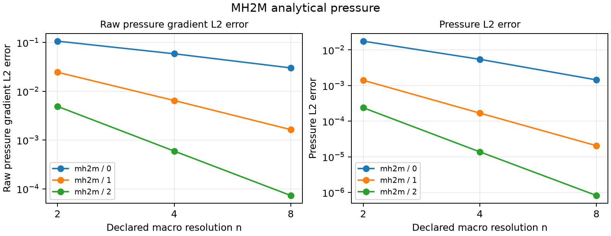

[Numerical record](https://github.com/ipes-lncc/pymhm/blob/main/examples/results/minimal-convergence/scalar-mh2m/study.json)


<a id="scalar-tensor-rt-k1"></a>

### Tensor RT family, face degree 1

All reported field errors decrease on these three levels.

Initial observations on explicitly constructed meshes; three levels do not establish asymptotic rates, uniform stability or a matched historical reproduction. Raw gradients and H(div) Darcy fluxes retain their distinct conventions.

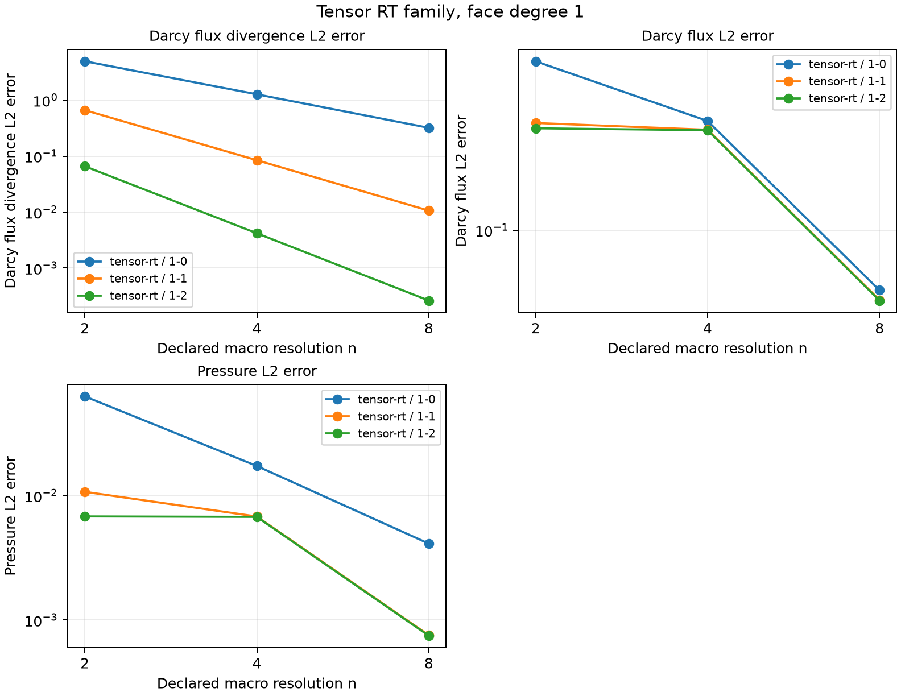

[Numerical record](https://github.com/ipes-lncc/pymhm/blob/main/examples/results/minimal-convergence/scalar-tensor-rt-k1/study.json)


<a id="scalar-tensor-rt-k2"></a>

### Tensor RT family, face degree 2

All reported field errors decrease on these three levels.

Initial observations on explicitly constructed meshes; three levels do not establish asymptotic rates, uniform stability or a matched historical reproduction. Raw gradients and H(div) Darcy fluxes retain their distinct conventions.

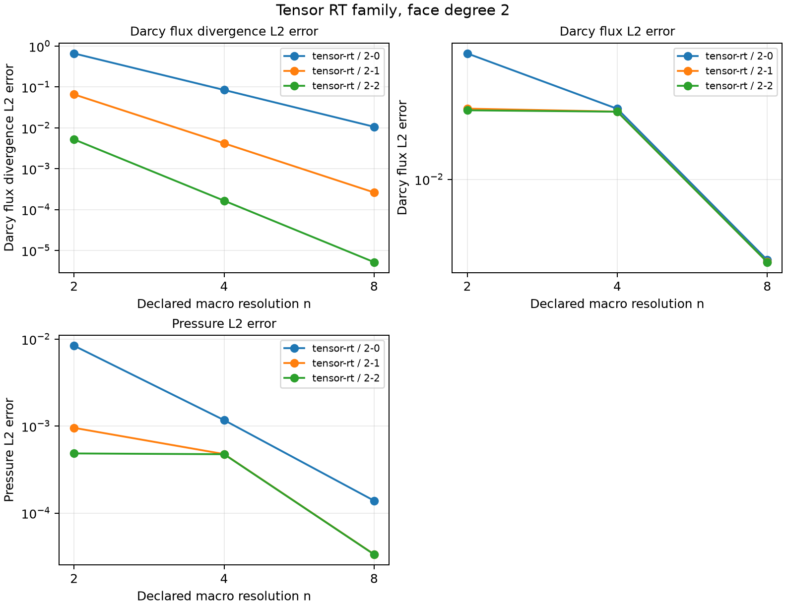

[Numerical record](https://github.com/ipes-lncc/pymhm/blob/main/examples/results/minimal-convergence/scalar-tensor-rt-k2/study.json)


<a id="scalar-tensor-rt-k3"></a>

### Tensor RT family, face degree 3

All reported field errors decrease on these three levels.

Initial observations on explicitly constructed meshes; three levels do not establish asymptotic rates, uniform stability or a matched historical reproduction. Raw gradients and H(div) Darcy fluxes retain their distinct conventions.

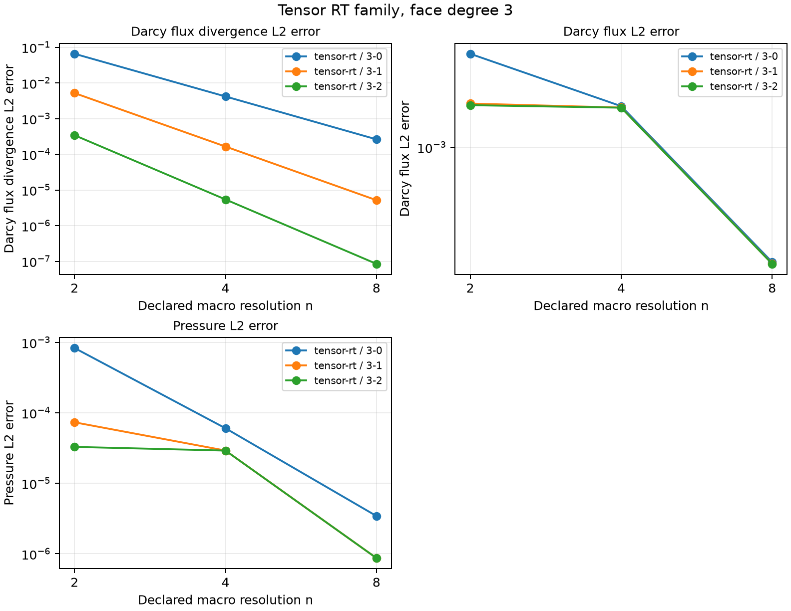

[Numerical record](https://github.com/ipes-lncc/pymhm/blob/main/examples/results/minimal-convergence/scalar-tensor-rt-k3/study.json)


<a id="scalar-polygons"></a>

### Polygonal advection–diffusion

All reported field errors decrease on these three levels.

Initial observations on explicitly constructed meshes; three levels do not establish asymptotic rates, uniform stability or a matched historical reproduction. Raw gradients and H(div) Darcy fluxes retain their distinct conventions.

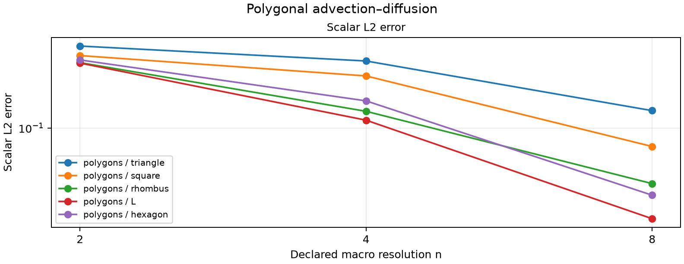

[Numerical record](https://github.com/ipes-lncc/pymhm/blob/main/examples/results/minimal-convergence/scalar-polygons/study.json)


<a id="scalar-rad-layer"></a>

### RAD analytical boundary layer

All reported field errors decrease on these three levels.

Initial observations on explicitly constructed meshes; three levels do not establish asymptotic rates, uniform stability or a matched historical reproduction. Raw gradients and H(div) Darcy fluxes retain their distinct conventions.

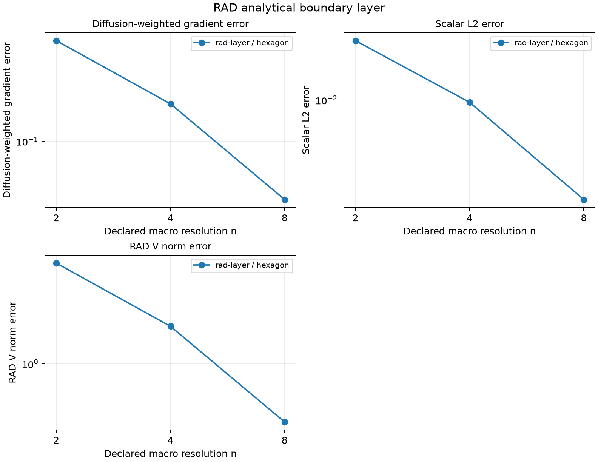

[Numerical record](https://github.com/ipes-lncc/pymhm/blob/main/examples/results/minimal-convergence/scalar-rad-layer/study.json)


<a id="scalar-transport-layer"></a>

### SUPG analytical transport layer

All reported field errors decrease on these three levels.

Initial observations on explicitly constructed meshes; three levels do not establish asymptotic rates, uniform stability or a matched historical reproduction. Raw gradients and H(div) Darcy fluxes retain their distinct conventions.

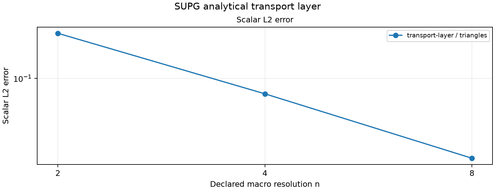

[Numerical record](https://github.com/ipes-lncc/pymhm/blob/main/examples/results/minimal-convergence/scalar-transport-layer/study.json)


<a id="darcy-unfitted"></a>

### Unfitted Darcy trace refinement

Pressure and Darcy-flux errors decrease across three trace partitions.

Trace refinement with fixed local discretization; macro convergence and the complete literature study are not asserted.

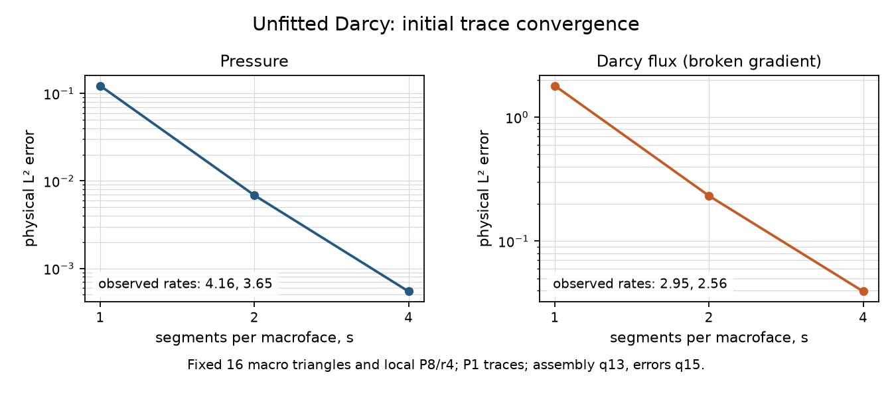

[Numerical record](https://github.com/ipes-lncc/pymhm/blob/main/examples/results/minimal-convergence/darcy-unfitted/study.json)


<a id="darcy-pgmhm"></a>

### PGMHM enriched pressure and Darcy flux

Three initial smooth-problem resolutions have decreasing enriched field errors.

Raw broken gradient flux; only the enriched normal multiplier is macro conservative. This declared triangular smooth problem does not reproduce a historical polygonal computation.

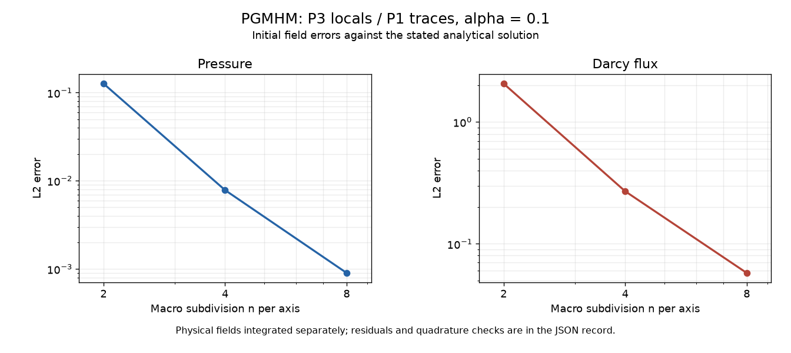

[Numerical record](https://github.com/ipes-lncc/pymhm/blob/main/examples/results/minimal-convergence/darcy-pgmhm/study.json)


<a id="darcy-unusual"></a>

### UNUSUAL reaction-diffusion

Separate scalar and diffusion-flux errors decrease on three smooth-problem meshes.

Epsilon=1 analytical control with stated strong Dirichlet and zero Neumann data; no singular-perturbation rate is inferred.

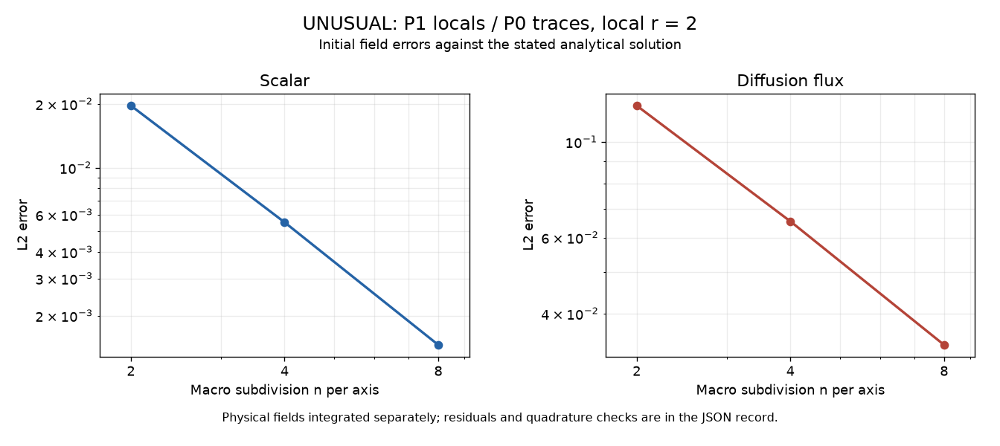

[Numerical record](https://github.com/ipes-lncc/pymhm/blob/main/examples/results/minimal-convergence/darcy-unusual/study.json)


<a id="darcy-spe10"></a>

### SPE10 Model 2, layer 36

Pressure increments decrease; relative Darcy-flux increments exceed unity and increase.

The three local resolutions do not establish flux convergence or a converged numerical reference. The r2 local/trace pairing is excluded by a rank-8 coupling with 12 trace columns. No exact solution or same-operator converged conforming reference is supplied.

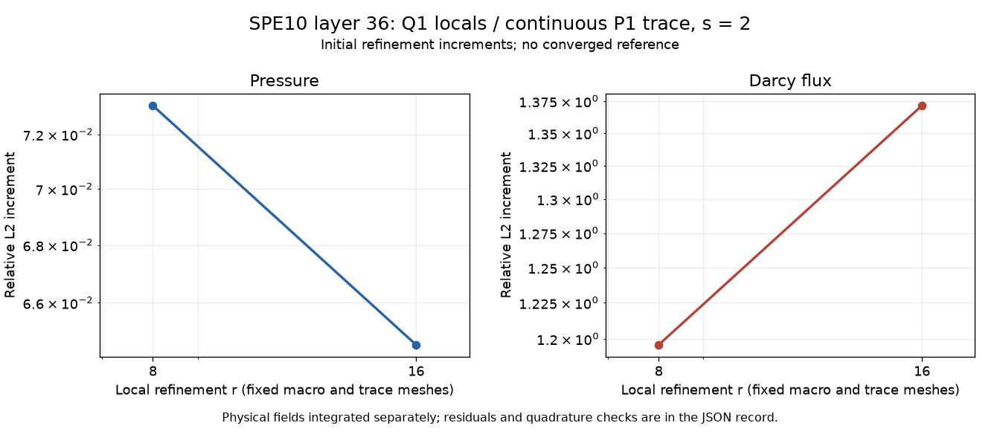

[Numerical record](https://github.com/ipes-lncc/pymhm/blob/main/examples/results/minimal-convergence/darcy-spe10/study.json)


<a id="darcy-quarter-obstacle"></a>

### Quarter obstacle classical reference refinement

Three successive physical pressure and Darcy-flux increments decrease on four classical meshes.

A fine numerical reference retains nonzero refinement error; it is not an exact or certified converged solution. Original native revision, basis and provenance are retained; the historical article reproduction is not asserted.

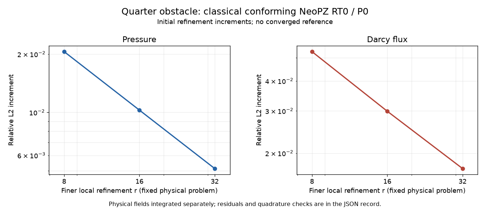

[Numerical record](https://github.com/ipes-lncc/pymhm/blob/main/examples/results/minimal-convergence/darcy-quarter-obstacle/study.json)


<a id="darcy-mixedwell"></a>

### Mixed Darcy well, two accepted levels

Two accepted resolutions have completed pressure and Darcy-flux norms; F4 did not close within its resource limit.

Only two of three requested levels are accepted; no three-level convergence rate is asserted. Fixed polygonal geometry, measured physical fine-cell diameters; this is not the historical curved mesh. The initial joint phase and the separate F4 phase each stopped at the 60-second bound.

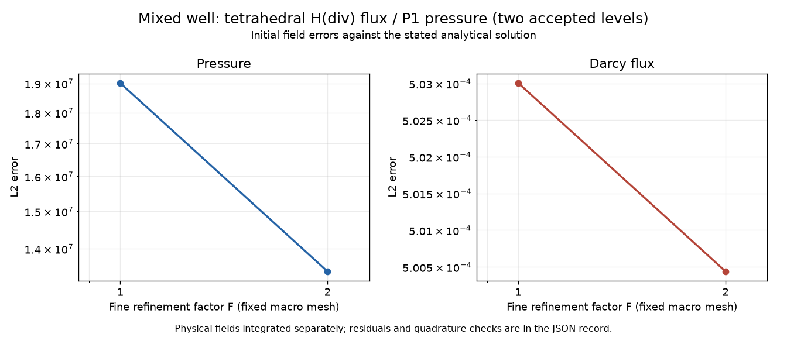

[Numerical record](https://github.com/ipes-lncc/pymhm/blob/main/examples/results/minimal-convergence/darcy-mixedwell/study.json)


<a id="wave-helmholtz"></a>

### Helmholtz plane wave

Exact pressure errors 5.306e-3 to 3.291e-4 and gradient errors 0.5076 to 0.06821.

Three initial levels do not establish asymptotic rates or the full angular/stability studies Cartesian local Q4 spaces are the declared analytical variant; every published mesh has not been identified

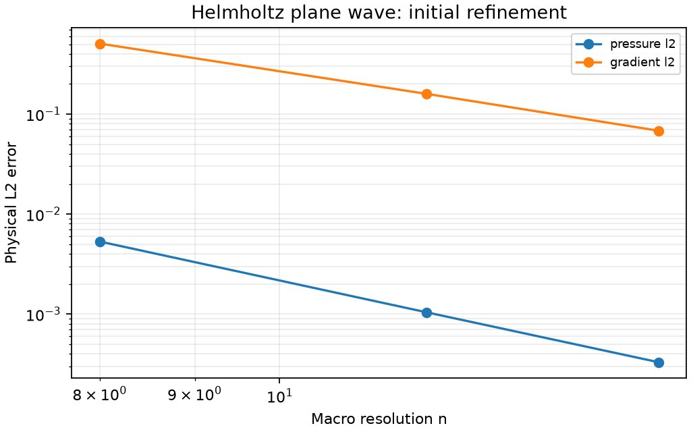

[Numerical record](https://github.com/ipes-lncc/pymhm/blob/main/examples/results/minimal-convergence/wave-helmholtz/study.json)


<a id="wave-elastic-wave"></a>

### Equation (53) analytical elastic wave

Separate displacement, velocity and stress errors decrease over all three initial levels.

Five time steps give an initial spatial study; the original .5s horizon and asymptotic rates remain outside this acquisition Temporal error is included in each analytical field error

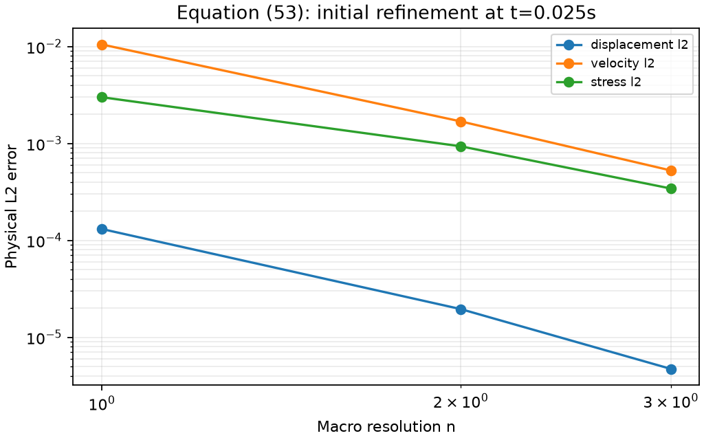

[Numerical record](https://github.com/ipes-lncc/pymhm/blob/main/examples/results/minimal-convergence/wave-elastic-wave/study.json)


<a id="wave-nanoguide"></a>

### Maxwell nanoguide: independent DG study

Electric increments decrease 1.485 to 0.2692 and magnetic increments 1.998 to 0.2964 against n 64.

n64 is a numerical comparison level, not an exact or resolved reference The shortened horizon includes the beginning of device interaction; the full11.31 observation remains outside this study Historical source phase/turn-on conventions remain unidentified No MHM/native whole-trajectory agreement is claimed by this DG-only study

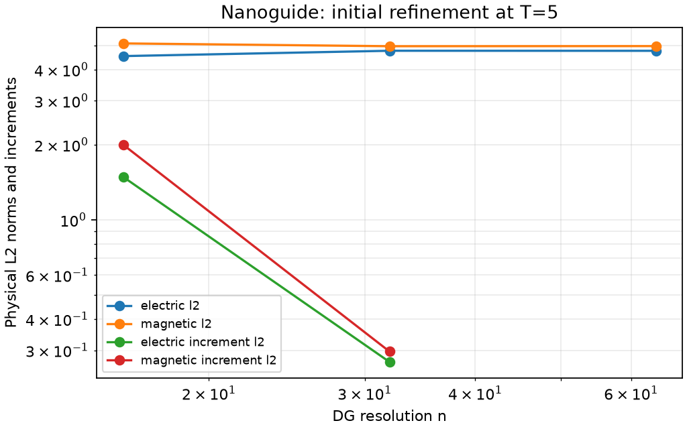

[Numerical record](https://github.com/ipes-lncc/pymhm/blob/main/examples/results/minimal-convergence/wave-nanoguide/study.json)


<a id="wave-three-layer"></a>

### Three layers: conforming temporal study

Displacement increments decrease 5.490e-8 to 1.101e-8 and velocity increments 5.695e-6 to 1.155e-6.

Spatial refinement of h8 is unresolved; temporal increments do not certify spatial accuracy dt.001 is a numerical comparison level, not an exact temporal solution This conforming temporal study does not replace a complete MHM/refined-reference physical comparison Selected mesh, horizons and Ormsby data do not identify the historical author's inputs

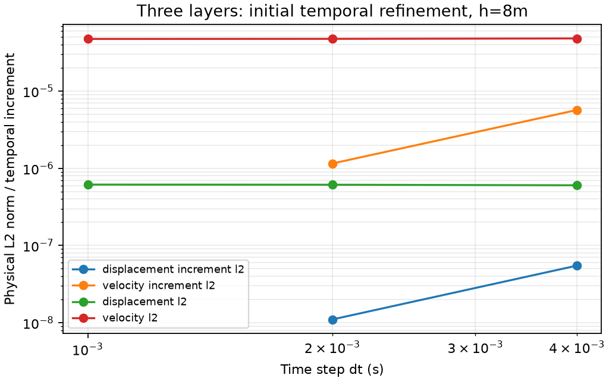

[Numerical record](https://github.com/ipes-lncc/pymhm/blob/main/examples/results/minimal-convergence/wave-three-layer/study.json)


<a id="wave-marmousi"></a>

### Marmousi: explicit 160x 80 m crop pilot

Pressure increments decrease 9795 to 959.7 against the H 20 numerical comparison level.

The crop changes lateral/bottom boundary locations; the full selected paper domain remains outside this pilot Fine spacing is fixed at2.5m; the study measures macro trace restriction and does not establish continuum spatial convergence The finest MHM field is a numerical comparison level; it is not an exact or resolved reference Primary SEG data are identified; the historical article arrays remain unidentified

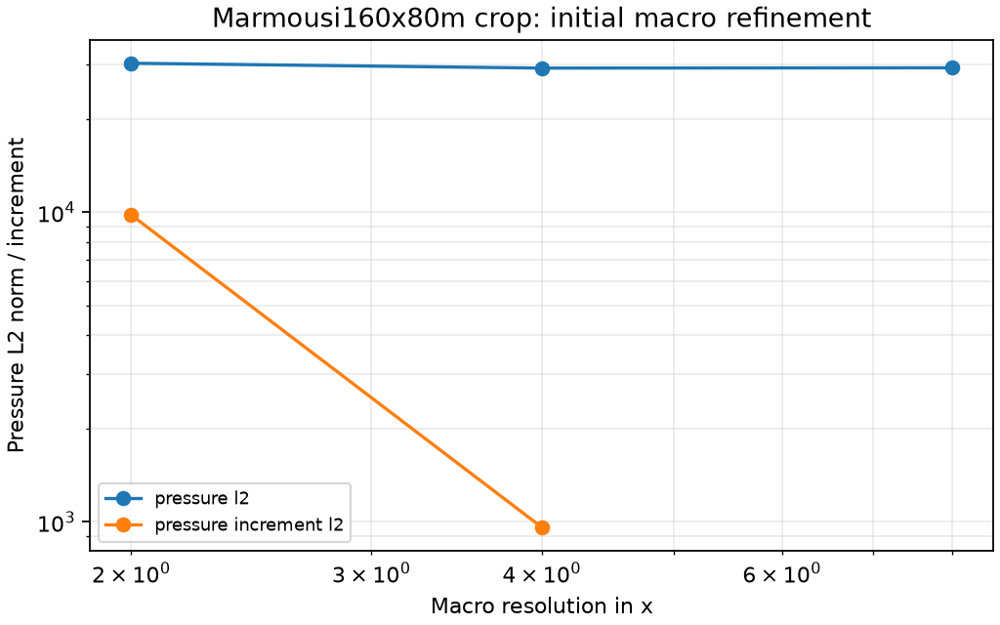

[Numerical record](https://github.com/ipes-lncc/pymhm/blob/main/examples/results/minimal-convergence/wave-marmousi/study.json)


<a id="transport-random-temporal"></a>

### Random-coefficient transport: initial temporal increments

Concentration L2 and gradient increments decrease when the time step is halved.

Three time steps give two own temporal increments at T=0.005 on one 2048-triangle mesh. Spatial reference accuracy and the complete T=7 trajectory remain unresolved. The unstabilized CGP3 field has negative nodal concentrations; no positivity clipping is applied. These increments are neither exact errors nor certified continuum bounds or transferred smooth-problem rates.

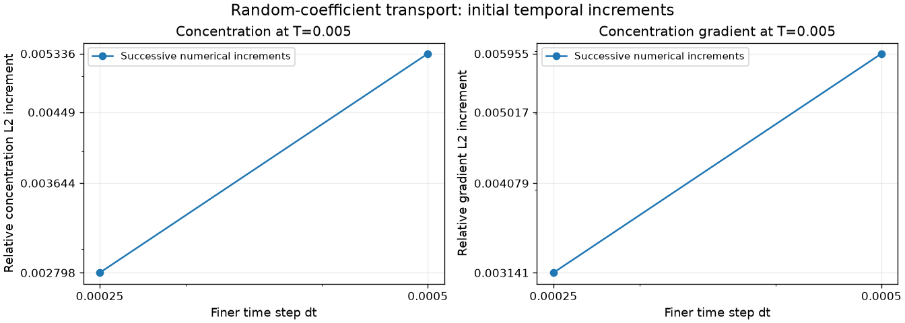

[Numerical record](https://github.com/ipes-lncc/pymhm/blob/main/examples/results/minimal-convergence/transport-random-temporal/study.json)


<a id="periodic-local-reference"></a>

### Periodic coefficient: Q1 increments and MHM local sensitivity

Q1 increments decrease; full H1 and MHM local increments still show unresolved field accuracy.

The Q1 finest-pair relative increments are approximately 0.99 percent in L2 and 9.77 percent in full H1. Five numerical Q1 controls do not certify a resolved continuum reference or exact solution. Fixed macro8x8/P0-trace MHM r128-to-r256 increments remain about 3.6-3.7 percent in L2 and 19 percent in full broken H1. The MHM panels show local-resolution sensitivity across fixed trace partitions, not trace convergence or macro-mesh rates. Earlier r32/r64 diagnostic increments retain their own acquisition IDs and qualifications; producer generations are not retagged.

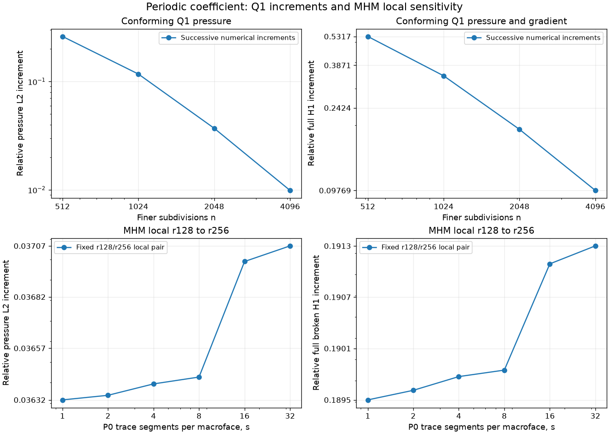

[Numerical record](https://github.com/ipes-lncc/pymhm/blob/main/examples/results/minimal-convergence/periodic-local-reference/study.json)


<a id="flow3d"></a>

### Analytical Stokes, Brinkman and Oseen in 3D

Separate velocity, pressure and velocity gradient errors decrease in all four fixed formulation series.

Three initial levels do not establish asymptotic rates or uniform stability. The analytical unit-cube series is separate from a matched historical reproduction and independent native whole-case agreement.

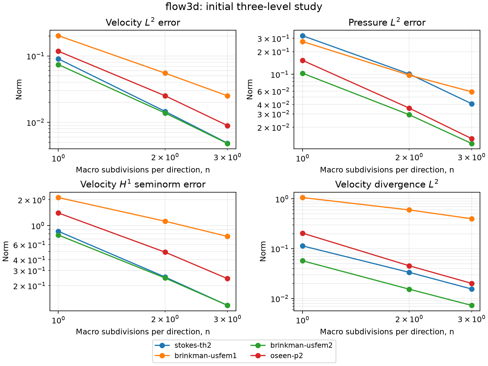

[Numerical record](https://github.com/ipes-lncc/pymhm/blob/main/examples/results/minimal-convergence/flow3d/study.json)


<a id="gals3d"></a>

### Nearly incompressible GaLS elasticity in 3D

Displacement, Herrmann pressure, stress and displacement gradient errors decrease in all three fixed-space series.

The three levels use one fixed nearly incompressible material; a locking sweep and uniform stability proof are outside this study. No matched historical table or independent native whole-case agreement is claimed.

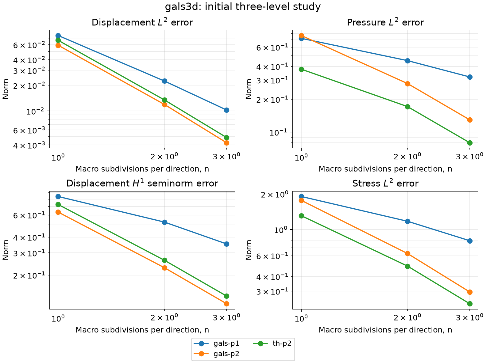

[Numerical record](https://github.com/ipes-lncc/pymhm/blob/main/examples/results/minimal-convergence/gals3d/study.json)


<a id="initial-elasticity2d"></a>

### Weak-symmetry anisotropic elasticity in 2D

Separate displacement, Cauchy stress, weak rotation and stress divergence errors decrease across all three families.

Three initial levels do not establish every literature rate or uniform stability; triangular rotation has a measured last-step order of 1.319. Analytical anisotropic data are identified separately from historical paper data and independent native whole-case agreement.

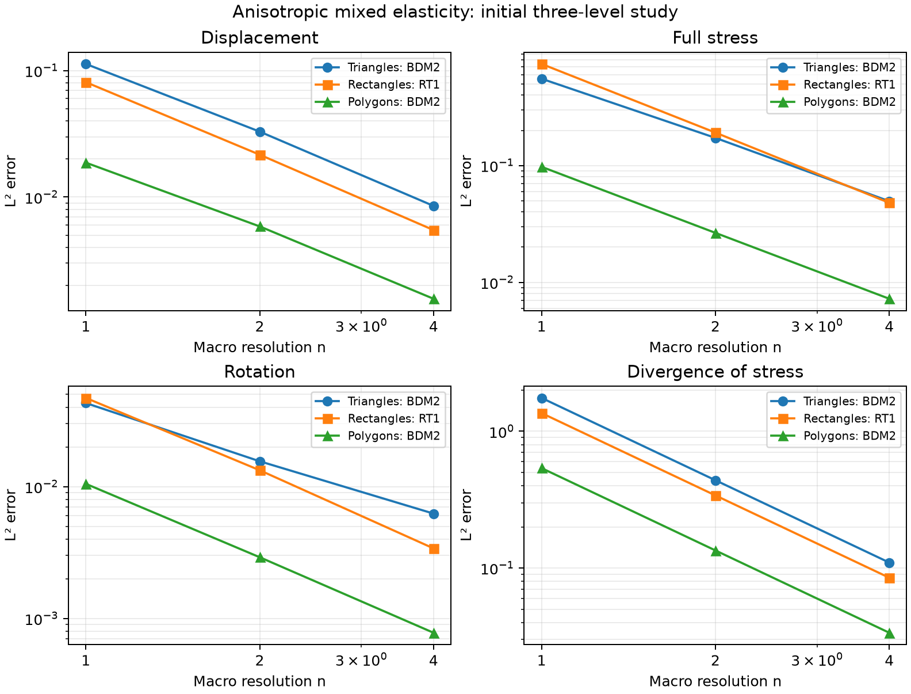

[Numerical record](https://github.com/ipes-lncc/pymhm/blob/main/examples/results/minimal-convergence/initial-elasticity2d/study.json)


<a id="primal-elasticity3d"></a>

### Anisotropic primal elasticity in 3D

Displacement errors decrease 1.0870 to 0.1244 and raw symmetric stress errors 102.23 to 26.98.

This minimum series selects P3/r1; the P2/r2 family and extensive sweeps remain outside this acquisition. Raw symmetric stress and retained six rigid modes do not constitute an H(div) stress reconstruction or an independent native whole-case comparison.

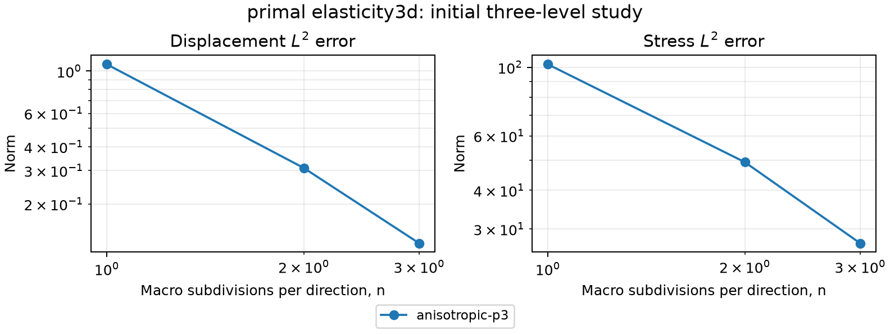

[Numerical record](https://github.com/ipes-lncc/pymhm/blob/main/examples/results/minimal-convergence/primal-elasticity3d/study.json)


<a id="mixed-elasticity3d"></a>

### AFW weak-symmetry mixed elasticity in 3D

Displacement, physical Cauchy stress, axial weak rotation and stress divergence errors decrease over all three initial levels.

The selected BDM3/P2/P2 series is an initial analytical AFW study; the BDM2/r2 family, locking sweep and complete historical tables remain outside this acquisition. Physical hydrostatic gauge and separate original blocks are checked; uniform stability and independent native whole-case agreement are not claimed.

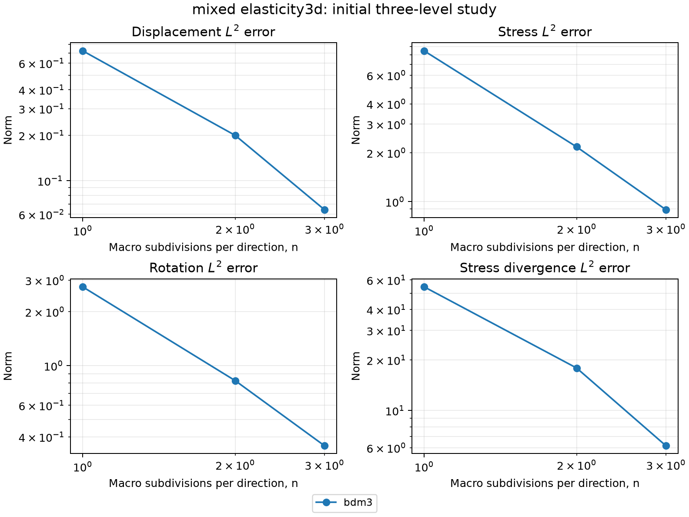

[Numerical record](https://github.com/ipes-lncc/pymhm/blob/main/examples/results/minimal-convergence/mixed-elasticity3d/study.json)


<a id="stokes2d"></a>

### Analytical stabilized Stokes in 2D

Velocity, pressure, velocity gradient errors and divergence decrease over the three initial levels.

This initial series selects trace P1; the P0/P2 trace variants remain outside this acquisition. Physical pressure mean and original field blocks are verified; no uniform stability proof, matched historical table or independent native whole-case agreement is claimed.

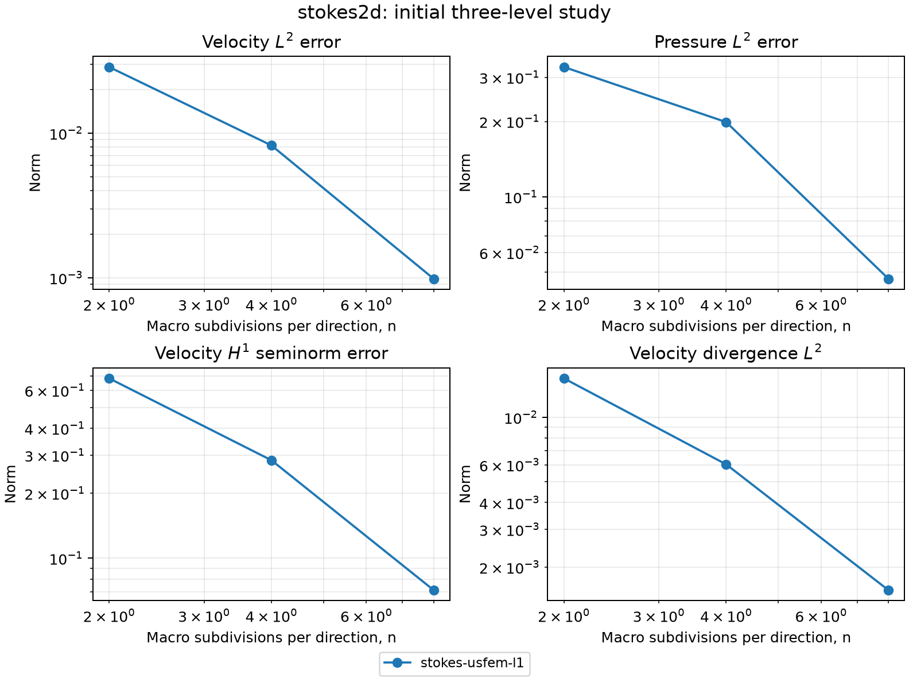

[Numerical record](https://github.com/ipes-lncc/pymhm/blob/main/examples/results/minimal-convergence/stokes2d/study.json)


<a id="oseen2d-trace"></a>

### Analytical Oseen with P1 skeleton in 2D

Velocity, pressure, velocity gradient errors and divergence decrease over the three initial levels.

This initial series selects trace P1; the P0/P2 trace variants remain outside this acquisition. Pseudo-traction and physical zero-mean pressure conventions are retained; no uniform stability or complete historical trace sweep is claimed.

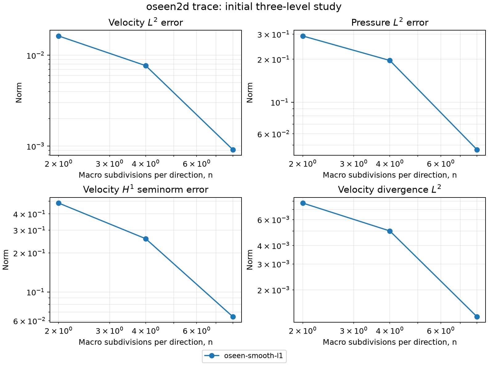

[Numerical record](https://github.com/ipes-lncc/pymhm/blob/main/examples/results/minimal-convergence/oseen2d-trace/study.json)


<a id="oseen2d-viscosity"></a>

### Analytical Oseen viscosity variants in 2D

Velocity, pressure, velocity gradient errors and divergence decrease for both selected viscosities.

The viscosity 1 acquisition UUIDs are reused from the trace-P1 study; these are the same executions, without retagging. The viscosity 0.0001 variant and extensive trace sweeps remain outside this initial acquisition; no uniform stability or matched full historical table is claimed.

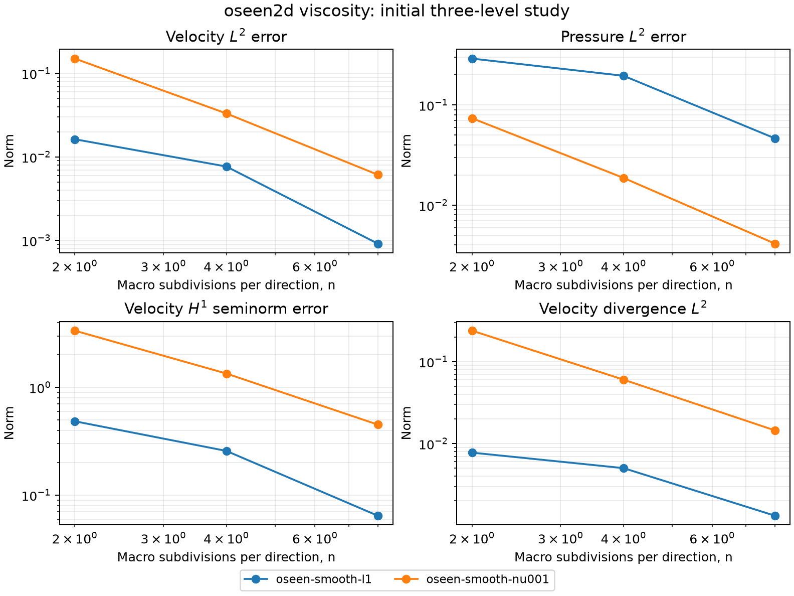

[Numerical record](https://github.com/ipes-lncc/pymhm/blob/main/examples/results/minimal-convergence/oseen2d-viscosity/study.json)


<a id="oseen2d-data"></a>

### Oseen boundary, internal-layer and variable-advection data in 2D

Velocity, pressure and velocity gradient errors decrease in all three series; internal-layer divergence increases from 0.1926 to 0.2822.

The internal-layer divergence does not converge on these three initial levels, despite accepted original discrete equation blocks. Sharp-layer velocity gradient errors remain large at the finest acquired level; smooth-problem rates and uniform stability are not inferred for these data. The selected trace-P1 analytical series does not reproduce all historical variants or establish independent native whole-case agreement.

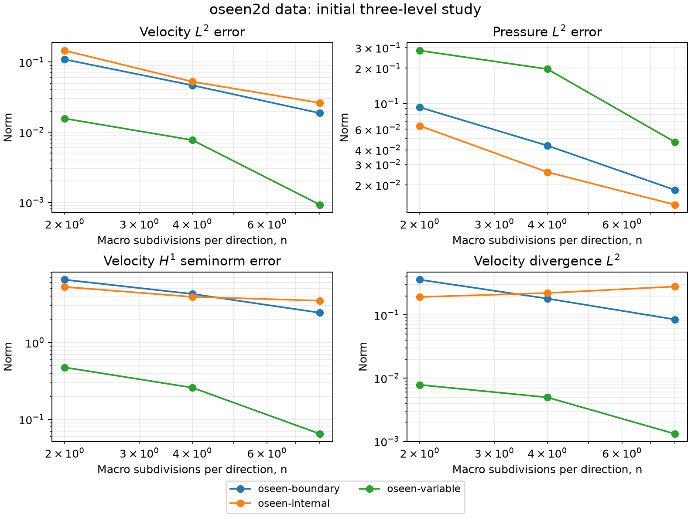

[Numerical record](https://github.com/ipes-lncc/pymhm/blob/main/examples/results/minimal-convergence/oseen2d-data/study.json)


<a id="elasticity-l18-oscillatory"></a>

### Oscillatory mixed elasticity in 2D

The coefficient and data follow [Devloo et al. (2021)](https://doi.org/10.1051/m2an/2021013).

Displacement, Cauchy stress, weak rotation and stress divergence errors decrease for the original oscillatory geometry and data.

The historical rotation column remains unreconciled; this selected BDM2 finite-space series is identified separately from a matched complete table reproduction. Three initial levels with assembly order 16 and norm orders 16/20 do not establish every asymptotic rate or uniform stability. Stress orders and rotation-enrichment sweeps, independent native whole-case comparison and coefficient field replay remain outside this scalar-record study.

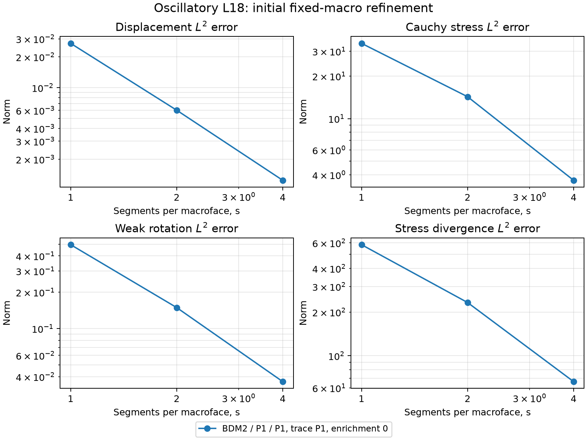

[Numerical record](https://github.com/ipes-lncc/pymhm/blob/main/examples/results/minimal-convergence/elasticity-l18-oscillatory/study.json)

## References

- Philippe R. B. Devloo, Agnaldo M. Farias, Sônia M. Gomes, Weslley Pereira, Antonio J. B. dos Santos, and Frédéric Valentin (2021). *New H(div)-conforming multiscale hybrid-mixed methods for the elasticity problem on polygonal meshes*, ESAIM: M2AN 55, 1005–1037. [DOI: 10.1051/m2an/2021013](https://doi.org/10.1051/m2an/2021013).
