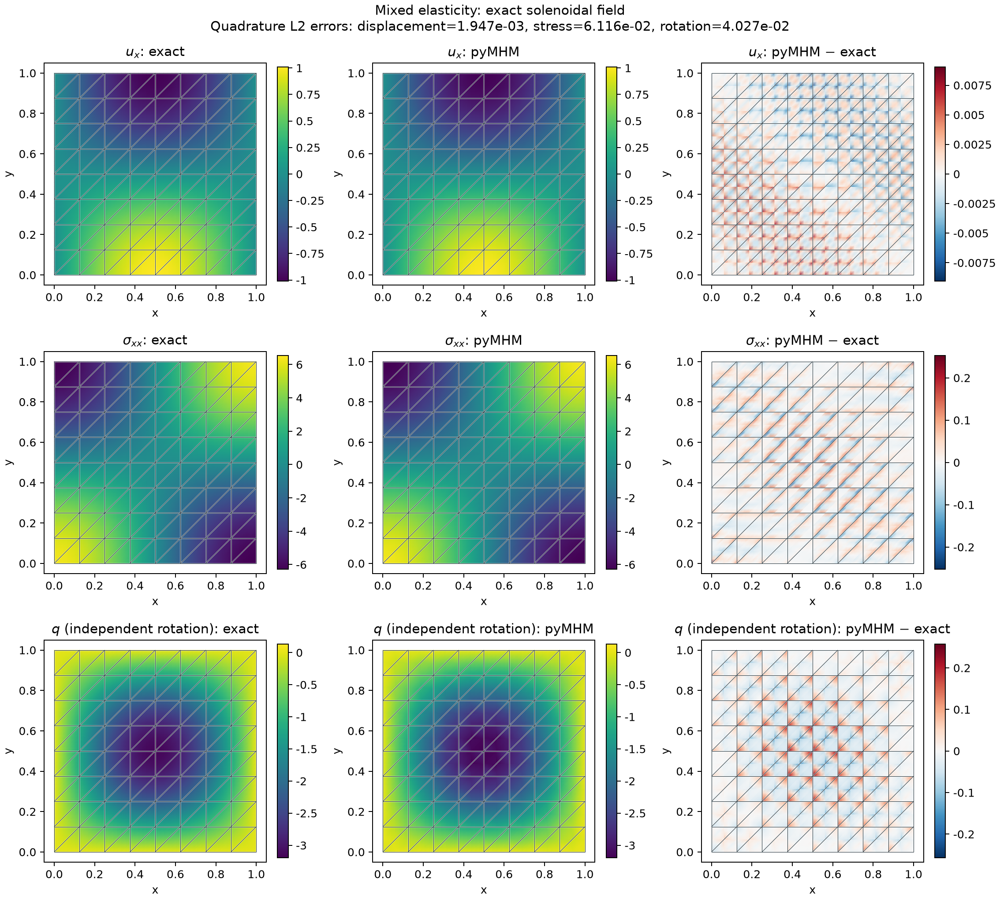
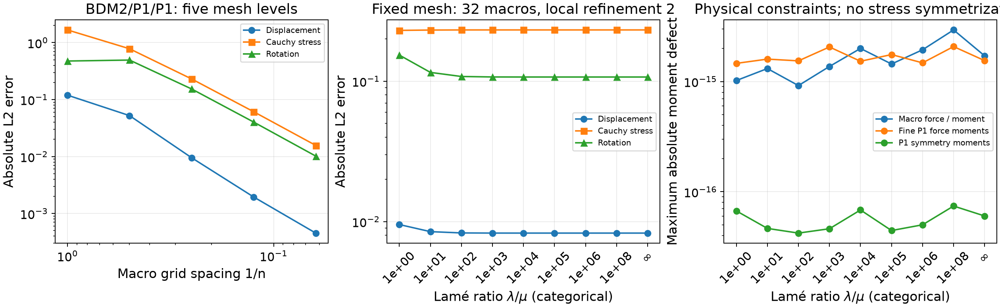
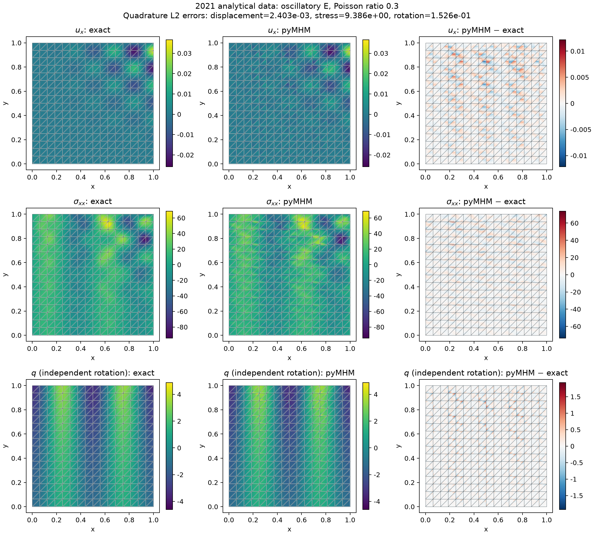

# H(div) stress and weak-symmetry elasticity

`solve_elasticity_mixed` solves plane-strain elasticity with a conforming normal
stress, discontinuous displacement, and an independent rotation multiplier.
Its default local spaces are BDM2 for each stress row, vector P1 for displacement, and
scalar P1 for rotation. These are the BDM2/P1/P1 spaces in Table 1 of the
[Devloo et al. (2021)](https://doi.org/10.1051/m2an/2021013).
The three rigid motions belong exactly to the local displacement space.
[Additional BDM and enriched families](mixed-families.md) retain these conventions
while independently varying fine-edge normal and interior polynomial degrees.

The default macroface traction is P1 on interior faces. On the exterior, P2
tractions are independent on each fine boundary edge. This preserves the local
BDM2 boundary space. Users can supply aligned face partitions and degrees up to
two; arbitrary alternatives still require the discrete stability checks.

## Formulation and conventions

The physical equations and compliance are

$$
-\operatorname{div}\sigma=f,\qquad
\sigma=2\mu\varepsilon(u)+\lambda\operatorname{div}(u)I,
$$

$$
\mathcal A\tau=
\frac{\operatorname{dev}\tau}{2\mu}
+\frac{\operatorname{tr}\tau}{4(\mu+\lambda)}I.
$$

This deviatoric/spherical form avoids subtracting almost equal terms when
\(\lambda/\mu\) is large. Both Lamé coefficients can be functions of physical
coordinates. Shear requires finite \(\mu>0\); \(\lambda\geq0\) also
accepts the exact incompressible limit `np.inf`, where the spherical compliance
vanishes. For a fully prescribed displacement boundary the finite-modulus
identity

$$
\int_\Omega\frac{\operatorname{tr}\sigma}{2(\mu+\lambda)}
=\int_{\partial\Omega}g\cdot n
$$

fixes the hydrostatic mode. At infinite lambda, `mean_pressure` instead sets
the global mean of \(-\operatorname{tr}\sigma/2\); boundary volume flux must
vanish. Traction data determine the hydrostatic stress without this gauge.

With \(\operatorname{asym}\tau=\tau_{12}-\tau_{21}\), the local weak constitutive
relation is

$$
(\mathcal A\sigma,\tau)+(u,\operatorname{div}\tau)
+(q,\operatorname{asym}\tau)=\langle u,\tau n\rangle.
$$

The independent rotation approximates
\(q=(\partial_yu_x-\partial_xu_y)/2\). It is not computed by differentiating the
discontinuous displacement. Stress symmetry is imposed through every local P1
moment of \(\operatorname{asym}\sigma\); pointwise skew stress is retained.
The skeletal multiplier represents **negative Cauchy traction**,
\(\Lambda=-\sigma n\).

The implementation uses three constrained local rigid modes. Their displacement
parts are two translations and a rotation, and the rotation multiplier of the
rigid displacement \((-y,x)\) is \(-1\). Constraints are physical displacement
moments, with no independent rotation gauge.

## A non-affine exact patch

The example helpers below are repository sources, supplied separately from the
installed library. Open the corresponding notebook to acquire its verified
companion, as described in the [notebook guide](../tutorials/notebooks.md#execute-downloaded-notebooks).

```python
import numpy as np
from pymhm import TriangleMesh
from examples.formulations.application import weak_stress_elasticity as solve_elasticity_mixed

def displacement(x):
    return np.column_stack((x[:, 0] ** 2, -2 * x[:, 0] * x[:, 1]))

solution = solve_elasticity_mixed(
    TriangleMesh.unit_square(2),
    lame_mu=1.0,
    lame_lambda=1e6,
    source=(-2.0, 0.0),
    dirichlet=displacement,
)
```

Here \(\operatorname{div}u=0\), and the exact fields are

$$
\sigma=\begin{pmatrix}4x&-2y\\-2y&-4x\end{pmatrix},
\qquad f=(-2,0),\qquad q=y.
$$

The discrete stress and rotation contain these exact fields. Displacement is
the cellwise P1 L2 projection of the quadratic field. On eight macrotriangles
with local refinement two, its error is \(6.58808\times10^{-3}\) for
\(\lambda/\mu=1,10^3,10^6\). The coefficient comparison verifies this P1
projection, including its nonzero displacement approximation error.

`traction={face: value}` prescribes **physical outward** \(\sigma n\). Other
boundary faces prescribe displacement. A pure-traction solve checks force and
moment compatibility and imposes three integrated displacement moments through
`rigid_moments`. A rigid rotation is included in that gauge; merely fixing mean
translation would leave the solution nonunique.

## Smooth fields and five mesh levels

The analytical displacement is

$$
u=(\sin(\pi x)\cos(\pi y),-\cos(\pi x)\sin(\pi y)),
\qquad f=2\pi^2u,
$$

with \(\mu=1\). This solenoidal solution is independent of \(\lambda\).
The maps below use 128 macrotriangles, four fine triangles per macrotriangle,
and \(\lambda=1\). Every panel shows the actual macro boundaries. Exact and
numerical panels share scales; the third column shows signed differences.



| Grid resolution n | Macrotriangles | Displacement L2 | Full stress L2 | Rotation L2 |
|---:|---:|---:|---:|---:|
| 1 | 2 | 1.19467e-1 | 1.67050 | 4.75127e-1 |
| 2 | 8 | 5.22406e-2 | 7.80112e-1 | 4.94022e-1 |
| 4 | 32 | 9.51962e-3 | 2.30284e-1 | 1.53556e-1 |
| 8 | 128 | 1.94669e-3 | 6.11585e-2 | 4.02710e-2 |
| 16 | 512 | 4.52345e-4 | 1.56854e-2 | 1.01778e-2 |

The last mesh doubling gives displacement/stress/rotation rates of approximately
2.11/1.96/1.98. Rotation error increases between the first two meshes;
the asymptotic trend is established by the subsequent levels.

The material sweep includes nine cases through \(\lambda/\mu=10^8\) and
the exact incompressible limit; the last two panels use categorical abscissae.



At fixed resolution \(n=4\), increasing \(\lambda/\mu\) from 1 to \(10^6\)
changes displacement error from 0.00951962 to 0.00827563 and stress error from
0.230284 to 0.231981. The latter ratio corresponds to
\(\nu=0.4999995000005\). The errors remain bounded while force, moment, and weak
symmetry defects remain close to floating-point accuracy.

Section 5, Remark (iv), of the paper states independence of the estimates from
Poisson ratio under its stability and regularity assumptions. The experiment
checks that behavior for this family and these data. It does not establish
robustness for arbitrary material contrast, meshes, or trace choices. At much
larger Lamé ratios, roundoff in the weakly controlled mean hydrostatic stress
can grow when nonzero boundary-volume terms nearly cancel. The physical finite-modulus
identity divides that boundary quadrature uncertainty by the bulk compliance;
this is distinct from discretization locking. A separate fixed-load polynomial
bubble with homogeneous boundary data checks \(\lambda/\mu=10^{12}\) against
the exactly incompressible solve, including stress and displacement coefficients.

## Oscillatory Young modulus from the 2021 article

The analytical data from Section 6.1 are

$$
E=100[1+0.3\sin(10\pi(x-0.5))\cos(10\pi y)],\qquad\nu=0.3,
$$

$$
u_1=\frac{x^2y^2}{27}\cos(6\pi x)\sin(7\pi y),
\qquad u_2=\frac{e^y}{5}\sin(4\pi x).
$$

The denominator of the first component is 27. The boundary displacement is the
trace of this formula, including its nonzero values. The body force includes
spatial derivatives of both Lamé coefficients. The example independently
checks \(f=-\operatorname{div}\sigma\) by complex-step differentiation of the
analytical stress before solving.



The [spatial-map record](../figures/mixed-elasticity/fields-replay.json) identifies
both executed cases. Integrated displacement, stress and rotation errors agree
with the retained smooth and oscillatory configurations within
$7\times10^{-14}$ relatively.

On 512 diagonal macrotriangles with local refinement two, the measured errors
are displacement 0.00240292, stress 9.38593, rotation 0.152634, and stress
divergence 66.3344 in L2. The maximum fine P1 force-moment defect is
\(1.85\times10^{-14}\). This distinguishes exact discrete equilibrium from
pointwise approximation of a rapidly varying body force. The displayed stress
retains its full tensor, including the pointwise skew part allowed by weak
symmetry.

This is an analytical-case verification using published data on our stated
mesh. It is **not a reproduction of Table 3's ordinates or a NeoPZ execution**.
A separate aligned-layer regression checks a modulus contrast of 100, and an
affine patch checks simultaneous spatial variation of \(\lambda\) and \(\mu\).

## Independent assembly and reproduction

The oscillatory problem above is independently assembled with **DOLFINx 0.9.0,
UFL 2024.2.0 and Basix 0.9.0**, using PETSc/MUMPS. The comparison preserves the
Young modulus, Poisson ratio, exact nonzero displacement trace, fine triangles,
local stress/displacement/rotation spaces and segmented macro traction space.
UFL differentiates the Cauchy stress to obtain the body force independently.
Native cell permutations are accounted for so both assemblies integrate at the
same physical Duffy points.

A monolithic conforming stress operator is restricted by independently assembled
Basix normal moments to the declared MHM traction subspace. Interior macrofaces
retain P1 traction in the BDM2/P1/P1 comparison; exterior fine edges retain P2.
The restricted system represents these same MHM approximation spaces. DOLFINx
assembles the conforming operator; the comparison application supplies the
macroface restriction and solves the complete saddle system. No PyMHM local
matrix or condensed operator enters that solve, and no built-in DOLFINx MHM
controller is assumed.

The physical differences on the three gallery meshes are:

| Resolution n | Macrotriangles | Relative stress L2 | Relative displacement L2 | Relative rotation L2 |
|---:|---:|---:|---:|---:|
| 4 | 32 | 6.901e-14 | 1.029e-13 | 7.544e-14 |
| 8 | 128 | 1.362e-13 | 3.248e-13 | 2.075e-13 |
| 16 | 512 | 5.914e-13 | 4.613e-13 | 8.113e-13 |

Norms integrate the full stress tensor and independent displacement and rotation
fields over every fine triangle, using orders 10 and 12. Each denominator is the
corresponding native field norm. These small differences establish agreement of
the matched discrete operators; the analytical errors reported above quantify
discretization accuracy.

The independently assembled reference is **MHM via trace restriction**:
monolithic DOLFINx/UFL assembly and a separately assembled restriction of normal
tractions on macrofaces. The comparison also supplies the enriched stress
coordinates. The table retains integrated displacement, stress and rotation
differences; reconstructing their comparison maps requires the separate original
coefficient archives. The analytical and PyMHM field maps above use the stated
smooth and oscillatory physical problems.

The [enriched-family comparison](mixed-families.md#oscillatory-coefficients-from-the-2021-paper)
also verifies all four nominal Table 3 branches against this independent assembly.
Historical connectivity/mesh-size conventions and inconsistent printed rotation
entries remain unresolved. The evidence therefore establishes the published
physical problem in the explicitly stated spaces, alongside its convergence
study; it does not identify these ordinates as a literal reproduction of Table 3.

The [complete numerical record](../figures/mixed-elasticity/native-discrete-verification.json)
contains 19 accepted same-case comparisons, source and archive digests,
quadrature checks and native build provenance. The verified upstream source is
[DOLFINx v0.9.0](https://github.com/FEniCS/dolfinx/tree/6443e3b27d29aec04ce83d8424b57c339e35f865).
Separate native integration tests additionally check polynomial patches, BDM
normal-moment orientation and the three-dimensional local rigid kernel.

Run the package's analytical gallery with:

```console
pixi run --locked -e notebooks python -m examples.plot_mixed_elasticity
```

[Numerical records](https://github.com/ipes-lncc/pymhm/blob/main/examples/results/mixed-elasticity.json)
contain the errors and defects. Plot fields are sampled independently within
each fine triangle, preserving broken one-sided values. P2 stress is sampled on
nine display subtriangles; reported norms use separate order-10 quadrature,
not the display interpolation.

## References

- Philippe R. B. Devloo, Agnaldo M. Farias, Sônia M. Gomes, Weslley Pereira, Antonio J. B. dos Santos, and Frédéric Valentin (2021). *New H(div)-conforming multiscale hybrid-mixed methods for the elasticity problem on polygonal meshes*, ESAIM: M2AN 55, 1005–1037. [DOI: 10.1051/m2an/2021013](https://doi.org/10.1051/m2an/2021013).
