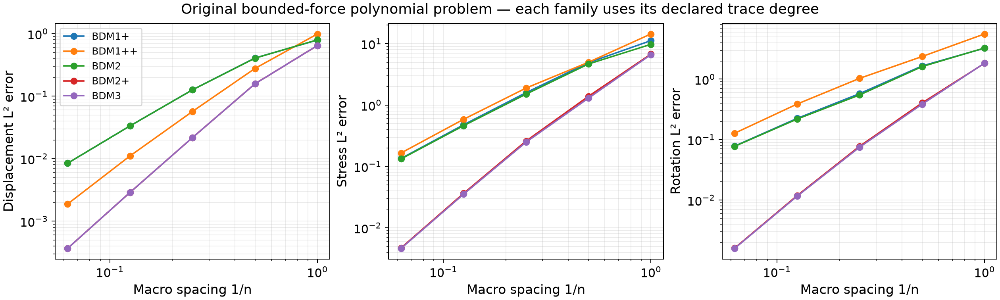
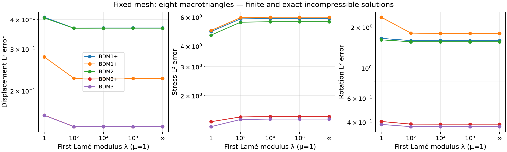
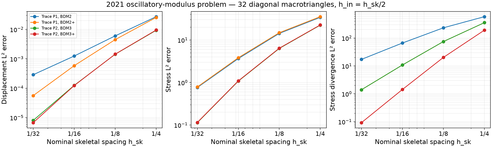

# Enriched mixed elasticity families

`solve_elasticity_mixed` supports the triangular BDM, BDM-plus and
BDM-double-plus families in Table 1 of the [weak-symmetry MHM paper (2021)](
https://doi.org/10.1051/m2an/2021013). The parameters distinguish the normal
polynomial degree on each fine edge from the degree of its interior bubbles:

| Parameters | Local stress row | Displacement and independent rotation |
|---|---|---|
| `stress_degree=k, enrichment=0` | BDM\(_k\) | \(P_{k-1}^2\) and \(P_{k-1}\) |
| `stress_degree=k, enrichment=1` | BDM\(_k\) plus all zero-normal \(P_{k+1}^2\) bubbles | \(P_k^2\) and \(P_k\) |
| `stress_degree=k, enrichment=2` | BDM\(_k\) plus all zero-normal \(P_{k+2}^2\) bubbles | \(P_{k+1}^2\) and \(P_{k+1}\) |

The normal degree remains \(k\) when interiors are enriched. The implementation
constructs the complete moment-dual BDM\(_{k+n}\) basis and retains its
normal moments through degree \(k\) and **all** interior moments. This preserves
the zero-normal polynomial subspace and
\(\operatorname{div}\Sigma_h=P_{k+n-1}^2\).
Piola transformations and the parity of oriented Legendre moments preserve
normal continuity across local fine faces.

The MHM local displacement space must contain the three rigid motions.
Consequently \(k+n\geq2\) is required: unenriched BDM1/P0/P0 is not an
admissible local choice in this implementation. Stability of a global AFW pair
alone does not establish this local MHM requirement. The default BDM2/P1/P1
solution and its coefficient conventions are preserved.

```python
from pymhm import TriangleMesh
from pymhm._legacy.models.elasticity.stress import solve_elasticity_mixed

solution = solve_elasticity_mixed(
    TriangleMesh.unit_square(2),
    stress_degree=2,
    enrichment=1,
    quadrature_order=6,
    source=(1.0, 0.0),
)
```

The default interior macro traction is P1; exterior tractions retain the full
fine-edge degree \(k\). An explicit skeleton can enrich interior macro tractions
independently, up to \(k\), with aligned segments. The theoretical construction
in section 6.1.2 uses macro degree \(k_{sk}\), local normal degree
\(k_{in}=k_{sk}+1\), and optional additional interior bubbles. Thus the local
normal degree is not the macroface degree.

The [mixed-elasticity conventions](https://github.com/ipes-lncc/pymhm/blob/main/docs/cases/mixed-elasticity.md) apply to every family:
negative Cauchy traction, independent weak rotation, three physical rigid-motion
constraints, heterogeneous Lamé callbacks, the finite-modulus hydrostatic
identity, and the exact infinite-lambda gauge. The stress remains a full tensor;
no pointwise symmetrization changes the computed field.

## Independent verification

CI checks physical normal-moment duality on sheared triangles, elimination of
higher normal modes, the full divergence range, and agreement with the original
BDM2 basis. Affine displacement and stress are reproduced by all families in the
suite. A quadratic solenoidal displacement with affine Cauchy stress is exact
for BDM1-double-plus, BDM2-plus and BDM3 at finite, large and infinite lambda.
Pure traction checks retain the prescribed rigid moments and force/moment
balance. Fine force moments and weak-symmetry moments are reported separately.

Four native integration tests assemble the complete compliance, divergence,
rotation and load operator independently in DOLFINx/UFL. Physical basis evaluation
determines the change of coordinates from Basix to the moment bases. The tests
include variable Lamé coefficients and distinguish the enriched local spaces
by restricting only the appropriate higher normal modes.

The bases accept arbitrary positive integer degree and nonnegative enrichment;
current normal-moment checks cover complete degrees through four, and the native
mixed-operator checks cover BDM1-plus, BDM1-double-plus, BDM2-plus and BDM3.
Higher requested degrees still encounter the numerical conditioning and rank
checks of the discrete system. These checks are not a uniform high-degree
stability theorem.

## Five-level manufactured convergence and locking studies

`examples/solve_elasticity_families.py` uses the bounded-force polynomial family
in `examples/elasticity_data.py`. Each of five families is solved on grids with
\(n=1,2,4,8,16\), one fine triangle per macrotriangle. The macro trace is
\(P_{\min(k,k+n_{enrichment}-1)}\), while exterior traces have degree \(k\).
The records state these degrees; comparing families therefore compares their
complete declared spaces, rather than isolating just one source of enrichment.

A separate fixed-mesh sweep uses
\(\lambda=1,10^2,10^4,10^8,\infty\), with \(\mu=1\), eight macrotriangles
and nonzero limiting pressure. The exact displacement, pressure, stress and load
remain consistent and bounded through the incompressible limit. The finite
errors quantify approximation on this deliberately small fixed space; the
sweep is evidence against locking in these cases, not a proof for every
heterogeneous contrast or arbitrary skeletal space.






```bash
pixi run --locked -e test-core python examples/solve_elasticity_families.py --degree 2 --enrichment 1
pixi run -e notebooks python examples/plot_elasticity_families.py
```

## Oscillatory coefficients from the 2021 paper

`examples/solve_elasticity_literature.py` also acquires the analytical data of
section 6.1.2/Table 3, including the gradient of the oscillatory Young modulus
in the force. It uses Poisson ratio 0.3 and the exact displacement trace on the
boundary; that trace is nonzero despite the paper's conflicting textual
boundary description. The formulas are given on the
[mixed-elasticity page](https://github.com/ipes-lncc/pymhm/blob/main/docs/cases/mixed-elasticity.md).

The declared mesh has 32 diagonal macrotriangles, nominal \(H=1/4\), with
\(s=1,2,4,8\) macroface segments and local refinement \(r=2s\).
Both \(k_{sk}=1,2\) and BDM/BDM-plus local families are recorded. This follows
the printed relation \(h_{in}=h_{sk}/2\) relative to square-grid spacing;
a diagonal macrotriangle's geometric diameter is \(\sqrt2/4\).
The article does not completely specify the historical connectivity and size
convention. Its first displayed divergence error agrees with a different
refinement index in this mesh. Some printed rotation entries also disagree
with the rates printed alongside them. Accordingly these are comparisons of
the stated problem and nominal spaces, not a claim of reproducing Table 3.

### Independent same-case comparison

DOLFINx/UFL independently assembles this variable-modulus case in the same fine
spaces, with a Basix normal-moment restriction matching each segmented macro
traction. The [assembly and physical-norm conventions](https://github.com/ipes-lncc/pymhm/blob/main/docs/cases/mixed-elasticity.md#independent-assembly-and-reproduction)
apply to every branch, including the enriched interior stress modes. The maximum
relative difference below is taken across full stress, displacement and rotation
and both norm quadrature orders.

| Macro degree | Local stress family | Independently compared segments s | Maximum relative field difference | Final stress / displacement / rotation rates |
|---:|---|---|---:|---|
| 1 | BDM2 | 1, 2, 4, 8 | 1.704e-12 | 2.26 / 2.11 / 2.40 |
| 1 | BDM2+ | 1, 2, 4, 8 | 1.970e-12 | 2.28 / 3.38 / 2.48 |
| 2 | BDM3 | 1, 2, 4, 8 | 4.941e-12 | 3.24 / 3.95 / 3.27 |
| 2 | BDM3+ | 1, 2, 4, 8 | 4.425e-11 | 3.24 / 4.19 / 3.27 |

Final rates use the recorded change from $s=4$ to $s=8$ on the fixed 32-macrotriangle
mesh. For these smooth fields and uniformly positive material, the paper's
Theorem 5.2 gives stress/rotation terms of order $k_{sk}+1$ in the skeletal
resolution, together with the local approximation terms. The measured second-
and third-order trends are consistent with those hypotheses. Additional interior
enrichment improves the displacement rates in this study; the table reports
measured rates rather than assigning the stress estimate to displacement.
The [numerical record](../figures/mixed-elasticity/native-discrete-verification.json)
preserves the complete same-case norms and executed discretizations. This
agreement does not resolve the historical mesh and table conventions described
above.

```bash
pixi run -e notebooks python examples/solve_elasticity_literature.py --trace-degree 1 --enrichment 1
```


The four-level acquisitions use assembly quadrature order 12 and error
quadrature order 10. At the last nominal level, \(s=8\), \(r=16\):

| Macro trace | Local stress family | Displacement L² error | Stress L² error | Stress-divergence L² error |
|---|---|---:|---:|---:|
| P1 | BDM2 | 2.88143e−4 | 0.762322 | 17.1668 |
| P1 | BDM2-plus | 5.62108e−5 | 0.784869 | 1.40033 |
| P2 | BDM3 | 8.09568e−6 | 0.113738 | 1.40033 |
| P2 | BDM3-plus | 6.75782e−6 | 0.115085 | 0.0925549 |

The maximum algebraic residual across these acquisitions is below 1.5e−15.
The separate force, moment, fine-force and weak-symmetry diagnostics remain
in each JSON record; they do not replace the approximation errors above.



## References

- Philippe R. B. Devloo, Agnaldo M. Farias, Sônia M. Gomes, Weslley Pereira, Antonio J. B. dos Santos, and Frédéric Valentin (2021). *New H(div)-conforming multiscale hybrid-mixed methods for the elasticity problem on polygonal meshes*, ESAIM: M2AN 55, 1005–1037. [DOI: 10.1051/m2an/2021013](https://doi.org/10.1051/m2an/2021013).
