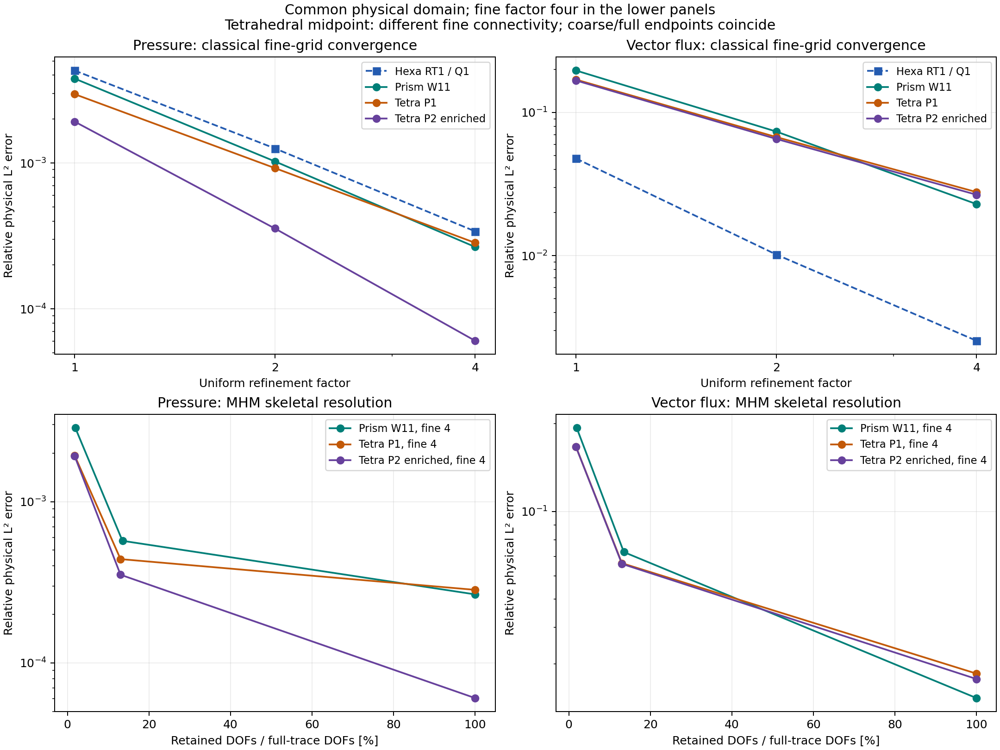
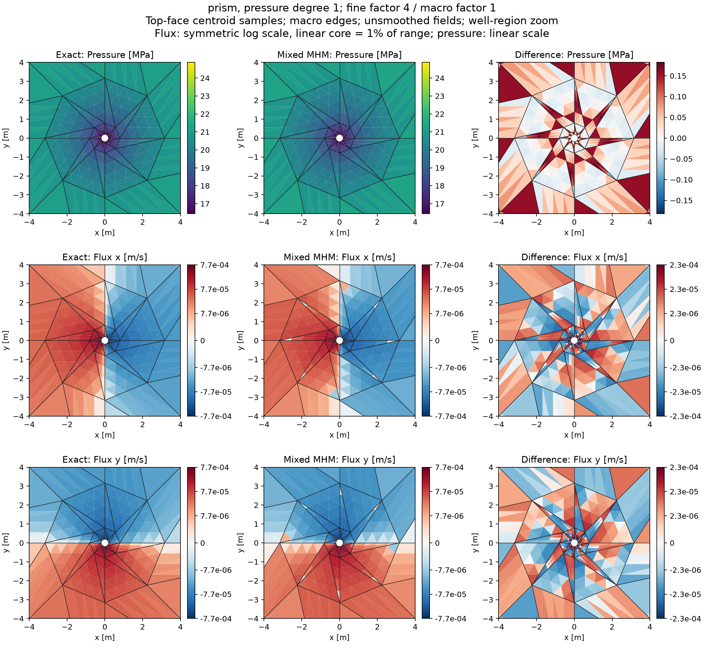
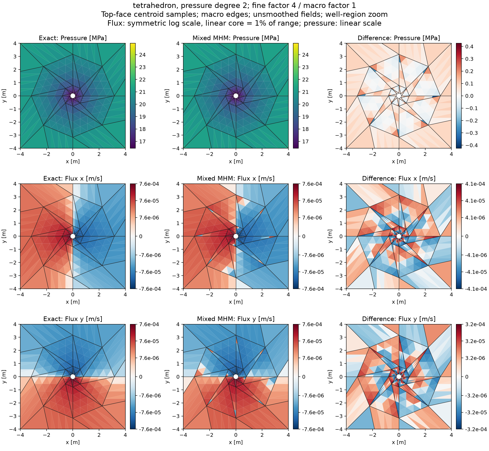

# Mixed Darcy on tetrahedra and prisms

`solve_darcy_hdiv3d` provides conforming local mixed Darcy solvers on affine
tetrahedra and triangular prisms. The skeleton carries physical normal-flux
moments on the original macrofaces. Fine interior flux and pressure modes remain
independent of the skeletal resolution.

## Explicit polynomial families

Let $P_k$ denote complete total-degree polynomials and
$W_{a,b}=P_a(x,y)\otimes P_b(z)$. The mathematical spaces, rather than a
degree label alone, determine the implementation.

| Cell | Normal trace | Interior flux construction | Pressure/divergence | Flux dimension |
| --- | --- | --- | --- | ---: |
| Tetrahedron, `pressure_degree=1` | $P_1$ on each triangle | $\{v\in[P_2]^3:v\cdot n\vert_F\in P_1(F)\}$ | $P_1$ | 18: 12 face + 6 interior |
| Tetrahedron, `pressure_degree=2` | $P_1$ on each triangle | $P_1$ face modes and every zero-normal bubble of $[P_3]^3$ | $P_2$ | 32: 12 face + 20 interior |
| Prism, `pressure_degree=1` | $P_1$ on triangles, $Q_1$ on rectangles | Horizontal $\mathrm{BDFM}_1(\triangle)\otimes P_1(z)$ and vertical $P_1(x,y)\otimes P_2(z)$ | $W_{1,1}$ | 27: 18 face + 9 interior |

The prismatic construction lies in $[W_{2,2}]^3$. The larger space defined only
by these normal-trace and divergence constraints has one additional solenoidal
bubble; it is not the implemented 27-dimensional tensor construction.

These spaces have been compared with the native `TPZShapeHDiv` evaluation in
[NeoPZ](https://github.com/labmec/neopz/tree/4c6b6d277ce097b97bfc8dea1b6725860f4fe05a).
An invertible coefficient transformation is fitted on 150 points and checked on
150 other points. Maximum vector and divergence discrepancies are respectively
$6.14\times10^{-14}$ and $3.29\times10^{-13}$. The
[verification record](../figures/mixed-well-geometries/native-basis-verification.json)
identifies the revision and all three dimensions. Separate native Basix tests
check tetrahedral mass/divergence operators and the independent tensor factors
of the prism. The runtime does not use NeoPZ coefficients or basis code.

The article's Problem 4 describes tetrahedral BDFM1 while also mentioning
quadratic pressure. Those labels do not uniquely specify its internal order.
Both compatible choices above are therefore explicit in the API and reported
separately. The published prismatic description refers to
[Castro et al. (2016)](https://doi.org/10.1016/j.cma.2016.03.050).
Agreement with the recorded NeoPZ revision establishes the executed space;
it does not identify the historical revision behind the article's figures.

Interior bubbles use fixed ordered monomial moments and positive-diagonal
Cholesky orthonormalization. `HDiv3DFamily.coefficients` exposes the resulting
read-only reference matrix. Persisted solutions store this executed matrix
alongside the flux coordinates; field replay uses that matrix for both the
oriented face transformation and polynomial evaluation. The records check
separate digests for the complete archive and its reference basis.

## Piola, boundaries and conservation

For an affine cell map $F(\hat x)=J\hat x+b$,

$$
q(F(\hat x))=\frac{J\hat q(\hat x)}{\det J},\qquad
\nabla\cdot q(F(\hat x))=\frac{\widehat{\nabla\cdot q}(\hat x)}{\det J}.
$$

Pressure uses ordinary scalar composition. Since $\det J$ is constant, the
physical divergence and pressure spaces coincide. Normal moment transformations
handle both orientation signs and permutations of shared face vertices.
Nonaffine prisms are rejected; curved-cell pressure conventions are outside
this API. [Mapped hexahedra](https://github.com/ipes-lncc/pymhm/blob/main/docs/cases/mapped-well.md) have their own geometry contract.

Pressure Dirichlet values enter the weak boundary load. Neumann data are physical
outward normal-flux densities. A pure-Neumann solve retains the joint constant
pressure/boundary-potential mode and imposes one physical volume mean. The
constitutive, divergence and prescribed-flux blocks each satisfy the stated
$10^{-10}$ backward-error check. Fine-cell conservation tests every pressure
moment, including the constant.

The example helpers below are repository sources, supplied separately from the
installed library. Open the corresponding notebook to acquire its verified
companion, as described in the [notebook guide](../tutorials/notebooks.md#execute-downloaded-notebooks).

```python
from pymhm import AffineMixedMesh
from examples.formulations.application import hdiv_darcy as solve_darcy_hdiv3d

mesh = AffineMixedMesh.unit_cube(kind="prism")
solution = solve_darcy_hdiv3d(
    mesh,
    local_refinement=2,
    dirichlet=lambda x: 1 + x[:, 0] + 2*x[:, 1] + 3*x[:, 2],
)
```

Setting `trace_degree=1` and `subdivisions=local_refinement` supplies every fine
normal moment. Tests compare this condensed representation against a separately
assembled uncondensed conforming mixed system. Lower skeletal resolution is
an MHM restriction, not an independent classical reference.

## Dupuit–Thiem well and geometry

The physical parameters are those of [Durán et al. (2019)](https://doi.org/10.1016/j.cma.2019.05.013)
Problem 4: inner/outer radii $0.2/50$ m, height 10 m,
permeability $10^{-13}$ m², viscosity $10^{-3}$ Pa s, outer pressure 25 MPa
and production rate $0.01$ m³/s. The exact pressure and Darcy flux are

$$
p(r)=p_e+\frac{Q\eta}{2\pi\kappa H}\log(r/r_e),\qquad
q(x,y,z)=-\frac{Q}{2\pi H}\frac{(x,y,0)}{x^2+y^2}.
$$

All three geometries partition the same planar octagonal annulus, with four
logarithmically spaced radial bands. Splitting a hexahedral extrusion into two
prisms and each prism into three tetrahedra preserves the physical boundary
and volume. Further refinement preserves that domain. The pressure boundary
data evaluate the exact radial function at points on the polygonal walls;
replacing them by the values at a constant circular radius would change the PDE.
Both horizontal caps have zero outward flux.


The graded connectivity is original and explicitly recorded. This is a
same-domain assessment of the mixed formulations, not a reproduction of
unavailable historical meshes or digitized Figure 15 ratios. Volume mass and
divergence use positive order-5 rules; boundary pressure uses order 12. Error
norms are computed separately with orders 7 and 10. Pressure and **vector** flux
errors are physical volume $L^2$ norms, divided by the corresponding exact norm.
The pressure denominator includes the 25 MPa datum; it is not the norm of the
pressure increment. The hexahedral curve reuses the independently recorded
[RT1/Q1 study](https://github.com/ipes-lncc/pymhm/blob/main/docs/cases/mapped-well.md) with this same pressure normalization. The affine
triangular subdivisions and the trilinear hexahedral spaces are different
discretizations on the same physical domain. A common refinement factor does
not imply equal cell counts or equal computational work across these families.



The classical limits give the following errors. Refinement factors 1, 2 and 4
refer to subdivision of the same base geometry; all entries are percentages.

| Family | Fine cells at factor 4 | Flux, factor 1 | Flux, factor 2 | Flux, factor 4 | Pressure, factor 4 |
| --- | ---: | ---: | ---: | ---: | ---: |
| Hexahedral RT1/Q1 | 2,048 | 4.7694% | 1.0174% | 0.25409% | 0.034040% |
| Prismatic 27-mode/W11 | 4,096 | 19.6410% | 7.35818% | 2.28985% | 0.026611% |
| Tetrahedral 18-mode/P1 | 12,288 | 16.9682% | 6.73571% | 2.77770% | 0.028389% |
| Tetrahedral 32-mode/P2 | 12,288 | 16.7277% | 6.53693% | 2.66195% | 0.006059% |

All three affine families reduce both physical errors under classical
refinement. On the finest tetrahedral grid, interior enrichment reduces pressure
error by a factor of 4.69, while the flux improvement is smaller: both families
retain degree-one normal traces. These measurements do not establish an
asymptotic order or a universal ranking across geometries and meshes.

The upper panels measure classical spatial refinement. The lower panels use
fine factor four and vary the macro partition until every fine trace is
retained. The prismatic fine cells are identical throughout. For tetrahedra,
the coarsest and finest macro configurations have identical fine cells, but
the intermediate composition of two factor-two refinements chooses different
internal tetrahedral diagonals. That midpoint therefore combines a skeletal
change with a fine-connectivity change. A finer local mesh alone need not remove
coarse-trace error. These
three operations—local refinement, skeletal resolution, and pressure-space
enrichment—remain separate in the records.

The article uses a different ordinate in Figure 15:

$$
\rho_q=\frac{\lVert q-q_{\mathrm{MHM}}\rVert_{L^2(\Omega)}}
                 {\lVert q-q_{\mathrm{classical,fine}}\rVert_{L^2(\Omega)}}.
$$

This is the error relative to the classical approximation error, rather than
relative to the norm of the exact flux. A value of one means that the MHM error
has reached that classical error. The paper by [Durán et al. (2019)](https://doi.org/10.1016/j.cma.2019.05.013) fixes the fine mesh at H/8 and varies the
macro partition; the present affine study reaches factor four on its explicitly
declared geometry. Its ratios therefore assess the same approximation mechanism,
without reproducing the historical mesh or its Figure 15 values. The pressure
and flux profiles in Figure 14 of [Durán et al. (2019)](https://doi.org/10.1016/j.cma.2019.05.013) use hexahedra, not tetrahedra or prisms.

At fine factor four, the errors for increasing macro resolution are:

| Family | Flux error, macro factor 1 | Macro factor 2 | Macro factor 4 | Pressure error, macro factors 1 → 4 |
| --- | ---: | ---: | ---: | ---: |
| Prismatic 27-mode/W11 | 19.3672% | 7.25650% | 2.28985% | 0.286802% → 0.026611% |
| Tetrahedral 18-mode/P1 | 16.6713% | 6.64604% | 2.77770% | 0.193605% → 0.028389% |
| Tetrahedral 32-mode/P2 | 16.6625% | 6.61069% | 2.66195% | 0.192001% → 0.006059% |

The coarse-trace flux error remains around 17–19% despite local refinement.
Interior pressure enrichment alone does not remove it. Across the 18 affine
cases, the largest physical block residual is $1.92\times10^{-13}$ and the
largest fine pressure-moment conservation defect is $1.52\times10^{-17}$ m³/s.
Changing error quadrature from order 7 to 10 changes a recorded norm by at most
$9.71\times10^{-6}$ relatively. These checks concern the declared discrete
systems and integrations; they are separate from the approximation errors above.

At fine factor four the coarse/full-trace flux-error ratios are approximately
8.46 for prisms, 6.00 for tetrahedral P1 pressure, and 6.26 for tetrahedral P2
pressure. The coarsest skeletal approximation is therefore insufficient for
a precise flux field in this well. Small pressure errors and accurate integrated
production do not change that conclusion.

The [fine-space comparison](../figures/mixed-well-geometries/fine-space-separation.json)
integrates both solutions on identical physical fine cells. With constant scalar
permeability, Galerkin orthogonality gives the flux-error decomposition

$$
\begin{aligned}
\lVert q-q_{\mathrm{MHM}}\rVert_{L^2}^2
&=\lVert q-q_f\rVert_{L^2}^2
 +\lVert q_f-q_{\mathrm{MHM}}\rVert_{L^2}^2,\\
(q-q_f,\;q_f-q_{\mathrm{MHM}})_{L^2}&=0,
\end{aligned}
$$

where $q_f$ is the full-trace classical field. Order-10 integration verifies
the squared-norm identity to a relative defect below $6.14\times10^{-13}$
for the two prismatic restrictions and the coarse/full tetrahedral endpoints.
The coarse/full differences, divided by the exact flux norm, are 19.2313%,
16.4383% and 16.4485% for prism, tetrahedral P1 and tetrahedral P2 pressure.
This isolates the large skeletal restriction error from the smaller classical
fine-space error. The tetrahedral midpoint is excluded from this identity
check because its fine connectivity differs.

The same record also reports pressure errors relative to the exact drawdown
$p-p_e$. For the coarsest prismatic skeleton, this error is 5.840%, compared
with 0.542% in the full-trace space. The corresponding total-pressure errors
are 0.287% and 0.0266%; the outer pressure datum makes those smaller percentages
unsuitable for assessing drawdown accuracy by themselves.

The [integrated boundary rates](../figures/mixed-well-geometries/boundary-rates.json)
are obtained from the archived constant normal moments, with outward signs.
The exact rates are $+0.01$ m³/s at the inner wall, $-0.01$ m³/s at the exterior,
and zero through the horizontal caps. The rate is a diagnostic of the pressure
boundary problem, not an additional imposed flux condition. The finest classical
inner rates are 0.00999488, 0.00999257 and 0.00999315 m³/s for prism/W11,
tetrahedron/P1 and tetrahedron/P2, respectively. The maximum net exterior rate
over the 18 cases is below $1.22\times10^{-17}$ m³/s.

The following maps retain the coarsest macro partition and refine each local
cell by factor four. They expose the coarse-trace approximation, rather than
showing the full-trace classical limit. The values are one-sided top-face
centroid samples without smoothing.
Exact and numerical panels use the same sample points and color limits;
difference and flux-component scales are centered at zero. Flux panels use a
symmetric logarithmic scale, with a linear interval of radius 1% of the displayed
absolute limit around zero; no values are clipped. Each difference panel uses
its own full symmetric range. Pressure panels remain linear. Black lines are
the actual macro edges. The view is restricted to the well neighborhood.

For a direct assessment of the skeletal resolution, these component plots
compare the exact field, the coarsest skeletal space and the complete fine-face
space. Each row uses a common color scale. The latter is the classical mixed
limit of the stated family, with the same fine refinement factor; it is not an
exact solution. The three columns retain the actual macro boundaries of their
respective configurations.

The plots show top-face samples, while the title errors are volume integrals.
Independent surface quadrature gives coarse/full top-cap flux errors of
19.367%/2.290% for prisms, 22.113%/3.551% for tetrahedral P1 pressure, and
22.085%/3.374% for tetrahedral P2 pressure. A tetrahedral discrete solution
need not be invariant in the vertical direction, even though the analytical
field is. Surface and volume errors therefore need not coincide.
The [replay verification](../figures/mixed-well-geometries/replay-verification.json)
checks that evaluating each archived field under different native thread counts
preserves its physical values.


The following panels include pressure and signed differences for the coarsest
skeletal configuration. The error panels use their own full color ranges.






## Independent NeoPZ solution comparison

The reference implementation is
[NeoPZ `4c6b6d277ce097b97bfc8dea1b6725860f4fe05a`](https://github.com/labmec/neopz/tree/4c6b6d277ce097b97bfc8dea1b6725860f4fe05a),
using its native H(div) elements and `TPZMixedDarcyFlow` material. Classical
mixed solves compare the three polynomial families on identical physical
cells, first with affine pressure and then with the nonpolynomial well solution.
The comparison evaluates physical fields at common quadrature points; it does
not equate coefficients belonging to different bases.

NeoPZ also provides the native
[`TPZMHMixedMeshControl`](https://github.com/labmec/neopz/blob/4c6b6d277ce097b97bfc8dea1b6725860f4fe05a/Pre/TPZMHMixedMeshControl.cpp)
implementation. Its own face restrictions define the coarse normal-trace
space. For the comparison, the internal and skeletal orders are both one;
the 32-mode tetrahedral family additionally enriches the interior by one order.
The native controller retains local unknowns in an uncondensed assembled
system, while PyMHM condenses them. This compares the same variational
restriction using different algebraic resolutions, not parallel performance.
No externally imposed restriction matrix replaces the native MHM controller.

Six classical comparisons and six native MHM comparisons cover an affine
pressure patch and the well for each polynomial family. All MHM comparisons
subdivide each macrocell into eight fine cells, keeping one degree-one trace
space per macroface. In the well, the measured relative physical-field
differences are:

| Family | Macro/fine cells | Flux difference / NeoPZ flux norm | Pressure difference / NeoPZ drawdown norm |
| --- | ---: | ---: | ---: |
| Prism, 27 modes/W11 | 64 / 512 | $3.995\times10^{-12}$ | $6.037\times10^{-12}$ |
| Tetrahedron, 18 modes/P1 | 192 / 1,536 | $2.315\times10^{-12}$ | $9.998\times10^{-14}$ |
| Tetrahedron, 32 modes/P2 | 192 / 1,536 | $2.970\times10^{-12}$ | $1.482\times10^{-13}$ |

The prismatic well, affine patches and classical cases use native NeoPZ
skyline LDLᵀ. The two tetrahedral MHM wells use SciPy SuperLU with pivoting
and symmetric equilibration on the matrix assembled by NeoPZ. Their coefficients
are imported back into NeoPZ for field evaluation and verification against the
original unscaled equations. The largest original-system relative residual
in the three MHM well cases is $2.69\times10^{-14}$. This establishes a comparison
of native MHM discretizations; it does not attribute SuperLU to NeoPZ.

Both implementations eliminate the prescribed zero normal flux on the caps.
Pressure data are integrated on the actual polygonal walls. The
[solution-verification record](../figures/mixed-well-geometries/native-solution-verification.json)
identifies the executed cases, quadrature, field norms, code revision and
source digests. Agreement between the two implementations is separate from
their error relative to the analytical solution: a coarse skeletal space can
give the same inaccurate flux in both codes.

## Reproduction

```bash
pixi run --locked -e test-core python -m examples.solve_mixed_well_geometries --kind prism --fine-factor 4 --macro-factor 1 --workers 4
pixi run --locked -e test-core python -m examples.solve_mixed_well_geometries --kind tetrahedron --pressure-degree 2 --fine-factor 4 --macro-factor 4 --workers 4
pixi run --locked -e notebooks python -m examples.plot_mixed_well_geometries
pixi run --locked -e test-core python -m examples.verify_mixed_well_fields
```

`51_mixed_well_geometries.ipynb` executes a small physical patch and reads the
recorded campaigns. Acquisition times are concurrent scientific-run metadata,
not controlled parallel benchmarks. The recorded `elapsed_s` covers assembly,
condensation, global solution and field reconstruction; the subsequent error-norm
integrations are excluded. The acquisition driver requests extended
precision for global defect corrections; it therefore requires a platform on
which NumPy `longdouble` has more precision than `float64`. The solver's default
double-precision path and the notebook patch do not impose that requirement.
The package supports affine tetrahedra and
prisms here; no mixed pyramidal or curved-prism implementation is implied.

## References

- Douglas A. Castro, Philippe R.B. Devloo, Agnaldo M. Farias, Sônia M. Gomes, Denise de Siqueira, and Omar Durán (2016). *Three dimensional hierarchical mixed finite element approximations with enhanced primal variable accuracy*. Computer Methods in Applied Mechanics and Engineering 306 479-502. [DOI: 10.1016/j.cma.2016.03.050](https://doi.org/10.1016/j.cma.2016.03.050).

- Omar Durán, Philippe R. B. Devloo, Sônia M. Gomes, and Frédéric Valentin (2019). *A multiscale hybrid method for Darcy’s problems using mixed finite element local solvers*, Computer Methods in Applied Mechanics and Engineering 354, 213–244. [DOI: 10.1016/j.cma.2019.05.013](https://doi.org/10.1016/j.cma.2019.05.013).
