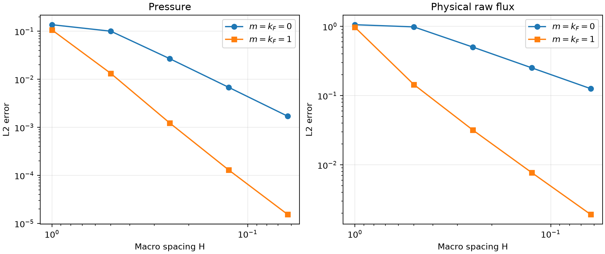
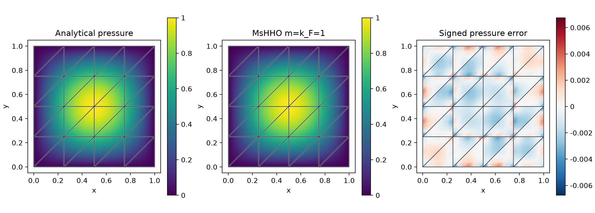

# MsHHO: cell and face moment reconstruction

MsHHO means **Multiscale Hybrid High-Order**. `solve_mshho` constructs its cell
and face pressure moments from constrained local energy minimization. MsHHO is
the macro discretization: after eliminating cell moments, it solves a global
system in shared face-pressure moments. The local reconstructions use conforming
finite elements on fine submeshes of the macrocells; the implemented local
discretization is not an HHO method on a second mesh.

It uses finite conforming Galerkin realizations of
the projected-source formulation (4.6) and reconstructed-source formulation (5.1) of
[Chaumont-Frelet et al. (2022)](https://doi.org/10.1051/m2an/2021082).
The article establishes an equivalence theorem with exactly solved local problems;
it does not provide a numerical benchmark table. The comparisons here measure a
finite Galerkin analogue against the MHM construction in PyMHM. They do not reproduce
the exact local multiscale spaces of that theorem. Remark 7.7 describes particular
second-level multiscale or local HHO spaces for two-level equivalence; an arbitrary
conforming $P_k$ local space does not automatically satisfy those hypotheses.

## Spaces and source convention

The macrocell unknowns are moments against $P_m(K)$, while each macroface has
independent polynomial moments. The reconstructed field minimizes
$\int_K A\nabla v\cdot\nabla v$ subject to those cell and face moments.
Its implementation uses a conforming local $P_k$ discretization of that
minimization. Cell moments are eliminated before assembling the global face
operator. For the symmetric diffusion form, independent local moment constraints
and physical Dirichlet elimination give a symmetric positive definite face operator
in exact arithmetic. The assembled reduction retains the represented Galerkin
operator $R^TAR$, including its floating-point antisymmetry.

For `source_variant="projected"`, the load uses the cellwise $L^2$ projection
of the source onto $P_m(K)$. For `source_variant="reconstructed"`, the original
load acts on the reconstructed test function. Polynomial sources in $P_m(K)$
give identical fields. Theorem 5.1 distinguishes the original MHM construction
with a source in $P_m(K)$ from its fully explicit projected-source construction
for general $L^2$ sources. Remark 5.3 relates the reconstructed-source variant to
a corresponding approximate MHM source lifting; it does not identify it with
an arbitrary full-source finite-element MHM solve. The face-only setting
`cell_degree=-1` uses the reconstructed-source variant, as in Remark 5.4;
it is not the same method as MHM with a source lifting.

```python
from pymhm import FaceSpace, SkeletonSpace, TriangleMesh
from examples.formulations.application import moment_diffusion as solve_mshho

mesh = TriangleMesh.unit_square(4)
faces = tuple(FaceSpace.uniform(1) for _ in mesh.faces)
solution = solve_mshho(
    mesh, skeleton=SkeletonSpace(mesh, faces), cell_degree=1,
    degree=3, local_refinement=2, source=4.0,
)
```

Polygonal macrocells use `solve_mshho_polygons` with the same moment spaces and
local energy minimization. Nonconvex L-shaped cells are included in the field
equivalence tests.

## Five-level analytical convergence

The unit-square problem uses $A=I$, zero Dirichlet data,
$u=\sin(\pi x)\sin(\pi y)$ and $f=2\pi^2u$. Both configurations use local
$P_3$ elements and two subdivisions of every macrotriangle edge. Macro spacing
ranges from $1$ to $1/16$. Error quadrature is independent of assembly.



For $m=k_F=0$, the expected leading orders are two for pressure and one for
the raw physical flux. For $m=k_F=1$, they are three and two. The final measured
orders are approximately **2.00/1.00** and **3.08/2.01**, respectively. Local
discretization remains part of the measured error.



The panels use separate broken local fields, without smoothing macro interfaces.
The error panel has its own symmetric scale. The plotted raw flux is not asserted
to be globally $H(\mathrm{div})$ conforming.

## Equivalence and numerical precision

The polynomial-source comparison uses $A=\mathrm{diag}(\kappa,1)$, $f=4$,
nonzero affine boundary data, local $P_3$ and degree-one face/cell moments.
The records include field differences and residuals for each $\kappa$.
For the shared assembled operator, the maximum relative nodal pressure difference
through $\kappa=10^6$ is $4.36\times10^{-13}$. Both complete original saddle
residuals are at most $5.35\times10^{-12}$, with the original criterion
$10^{-10}$. MsHHO retains wider digits in its reconstructions, Galerkin reductions
and moment coordinates. MHM uses wider local accumulation and two full original
equation corrections, requested with `hybrid_refinement_steps=2` and
`hybrid_refinement_min_steps=2`. Factors remain binary64. The default minimum is
zero, which permits stopping once the original residual criterion is met.
The wider mode requires a platform whose `longdouble` has more mantissa bits
than `float64`; an unsupported platform raises `SolverUnavailableError`.

The independently assembled comparison uses
[FEniCS Basix 0.9.0, revision 19555f5](https://github.com/FEniCS/basix/tree/19555f5b629b4090b14014f9db5f2c9ac80984f9),
through `basix.finite_element` and `basix.polynomials`. The executed comparison
adapter assembles its geometry, cardinal bases, volume and face integrals
independently. It shares the checked SciPy factorization and original-residual
arithmetic with PyMHM. It uses all eight macrocells, the same
local $P_3$ spaces, materials, source, Dirichlet data and physical field norms.
Pressure, raw gradient and Darcy flux differences meet the declared $10^{-9}$
criterion at all four contrasts. The homogeneous Dirichlet control at
$\kappa=10^6$ also meets this criterion. A separate insertion into the other
assembly's original saddle has residual about $5.19\times10^{-9}$ at
$\kappa=10^6$, exceeding its declared $10^{-10}$ criterion in both directions.
The measured action of the difference between the two rounded operators explains
this discrepancy. Joint certification of that insertion remains unresolved;
field agreement and each assembly's own accepted equations are recorded separately.
These finite-case checks do not establish a contrast-independent error bound or
uniform inf-sup stability.

The compact record `examples/results/mshho/native-verification.json` identifies
the executed binary and adapter digests, actual archived bases and coefficient
vectors, quadrature controls, and each separate acceptance result. Field replay
uses those archived bases and reproduces sampled fields and original rows
bitwise with one and two BLAS threads. Coherent basis reordering preserves the
physical fields; inconsistent reordering is rejected. The external solver sources
and comparison tools are kept outside the package's release artifacts.

Run `pixi run --locked -e notebooks verify-mshho` to acquire and render the study.
The numerical record is `examples/results/mshho.json`; compact algebraic,
source-convention and polynomial-patch checks run in the test suite.

## References

- Théophile Chaumont-Frelet, Alexandre Ern, Simon Lemaire, and Frédéric Valentin (2022). *Bridging the Multiscale Hybrid-Mixed and Multiscale Hybrid High-Order Methods*, ESAIM: M2AN 56, 261–285. [DOI: 10.1051/m2an/2021082](https://doi.org/10.1051/m2an/2021082).
