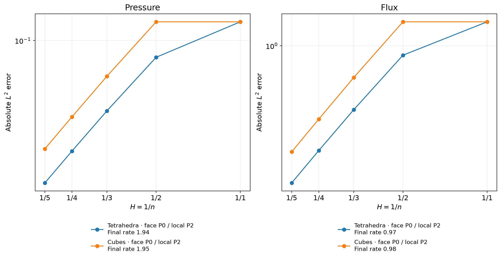
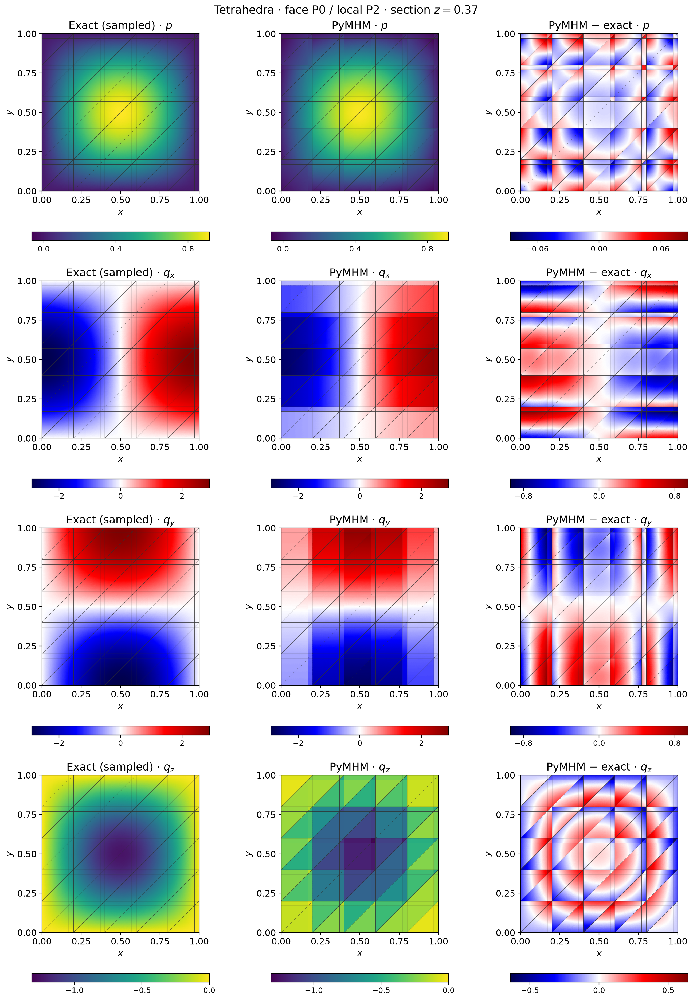
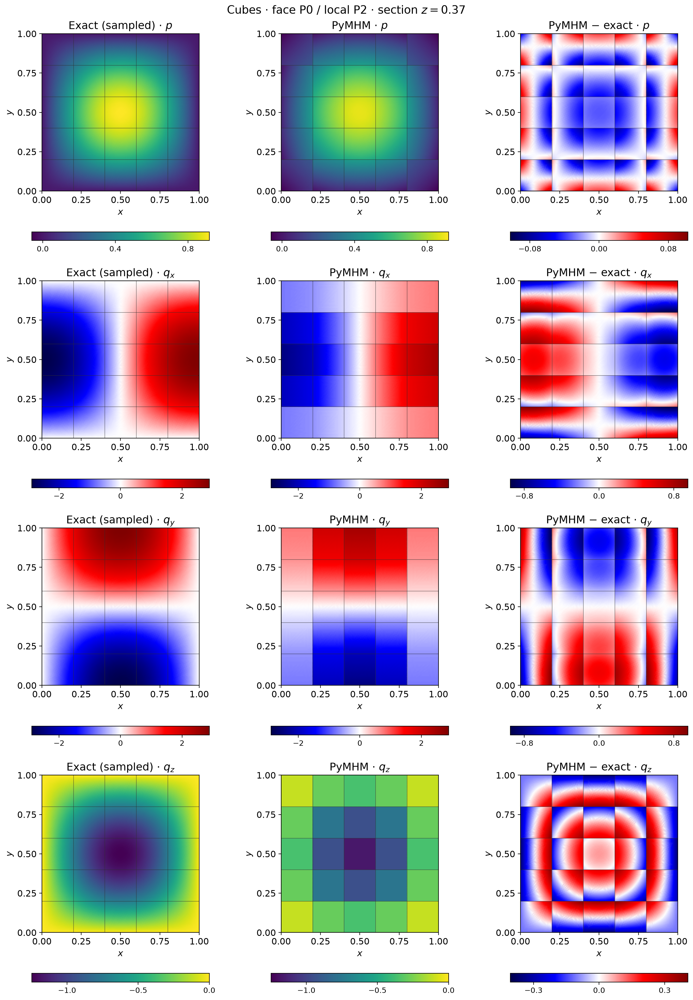

# MsHHO in three dimensions

`solve_mshho_3d` constructs cell and face moments on tetrahedral or convex
polyhedral macro meshes. The local field minimizes physical diffusion energy
subject to these moments. Local volume moments are condensed before the global
face-pressure moment solve. MsHHO is the macro discretization, while the local
energy reconstructions use conforming tetrahedral finite elements on fine
submeshes. The implemented local discretization is not an HHO method on a
second mesh. It uses the same projected-source and reconstructed-source
conventions as the [two-dimensional implementation](mshho.md), following
[Chaumont-Frelet et al. (2022)](https://doi.org/10.1051/m2an/2021082).
The article proves equivalence for its ideal local reconstruction spaces.
Generic finite local meshes approximate those spaces; algebraic reconstruction
alone does not establish the hypotheses of the paper's error estimates.
The cases below use an analytical solution rather than a published numerical
benchmark table.

## Geometry, moments and boundary conditions

Each tetrahedral face carries independent \(P_\ell\) moments, optionally on
an aligned triangular partition. Polyhedral faces retain moments on the original
polygon, rather than independent traces on the triangles used to integrate it.
Volume moments use \(P_m(K)\). The energy lift uses a conforming tetrahedral
\(P_k\) local mesh, which must have enough independent degrees of freedom to
represent all moment constraints.

Prescribed pressure is imposed through exterior face moments. `neumann`
prescribes physical outward Darcy flux on selected faces. For pure Neumann data,
compatibility is checked and `mean_pressure` selects the physical volume mean.
The global mean is not a coordinate-dependent choice of one nodal value.

The example helpers below are repository sources, supplied separately from the
installed library. Open the corresponding notebook to acquire its verified
companion, as described in the [notebook guide](../tutorials/notebooks.md#execute-downloaded-notebooks).

```python
from pymhm import TetraMesh
from examples.formulations.application import moment_diffusion as solve_mshho_3d

solution = solve_mshho_3d(
    TetraMesh.unit_cube(2), source=1.0, degree=2,
    cell_degree=0, local_refinement=2,
)
```

`source_variant="projected"` uses the cellwise \(L^2\) source projection.
`source_variant="reconstructed"` applies the original source to reconstructed
test functions. Their fields coincide for represented polynomial sources.
The face-only choice `cell_degree=-1` requires the reconstructed-source variant.
Tests cover both conventions, mixed and pure Neumann boundaries, tensor
diffusion and source compatibility.

## Exact local spaces for the selected constant-moment cases

For identity diffusion and constant volume/original-face moments, Equation
(2.19) defines local functions with constant Laplacian and constant normal
derivative on every original face. On a tetrahedron $T$ and an axis-aligned
box $Q$, respectively, these spaces are

$$
\begin{aligned}
\mathcal U^{0,0}(T)
 &=\operatorname{span}\{1,x,y,z,x^2+y^2+z^2\},\\
\mathcal U^{0,0}(Q)
 &=\operatorname{span}\{1,x,y,z,x^2,y^2,z^2\}.
\end{aligned}
$$

Compatible constant Neumann data and the constant kernel give dimensions
five and seven. The volume and face integrals determine each polynomial
uniquely: integration by parts gives zero energy for a polynomial whose
moments all vanish, and the zero volume moment fixes its constant part.
The same calculation makes each polynomial energy lift orthogonal to every
fine finite-element function with zero moments. A conforming local P2
space contains these polynomials, so its energy lifts coincide with the
ideal lifts for these particular geometries and $K=I$.

The ten-case acquisition compares every column of the executed lift with
this independent polynomial characterization. Its maximum relative
discrepancy is $5.890\times10^{-15}$; the executed matrix and field
coefficients are retained. This exact-space argument requires local degree
at least two and does not extend to degree one, higher moment degrees,
general polyhedra or different materials. Those configurations can admit
finite algebraic reconstructions without satisfying this argument.

## Five-level unit-cube study

The material is \(K=I\), pressure is zero on the boundary, and

$$
p=\sin(\pi x)\sin(\pi y)\sin(\pi z),\qquad
q=-\nabla p,\qquad f=3\pi^2p.
$$

Both families use constant cell/face moments, local \(P_2\), and the projected
source. Tetrahedral macrocells use local refinement two; cubic macrocells use
their conforming tetrahedral decomposition at refinement one. These are
different local meshes, so their errors are not an equal-cost comparison.
The macro resolutions are \(n=1,2,3,4,5\). Assembly order nine and independent
error rules ten and twelve give a maximum relative norm difference
$3.588\times10^{-10}$. The local refinement is an integer subdivision
factor: each tetrahedral macro has eight fine tetrahedra, and each cubic
macro has twelve. The executed coefficient precision is explicitly
extended; native sparse factors use binary64. The default solver precision
is documented separately from this acquisition setting.

Here $n$ counts equal intervals along each side of the unit cube. The
macro partition therefore has $n^3$ cubes or $6n^3$ tetrahedra: at `n5`,
125 cubes or 750 tetrahedra. It is independent of the local subdivision
factor and polynomial degree. `P2/P0` in these records denotes local
pressure degree two and constant cell/original-face moments.



| Macro geometry | Pressure L2 error at n=5 | Final rate | Raw flux L2 error at n=5 | Final rate |
|---|---:|---:|---:|---:|
| Tetrahedra | 1.43723e-2 | 1.942 | 3.98453e-1 | 0.972 |
| Cubes | 2.28545e-2 | 1.954 | 4.90777e-1 | 0.984 |

The measured rates approach second order for pressure and first order for
flux. Theorem 6.3 supplies a first-order energy estimate here: the smooth
source satisfies $f\in H^1$ and the exact flux satisfies
$K\nabla p\in H^1$. The second-order pressure rate is an observation from
this study, rather than an additional consequence of that energy bound.
The displayed flux is the raw physical field $-K\nabla p_h$, with no
separate H(div) postprocessing. Generic finite lifts do not guarantee
H(div) conformity or fine-cell conservation. Conservation for a projected
source refers to its macro P0 projection, not to the original nonconstant
source at each fine cell.

For the selected identity-material tetrahedral and cubic P0 cases, the
polynomial characterization above gives a stronger conclusion. The raw
flux has constant divergence equal to the macro P0 source projection and
constant normal trace on each original macroface. Global face equations
match these normal traces with opposite outward orientations, so this
particular flux is H(div)-conforming without postprocessing. Independent
one-sided derivative checks on all ten acquired meshes confirm the
divergence, fine-face normal continuity and macroface multiplier identity;
their maximum scaled discrepancies are below $5.889\times10^{-13}$.
This statement concerns the projected source and these exact local spaces,
not arbitrary finite local lifts.

The maximum relative residual of the original projected-source equations
is $5.789\times10^{-17}$, separately from approximation accuracy and
uniform inf-sup stability. Actual volume/face moments, reconstructed
matrices, raw energy matrices, physical maps, coefficients and cardinal
value/derivative tables are archived. Original stiffness matrices in the
archive are explicitly identified as diagnostic reassemblies by the shared
operator owner.

An independently assembled FEniCS Basix 0.9.0 P2/P0 reference solves the
same projected-source problem on all ten macro meshes. Both fields are
evaluated with their own executed bases and physical maps. The maximum
relative differences are $1.327\times10^{-14}$ for pressure, raw gradient,
physical Darcy flux and full broken H1 norms, and $8.771\times10^{-15}$
for the physical P0 normal multiplier. Inserting the acquired coefficients
into the original reference equations gives at most
$2.559\times10^{-14}$, against the unchanged $10^{-10}$ criterion.
Twenty data-only replays with one and two BLAS threads are bitwise
identical. The reference independently constructs operators, moments,
source projection and field norms; it shares the attributed SciPy
factorization and original-residual arithmetic. Project, module, revision,
verified source URL, runtime digests and all archive identities are in
the [independent verification record](../figures/core-extensions/mshho3d-native-verification.json).

## Sections and components

The section \(z=0.37\) displays the complete local pressure polynomial and
every physical flux component. Exact and numerical samples share scales,
while differences have independent symmetric scales. Original macroface
intersections are overlaid. Each triangular fan of a fine-cell section has
six display subdivisions; vertices remain private to their fine cell so that
interpolation cannot smooth independent traces across interfaces. Both finest
states are replayed and their volume error norms checked against the campaign
before all local coefficients and section samples are archived.




```bash
pixi run --locked -e notebooks python -m examples.solve_core_extensions mshho3d
pixi run --locked -e notebooks python -m examples.sample_core_sections mshho3d
pixi run --locked -e notebooks python -m examples.plot_core_extensions mshho3d
```

The ten-case record is `examples/results/core-extensions/mshho3d.json`, with
source hashes, error quadrature checks and section archives.
The coefficient replay and display hashes are recorded separately in
`examples/results/core-extensions/mshho3d-field-sampling.json`.

## References

- Théophile Chaumont-Frelet, Alexandre Ern, Simon Lemaire, and Frédéric Valentin (2022). *Bridging the Multiscale Hybrid-Mixed and Multiscale Hybrid High-Order Methods*, ESAIM: M2AN 56, 261–285. [DOI: 10.1051/m2an/2021082](https://doi.org/10.1051/m2an/2021082).
