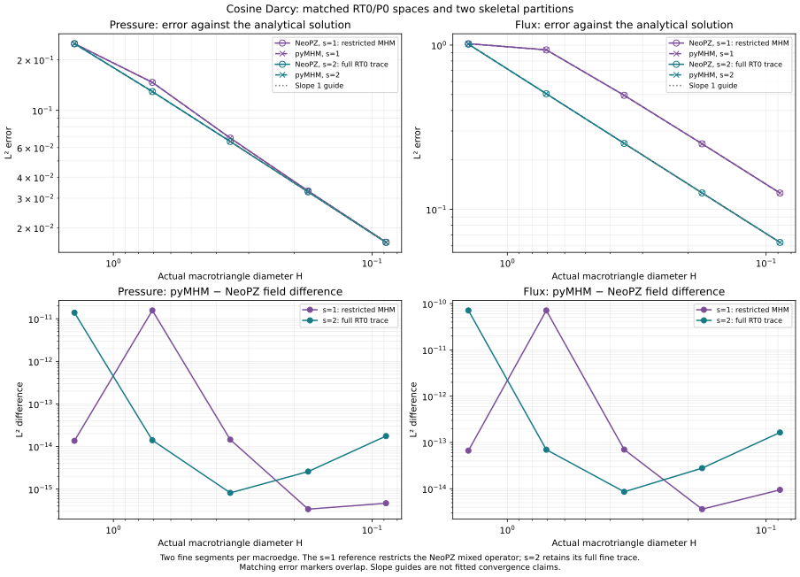

# Independent NeoPZ comparison

An independent mixed finite element assembly can check the local Darcy
operators, face orientations, pressure reconstruction, and MHM condensation
against another implementation. This comparison uses NeoPZ's public RT0
element family on exactly the same triangular mesh. It also distinguishes
that reference from Labmec's higher-order mixed MHM controller.

An additional [coarse cosine check](coarse-cosine.md#mixed-comparison-with-neopz)
uses the gallery's exact 32-macrotriangle, 512-fine-triangle configuration.
It reproduces its 21.8662% flux error and compares the complete RT0 fields.

The reference uses [NeoPZ commit
`4c6b6d2`](https://github.com/labmec/neopz/tree/4c6b6d277ce097b97bfc8dea1b6725860f4fe05a)
and [Labmec/MHM commit
`f978f29`](https://github.com/labmec/MHM/tree/f978f29d657d28fe58bcea20fabee68953093482).
Execution with the independent driver tests the same discrete equations; it
does not constitute execution of an unchanged historical MHM application.

## Spaces that can be compared exactly

The native mixed Darcy solver uses

$$
\boldsymbol q_h|_T\in RT_0(T),\qquad p_h|_T\in P_0(T),\qquad
\boldsymbol q=-K\nabla p,\quad\nabla\cdot\boldsymbol q=f.
$$

There is one flux integral per oriented fine edge and one pressure value per
fine triangle. The divergence belongs to $P_0(T)$. The skeleton represents
the physical normal flux, with a fixed normal for each macroedge.

NeoPZ's public `EHDivConstant` family constructs RT0 facet modes and enriches
them by divergence-free curls. **At order zero, no enrichment modes remain:**
there are three flux DOFs on a triangle, and the basis is RT0. The name
"constant" describes its divergence; an RT0 vector field can vary linearly
inside an element. See the [basis construction][constant-basis] and
[DOF count][constant-count]. This order-zero family is used by the independent
reference.

The positive-order `EHDivStandard` family used by the mixed MHM controller is
different. Its triangular flux count is

$$
3(k+1)+\bigl((k+1)^2-1\bigr)=k^2+5k+3.
$$

For example, standard order one has nine flux DOFs, rather than the eight of
classical RT1. The disconnected pressure space has degree $k$, while the
normal trace has degree $k$. The controller can additionally raise the
interior flux and pressure degrees without raising the skeletal degree.
Matching the integer degree alone therefore does not establish matching
spaces. See [standard DOF counts][standard-count], [pressure construction][pressure-space],
and [interior enrichment][enrichment].

The mixed MHM controller requires positive interior and skeleton degrees;
its skeleton-order setter maps nonpositive values to one. The RT0 reference
instead uses the order-zero `EHDivConstant` family. These are distinct
approximation spaces and execution paths. See the
[controller degree requirements][degree-guard].

The historical application's default mesh uses quadrilaterals and its default
interior/skeleton degrees are two/one. Replacing those elements by triangular
RT0 changes the approximation. The independent RT0 comparison is valuable
because its spaces agree with the native solver, but it must not be labelled a
reproduction of that default application. The [application configuration][application]
and [mesh generator][geometry] make this distinction explicit.

## Matching signs, orientations, and pressure

NeoPZ's mixed material and pyMHM use the same weak equations:

$$
(K^{-1}\boldsymbol q_h,\boldsymbol v_h)
 -(p_h,\nabla\cdot\boldsymbol v_h)
 =-\langle g_D,\boldsymbol v_h\cdot\boldsymbol n\rangle,
\qquad
-(\nabla\cdot\boldsymbol q_h,w_h)=-(f,w_h).
$$

Dirichlet pressure is imposed through boundary moments. The modern NeoPZ
material used by the independent driver supports scalar isotropic permeability;
comparisons therefore use $K=kI$. The [volume contributions][darcy-form] and
[boundary contributions][darcy-bc] provide the reference signs.

For a counterclockwise triangle with area $|T|$, pyMHM writes the RT0 basis
associated with an edge opposite vertex $\boldsymbol a_e$ as

$$
\boldsymbol\phi_e(\boldsymbol x)
 =s_{Te}\frac{\boldsymbol x-\boldsymbol a_e}{2|T|},
\qquad
\int_T\nabla\cdot\boldsymbol\phi_e=s_{Te}.
$$

Here $s_{Te}$ compares the cell's outward normal with the globally chosen
normal. NeoPZ implements the contravariant Piola map and carries orientation
through its side signs and permutations. These are equivalent on the affine
triangles of this comparison. Raw basis coefficients need not share signs or
normalization; compare physical flux samples and integrals against a common
normal. See [NeoPZ's Piola map][piola].

pyMHM's constrained local pressure lift has zero volume mean, and its coarse
pressure amplitude restores a constant. NeoPZ's mixed controller instead keeps
an algebraic pressure connect before condensation. That retained coefficient
is not generally the physical macrocell mean. Compare reconstructed pressure
and integrated means, not coarse coefficient vectors. See the
[retained-connect algorithm][retained-pressure].

For pure Neumann conditions a common global pressure gauge is also necessary.
Keeping a local pressure connect does not remove the global additive constant.
The NeoPZ material imposes Neumann flux by a large penalty, whereas
pyMHM fixes projected flux coefficients strongly. The recorded comparison uses
Dirichlet conditions. An equivalent Neumann comparison requires matching flux
imposition and the pressure gauge.

## Full and restricted skeletal traces

When each macroedge has one P0 skeleton segment per fine edge, the skeleton
spans every admissible RT0 normal trace. MHM condensation must then recover the
global conforming RT0/P0 solution on the assembled fine mesh. This tests the
local operators and elimination against an independent global assembly.

For a genuinely restricted MHM space, let $T$ map a vector of independent
coarse flux and pressure coordinates to the full mixed reference coordinates.
The restriction affects interface fluxes; fine interior fluxes and fine
pressure values remain independent before condensation. If the global mixed
reference system is $A x=b$, the restricted equations are

$$
(T^{\mathsf T}AT)y=T^{\mathsf T}b,\qquad x=Ty.
$$

Flux entries of $T$ must account for face orientation and physical lengths.
For a constant macroedge flux, a fine-edge integral equals that flux times the
fine-edge length with the corresponding sign. Restricting just coefficient
indices without those factors can change the problem. Comparing this system
with pyMHM's reduced trace tests MHM approximation as well as condensation.
It is a restricted-trace NeoPZ reference, separate from the positive-order
historical controller. That controller applies its own [facet dependencies][restriction].

## Comparison results

The executed study contains **46 comparisons**: 23 with the complete fine-edge
trace and 23 with a constant trace on each macroedge. The Cartesian macro grid
has $n=1,2,4,8,16$ squares per axis, split into triangles; each macrotriangle is
subdivided with $r=2$. Thus there are $2n^2$ macrotriangles and $8n^2$ fine
triangles. The two layered cases use $n=2,4,8,16$ so that the material interface
coincides with mesh edges. All cases impose exact pressure on the exterior
boundary and use the same geometry in both implementations.

| Case | Exact pressure $p$ | Permeability | Source $f$ |
|---|---|---|---|
| Affine | $1+x+2y$ | $K=I$ | $0$ |
| Polynomial | $x^2+y^2+xy$ | $K=I$ | $-4$ |
| Cosine | $\cos(\pi x)\cos(\pi y)$ | $K=I$ | $2\pi^2p$ |
| Layered | $1+\min(x,\tfrac12)+\max(x-\tfrac12,0)/10+2y$ | $K=kI$, $k=1$ left and $10$ right | $0$ |
| Layered, contrast $10^3$ | $1+\min(x,\tfrac12)+\max(x-\tfrac12,0)/1000+2y$ | $K=kI$, $k=1$ left and $1000$ right | $0$ |

The layered solutions have $\boldsymbol q=(-1,-2k)$: normal flux is continuous
across $x=1/2$, while the tangential component jumps. Their exact flux belongs
to both discrete spaces; their nonconstant pressure cannot be represented
exactly by P0. An affine pressure likewise has a nonzero P0 approximation
error even when its constant flux is recovered to roundoff.

The RT0 Dirichlet functional depends only on the pressure average on each
fine boundary edge. The reference supplies that average, computed by NeoPZ's
Gauss rule requested at order 20 (11 points), as a constant boundary value.
This represents the same discrete Dirichlet functional. Divergence is evaluated
from the native H(div) divergence solution field; see
[H(div) solution evaluation][divergence-native].

The reference with two trace segments per macroedge ($s=2$) uses the native
NeoPZ skyline LDLt solve. The reference with one segment ($s=1$) uses the
independently assembled NeoPZ matrix, the restriction described above, and a
SciPy sparse solve; its coefficient vector is then imported into NeoPZ for
native field evaluation. Neither reference uses pyMHM's assembled matrices.

The table gives the largest **absolute field differences in L2** across the
listed meshes. Differences of RT0 fields are integrated exactly with a
three-point, degree-two triangle rule. Error norms against the analytical
solution use a separate Duffy order-10 rule. These are comparisons of physical
fields, not just comparisons of their error norms.

| Case | Segments $s$ | Meshes | $\lVert p_{\rm pyMHM}-p_{\rm ref}\rVert$ | $\lVert \boldsymbol q_{\rm pyMHM}-\boldsymbol q_{\rm ref}\rVert$ | $\lVert \nabla\cdot(\boldsymbol q_{\rm pyMHM}-\boldsymbol q_{\rm ref})\rVert$ |
|---|---:|---:|---:|---:|---:|
| Affine | 2 | 5 | 3.84e-13 | 1.82e-12 | 3.40e-11 |
| Polynomial | 2 | 5 | 1.34e-13 | 6.72e-13 | 1.63e-11 |
| Cosine | 2 | 5 | 1.39e-11 | 7.12e-11 | 5.67e-12 |
| Layered, contrast 10 | 2 | 4 | 1.53e-13 | 7.88e-12 | 2.87e-10 |
| Layered, contrast 1000 | 2 | 4 | 1.04e-13 | 3.93e-10 | 2.25e-8 |
| Affine | 1 | 5 | 2.83e-15 | 5.07e-14 | 3.10e-13 |
| Polynomial | 1 | 5 | 9.04e-16 | 2.05e-14 | 1.22e-13 |
| Cosine | 1 | 5 | 1.57e-11 | 7.12e-11 | 3.26e-13 |
| Layered, contrast 10 | 1 | 4 | 2.12e-15 | 3.00e-13 | 2.75e-13 |
| Layered, contrast 1000 | 1 | 4 | 3.50e-14 | 9.04e-11 | 1.39e-11 |

Pressure and flux acceptance thresholds are $10^{-9}\max(1,\|u_{\rm ref}\|)$
for the respective field. The divergence threshold is
$10^{-8}\max(1,\|\boldsymbol q_{\rm ref}\|,\|\nabla\cdot\boldsymbol q_{\rm ref}\|)$.
All 46 cases pass these fixed checks. In the contrast-1000 case the flux norm
is approximately $1.414\times10^3$, so the largest flux difference corresponds
to about $2.8\times10^{-13}$ relative to that norm.

Conservation is checked by integrating $\nabla\cdot\boldsymbol q_h-f$ in
each fine cell using the assembly source quadrature. The maximum absolute
integrated defect is $1.14\times10^{-13}$ in pyMHM and $8.42\times10^{-11}$
in the reference, over all 46 cases. For the full-trace contrast-1000 case,
the larger divergence-density difference in the table accompanies a much
smaller integrated defect: differentiating fine-cell fields amplifies flux
coefficient errors. Both measures remain recorded, rather than using the
integrated residual alone to assess agreement.

### Boundary quadrature sensitivity

The recorded cosine comparisons use five Gauss points per skeleton segment
for pyMHM boundary moments and 11 Gauss points for the NeoPZ boundary means.
A controlled integration study compares the five-point rule with a 20-point
rule for pyMHM's boundary moments, keeping the volume quadrature, finite
element spaces, reference fields and solver tolerances fixed.

| Configuration | Flux difference, 5 points | Flux difference, 20 points |
|---|---:|---:|
| $n=1$, $s=2$ | 7.1241e-11 | 5.1509e-14 |
| $n=2$, $s=1$ | 7.1241e-11 | 1.7045e-15 |

The reduction in field differences identifies boundary integration as the
leading discrepancy in these two coarse cosine cases. The 46 comparisons
reported above use the five-point pyMHM rule and the 11-point NeoPZ rule.

### Convergence and physical fields



The expected asymptotic rate is first order for RT0 flux and P0 pressure.
With $r=2$ fixed, reducing the macrotriangle diameter $H=\sqrt{2}/n$ refines
both macro and fine meshes.
The five measured levels approach that rate. A single constant trace per
macroedge has a larger flux error than the complete trace, as expected from
the smaller approximation space. Its coarsest two flux errors are almost
stationary; both points are retained. The reference and pyMHM convergence
curves overlap to the field differences reported above.

For example, at $n=16$ the pressure/flux errors are $0.0163597/0.0629614$
with $s=2$ and $0.0164147/0.125766$ with $s=1$. Near-zero errors in the
representable affine and layered fluxes are consistency checks, not
convergence-rate measurements.

The figure reads the retained pressure/flux errors and field differences against
the declared macrogeometry; its [rendering provenance](../figures/neopz/convergence-record.json)
records the original report digest and all five diameters. It does not
reconstruct spatial fields from scalar errors. The original 46 coefficient
archives are not distributed, so spatial panels and one-sided profiles for
those acquisition files cannot be replayed from this checkout.

The separate [coarse cosine field comparison](coarse-cosine.md#mixed-comparison-with-neopz)
includes downloadable P0/RT0 field data, native NeoPZ reevaluation and actual
macro boundaries. Its configuration is $n=4$, $r=4$, $s=1$, rather than the
$r=2$ refinement series above. Both methods share a substantial coarse-trace
flux error even when their reconstructed fields agree to roundoff.

### Restricted macro trace

The independent restriction retains all fine pressure and interior flux
coordinates before condensation. The following dimensions therefore describe
the reference systems, not pyMHM's condensed global system.

| $n$ | Macrotriangles | Fine triangles | Full $A$ | Restricted $T^{\mathsf T}AT$, $s=1$ |
|---:|---:|---:|---:|---:|
| 1 | 2 | 8 | 24 | 19 |
| 2 | 8 | 32 | 88 | 72 |
| 4 | 32 | 128 | 336 | 280 |
| 8 | 128 | 512 | 1312 | 1104 |
| 16 | 512 | 2048 | 5184 | 4384 |

The maximum relative algebraic residual is $1.78\times10^{-11}$ for the
native full solves and $2.30\times10^{-13}$ for the restricted solves.
The latter check uses $T^{\mathsf T}(ATy-b)$: the full unrestricted residual
need not vanish for a constrained approximation. Native NeoPZ evaluation of
the imported restricted coefficients gives the $s=1$ field comparisons above.

## Inspect the archived comparison

The executed C++ comparison driver is named **`neopz_rt0`**. It uses **NeoPZ**
for finite element assembly and field evaluation. The checkout provides complete
JSON measurements, field hashes and boundary-quadrature diagnostics. The original
46 coefficient archives and instrumented external driver are not distributed.
The standalone notebook assembles fresh RT0/P0 equations through the public API
for the same five analytical physical cases and reports pressure, physical-flux
and fine-cell equilibrium errors:

```sh
pixi run --locked -e notebooks notebooks-run 14
```

Results are in `examples/results/neopz/comparison.json`; the boundary diagnostic
is in `examples/results/neopz/boundary-quadrature.json`. Execution provenance
records source and archive SHA-256 digests. The accompanying
[notebook](../tutorials/notebooks.md) reads the retained original provenance separately from
its current analytical refinement. Selecting `--historical` additionally loads
all 46 original coefficient archives, validates their recorded hashes and
displays their comparison figures. This option requires the original payloads;
newly solved fields do not recreate their acquisition identity. The
recorded execution establishes agreement for the tested
triangular RT0/P0 problems and trace restrictions. Higher-order spaces,
three-dimensional elements, Neumann penalties and unchanged historical MHM
drivers require separate comparisons.

## RT0 trace compatibility

An RT0 normal trace is constant on each fine edge. The skeletal space must
therefore consist of degree-zero segments whose endpoints coincide with fine
boundary vertices. Each segment can span one or more complete fine edges;
a segment boundary inside a fine edge is inadmissible.

With this compatibility condition, the reconstructed mixed field satisfies
$\boldsymbol q_h\cdot\boldsymbol n=\lambda_h$ on every fine boundary edge,
using the common macroface normal. Matching only the integrated flux across
a macroface is a weaker condition and does not establish this trace identity.
The RT0 local-equation definition validates the polynomial degree and partition
alignment before assembly; see the [mixed MHM tutorial](../tutorials/methods/mixed-mhm.md).

[constant-basis]: https://github.com/labmec/neopz/blob/4c6b6d277ce097b97bfc8dea1b6725860f4fe05a/Shape/TPZShapeHDivConstant.cpp#L95-L146
[constant-count]: https://github.com/labmec/neopz/blob/4c6b6d277ce097b97bfc8dea1b6725860f4fe05a/Shape/TPZShapeHDivConstant.cpp#L213-L241
[standard-count]: https://github.com/labmec/neopz/blob/4c6b6d277ce097b97bfc8dea1b6725860f4fe05a/Shape/TPZShapeHDiv.cpp#L412-L448
[pressure-space]: https://github.com/labmec/neopz/blob/4c6b6d277ce097b97bfc8dea1b6725860f4fe05a/Pre/TPZMHMixedMeshControl.cpp#L297-L362
[enrichment]: https://github.com/labmec/neopz/blob/4c6b6d277ce097b97bfc8dea1b6725860f4fe05a/Pre/TPZMHMixedMeshControl.cpp#L205-L241
[degree-guard]: https://github.com/labmec/neopz/blob/4c6b6d277ce097b97bfc8dea1b6725860f4fe05a/Pre/TPZMHMixedMeshControl.cpp#L140-L164
[application]: https://github.com/labmec/MHM/blob/f978f29d657d28fe58bcea20fabee68953093482/main_MHM_HDiv.cpp#L72-L115
[geometry]: https://github.com/labmec/MHM/blob/f978f29d657d28fe58bcea20fabee68953093482/meshgen.cpp#L629-L723
[darcy-form]: https://github.com/labmec/neopz/blob/4c6b6d277ce097b97bfc8dea1b6725860f4fe05a/Material/DarcyFlow/TPZMixedDarcyFlow.cpp#L40-L240
[darcy-bc]: https://github.com/labmec/neopz/blob/4c6b6d277ce097b97bfc8dea1b6725860f4fe05a/Material/DarcyFlow/TPZMixedDarcyFlow.cpp#L244-L348
[piola]: https://github.com/labmec/neopz/blob/4c6b6d277ce097b97bfc8dea1b6725860f4fe05a/Mesh/pzelchdiv.cpp#L853-L890
[retained-pressure]: https://github.com/labmec/neopz/blob/4c6b6d277ce097b97bfc8dea1b6725860f4fe05a/Mesh/TPZCompMeshTools.cpp#L462-L595
[restriction]: https://github.com/labmec/neopz/blob/4c6b6d277ce097b97bfc8dea1b6725860f4fe05a/Mesh/pzintel.cpp#L847-L943
[divergence-native]: https://github.com/labmec/neopz/blob/4c6b6d277ce097b97bfc8dea1b6725860f4fe05a/Mesh/pzelchdiv.cpp#L648-L696
