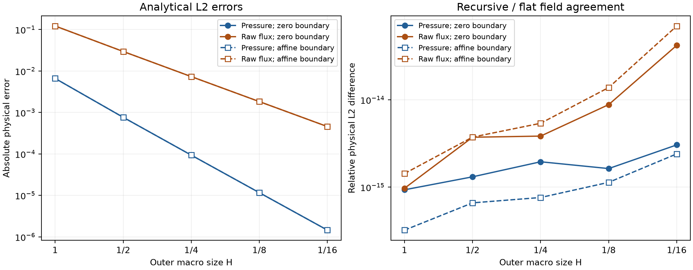

# Recursive MHM local problems

An MHM discretization can supply a local problem at the next scale. This
multilevel interpretation appears in [Harder, Paredes and Valentin (2013)](https://doi.org/10.1016/j.jcp.2013.03.019),
Remarks 7 and 10, and the local variational decomposition of
[Harder and Valentin (2016), sections 2 and 4.1](https://doi.org/10.1007/978-3-319-41640-3_13).
The current study is an original recursive realization on a declared Cartesian
mesh. It compares recursive and flat MHM with identical leaf spaces, and verifies
both against an independently assembled complete original Q2/P1 hybrid system.

## Local equations and physical moments

Let \(A_{\mathrm{in}}x=b_{\mathrm{in}}\) denote the inner hybrid system,
including its retained local modes. The columns of \(P\) select the inner
boundary trace. The signed injective map \(T\) restricts the parent trace to
that boundary. The parent local problem is

$$
\begin{bmatrix}
-A_{\mathrm{in}} & P\\
P^T & 0
\end{bmatrix}
\begin{bmatrix}x\\\mu\end{bmatrix}
+\begin{bmatrix}0\\-T\end{bmatrix}\lambda
=\begin{bmatrix}-b_{\mathrm{in}}\\0\end{bmatrix}.
$$

Thus \(P^Tx=T\lambda\). The reaction \(\mu\) is minus the inner pressure
moment; the parent pairing \(-T^T\mu\) preserves the continuity sign.
`NestedLocalProblem` uses the shared `LocalProblem` condensation. Physical
constant kernels, source offsets and moment constraints survive the second
elimination. The executed retained basis \(E\) is archived separately from
the selector \(P\), and field replay uses that same numerical basis.

`nested_trace_map` checks exact facewise representability and includes normal
and parameter orientations. Each parent face has two independent P1 segments,
exactly matching the two inner boundary faces. This restriction is a signed
permutation; no projection or averaging changes the trace space.

## Physical problem and finite spaces

On \(\Omega=(0,1)^2\), the permeability is \(K=I\). The two problems share
the same independently derived source:

$$
\begin{aligned}
p_0(x,y)&=\sin(\pi x)\sin(\pi y),\\
p_1(x,y)&=1+x-y+\sin(\pi x)\sin(\pi y),\\
f(x,y)&=-\Delta p_i(x,y)
       =2\pi^2\sin(\pi x)\sin(\pi y).
\end{aligned}
$$

Exact pressure is imposed weakly on every exterior face: zero for \(p_0\),
and \(1+x-y\) for \(p_1\). No extra physical mean is imposed on this
Dirichlet problem. The physical Darcy flux displayed here is
\(q=-\nabla p_h\), evaluated independently on each leaf. It is a raw
polynomial gradient, distinct from an H(div) reconstruction and from the
oriented normal-flux multiplier on macrofaces.

For \(n=1,2,4,8,16\), the outer mesh has \(n\times n\) rectangles of size
\(H=1/n\). Each contains \(2\times2\) inner macrocells, and each inner
macrocell contains \(2\times2\) fine quadrilaterals. Continuous Q2 on each
inner submesh has 25 nodal coordinates. Inner faces carry
\(P_1=\operatorname{span}\{1,2t-1\}\), with canonical face parameter
\(0\leq t\leq1\).

The local volume stiffness kernel is the declared physical constant, paired
with its physical volume integral. Eight disjoint fine-edge midpoint functions
provide a rank-eight witness for the local trace coupling: each face of length
\(L\) contributes the block

$$
\frac{L}{3}
\begin{bmatrix}1&-1/2\\1&1/2\end{bmatrix},
\qquad \det=\frac{L^2}{9}>0.
$$

Trace continuity connects the leaf constants, and exterior Dirichlet data fixes
the remaining global constant. This establishes finite-case injectivity and
the physical gauge for these executed spaces. The single-polynomial Pk degree
conditions of Lemma 10 in the cited chapter do not automatically apply to Q2
on a fine submesh. This study does not establish a mesh-uniform inf-sup estimate
or transfer the chapter's convergence theorem to these spaces.

## Measured fields and convergence

The analytical errors use physical leafwise integration. The raw-flux error is
the gradient error because \(K=I\). The complete broken H1 norm also reported
by the independent reference includes the pressure L2 term:

$$
\begin{aligned}
\|e_p\|_{0,\Omega}^2
 &=\sum_{K}\int_K |p_h-p_i|^2\,dx,\\
\|e_q\|_{0,\Omega}^2
 &=\sum_{K}\int_K |q_h+\nabla p_i|^2\,dx,\\
\|e_p\|_{1,\mathrm{broken}}^2
 &=\|e_p\|_{0,\Omega}^2
   +\sum_{K}\int_K |\nabla(p_h-p_i)|^2\,dx.
\end{aligned}
$$

The public acquisition uses a six-point tensor Gauss rule per fine cell;
weak boundary data uses eight points per face segment. Separate eight- and ten-point rules check
all integrated errors and physical field differences. The maximum relative
change between these two norm rules is \(3.69\times10^{-12}\).

| Outer divisions | Recursive unknowns | Flat unknowns | \(\lVert e_{p_0}\rVert_{0,\Omega}\) | \(\lVert e_{q_0}\rVert_{0,\Omega}\) | \(\lVert e_{p_1}\rVert_{0,\Omega}\) | \(\lVert e_{q_1}\rVert_{0,\Omega}\) |
|---:|---:|---:|---:|---:|---:|---:|
| 1 | 17 | 28 | 6.60653e-3 | 1.21651e-1 | 6.60653e-3 | 1.21651e-1 |
| 2 | 52 | 96 | 7.62088e-4 | 2.95357e-2 | 7.62088e-4 | 2.95357e-2 |
| 4 | 176 | 352 | 9.32881e-5 | 7.31711e-3 | 9.32881e-5 | 7.31711e-3 |
| 8 | 640 | 1344 | 1.16000e-5 | 1.82493e-3 | 1.16000e-5 | 1.82493e-3 |
| 16 | 2432 | 5248 | 1.44810e-6 | 4.55957e-4 | 1.44810e-6 | 4.55957e-4 |

The final \(8\to16\) refinement gives measured pressure order 3.001892 and
raw-flux order 2.000869 for both boundary problems. These are observed rates
for the current smooth analytical family. The relative physical L2 difference
between recursive and flat pressure or raw flux is at most
\(7.01\times10^{-14}\); the maximum source-normalized original equation
or constraint residual is \(6.64\times10^{-13}\). Macroface normal-flux
equilibrium does not establish fine-cell conservation of the raw gradient.




The spatial figure uses the homogeneous \(n=4\) acquisition. Every analytical,
numerical and error panel marks the actual archived outer macrofaces in dark
lines and inner macrofaces in thin lines. Saved one-sided field samples remain
independent at interfaces; no smoothing or averaging is applied. Each panel
has its own colorbar. Pointwise figure errors complement the integrated norms.

## Independent original-system comparison

The executed reference uses [FEniCS Basix 0.9.0](https://docs.fenicsproject.org/basix/v0.9.0/index.html),
module `create_element/tabulate`, for independent equispaced Q2 and P1 basis
tabulation. The upstream tag resolves to
[`19555f5b629b4090b14014f9db5f2c9ac80984f9`](https://github.com/FEniCS/basix/tree/19555f5b629b4090b14014f9db5f2c9ac80984f9).
Compiled runtime digests are recorded separately; no byte identity to this
upstream source checkout is asserted. An instrumented comparison assembly
constructs the complete original Q2/P1 saddle system on the same geometry,
coefficients, source, boundary data and approximation spaces. This is an
executed assembly comparison, not an original author application or a
classical conforming reference. It shares the attributed SciPy SuperLU
factorization and extended original-residual policy, while geometry, basis,
operator assembly and physical evaluation are independent of PyMHM assembly
and condensation.

The native reference uses six Gauss points for both volume and face assembly;
the affine weak Dirichlet moments are integrated exactly by this rule. Its
field norms use the separate eight- and ten-point rules.

Both recursive and flat candidate fields are inserted into the independently
assembled original equations. Pressure, raw gradient, Darcy flux, full broken
H1 and the physical normal-flux multiplier are compared through physical norms
on the same leaves or faces. Trace coordinates are transformed using actual
endpoints, normals and parameter directions, without averaging. Across all ten
complete cases:

| Verification | Maximum relative value | Acceptance criterion |
|---|---:|---:|
| Native original equations | 8.76e-13 | 1e-10 |
| Candidate in native original equations | 2.02e-12 | 1e-10 |
| Physical fields and oriented normal multiplier | 1.36e-12 | 1e-9 |
| Represented A, B, source and weak boundary load | 4.51e-16 | 1e-11 |
| Native norm quadrature sensitivity | 3.69e-12 | 1e-9 |

Twenty data-only replays and twenty physical comparisons produce bitwise
identical results with one and two BLAS threads. The reference's final
pressure, raw-gradient and complete broken H1 orders are respectively
3.001892, 2.000869 and 2.000891. Executed basis matrices, operators, field
coefficients, producer and consumer identities have separate digests in
`examples/results/nested-current/native-verification.json`.

The public acquisition took 155.46 seconds with 663.64 MiB peak owned RSS;
its separate read-only archive closure took 81.71 seconds with 814.33 MiB.
The complete native acquisition, comparisons and replays took 246.91 seconds
with 630.27 MiB under overlapping host workloads. Costs include setup,
serialization, synchronization and verification. Fewer outer unknowns measure
condensation; these measurements do not demonstrate a runtime speedup.

## Reproduction and archived evaluation

`examples/results/nested.json` selects the ten current acquisitions and their
checksummed companion records. Numerical archives contain the actual original
operators, retained bases, geometry, quadrature tables and one-sided display
tables. They are generated locally and remain outside release artifacts.
The plotting driver consumes these saved tables without solving or tabulating
a new numerical basis:

```sh
pixi run --locked -e notebooks python examples/verify_nested.py \
  --levels 1 2 4 8 16 --boundary both --native-threads 1 \
  --acquire-only --output examples/results/nested-regenerated
pixi run --locked -e notebooks python examples/plot_nested.py \
  --record examples/results/nested-regenerated/nested.json \
  --output build/figures/nested-regenerated
pixi run --locked -e notebooks python scripts/run_notebooks.py \
  notebooks/darcy/36_recursive_mhm.ipynb --timeout 60
```

The notebook validates the selected current archive and displays the current
published figures. The independent comparison sources remain private; their
attribution, source identities, numerical results and basis digests are public.
The analytical Cartesian problem is distinct from a literal historical-mesh
or published-figure reproduction.

See the [nested API](../api/hybrid.md#pymhm.core.nested) and
[operator reuse](../execution.md). `restrict_response` reuses prepared harmonic
lifts on an exactly embedded skeletal subspace without refactoring a local matrix.

## References

- Christopher Harder, Diego Paredes, and Frédéric Valentin (2013). *A family of Multiscale Hybrid-Mixed finite element methods for the Darcy equation with rough coefficients*, Journal of Computational Physics 245, 107–130. [DOI: 10.1016/j.jcp.2013.03.019](https://doi.org/10.1016/j.jcp.2013.03.019).

- Christopher Harder and Frédéric Valentin (2016). *Foundations of the MHM Method*, in *Building Bridges: Connections and Challenges in Modern Approaches to Numerical Partial Differential Equations*, Lecture Notes in Computational Science and Engineering 114, Springer. [DOI: 10.1007/978-3-319-41640-3_13](https://doi.org/10.1007/978-3-319-41640-3_13).
