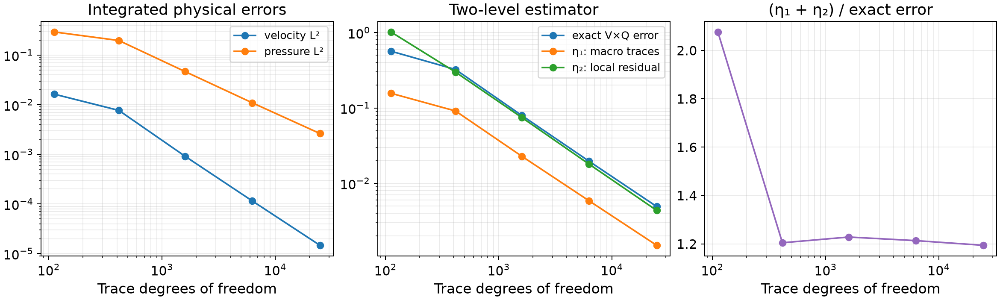
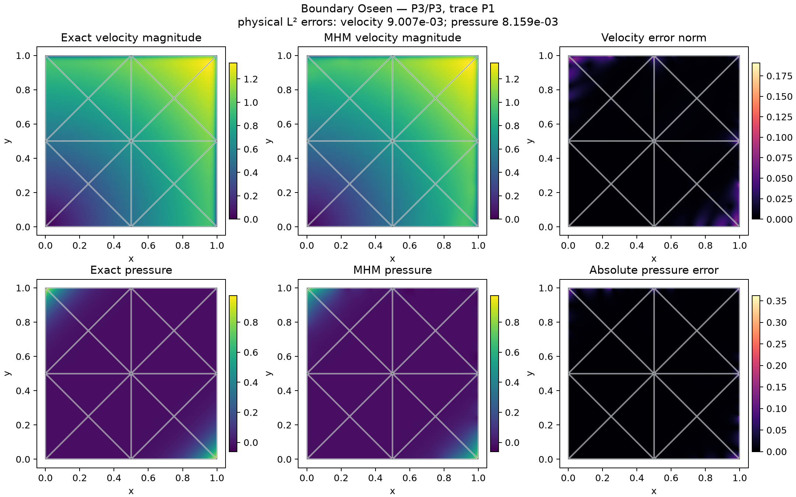
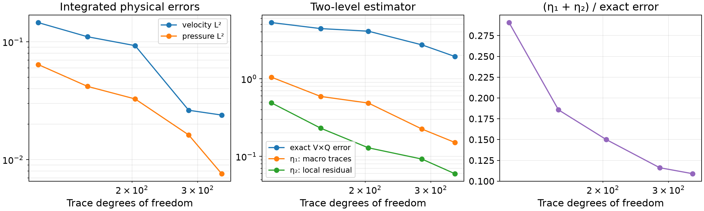

# Stabilized Oseen flow and two-level adaptivity

The Oseen implementation solves

$$
-\nu\Delta u+(\beta\cdot\nabla)u+\gamma u+\nabla p=f,
\qquad \nabla\cdot u=0,
$$

with the velocity-gradient viscous operator. Local continuous equal-order
\(P_k/P_k\) spaces, independent vector-valued skeletal spaces, and the
stabilization of [Araya, Cárcamo, Poza and Valentin (2021)](
https://doi.org/10.1007/s10444-020-09833-8) are available through
`solve_brinkman(..., formulation="oseen", degree=k)`.
The global hybrid problem retains translation moments, including for positive
reaction; reconstructed pressure uses the prescribed global mean when all
velocity components have Dirichlet data.

## Variable convection and local stabilization

A constant convection vector needs no derivative data. For a callable
`advection(points)`, supply its analytical divergence through
`advection_divergence` and a finite global bound on its Euclidean magnitude
through `advection_bound`. The latter is required by the stabilized Oseen
formulation. The Taylor–Hood formulation accepts variable convection without
this stabilization bound. Bounds are checked at integration points; sampling
cannot prove a bound everywhere.

The skew convection form uses the reaction correction
\(\gamma-\tfrac12\nabla\cdot\beta\), so its strong operator remains
\((\beta\cdot\nabla)u+\gamma u\). The local residuals are

$$
R(u,p)=-\nu\Delta u+\nabla u\,\beta+\gamma u+\nabla p,
\qquad
R^*(v,q)=-\nu\Delta v-\nabla v\,\beta+\gamma v+\nabla q.
$$

With the pressure-test sign convention used by the package, the stabilized
terms are \(\kappa_\tau(\nabla\cdot u,\nabla\cdot v)_\tau
-\delta_\tau(R(u,p),R^*(v,q))_\tau\), and the source contribution includes
\(-\delta_\tau(f,R^*(v,q))_\tau\). These signs and both convection directions
are checked against independently assembled DOLFINx/UFL operators for degrees
one, two and three, including variable convection.

Let \(h_\tau\) be the fine-cell diameter,
\(m_\tau=\min(1/3,C_\tau)\), where
\(C_\tau h_\tau^2\|\Delta v\|^2\leq\|\nabla v\|^2\).
Writing \(d=4\nu/m_\tau\) and
\(b=h_\tau\|\beta\|_{\infty,\tau}\), equations (26)–(27) give

$$
\delta_\tau=\frac{h_\tau^2}
{\max(\gamma h_\tau^2,d)+\max(d,b)},
\qquad
\kappa_\tau=b\min(1,b/d).
$$

The implementation accepts constant nonnegative scalar \(\gamma\) for this
formulation. Its analytical reliability assumptions are stronger:
\(\gamma-\tfrac12\nabla\cdot\beta\geq\gamma_m>0\).
The internal-layer example has \(\gamma=0\), as in the article, and is outside
that strict coercivity hypothesis. A computed estimator or small linear-system
residual does not establish the theorem's assumptions.

## Residual estimator and adaptive spaces

`estimate_flow_error` evaluates the two levels of the Oseen estimator in
(33)–(34), or the Stokes–Brinkman estimator when
`variant="stokes-brinkman-2021"`. These interfaces currently require full
Dirichlet boundaries, constant positive viscosity and uniform skeletal degree
\(\ell\). Local meshes may have different refinements. Face quadrature is
partitioned at the local-cell and skeletal breakpoints, preserving one-sided
velocity values.

The first level uses \(-[u_h]/2\) on internal macrofaces and \(g-u_h\)
on the exterior. Its denominator is the original macroface length, including
when the trace is subdivided. An interior macroface appears twice in the sum
of macrocell boundaries. The second level contains momentum residuals,
divergence, and pseudotraction mismatches on local faces. The pseudotraction is
\(\nu\nabla u\,n-pn-u(\beta\cdot n)/2\).
For Oseen,

$$
\eta_2=2^{-2\ell}\Big(\sum_K\eta_{2,K}^2\Big)^{1/2},
\qquad \eta=\eta_1+\eta_2.
$$

The Stokes–Brinkman variant has no \(2^{-2\ell}\) factor. These are
estimators with constants and higher-order terms in their respective bounds;
the reported value is not a certified upper bound with constant one.
Discontinuous material coefficients must align with the local cells for the
Gaussian volume quadrature used by this estimator.

`adapt_flow` uses equation (52):
\(\eta_F=(\sum_{\widetilde F}\eta_{1,\widetilde F}^2)^{1/2}
+\sum_{K\in\omega_F}\eta_{2,K}\), with unscaled local indicators.
It marks macrofaces above a fraction of the maximum indicator and bisects
segments with maximal contribution on those faces. Local meshes double when
the second level dominates; an explicit uniform-grid closure also resolves
every new trace breakpoint. Thus the macro topology stays fixed while local
meshes and traces adapt. `max_local_refinement` imposes a declared resolution
limit and returns a distinct stop reason.

The example helpers below are repository sources, supplied separately from the
installed library. Open the corresponding notebook to acquire its verified
companion, as described in the [notebook guide](../tutorials.md#execute-downloaded-notebooks).

```python
import numpy as np
from pymhm import TriangleMesh
from pymhm.adaptivity.flow import adapt_flow
from examples.formulations.application import flow as solve_equations

result = adapt_flow(
    TriangleMesh.unit_square(2),
    solve_step=solve_equations,
    formulation="oseen",
    degree=3,
    drag=2.0,
    advection=lambda x: x,
    advection_divergence=2.0,
    advection_bound=np.sqrt(2.0),
    source=lambda x: 2.0 * x,
    iterations=3,
    theta=0.5,
)
```

`solve_step` builds the current mathematical velocity/pressure equations through
the public provider; the shared adaptive owner supplies refinement and estimator
checks. The callback receives the actual oriented trace and local partitions.
The same contract applies to macro refinement through `adapt_flow_macros`.

## Analytical campaigns

`examples/solve_oseen.py` runs the original package implementation on the
smooth, boundary-layer and internal-layer data from sections 5.1–5.3. The
smooth study uses \(P_3/P_3\) local spaces with one fine triangle per macrocell,
crisscross meshes with \(H=1/2,1/4,1/8,1/16,1/32\), and pressure
\(p=(x-y)^6-1/28\). Viscosity and trace-degree studies are separate campaigns.
The variable-convection experiment is supplementary: \(\beta=(x,y)\) and
\(\gamma=2\), with the source differentiated from the same exact fields.

The boundary-layer experiment uses \(\nu=0.01\), \(\gamma=1\),
\(\beta=(1,1)/\sqrt2\), and \(p=(x-y)^8-1/45\). The internal-layer
experiment uses \(\nu=0.001\), \(\gamma=0\), \(\beta=(1,0)\), and
the published hyperbolic-tangent streamfunction. Both adaptive studies keep
16 initial macrotriangles, use \(P_3/P_3\) locally and \(P_1\) skeletal
segments, and state their marking threshold and quadrature in each record.

The experiments reproduce the stated analytical problems and stabilized
forms. Historical adaptive connectivity and marking parameters are not fully
specified by the article; the archived campaigns do not assert an identical
adaptive mesh or reproduction of its numerical tables. Physical errors are
integrated on local cells, separately from the polynomial samples used for
spatial plots. The mixed norm is

$$
\|(e_u,e_p)\|_{V\times Q}^2=
\operatorname{diam}(\Omega)^{-2}\|e_u\|_{L^2}^2+
\|\nabla e_u\|_{L^2}^2+\|e_p\|_{L^2}^2.
$$

Run an acquisition with the test environment, and render its archived data
with the notebook environment. Large convergence studies are separate from
routine CI; CI covers analytical patches, exact estimator moments, marking,
and small adaptive solves.

```bash
pixi run --locked -e test-core python -m examples.solve_oseen --case smooth --levels 2 4 8 16 32
pixi run --locked -e test-core python -m examples.solve_oseen --case boundary --viscosity .01 --levels 2 --adaptive --iterations 4 --order 20
pixi run --locked -e notebooks python -m examples.plot_oseen
```

## Archived results

All eight studies contain five solved states. The uniform studies below use
\(H=1/32\) at their last state; the adaptive studies retain their original
16 macrotriangles. Errors are absolute physical \(L^2\) norms.

| Study | Viscosity | Trace degree | Final velocity error | Final pressure error | Final effectivity |
|---|---:|---:|---:|---:|---:|
| Smooth | 1 | 0 | 2.46134e-3 | 1.58417e-1 | 0.9406 |
| Smooth | 1 | 1 | 1.47070e-5 | 2.62523e-3 | 1.1940 |
| Smooth | 1 | 2 | 2.24595e-7 | 1.05024e-4 | 1.1340 |
| Smooth | 0.01 | 1 | 1.26142e-4 | 2.00064e-4 | 0.3479 |
| Smooth | 0.0001 | 1 | 2.20335e-3 | 6.26125e-4 | 0.2689 |
| Variable convection | 1 | 1 | 1.48474e-5 | 2.63794e-3 | 1.1854 |
| Adaptive boundary layer | 0.01 | 1 | 9.00694e-3 | 8.15895e-3 | 0.1592 |
| Adaptive internal layer | 0.001 | 1 | 2.38814e-2 | 7.59098e-3 | 0.1090 |

The effectivity variation matters: these data do not establish a universal
viscosity-independent estimator constant. The boundary and internal-layer
runs reduce their errors but retain finite discretization error. Their final
local meshes contain 2,566 and 2,917 triangles, respectively. Their recorded
algebraic residuals are below \(6\times10^{-15}\); this is a separate check
from their approximation errors.









## References

- Rodolfo Araya, Cristian Cárcamo, Abner H. Poza, and Frédéric Valentin (2021). *An adaptive multiscale hybrid-mixed method for the Oseen equations*, Advances in Computational Mathematics 47, article 15. [DOI: 10.1007/s10444-020-09833-8](https://doi.org/10.1007/s10444-020-09833-8).
