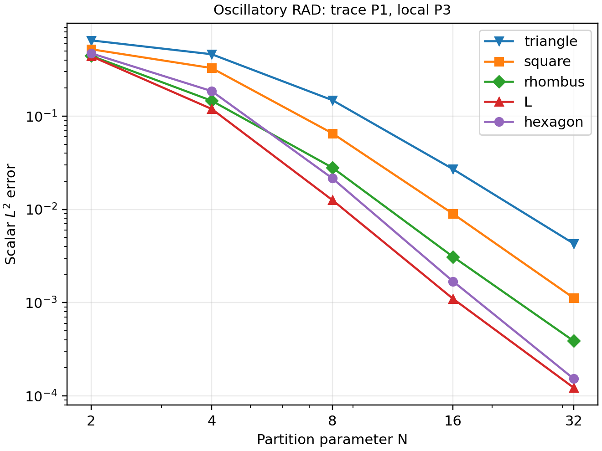
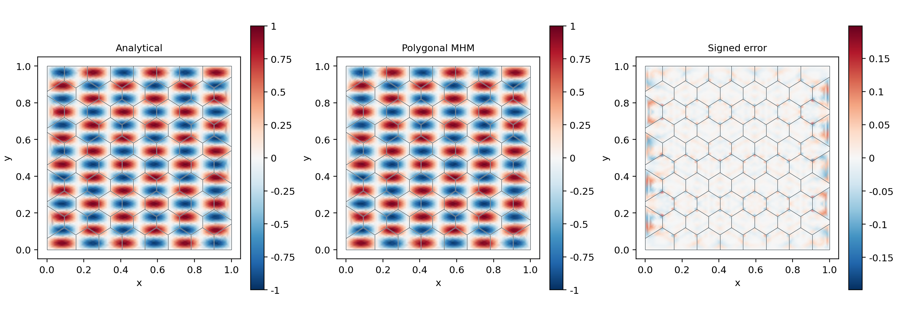

# Polygonal macro meshes

`PolygonMesh` accepts conforming partitions of straight-sided simple polygons,
including nonconvex cells and collinear boundary vertices. Each macrocell has
its own conforming triangular local mesh. The global unknowns remain on the
original polygon edges; local triangulation edges do not become macrofaces.

The shared Darcy, conservative transport, Stokes–Brinkman and MsHHO operators
are available through `solve_darcy_polygons`, `solve_transport_polygons`,
`solve_brinkman_polygons` and `solve_mshho_polygons`. The automated checks include
an L-shaped macrocell, polynomial patches, oriented normal fluxes and MHM–MsHHO
field equivalence. Hanging macro vertices must be inserted consistently in
both incident cells. Cells with holes require a partition into simple polygons.

## Oscillatory transport on five polygon families

The data and approximation degrees follow section 5.2.1 of the
[Araya et al. (2024)](https://doi.org/10.1016/j.cma.2024.117089):

$$
u=\sin(6\pi x)\sin(14\pi y),\qquad
A=0.1I,\quad\beta=(1,0),\quad c=0,
$$

$$
f=0.1(6^2+14^2)\pi^2u+
6\pi\cos(6\pi x)\sin(14\pi y).
$$

Dirichlet data are homogeneous on the unit square. The skeletal degree is one
and local finite elements have degree three. The study constructs triangular,
square, rhombic, L/square and clipped hexagonal partitions at five resolutions.
`local_triangulation="boundary"` gives distinct adjacent triangles to distinct
macrofaces, as required by the construction in assumption (A1). An interior
centroid fan is used when it lies in the polygon kernel; otherwise, each ear
triangle has its own centroid fan. There is no extra local refinement in this
P3/P1 campaign, consistent with (A2). These explicit meshes and refinement
choices define this reproduction of the PDE and spaces; the publication does
not supply their complete local connectivity, so pointwise equality with its
historical mesh is not asserted.

The coarsest meshes underresolve the seven vertical oscillations. Error decreases
as the macro partition resolves them. Comparisons at the same partition parameter
do not imply the same number of cells or unknowns: the machine-readable record
also contains those counts. This is a convergence study, not a ranking of polygon
families at equal computational cost.

The analytical and numerical fields share a color scale. The signed error has a
separate scale, and every panel shows the actual macro boundaries. Display
sampling evaluates the cubic local functions independently on each fine triangle.
All error norms use volume quadrature rather than image samples.

Run `pixi run -e notebooks verify-polygons`. The records are stored in
`examples/results/polygons.json`. These research runs are separate from the
small polynomial and geometry checks used in CI.

## References

- Rodolfo Araya, Fabrice Jaillet, Diego Paredes, and Frédéric Valentin (2024). *Generalizing the multiscale hybrid-mixed method for reactive-advective-diffusive equations*, Computer Methods in Applied Mechanics and Engineering 428, 117089. [DOI: 10.1016/j.cma.2024.117089](https://doi.org/10.1016/j.cma.2024.117089).
