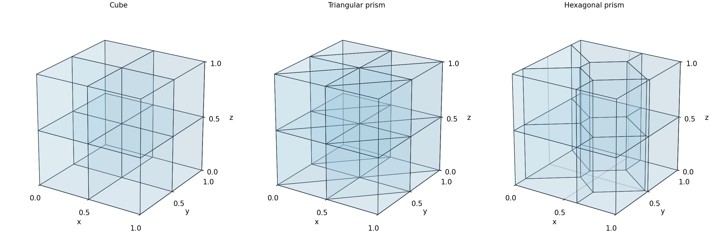
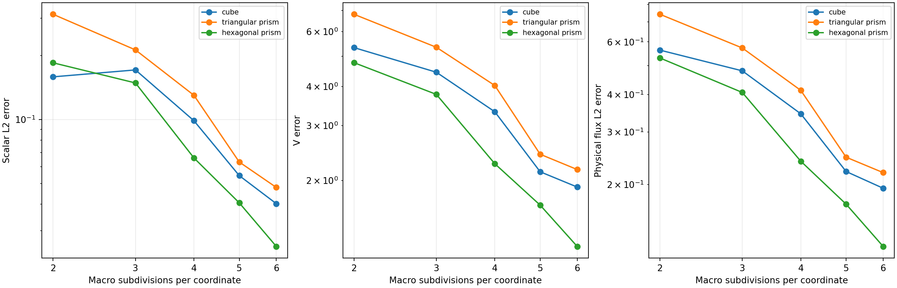
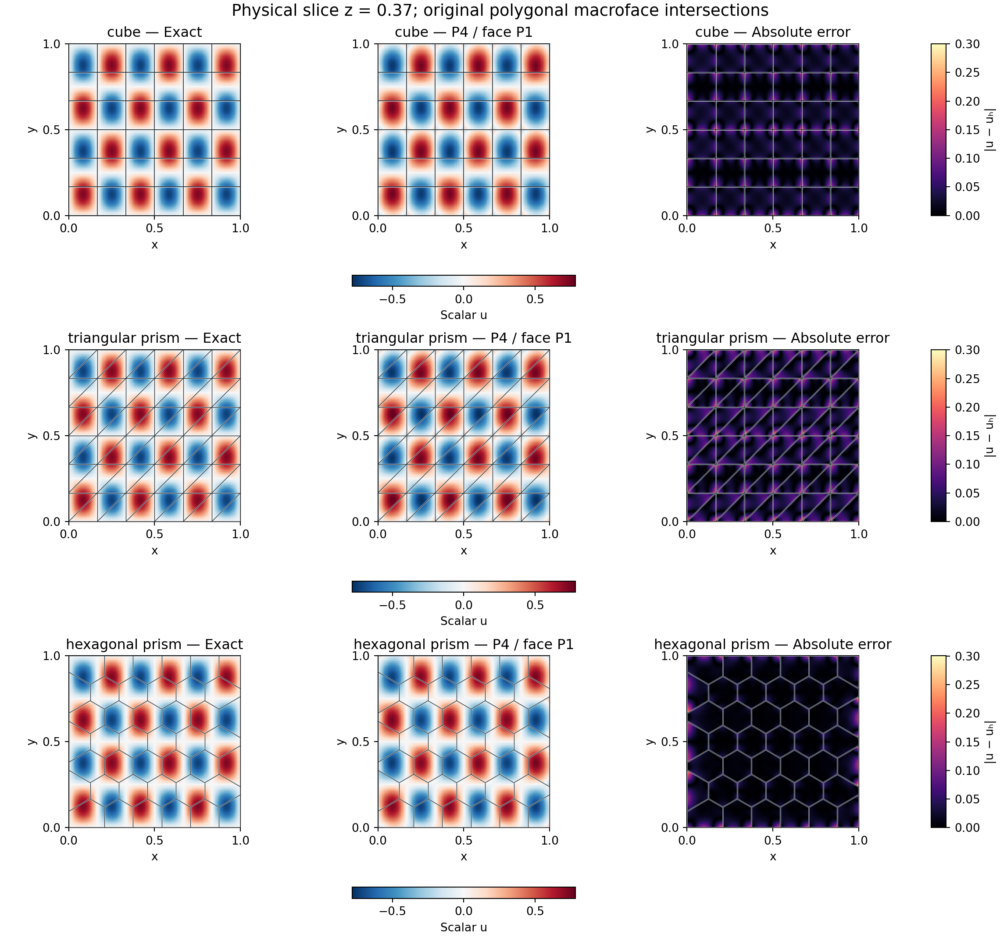

# Conservative RAD on star-shaped polyhedra

`PolyhedralMesh` keeps each planar polygonal macroface as a single entity.
Continuous tetrahedral local spaces solve the interior problems, while
`PolygonalSkeleton3D` supplies one constant or one affine polynomial on each
original macroface. Triangulation diagonals carry no independent global traces.
This realizes the polyhedral geometry allowed by the generalized RAD formulation
of [Araya et al. (2024)](https://doi.org/10.1016/j.cma.2024.117089).

## Geometry and spaces

The native geometry accepts conforming **star-shaped** cells with planar simple
polygonal faces, including nonconvex cells and concave faces. Face vertices are
cyclically ordered. Each cell has a closed, connected, orientable boundary;
shared faces have opposing outward orientations. An interior kernel point and
its positive distance from every face plane certify a kernel ball. Its radius
is recorded in `kernel_radii`. The star-shaped-ball hypothesis is the geometric
condition in §4.1(iii) of the cited RAD analysis. Uniform family regularity
additionally needs a lower bound on kernel radius divided by cell diameter.

Convex faces retain their deterministic fan triangulation. Concave faces use
a conforming ear triangulation. Cones from the certified cell center to these
triangles form the local tetrahedral mesh; a separating-axis check rejects
positive-volume overlaps between cones. The construction preserves reentrant
notches and never fills a convex hull. Curved faces, separate cavity shells
and empty kernels are rejected. Coplanar adjacent polygons may remain distinct
macrofaces, with separate physical moments.

Optional dyadic refinement identifies shared nodes by integer barycentric
topology. Local fields are continuous Pk across these tetrahedra; the basis
accepts arbitrary positive degree and the chosen formulation still requires
adequate quadrature and compatible trace coupling. The additional
[nonconvex campaign](star-polyhedra.md) verifies five L-prism/cuboid resolutions
and a native UFL full-saddle comparison on two reentrant cells.



A $P_0$ macroface has one degree of freedom. A $P_1$ macroface has three,
regardless of its vertex count or triangulation:

$$
\lambda_F(x)=a_F+b_F\frac{(x-c_F)\cdot t_{F,1}}{\sqrt{|F|}}
+c_F^{\lambda}\frac{(x-c_F)\cdot t_{F,2}}{\sqrt{|F|}}.
$$

Here $c_F$ is the area centroid and the tangents are orthonormal. Coefficients
refer to the canonical normal directed outward from the first neighboring
cell. Local coupling includes the corresponding orientation sign. External
Robin values are projected onto this same polynomial space by a physical
$L^2(F)$ projection.

The local and skeletal spaces must have sufficient independent coupling.
The solver checks the condensed system's numerical rank. In particular,
an unrefined cubic macrocell with local $P_2$ and face $P_1$ contains an
invisible trace mode; it is rejected. The $P_4/P_1$ campaign below and the
reported $P_3/P_1$ affine patches satisfy the checked discrete coupling.

## PDE and boundary convention

The conservative equation is

$$
-\nabla\cdot(K\nabla u)+\nabla\cdot(\beta u)+cu=f.
$$

The local form uses skew transport and the effective reaction
$c+\nabla\cdot\beta/2$. Its natural multiplier is
$\lambda=(-K\nabla u+\beta u/2)\cdot n$, whereas the physical flux evaluated
by the solution is $-K\nabla u+\beta u$. Dirichlet data enter the global weak
moments on the remaining exterior faces. Variable velocity requires an explicit
divergence; SUPG with variable diffusion also requires $\nabla\cdot K$.

Physical constant modes are retained by default, including near-singular local
operators. The explicit `coarse_space="kernel"` policy retains only genuine
constant null modes. An all-Robin problem admits a physical mean when reaction
vanishes and the velocity is divergence-free and tangent to the full exterior.
The original physical equations are checked after imposing this mean.

The example helpers below are repository sources, supplied separately from the
installed library. Open the corresponding notebook to acquire its verified
companion, as described in the [notebook guide](../tutorials/notebooks.md#execute-downloaded-notebooks).

```python
import numpy as np
from pymhm import assemble
from pymhm.meshes.polyhedral import PolyhedralMesh
from examples.formulations.transport_3d import define_transport_3d
from examples.formulations.scalar_3d import scalar_constraints_3d, recover_transport_3d

mesh = PolyhedralMesh.cubes(2)
definition = define_transport_3d(
    mesh,
    degree=4,
    diffusion=0.1,
    velocity=(1.0, 0.0, 0.0),
    source=lambda x: np.ones(len(x)),
)
system = assemble(definition.problem)
coefficients = system.solve(constraints=scalar_constraints_3d(definition, system))
solution = recover_transport_3d(definition, system, coefficients)
```

The user-defined provider in `examples/formulations/scalar_3d.py` composes the
public `tetra_transport_operators`, `polygonal_trace_coupling` and boundary
projection with explicit four-block equations. Natural data, coefficient
derivatives, Galerkin/SUPG, retained constants or selective kernels, and a
physical mean use the same declarations as the tetrahedral example. Assembly
supports serial, thread and spawn workers through generic `ExecutionConfig`;
`SolverConfig` declares independent local/global solvers and arithmetic for
iterative refinement. Original polygonal faces retain their unknowns throughout.


## Analytical campaign

On the unit cube, the smooth three-dimensional data from §5.2.1 are

$$
\begin{aligned}
K&=0.1I,\qquad \beta=(1,0,0),\qquad c=0,\\
u&=\sin(6\pi x)\sin(4\pi y)\sin(2\pi z),\\
f&=5.6\pi^2u+\partial_xu.
\end{aligned}
$$

All exterior Dirichlet values vanish. The campaign uses local $P_4$ and one
$P_1$ polynomial per original face, with five independently specified macro
resolutions. The three families are cubes, triangular prisms and extruded
convex Voronoi polygons; the latter include nonquadrilateral polygonal faces.
These are original meshes with the published PDE and degrees, not the article's
unavailable historical mesh realization.

Assembly uses eight Duffy points per coordinate. Positive error quadrature uses
ten, with a twelve-point scalar-error check on each family's finest mesh.
The energy-space norm is
$\|e\|_V=(\|\nabla e\|^2+\|e\|^2/3)^{1/2}$, since the squared diameter of the
unit cube is three. The physical flux error includes advection.

| Macro family | $n$ | Cells | $L^2$ error | $V$ error | Physical flux $L^2$ error |
|---|---:|---:|---:|---:|---:|
| cube | 2 | 8 | 0.158999 | 5.329271 | 0.563130 |
| cube | 3 | 27 | 0.171405 | 4.444685 | 0.480116 |
| cube | 4 | 64 | 0.098837 | 3.321122 | 0.345042 |
| cube | 5 | 125 | 0.054512 | 2.134023 | 0.221299 |
| cube | 6 | 216 | 0.040224 | 1.906931 | 0.194558 |
| triangular prism | 2 | 16 | 0.313256 | 6.812927 | 0.741945 |
| triangular prism | 3 | 54 | 0.212936 | 5.342275 | 0.572471 |
| triangular prism | 4 | 128 | 0.130207 | 4.030258 | 0.413215 |
| triangular prism | 5 | 250 | 0.063167 | 2.428163 | 0.247054 |
| triangular prism | 6 | 432 | 0.047967 | 2.169592 | 0.219416 |
| hexagonal prism | 2 | 12 | 0.185123 | 4.769644 | 0.530109 |
| hexagonal prism | 3 | 36 | 0.148823 | 3.774670 | 0.406549 |
| hexagonal prism | 4 | 80 | 0.066044 | 2.264220 | 0.239593 |
| hexagonal prism | 5 | 150 | 0.040584 | 1.668919 | 0.172123 |
| hexagonal prism | 6 | 252 | 0.025304 | 1.230969 | 0.124348 |

The largest relative change of the finest scalar error under the ten-to-twelve
point quadrature check is $1.28\times10^{-11}$. All fifteen original-system
backward residuals are below $1.16\times10^{-15}$. These checks address
integration and algebra; the measured analytical errors quantify discretization.





Slice samples at $z=0.37$ are evaluated in their owning tetrahedron; values on
distinct macrocells are not averaged. Macro outlines are the intersections of
the actual polyhedral faces with the slice. The maps illustrate fields; norms
use volume integration. Coarse grids can display nonmonotonic scalar errors
for this oscillatory solution, so the records retain every measured level.
The [field replay record](../figures/polyhedral-rad/fields-replay.json)
identifies the finest-resolution coefficients and their agreement with the
original physical error measurements for all three macroelement families.

## Verification and reproduction

Tests verify exact volume and surface area, the divergence theorem for affine
fields, two cells sharing a quadrilateral face, and invariance under cyclic
face reversal and face-list reordering. They also cover full physical RAD
patches, variable-coefficient SUPG, Neumann projection, mean gauges, selective
constant modes, incompatible data and serial/process equivalence. The local
finite-element operators are shared with the independently checked tetrahedral
RAD implementation. Eight native Basix/UFL checks independently integrate
$P_3/P_4$ test functions against affine polygonal-face loads on cubes, shared
faces, hexagonal prisms and distinct coplanar faces.

```bash
pixi run --locked -e notebooks python -m examples.solve_polyhedral_rad --workers 4
pixi run --locked -e notebooks python -m examples.plot_polyhedral_rad
```

Numerical summaries and source hashes are in `examples/results/polyhedral-rad.json`;
local coefficients used by the figures are in `build/results/polyhedral-rad`.
Notebook 49 reads those summaries and figures without rerunning the campaign.

## References

- Rodolfo Araya, Fabrice Jaillet, Diego Paredes, and Frédéric Valentin (2024). *Generalizing the multiscale hybrid-mixed method for reactive-advective-diffusive equations*, Computer Methods in Applied Mechanics and Engineering 428, 117089. [DOI: 10.1016/j.cma.2024.117089](https://doi.org/10.1016/j.cma.2024.117089).
