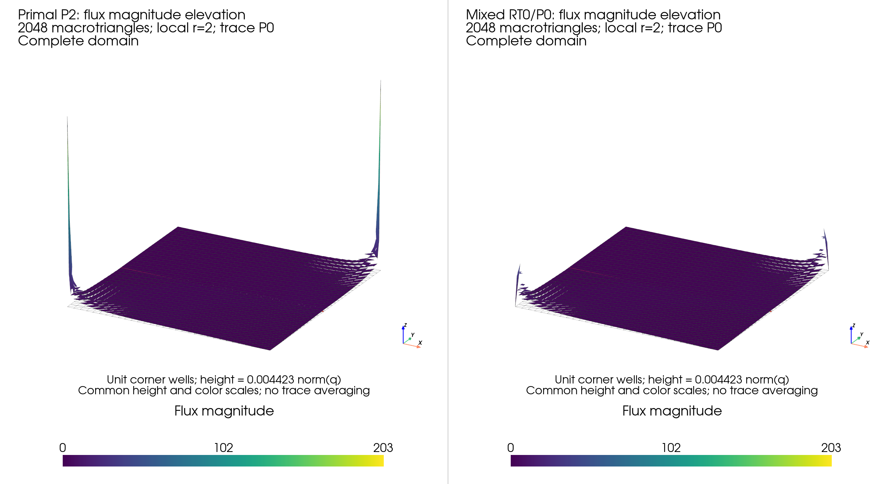
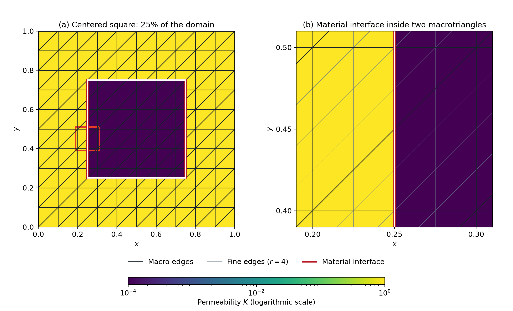

# Quarter-five spot: point wells and a low-permeability obstacle

The quarter-five-spot experiments have injection at (1,1), extraction at
(0,0), impermeable exterior boundaries and a zero domain-mean pressure.
With \(q=-K\nabla p\), injection has a positive source and extraction a
negative source. Pressure is higher near injection, and flux connects the two
wells while respecting material barriers.

## The published point-well problem

[Harder, Paredes and Valentin](https://doi.org/10.1016/j.jcp.2013.03.019),
§5.2, consider both K=1 and layered permeability. The lower layer has K=1000
and the upper layer K=1, with interfaces at y=0.5 and y=0.484375.


[Araya et al.](https://doi.org/10.1137/120888223), §6.3, explicitly model the
wells by Dirac loads and note the example's singular regularity. The numerical
functional used here is

$$
f(v)=v(1,1)-v(0,0).
$$

The unit intensity is an explicit normalization: the published discussion does
not provide a recoverable well rate. Each point load is shared between incident
macrocells in proportion to their actual angles. The weights sum to one,
preserving the prescribed total well rate. Primal Pk applies the exact discrete
point functional; the mixed P0 test space receives the integrated well rate in incident fine cells.
No finite-area source is substituted in this point-well experiment.

The comparison uses 32×32 squares split along the southwest-to-northeast
diagonal, 2048 macrotriangles, two local subdivisions and constant traces.
Primal pressure is P2; the mixed method is RT0/P0. The offset material interface
cuts macrotriangles but aligns with the fine mesh. The paper specifies its
resolution but not enough connectivity details to assert identical historical
matrices.


**Expected result.** Pressure has logarithmic corner singularities and flux
grows near both wells. Their peak values depend on mesh resolution and display
sampling; equal peak values on different meshes are not an accuracy criterion.
The solution is antisymmetric in pressure under a half-turn about the center,
with flux directed from injection toward extraction.


The red line is the material interface; dark edges are the macro mesh. The
high-permeability lower layer carries substantial flux with a comparatively
small pressure gradient. The offset case exercises transmission inside
macrocells. Broken fields are retained on both sides of every interface.

### The local-solver comparison in Figure 19

Figure 19 in §5.2.2 specifically uses the offset interface at
\(y=0.484375\), constant skeletal traces \(\ell=0\), and a structured macro
mesh with 32 triangles along each domain side. Each macrotriangle has two
subdivisions along each edge. The local pressure space is continuous P2 in
the primal method; the mixed local method uses the lowest-order
Raviart–Thomas element. Its plotted quantity is the magnitude of the
physical Darcy flux, denoted \(\sigma(p_h)\) in the article. The primal
flux is evaluated as \(-K\nabla p_h\); the mixed method approximates the
flux directly in RT0.




The corresponding PyMHM fields use the stated local spaces, refinement and
interface position, with 32×32 squares split along a fixed diagonal. The
point functional has unit injection and extraction rates. The article does
not specify a recoverable rate, the discrete allocation of the corner loads,
the exact macro connectivity, or the evaluation and interpolation used for
Figure 19. These are material qualifications near singular wells: a peak
read from a colorbar is not an integrated flux or a convergence measure.
The elevation views retain the calculated magnitudes without amplitude
rescaling. The recorded one-sided fields retain both sides of the material interface.


The full elevation view uses one common color range, 0–203.459, and a
common vertical scale for both methods. The nodal display peaks are
203.459 for P2 and 45.2838 for RT0. The detail view excludes each display
triangle intersecting the open disk of radius 0.125 around either well; it
uses a common range of approximately 0–6.004 to expose the interface.
Only the displayed geometry is restricted: the solutions, well rates and
conservation calculations are unchanged. Within each image, both panels
use the same camera and height scale. The
[view metadata](../figures/quarter-five-spot/point-flux-elevation.json)
records the sampling, excluded radius and physical color limits.

The article reports small localized oscillations near the interface for
primal local solves and a conforming H(div) flux for mixed local solves.
This distinguishes raw primal flux from RT0 normal-flux conformity;
pointwise agreement of their peaks is not expected merely from matching
the skeletal degree.

## Six refinements against an independent Green series

For K=1, separation of variables gives the zero-mean pressure

$$
p(x,y)=y-\tfrac12+\sum_{m=1}^{\infty}
\frac{2\cos(m\pi x)}{m\pi\sinh(m\pi)}
\left[(-1)^m\cosh(m\pi y)-\cosh(m\pi(1-y))\right].
$$

Differentiating gives the physical flux. Evaluation uses exponentially scaled
ratios and checks 2048 against 4096 terms. The comparison excludes balls of
radius 0.125 around both wells and measures area-weighted centroid RMS
differences. These are sampled diagnostics, not quadrature-certified L2 norms.


A two-dimensional Dirac source does not define a finite H1-energy pressure
solution. Consequently this experiment makes no finite-energy convergence or
L2-divergence claim at the wells. Macro conservation includes their exact
integrated rates, and the RT0 fine-cell balance includes the allocated rates.

From 128 to 4608 macrotriangles, sampled pressure RMS decreases from 0.01124
to 0.0003692, and flux RMS from 0.3511 to 0.06424. At the finest level,
doubling the series changes the flux away from wells by at most
8.3×10⁻¹⁰. Macro balance defects stay below 9.1×10⁻¹⁶.

MSL's native P1 primal formulation was also executed with the same point
functional and angular sharing: five macro resolutions from 2×2 to 32×32,
homogeneous and layered K, plus two segmented-trace checks. Across these
12 matched cases, the largest physical pressure and flux L2 differences
against PyMHM are 8.62×10⁻¹⁵ and 8.40×10⁻¹², respectively. This validates
the discrete point-load handling and primal operator against MSL; it does
not recover the unspecified historical well intensity or macro connectivity.

## Supplemental central obstacle

The square-obstacle quarter-five spot is a separate specified benchmark.
In the unit square, define

$$
a=0.25,\qquad b=0.75,\qquad D=[a,b]^2.
$$

The obstacle is centered at \((0.5,0.5)\), with side length
\(0.5\) and area **0.25**, or 25% of the domain. Its permeability is \(10^{-4}\),
against a background of 1:

$$
K(x,y)=\begin{cases}10^{-4},&(x,y)\in D,\\1,&(x,y)\notin D,\end{cases}
\qquad -\nabla\cdot(K\nabla p)=f,\qquad q=-K\nabla p.
$$

Fixed square wells use source −100 on \([0,0.1]^2\) and +100 on
\([0.9,1]^2\), hence integrated rates −1 and +1. These finite-area wells remain
unchanged during refinement. All exterior normal fluxes are zero, and pressure
has mean zero.


**Expected result.** Most flow bypasses the obstacle through the surrounding
permeable region. Pressure gradients can be steep near its corners, but normal
flux must balance across interfaces. Concentrated Darcy velocity in a thin
conductive corridor is physical. Verification includes material integrals, integrated well rates and the
linear-system residual.

The cross-code experiment uses 200 macrotriangles from a uniform 10×10
square grid, each split along its southwest-to-northeast diagonal. The
obstacle boundary crosses macrocell interiors: 38 macrotriangles contain
positive areas of both materials. The well boundaries
remain on macrofaces. Local refinement uses four, eight or sixteen
subdivisions per macroedge, with one or two constant trace segments.
These local meshes fit the material interface exactly: their coordinate
spacings are 0.025, 0.0125 and 0.00625, respectively. The permeability is
constant within each fine triangle, including those inside heterogeneous
macrocells. MSL uses native
`msl_mhm`/`msl_cg` primal P1 assembly. NeoPZ supplies the native RT0 operator,
with the prescribed boundary fluxes, macro trace restriction and mean gauge
applied to that operator. This algebraically restricted reference is distinct
from NeoPZ's native MHM controller. Each comparison verifies the original or
restricted physical equations before comparing fields.



### Material interfaces inside macrocells

The local solves retain the two permeability values within each cut
macrocell; they do not replace them by one averaged coefficient. The
primal method computes a continuous local P1 pressure and its raw flux
\(-K\nabla p_h\). That raw flux need not have continuous normal components
across fine faces. The mixed local method computes RT0 flux and P0
pressure, with \(\nabla\cdot RT0=P0\). Its normal-flux conformity and
fine-cell balance follow from the compatible mixed spaces and the
restriction of macroface fluxes to the prescribed skeletal space, as in
[Durán et al. (2019), §§3.2–3.3](https://doi.org/10.1016/j.cma.2019.05.013).
Normal continuity does not require tangential flux continuity across a
permeability jump.

Macro, local and skeletal resolution have distinct roles. The obstacle
interface crosses macrofaces at their midpoints: a one-segment trace
cannot represent separate values on the two material portions, whereas
two segments place an endpoint at the intersection. Refining the local
solves does not eliminate the approximation imposed by a fixed skeletal
space. In particular,
[Chaumont-Frelet, Paredes and Valentin (2026), §§3–6](https://doi.org/10.1016/j.camwa.2026.01.016)
derive strengthened estimates on nonaligned macro meshes under the
additional assumption that each skeletal subface belongs to one material
region. Here the two-segment configuration meets this geometric
condition; the one-segment configuration does not. The present
comparison verifies matching discrete operators with submacro
heterogeneity; it does not claim that convergence result or a computation
with material interfaces cutting the fine elements.

### Classical mixed reference

A classical global RT0/P0 reference retains independent normal-flux
degrees of freedom on all fine faces, including those crossing the macro
skeleton. The MHM flux instead belongs to the subspace defined by the
one- or two-segment macro trace restrictions. Comparing these spaces on
the same material-aligned fine mesh separates the effect of the skeletal
restriction from local refinement. Successive classical refinements
measure reference sensitivity; this numerical reference is not an exact
solution. Both formulations impose zero exterior normal flux and zero
mean pressure.

The classical reference uses local-equivalent subdivisions \(r=4,8,16\).
Its successive relative flux difference is
\(\|q_{r}-q_{r/2}\|_{L^2}/\|q_r\|_{L^2}\), with the corresponding
definition for pressure. Fields on nested meshes are compared by
integration on the finer triangles. The MHM trace study holds \(r=16\)
fixed and uses one, two or four segments per macroface, with differences
normalized by the finest classical field norm. The last classical
refinement increment provides a sensitivity scale, not an error bound.

| Classical refinement | Fine triangles | Free flux and pressure unknowns | Relative pressure change | Relative flux change |
| --- | ---: | ---: | ---: | ---: |
| 4 | 3,200 | 7,920 | — | — |
| 8 | 12,800 | 31,840 | 2.06108% | 5.30059% |
| 16 | 51,200 | 127,680 | 1.02736% | 2.99132% |

The unknown counts exclude exterior fluxes fixed to zero and the additional
mean-pressure multiplier. The finest field norms are
\(\|p\|_{L^2}=0.7536654\) and \(\|q\|_{L^2}=1.9328324\).
NeoPZ supplies the native RT0/P0 matrices and field evaluation; SciPy
SuperLU solves the global system with the physical mean-pressure gauge.
The three-point positive triangular quadrature integrates the squared
RT0 and P0 differences exactly on these nested affine meshes, up to
floating-point evaluation and summation.
The classical fields satisfy
\(\int_\Omega K^{-1}|q_h|^2=\int_\Omega p_h f\) with a relative
defect below 1.10×10⁻¹⁴; the relative residual of the original free
algebraic equations is at most 7.07×10⁻¹¹. The energy identity uses the
homogeneous normal-flux boundary condition and the resolved source.

| MHM trace segments per macroface, at \(r=16\) | Pressure difference / classical pressure norm | Flux difference / classical flux norm |
| ---: | ---: | ---: |
| 1 | 26.5680% | 42.8987% |
| 2 | 0.422949% | 6.20369% |
| 4 | 0.0946676% | 2.54342% |

The two-segment trace resolves the midpoint material intersections;
four segments further enrich the same RT0/P0 MHM approximation. The
four-segment result is an additional PyMHM experiment, separate from
the twelve matched MSL/NeoPZ cases below. The classical flux changes
by 2.99132% on its last refinement, so these percentages remain
differences between numerical fields. They are not certified errors
against the exact PDE solution, including when the MHM/classical
difference is smaller than that last refinement increment.


### Matched MHM fields

| Reference | Matched configurations | Largest pressure L2 difference | Largest flux L2 difference |
| --- | ---: | ---: | ---: |
| MSL `msl_mhm` + `msl_cg`, primal P1 | 6 | 9.11×10⁻¹² | 2.07×10⁻¹² |
| NeoPZ `EHDivConstant`, restricted RT0/P0 | 6 | 2.17×10⁻¹² | 1.13×10⁻¹² |

The largest macro conservation defect is 1.11×10⁻¹⁵. The native MSL and
restricted NeoPZ relative algebraic residuals are at most 2.58×10⁻¹⁴ and
9.41×10⁻¹⁴, respectively. The native RT0 fine-cell balance defect is at
most 8.12×10⁻¹⁵. These compare matching discrete formulations; agreement
between codes does not by itself measure their error against the exact PDE
solution.


The component panels display signed \(q_x\) and \(q_y\), with symmetric
color scales centered at zero and a shared range for each reference/PyMHM
pair. The arrows show the normalized vector \(q/|q|\) at actual fine-cell
centroids selected by spatial bins. The same centroids are used for both
implementations; their plotted length is fixed at 0.035 in unit-domain
coordinates. Arrow length does not encode flux magnitude: the underlying color
field supplies the magnitude. No field interpolation or averaging across
material interfaces is applied.

Difference panels use
their own small color scales; their patterns must be interpreted against the
reported absolute values. Flux difference means the norm of the **vector
difference**, not subtraction of the two magnitudes.

The numerical records identify MSL core revision `7f15f455`, CG `afb76d14`,
MHM `4cb8cf81`, and [NeoPZ](https://github.com/labmec/neopz) revision
`4c6b6d27`. Full revisions, quadrature orders, source fingerprints, gauge
conventions and original-equation residuals accompany each archived case.

## Reproduction

```bash
pixi run -e notebooks python examples/plot_quarter_spot.py
pixi run -e notebooks gallery-quarter-elevation
pixi run -e notebooks gallery-quarter-geometry
pixi run -e notebooks gallery-quarter-reference
pixi run -e notebooks gallery-quarter-classical
```

The source program reproduces the PyMHM point-well cases and analytical-series
comparison. `--reuse-results` redraws archived fields without recomputing them.
Reference-program numerical arrays, revisions and measured differences are
available in the accompanying records. The second command redraws the
offset-layer elevation views. The geometry command displays the material
cuts through macrocells and the fitted local mesh. The reference command
renders the archived square-obstacle comparisons, including signed components and
vector directions, without executing the reference programs. The classical
command renders the unrestricted RT0 reference and trace-enrichment study.
Notebook 22
checks the geometry and well rates and displays these records.
