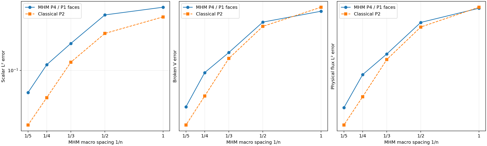
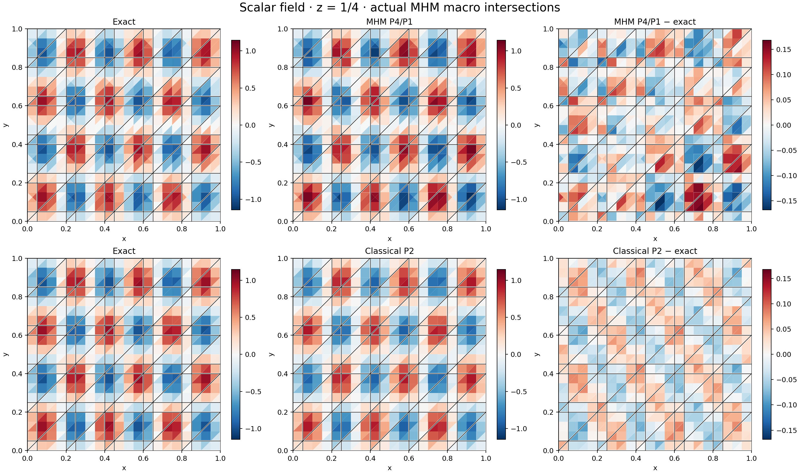
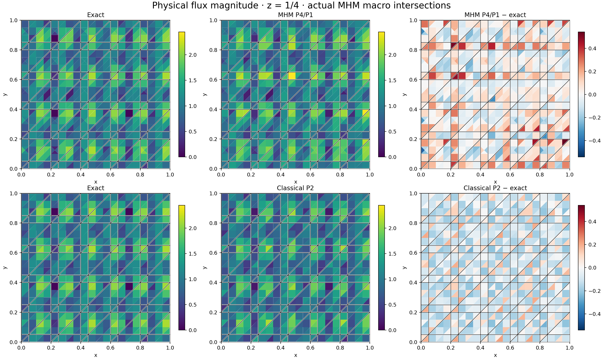

# Three-dimensional reaction–advection–diffusion

`solve_rad_3d` solves

$$
-\nabla\cdot(K\nabla u)+\nabla\cdot(\beta u)+c u=f
$$

on affine tetrahedral macrocells. Local continuous Lagrange spaces accept any
positive degree through the [general tetrahedral Pk evaluator](tetra-pk.md).
`TriangularSkeleton` selects independent Bernstein Pk modes on each
triangular macroface subdivision, with different degrees and dyadic partitions
per face when desired. Physical node identity uses integer barycentric weights
on shared vertices, edges and faces, without merging nearby geometric points.

## Local equation and boundary convention

The local form is

$$
a_K(u,v)=(K\nabla u,\nabla v)_K
+\tfrac12(\beta\cdot\nabla u,v)_K
-\tfrac12(u,\beta\cdot\nabla v)_K
+((c+\tfrac12\nabla\cdot\beta)u,v)_K.
$$

Its skeletal variable is the outward **Robin flux**
\(\lambda=(-K\nabla u+\beta u/2)\cdot n\).
It differs from the physical conservative flux
\(q=-K\nabla u+\beta u\). The `neumann` argument prescribes this Robin quantity;
remaining exterior faces receive weak Dirichlet moments. The classical comparison
API `solve_rad_3d_conforming` instead imposes strong nodal Dirichlet data on the
entire exterior boundary and has no macro skeleton.

The implementation accepts scalar or SPD tensor diffusion and spatial callbacks.
A variable velocity requires `velocity_divergence`; SUPG with variable diffusion
also requires `diffusion_divergence`. It checks
\(c+\nabla\cdot\beta/2\ge0\) at quadrature points. This is an input check, not a
certificate between quadrature points. Tetrahedral quadrature is positive; there
is no three-dimensional material-intersection integration in this API.

`stabilization="supg"` adds the consistent term
\((\tau(\mathcal L u-f),\beta\cdot\nabla v)_K\), with the complete conservative
operator

$$
\mathcal L u=-K:\nabla^2u-(\nabla\cdot K)\cdot\nabla u
+\beta\cdot\nabla u+(c+\nabla\cdot\beta)u.
$$

The positive parameter is
\(\tau=[(2|\beta|/h)^2+(4\lambda_{\max}(K)/h^2)^2+
(c+\nabla\cdot\beta)^2]^{-1/2}\), evaluated at quadrature points, with fine-tetrahedron
diameter \(h\). No discrete maximum principle is asserted. The published
oscillatory case below uses **Galerkin local problems**, without SUPG.

Physical constant modes remain in the coarse space for nonzero reaction or
advection, including arbitrarily small coefficients. A prescribed global mean
is allowed only for all-Robin data with zero reaction, divergence-free
exterior-tangent velocity and a representable constant mode. The original
physical equations are checked after imposing that gauge. Local factories
support serial, thread and spawned-process assembly and condensation.

The example helpers below are repository sources, supplied separately from the
installed library. Open the corresponding notebook to acquire its verified
companion, as described in the [notebook guide](../tutorials/notebooks.md#execute-downloaded-notebooks).

```python
from pymhm import assemble
from pymhm.meshes.tetrahedron import TetraMesh
from pymhm.fem.traces.triangle_3d import TriangularSkeleton
from examples.formulations.transport_3d import define_transport_3d
from examples.formulations.scalar_3d import scalar_constraints_3d, recover_transport_3d

mesh = TetraMesh.unit_cube(2)
definition = define_transport_3d(
    mesh,
    diffusion=0.1,
    velocity=(1.0, 0.0, 0.0),
    source=1.0,
    degree=4,
    skeleton=TriangularSkeleton(mesh, degree=1),
    local_refinement=2,
)
system = assemble(definition.problem)
coefficients = system.solve(constraints=scalar_constraints_3d(definition, system))
solution = recover_transport_3d(definition, system, coefficients)
```

The editable provider declares `LocalEquations(A, f, B, -B.T, dofs)` from
public volume integration and oriented trace pairings. `neumann`, coefficient
derivatives, Galerkin/SUPG, `coarse_space="constants"` or `"kernel"`, and
`mean_value` are explicit mathematical inputs. Assembly independently accepts
`ExecutionConfig` and `SolverConfig`; no prepared physical solver is required.
`conforming_transport_3d` in the same example module assembles the original
continuous-Pk global matrix with strong exterior nodal values. Both definitions
are importable after cloning the repository.


## Oscillatory case from the literature

Section 5.2.1 and Figure 4 of
[Araya et al. (2024)](https://doi.org/10.1016/j.cma.2024.117089) use the unit cube,
\(K=0.1I\), \(\beta=(1,0,0)\), \(c=0\), and

$$
u=\sin(6\pi x)\sin(4\pi y)\sin(2\pi z),\qquad
f=5.6\pi^2u+6\pi\cos(6\pi x)\sin(4\pi y)\sin(2\pi z).
$$

Homogeneous Dirichlet data apply to the complete exterior. The present study
uses the published local P4 and skeletal P1 degrees. Its deterministic
Freudenthal macro grids and eight red-refined tetrahedra per local mesh differ
from the irregular tetrahedra in the paper. It is an analytical convergence
study of the published problem and spaces, not a claim of identical historical
mesh data.

Five macro grids use \(n=1,2,3,4,5\) Cartesian subdivisions per coordinate.
Each classical P2 solution uses \(2n\) subdivisions and strong exterior data,
so its fine Cartesian spacing agrees with the MHM local spacing. The two
approximations differ in both local degree and global trial space. The record
states the MHM global unknown count and the classical nodal count; the latter
includes prescribed exterior nodes. Each method is compared directly with the exact
field, giving an independent refinement check for the classical solution.

Errors include scalar L2, broken H1 seminorm, physical flux L2, and the paper's
scaled broken norm
\(\|e\|_V^2=|e|_{1,\mathcal T}^2+\|e\|_0^2/d_\Omega^2\), with
\(d_\Omega^2=3\). Assembly and error integration use order eight; order ten
provides a separate finest-grid norm check.

| Macro subdivisions \(n\) | Macro tetrahedra | MHM scalar L2 | Classical scalar L2 | MHM physical-flux L2 | Classical physical-flux L2 |
|---:|---:|---:|---:|---:|---:|
| 1 | 6 | 0.448111 | 0.356147 | 0.884244 | 0.896132 |
| 2 | 48 | 0.373379 | 0.240551 | 0.731636 | 0.688079 |
| 3 | 162 | 0.189711 | 0.121453 | 0.479814 | 0.445553 |
| 4 | 384 | 0.114369 | 0.0523045 | 0.364196 | 0.270825 |
| 5 | 750 | 0.0590406 | 0.0273004 | 0.234279 | 0.185853 |

Both methods reduce all reported errors along these five refinements. The
finest MHM problem has 5,700 global trace and retained-mode unknowns; the
classical P2 space contains 9,261 nodes, including prescribed exterior nodes.
The respective broken V errors are 2.31862 and 1.83843. The classical solution
has smaller scalar and flux errors on this finest grid; these data do not
establish an accuracy or performance advantage for the MHM configuration.
The oscillatory field remains incompletely resolved by both approximations.
Changing the finest error quadrature from order eight to ten changes every
reported norm by at most \(1.42\times10^{-10}\) relatively. Both algebraic
backward residuals remain below \(4.23\times10^{-16}\).



[Convergence SVG](../figures/rad3d/convergence.svg).



[Scalar field SVG](../figures/rad3d/scalar.svg).



[Physical flux SVG](../figures/rad3d/flux.svg).

Each polygon is the actual intersection of a fine tetrahedron with the plane
\(z=1/4\), colored by its own polynomial value at the polygon centroid. Thick
lines show the actual MHM macro intersections in every panel. No interpolation
or averaging connects independent macro traces. Both methods share physical
color limits and centered difference limits. The integrated norms use the full
volume fields rather than the displayed centroid samples.

## Independent verification and reproduction

Tests verify P1–P4 cardinality, exact polynomial gradients and Hessians,
topological continuity, anisotropic and variable-coefficient affine patches,
Neumann means, vanishing transport/reaction, and process/serial equality.
Optional native tests independently assemble P3/P4 Galerkin and full-residual
SUPG matrices and loads with Basix/DOLFINx/UFL on a distorted tetrahedron.

```bash
pixi run --locked -e test-core python -m examples.solve_rad3d
pixi run --locked -e notebooks python -m examples.plot_rad3d
pixi run --locked -e fem pytest tests/test_rad3d.py -m fem
```

The [numerical record](https://github.com/ipes-lncc/pymhm/blob/main/examples/results/rad3d.json)
stores all five levels, quadrature checks, field digests and acquisition-source
hashes. Notebook `41_rad3d.ipynb` combines a small patch with replay of these
results and figures.

## References

- Rodolfo Araya, Fabrice Jaillet, Diego Paredes, and Frédéric Valentin (2024). *Generalizing the multiscale hybrid-mixed method for reactive-advective-diffusive equations*, Computer Methods in Applied Mechanics and Engineering 428, 117089. [DOI: 10.1016/j.cma.2024.117089](https://doi.org/10.1016/j.cma.2024.117089).
