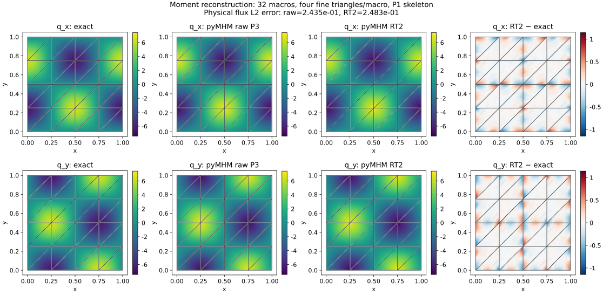
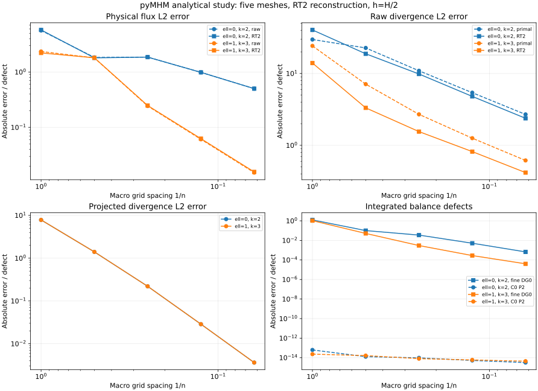

# RT flux reconstruction by moments

`reconstruct_darcy_moments` implements the face and volume moments in
[Barrenechea et al. (2026)](https://doi.org/10.1137/24M1673073), equations
(4.9) and (5.1). It takes a primal MHM pressure and constructs a globally
H(div)-conforming Raviart–Thomas flux. Mathematical orders RT0, RT1 and RT2
are available on affine triangles. The RT2 vector space has 15 degrees of
freedom per triangle: three normal moments on each edge and six interior
vector moments.

This is separate from the [energy-based RT0 reconstruction](https://github.com/ipes-lncc/pymhm/blob/main/docs/cases/darcy.md#conservation-skeleton-raw-gradient-and-recovered-field).
The moment construction does not solve an equilibrium minimization problem
and does not impose an independent mass balance in every fine cell.

## Definition and signs

Let \(q_h=-K\nabla p_h\) be the broken primal flux. On a fine triangle \(T\),
construct \(\sigma_h\in\mathrm{RT}_m(T)\) from

$$
\begin{aligned}
\int_e\sigma_h\cdot n_e\,\mu
  &=\int_e\lambda_h^{(n_e)}\,\mu,
  &&e\subset\partial K,\\
\int_e\sigma_h\cdot n_e\,\mu
  &=\int_e\{q_h\}\cdot n_e\,\mu,
  &&e\subset\operatorname{int}K,\\
\int_T\sigma_h\cdot v
  &=\int_Tq_h\cdot v,
  &&v\in[\mathbb P_{m-1}(T)]^2.
\end{aligned}
$$

The face test functions satisfy \(\mu\in\mathbb P_m(e)\), and braces denote
the arithmetic average of the two physical one-sided values. The notation
\(\lambda_h^{(n_e)}\) means the skeletal normal flux expressed in the
direction \(n_e\). pyMHM stores
\(\lambda_h=q\cdot n_e\) relative to the global face normal. The paper uses
the opposite multiplier sign, hence its boundary formula contains
\(-\lambda_H\). Oriented normal moments and the contravariant Piola transform
account for local outward normals and polynomial reversal.

The skeletal degree must not exceed \(m\), and every skeletal partition point
must coincide with a fine boundary vertex. The native wrapper requires
\(m\leq k\), where \(k\) is the primal pressure degree. The optimal flux
estimates in the paper additionally assume \(k\geq\ell+2\) in two dimensions,
where \(\ell\) is the skeletal degree, together with the stated mesh,
coefficient and solution regularity assumptions. An accepted API input alone
does not establish those estimates.

```python
import numpy as np
from pymhm import FaceSpace, SkeletonSpace, TriangleMesh
from pymhm._legacy.models.darcy.primal import solve_darcy
from pymhm.recovery.moments import reconstruct_darcy_moments

mesh = TriangleMesh.unit_square(4)
skeleton = SkeletonSpace(mesh, tuple(FaceSpace.uniform(1) for _ in mesh.faces))
pressure = solve_darcy(
    mesh, skeleton=skeleton, degree=3, local_refinement=2,
    source=lambda x: 8*np.pi**2*np.sin(2*np.pi*x[:, 0])*np.sin(2*np.pi*x[:, 1]),
    quadrature_order=8,
)
flux = reconstruct_darcy_moments(pressure, degree=2)
```

For a custom local discretization, `reconstruct_flux_moments` accepts one
`raw_flux(points, fine_cell_indices)` evaluator per macrocell. This allows
explicit one-sided values for a discontinuous material. The native wrapper
can use the same evaluators through `raw_fluxes`. Its default permeability
callback is evaluated at the actual physical face points; when permeability
jumps across an interior fine face, supply the one-sided evaluators. No
coordinate perturbation or averaging of material coefficients is inferred.
Discontinuities solely on macrofaces are handled by the skeletal normal data.

## What is conserved

Proposition 4.3 concerns the **continuous** macro-local test space:

$$
(\operatorname{div}\sigma_h-f,v)_K=0,
\qquad v\in C^0(K)\cap\mathbb P_m(\mathcal T_h^K).
$$

For \(m=0\), that space contains one constant per macrocell. It does not
contain independent constants on each fine triangle. Accordingly:

| Method | Quantity |
|---|---|
| `continuous_moment_residuals()` | Moments against continuous local Pm |
| `conservation_residuals()` | Integrated balance per macrocell |
| `fine_conservation_residuals()` | Measured fine-cell balance defects, generally nonzero |
| `normal_flux_residuals()` | Boundary normal moments minus the skeletal moments |
| `divergence_l2_error(f)` | Error of the raw RT divergence |
| `projected_divergence_l2_error(f)` | Error of its L2 projection onto continuous local Pm |

The continuous projection satisfies the higher-order approximation property
in Theorem 4.4. It is not the raw RT divergence. When a macrocell contains only
one fine triangle, the two polynomial spaces coincide and the distinction
disappears. Diagnostics use the recorded reconstruction quadrature; a higher
order error norm measures approximation independently. Nonpolynomial inputs
retain the usual quadrature error.

## Smooth sine study

Use the analytical data of section 6.1,

$$
p=\sin(2\pi x)\sin(2\pi y),\qquad
K=I,\qquad f=8\pi^2p,
$$

with zero boundary pressure. The study compares \((\ell,k)=(0,2)\) and
\((1,3)\), RT2 reconstruction, and four fine triangles per macrotriangle.
There are five macro grid resolutions, \(n=1,2,4,8,16\), with the diagonal
triangulation defined by `TriangleMesh.unit_square`. Assembly uses quadrature
order eight and physical error norms use order ten.

These are pyMHM analytical results. They do not claim agreement with digitized
ordinates or execute the paper's **FreeFem++** implementation.



The flux map uses 32 macrotriangles, P1 skeletal traces and P3 primal locals.
It preserves separate fine-cell values. Every analytical, numerical and
error panel displays the actual macro mesh; exact and numerical flux panels
share color scales. The reconstruction enforces normal conformity but does
not promise a smaller L2 error for every finite discretization.


The last row is a projection, explicitly identified as such. At this mesh,
the L2 divergence errors are 2.69947 for the primal flux, 1.55194 for the RT2
flux, and 0.220082 for the continuous P2 projection. The flux L2 errors are
0.243490 and 0.248253 respectively: normal conformity and divergence accuracy
improve here without a flux L2 improvement.



At the finest level the measured errors are:

| Skeletal / primal degrees | Raw flux L2 | RT2 flux L2 | Raw RT2 divergence L2 | Projected divergence L2 |
|---|---:|---:|---:|---:|
| P0 / P2 | 0.501010 | 0.500989 | 2.37786 | 0.00362392 |
| P1 / P3 | 0.0152811 | 0.0157188 | 0.416997 | 0.00362392 |

The projected-divergence rate between the final two meshes is 2.984. All
continuous moments in the study are below \(6.2\times10^{-14}\), while
the fine-cell integrated defects at the finest level are
\(6.63\times10^{-4}\) and \(4.01\times10^{-5}\), respectively.

The two projected-divergence curves overlap because both satisfy the same
continuous P2 moments of the same source on the same mesh. Coarse under-resolved
levels can have nonmonotone flux or pressure errors. The fine-cell integrated
defects shown in the last panel are generally nonzero, consistently with
equilibrium against continuous macro-local tests. Spatial maps sample each
fine triangle on sixteen display triangles, without merging one-sided traces;
quadrature norms are independent of that display interpolation.

## Verification and scope

Portable tests check canonical RT duality, Piola orientation, polynomial
reproduction, divergence-commuting interpolation, all volume moments, normal
continuity within and between macrocells, continuous-test equilibrium, and
nonzero fine-cell defects. Three native **DOLFINx/Basix RT** tests independently
compare physical interpolation and UFL divergence for RT0, RT1 and RT2. Basix
numbers those spaces with degrees 1, 2 and 3 respectively. The divergence is
compared through its exact discontinuous polynomial representation, without
smoothing.

The implemented orders and affine triangular geometry are explicit limits.
The moment flux alone is not a complete guaranteed a posteriori estimator:
the paper also requires a conforming potential reconstruction, divergence
correction and data oscillation terms with their assumptions.

```console
pixi run -e notebooks python examples/plot_reconstruction_moments.py
```

The [archived numerical records](https://github.com/ipes-lncc/pymhm/blob/main/examples/results/reconstruction-moments.json)
and notebook `18_reconstruction_moments.ipynb` expose the measured errors and
conservation quantities.

## References

- Gabriel R. Barrenechea, Larissa Martins, Weslley Pereira, and Frédéric Valentin (2026). *An H(div; Ω)-Conforming Flux Reconstruction for the Multiscale Hybrid-Mixed Method*, Multiscale Modeling & Simulation 24(2), 399–428. [DOI: 10.1137/24M1673073](https://doi.org/10.1137/24M1673073).
