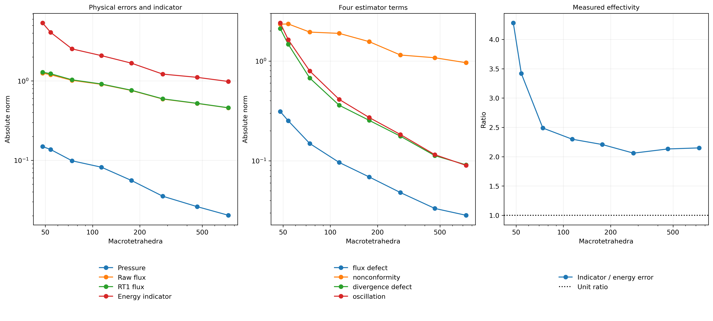
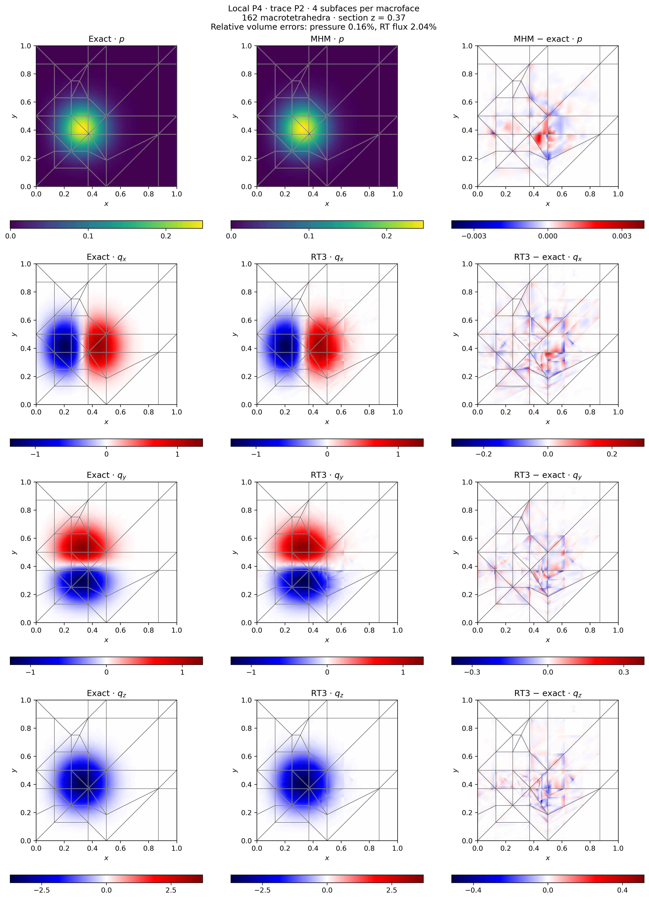
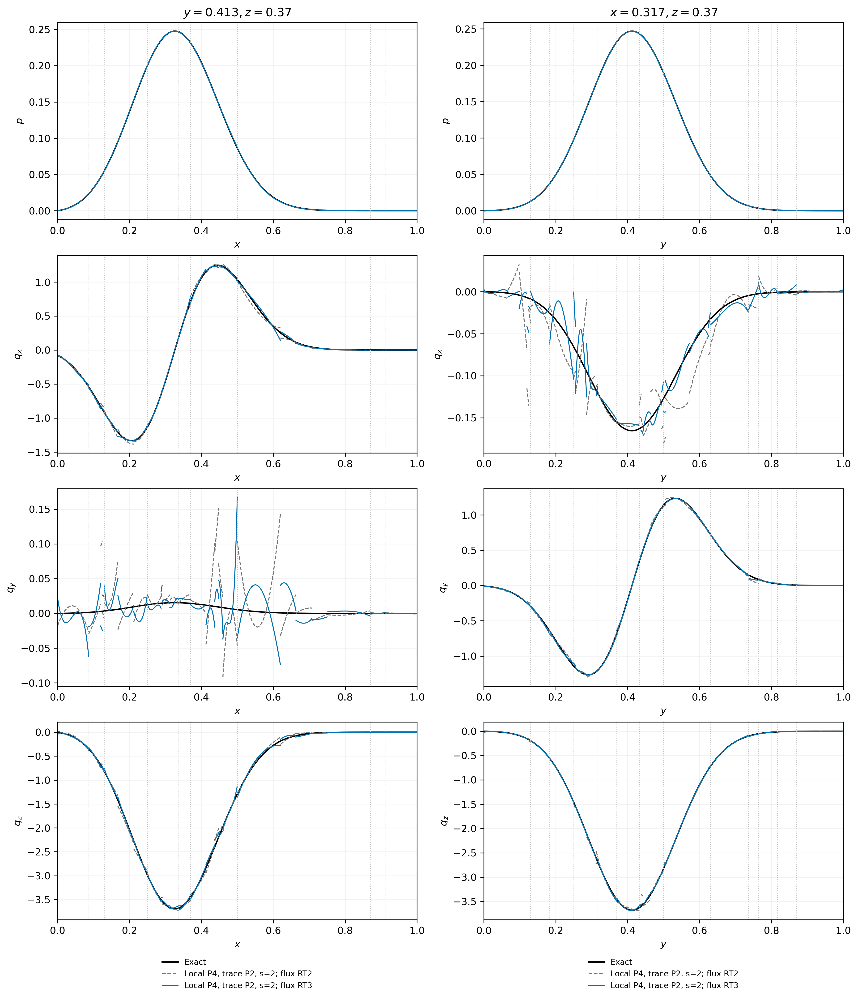

# Tetrahedral flux reconstruction and adaptive resolution

The three-dimensional construction uses the canonical Raviart–Thomas moments
and energy decomposition of [Barrenechea et al. (2026)](https://doi.org/10.1137/24M1673073). Their analysis explicitly treats
dimensions two and three. This page uses analytical cube problems to verify the
three-dimensional implementation; these are not historical numerical figures
from the paper.

## Spaces and physical conventions

The pressure solves

$$
-\nabla\cdot(A\nabla p)=f,\qquad q=-A\nabla p,\qquad
p=0\quad\text{on }\partial(0,1)^3.
$$

The local continuous space has degree \(k\), the macroface normal-flux space
has degree \(\ell\), and the reconstructed space is \(\mathrm{RT}_m\) on every
fine tetrahedron. The sufficient polynomial condition in Theorem 5.2 is

$$
k\geq\ell+d,\qquad \ell\leq m\leq k.
$$

Thus a tetrahedral estimator with constant skeletal traces requires at least
local \(P_3\). A degree-one skeletal space requires at least local \(P_4\).
The reported uniform and adaptive estimator sequences use local \(P_3\),
eight fine tetrahedra per macrocell, skeletal \(P_0\), and RT1 reconstruction.
The API checks the spatial dimension explicitly. Canonical RT moment
construction itself has a weaker algebraic requirement; its existence alone
does not establish the hypotheses of this error estimate.

The theorem's skeletal space has independent polynomial tests on each
subtriangle. The local efficiency argument uses a constant test supported on
one such subface to obtain its zero mean pressure jump. A continuous macroface
with several subtriangles does not contain those tests and is rejected by
`estimate_darcy_error_3d`. A continuous face with one subtriangle has the same
polynomial space as a discontinuous face. `reconstruct_darcy_moments_3d`
remains available for subdivided continuous traces; its shared-coefficient
evaluation establishes an algebraic reconstruction, not the cited estimate
for that different test space.

Boundary RT moments equal the physical skeletal flux moments. Interior fine-face
moments use the arithmetic average of the two incident raw fluxes, with their
separate material traces. Interior vector moments use the raw physical gradient.
No display interpolation enters these equations.

The reconstruction satisfies

$$
\int_K(\nabla\cdot q_h-f)v_h=0
\qquad\text{for every continuous local }v_h\in P_m.
$$

These are continuous-test moments. They do not impose a separate source balance
on every fine tetrahedron. Numerical records retain both diagnostics.

## Exact solutions and integration

For the uniform sequence, use
\(p(x,y,z)=\sin(\pi x)\sin(\pi y)\sin(\pi z)\).
The localized adaptive problem is

$$
\begin{aligned}
p(x,y,z)&=100\prod_{i=1}^3
x_i(1-x_i)\exp[-30(x_i-c_i)^2],\\
c&=(0.3,0.4,0.6).
\end{aligned}
$$

Analytical derivatives supply the source and all three physical flux components.
The independently integrated exact norms for the localized problem are
\(\lVert p\rVert_{L^2}=0.1216558888886656\) and
\(\lVert q\rVert_{L^2}=1.2583314573562623\).
The reference norm integration uses tensor Gauss rules of orders 32 and 40;
independent separable one-dimensional quadrature confirms these values.
Reported relative errors divide by these physical volume norms.

Assembly and estimation use quadrature order 12. Error norms use two independent
orders, 12 and 14. The records retain their differences. These are numerical
quadrature checks, not interval-certified integral bounds.

## Uniform and adaptive estimator studies

The uniform sequence uses \(n=1,2,3,4,5\), with \(6n^3\) macrotetrahedra.
The adaptive sequence starts from 48 macrotetrahedra, selects a minimal Dörfler
bulk set with \(\theta=0.5\), and bisects conforming edge stars.
The geometry transfer preserves parent volumes, boundary labels and physical
Neumann data when present. This refinement policy is an original implementation;
no optimal-complexity or shape-regularity theorem is inferred from this sequence.

The four terms are the material-weighted flux defect, Oswald nonconformity,
continuous-projection divergence defect and data oscillation. For identity
diffusion their normalization coincides with the printed estimator.
The effectivity divides the total indicator by the independently integrated
broken energy error. Indicator reduction and field accuracy are reported
separately.

| Uniform macrocells | Relative pressure error | Relative RT1 flux error | Effectivity |
|---:|---:|---:|---:|
| 6 | 44.6844% | 60.8519% | 3.3788 |
| 48 | 33.3879% | 48.6713% | 1.7437 |
| 162 | 15.8995% | 33.7506% | 1.6595 |
| 384 | 9.1702% | 25.6828% | 1.6448 |
| 750 | 5.9378% | 20.6871% | 1.6405 |

The final uniform interval gives observed orders 1.95 for pressure and 0.97
for RT1 flux when measured against \(H=1/n\). The constant skeletal space
remains a low-order approximation even with cubic local pressure. These
five points verify decreasing errors and measured effectivity; they do not
make the finest field an accurate reference solution.


For the localized problem, all eight adaptive states retain the same
P3/P0/RT1 degrees and eight fine tetrahedra per macrocell. The indicator
\(\eta\) below is an absolute energy-scale quantity. Its effectivity is
\(\eta/\lVert\nabla(p-p_h)\rVert_{L^2(\mathcal T_H)}\), rather than a ratio
to the reconstructed-flux error.

| State | Macrocells | Relative pressure error | Relative RT1 flux error | Indicator \(\eta\) | Effectivity |
|---:|---:|---:|---:|---:|---:|
| 0 | 48 | 122.6317% | 102.2120% | 5.363611 | 4.2811 |
| 1 | 54 | 112.5743% | 97.8426% | 4.088370 | 3.4179 |
| 2 | 74 | 81.0567% | 82.0158% | 2.528290 | 2.4889 |
| 3 | 114 | 67.2968% | 72.6131% | 2.079804 | 2.2978 |
| 4 | 177 | 45.8101% | 60.6013% | 1.671476 | 2.2074 |
| 5 | 280 | 29.0417% | 47.2582% | 1.217821 | 2.0604 |
| 6 | 464 | 21.4581% | 41.4809% | 1.108717 | 2.1317 |
| 7 | 734 | 16.7026% | 36.4593% | 0.983538 | 2.1498 |

Macro refinement reduces the indicator by 81.66% and both physical errors
decrease throughout the sequence. Nevertheless, the final constant-trace field
still has a 36.46% reconstructed-flux error. The raw-flux error is similarly
large, 36.36%, so reconstruction alone does not resolve this approximation.
The final nonconformity term is 0.961622, the largest estimator contribution.
Effectivity remains above one in these measurements but is not monotone.
The sequence verifies estimator-guided refinement under the stated degree
conditions; it does not establish that this macro budget sufficiently resolves
the localized solution.

The maximum continuous-test equilibrium residual over the eight states is
\(1.63\times10^{-15}\), and the largest absolute change in the error norms
between quadrature orders 12 and 14 is \(1.46\times10^{-10}\).
These checks distinguish algebraic equilibrium and integration from the
remaining physical approximation error. The fixed-geometry comparisons below
separately test the effect of enriching the constant skeletal space.




The second figure shows the 734-macrocell constant-trace state from the table,
including its signed errors. The enriched P4/P2 fields later on this page
belong to a separate approximation-space study.

## Local and skeletal resolution

A separate fixed-macrogeometry comparison changes local and skeletal spaces
independently. Raising the local degree while retaining one constant flux
coefficient per macroface need not resolve the physical field. The trace
comparison therefore includes quadratic modes and subface refinement, with
unchanged geometry, source and material.

All configurations use the same 162 macrotetrahedra and eight local
tetrahedra per macrocell. Subdivision \(s=2\) divides each triangular macroface
into four triangular subfaces. The table reports relative volume \(L^2\) errors.

| Local pressure | Trace degree | Subdivision | Global trace DOFs | Pressure | Raw flux | Reconstructed flux |
|---|---:|---:|---:|---:|---:|---:|
| P2 | 0 | 1 | 351 | 56.0870% | 65.1609% | 65.5165% (RT1) |
| P4 | 0 | 1 | 351 | 56.1706% | 64.8769% | 65.4013% (RT1) |
| P4 | 2 | 1 | 2,106 | 2.0470% | 6.1738% | 6.9367% (RT2) |
| P4 | 2 | 2 | 8,424 | 0.1598% | 1.0871% | 3.2424% (RT2) |
| P4 | 2 | 2 | 8,424 | 0.1598% | 1.0871% | 2.0420% (RT3) |

The nearly unchanged errors in the first two rows identify a limitation of
the constant macroface trace. Adding quadratic trace modes and then subfaces
resolves the localized field. Reconstruction does not minimize the physical
flux error: its prescribed normal and interior moments can produce a larger
\(L^2\) error than the raw gradient. In particular, RT2 does not contain the
complete cubic gradient space of a P4 pressure.

The RT3 row reconstructs the **same archived P4 solution**, without another
primal solve. RT3 contains its cubic raw gradient, but the prescribed macroface
moments and averaged interior-face moments can still change that gradient.
Here the higher reconstruction order reduces the physical error from 3.2424%
to 2.0420%; it does not reach the raw-gradient error. Its maximum continuous-test
equilibrium residual is \(2.43\times10^{-15}\), while its maximum fine-cell
source-balance defect is \(9.83\times10^{-4}\). These measure different conditions.

This control uses error quadrature orders 10 and 12; the largest absolute norm
difference is \(2.14\times10^{-10}\). The maximum integrated macrocell balance
residual is \(1.95\times10^{-16}\). Balance is a separate invariant and does not
explain the substantial accuracy differences between these spaces.

This comparison evaluates physical errors directly. A \(P_4/P_2\) local/trace
pair is not assigned the estimator theorem above, which requires \(P_5\) for
\(\ell=2\) in three dimensions. This distinction preserves both the valid
approximation experiment and the theorem's actual hypotheses.
The [P5/P2 study](https://github.com/ipes-lncc/pymhm/blob/main/docs/cases/tetra-pk.md) supplies the corresponding admissible
degree pair, with five uniform macro resolutions and a separate RT2/RT3
comparison on the same 162-macrocell geometry.

## Fields and one-sided profiles

An independent DOLFINx/UFL assembly constructs the uncondensed saddle matrix,
including stiffness, source, physical face normals and Bernstein trace moments.
Five comparisons cover \(P_2/P_0\), \(P_3/P_0\) and \(P_4/P_2\) local/trace
pairs on 6 or 48 macrotetrahedra. The largest full system has 8,640 unknowns.
Maximum relative coefficient differences are \(2.18\times10^{-13}\) for
pressure and \(1.50\times10^{-13}\) for the multiplier; the largest complete
system residual is \(8.31\times10^{-15}\).
The [native verification record](../figures/reconstruction3d/native-saddle-verification.json)
states the operators, integration and versions. These comparisons verify the
discrete equations independently of condensation. They are distinct from the
physical approximation errors and do not remove the degree hypotheses above.

Spatial panels evaluate complete local pressure and RT polynomials on the
section \(z=0.37\). The executed RT basis matrix is stored with its coefficients
and used consistently in moment orientation and Piola evaluation.
Analytical and numerical fields share scales. Signed components use symmetric
limits about zero; error panels use separately labeled symmetric scales.
The original macroface intersections remain visible in every panel.



The field panels use the final P4/P2 configuration in the table, with four
subfaces per macroface and RT3 reconstruction. They show pressure and every
signed flux component, with independent error color scales.

The [RT2 field panels](../figures/reconstruction3d/adaptive-rt2-components.png)
show the same pressure solution with the lower reconstruction order.

Profiles cross the section along \(y=0.413\) and \(x=0.317\). Every fine-cell
segment retains its own endpoint values. Consequently jumps in pressure or
tangential flux remain visible instead of being averaged across interfaces.
Vertical dotted lines identify macroface intersections.




## Reproduce

Run the estimator sequences and the separate approximation-space comparison:

```bash
pixi run --locked -e notebooks reconstruction3d-uniform
pixi run --locked -e notebooks reconstruction3d-adaptive
pixi run --locked -e notebooks reconstruction3d-resolution
pixi run --locked -e notebooks reconstruction3d-rt-order
pixi run --locked -e notebooks gallery-reconstruction3d
```

The resolution comparison uses the fixed geometry in
`examples/data/reconstruction3d-macro.json`, independently of the adaptive run.
Numerical JSON and NPZ records live in `examples/results/reconstruction3d`.
Each record includes source hashes, space choices, integration controls and
field archive digests.

The complete downloadable records are the
[uniform estimator sequence](../figures/reconstruction3d/uniform.json),
[eight-state adaptive sequence](../figures/reconstruction3d/adaptive.json),
[fixed-geometry resolution comparison](../figures/reconstruction3d/resolution.json)
and [RT3 reconstruction of the unchanged P4 field](../figures/reconstruction3d/reconstruction-order.json).
Their recorded source guards report no changes during acquisition.

## References

- Gabriel R. Barrenechea, Larissa Martins, Weslley Pereira, and Frédéric Valentin (2026). *An H(div; Ω)-Conforming Flux Reconstruction for the Multiscale Hybrid-Mixed Method*, Multiscale Modeling & Simulation 24(2), 399–428. [DOI: 10.1137/24M1673073](https://doi.org/10.1137/24M1673073).
