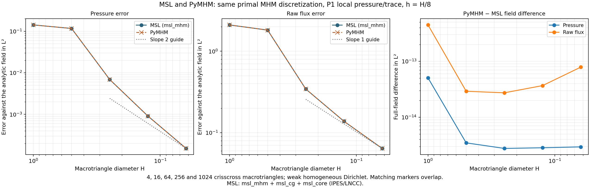

# Direct field comparison with MSL

This case compares **complete numerical fields** from pyMHM and the IPES/LNCC
**MSL** implementation: `msl_mhm` for MHM coupling, `msl_cg` for continuous
Galerkin local problems, and `msl_core` for shared infrastructure. Both primal
MHM solvers solve the same problem with the same macro mesh, local
finite elements, skeleton space, and boundary enforcement. Across five mesh
sizes, full-field L2 differences stay below $5.1\times10^{-14}$ in pressure and
$4.5\times10^{-13}$ in flux. The largest case contains 65,536 fine triangles.

The [coarse cosine comparison](https://github.com/volpatto/pymhm/blob/main/docs/cases/coarse-cosine.md) separately checks the gallery's
diagonal mesh and P0 traces. Both comparisons use the same boundary assembly;
their prescribed pressures are zero and nonzero, respectively.

## Reference code and revisions

The label **MSL** in the figures refers to the following combination, using the
`main_mhm_diffusion` example from `msl_mhm`:

| Component | Role | Executed revision |
|---|---|---|
| `ipes-lncc/msl_mhm` | MHM local/global coupling and diffusion driver | `4cb8cf81518284313b680b13fd586ee619f08b99` |
| `ipes-lncc/msl_cg` | `DiffusionCGProblem` local finite element assembly | `afb76d14c1baf50f0b9e69f7bcac675749ef4458` |
| `ipes-lncc/msl_core` | Mesh, approximation-space and algebra infrastructure | `7f15f455717173d29080d411a7e732c72c1e87f8` |

The executable instantiates
`MHMGlobalProblem<DiffusionCGProblem, CGMHMDecorator<DiffusionCGProblem>>`.
MSL's numerical libraries and solve sequence are unchanged. The comparison
adapter assembles prescribed weak Dirichlet boundary moments and exports fields
and error norms at 17-digit precision. The archived report records the component
revisions and the adapter's source digests.

## Problem and identical discretization

On $\Omega=(0,1)^2$,

$$
-\Delta p=8\pi^2\sin(2\pi x)\sin(2\pi y),\qquad
p=0\text{ on }\partial\Omega,
$$

with exact pressure $p=\sin(2\pi x)\sin(2\pi y)$ and physical flux
$\boldsymbol q=-\nabla p$.

Each Cartesian macro square is divided into four triangles through its center.
The partitions have 4, 16, 64, 256, and 1024 macrotriangles. Within every
macrotriangle, each edge is divided into eight equal segments, producing
64 fine triangles and 45 continuous P1 pressure unknowns. The skeleton is P1
on each unsplit macro edge. Thus $h=H/8$ throughout the sequence.

Dirichlet pressure is imposed **weakly through the global skeleton moments**.
Every local solve is a Neumann problem with a constant kernel and its physical
mean constraint. This choice matters: strong nodal Dirichlet constraints on
boundary macroelements produce a different finite dimensional method and
cannot serve as an identical-discretization comparison.

MSL uses C++ finite element assembly and Eigen sparse LU. Its export records
pressure coefficients, triangle connectivity, and error norms. PyMHM uses its NumPy/SciPy
implementation. Both use accurate forcing and error quadrature; PyMHM uses
Gauss-Duffy order 8, while MSL's forcing parameter 8 requests native polynomial
integration degree 9. These are different rules, despite the same input integer.
Reintegrating the exported MSL fields with PyMHM's quadrature recovers
MSL's computed errors to rounding accuracy.

## Results against the analytic solution

| Macrotriangles | $H$ | MSL pressure $L^2$ | PyMHM pressure $L^2$ | MSL raw flux $L^2$ | PyMHM raw flux $L^2$ |
|---:|---:|---:|---:|---:|---:|
| 4 | 1 | 1.42098571e-01 | 1.42098571e-01 | 2.10096391e+00 | 2.10096391e+00 |
| 16 | 0.5 | 1.16904455e-01 | 1.16904455e-01 | 1.81630493e+00 | 1.81630493e+00 |
| 64 | 0.25 | 6.88512796e-03 | 6.88512796e-03 | 3.43688530e-01 | 3.43688530e-01 |
| 256 | 0.125 | 9.10320678e-04 | 9.10320678e-04 | 1.38270851e-01 | 1.38270851e-01 |
| 1024 | 0.0625 | 1.51680908e-04 | 1.51680908e-04 | 6.42761266e-02 | 6.42761266e-02 |



The first two coarse meshes underresolve the oscillatory solution. Asymptotic
behavior should be assessed on the finer meshes, rather than inferred from
those two points. The slope guides are references, not fitted convergence
claims. The raw primal flux is the piecewise constant field
$-\nabla p_h$; this experiment does not replace it with an equilibrated
$H(\mathrm{div})$ reconstruction.

## Agreement of the full fields

Matching each local node by its physical coordinate, and each fine triangle
by its three vertex coordinates, avoids assumptions about either code's
numbering and orientation. Pressure differences are integrated exactly using
the P1 mass matrix; raw flux differences are integrated exactly as P0 fields.
Across the five meshes:

- pressure field differences in $L^2$ are at most $5.05\times10^{-14}$;
- raw flux field differences in $L^2$ are at most $4.47\times10^{-13}$;
- the largest nodal pressure difference is $1.04\times10^{-13}$;
- the largest raw flux component difference is $1.42\times10^{-12}$.


The pressure plots render nodal P1 values. Flux panels show **signed components**
on the same scale for the analytic, MSL, and PyMHM fields. Analytic flux
is sampled at fine-cell centroids for visualization; all reported analytic
error norms use quadrature. Difference panels use separate roundoff scales.
The scalar meshwise errors alone would not establish this fieldwise agreement.

## Inspect the archived results

The repository includes the complete MSL numerical field snapshots for
all five meshes, their connectivity, a JSON report with full precision metrics,
and SHA256 checksums. MSL source and the comparison execution programs are
not included in the distribution. The visualization script reads the archived
results without an MSL installation or a new finite element solve:

```bash
pixi run -e notebooks python examples/plot_reference_comparison.py
```

The executed verification checked every pressure coefficient and every raw flux
component against the MSL solution. Its tolerances allow platform-dependent
floating point roundoff and are much smaller than the discretization errors.
The plotter displays that recorded evidence; it does not rerun the verification.

- `examples/results/reference-darcy-comparison.json`: methods, metrics and checksums.
- `examples/results/reference-darcy-{4,16,64,256,1024}.npz`: reference numerical fields.
- `examples/results/reference-darcy-aligned-{4,16,64,256,1024}.npz`: paired MSL/pyMHM fields in the matched numbering.
- `examples/results/reference-darcy-fields.npz`: the recorded 64-macrotriangle plot data.

## Relation to the literature and other backends

The sine problem is also used in the unfitted flux study discussed in
[L10](../literature.md#l10-unfitted-flux-approximation-2026-publication).
That article fixes 16 macrotriangles and refines the skeleton, with local
problems solved to sufficient accuracy. This experiment instead refines both
macro and local meshes with fixed local ratio and P1 local approximation.
It verifies agreement between MSL and pyMHM; it does **not**
claim to reproduce that article's convergence curve or a P2/RT2 reconstruction
table. The [Darcy gallery](https://github.com/volpatto/pymhm/blob/main/docs/cases/darcy.md) separately distinguishes raw and
conservative flux approximations.

An additional run of **`ipes-lncc/msl_mfem`**, revision
`b9a67e7079c7e487e4ab1679c1bb3c880cc1909a`, using **MFEM 4.9** and
**strong local Dirichlet** conditions,
produced pressure error approximately $2.81519\times10^{-2}$ on four
macrotriangles. The `msl_mhm` + `msl_cg` strong-boundary counterpart gave
$2.81496\times10^{-2}$, while the weak-boundary method above gives
$1.42099\times10^{-1}$. These numbers belong to different discrete boundary
conditions and integration rules, so they are not used as a PyMHM agreement
claim. This page's matched weak-boundary comparison uses `msl_mhm` + `msl_cg`.
The [software provenance](../literature.md#software-provenance) distinguishes
these components from the separate `ipes-lncc/mhm-mfem` project.
