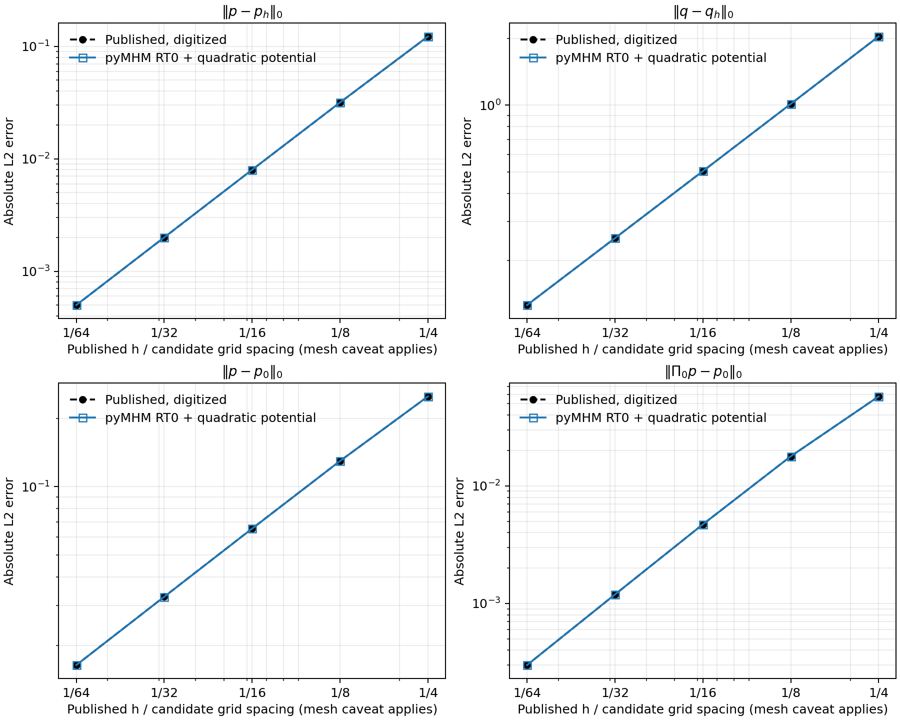
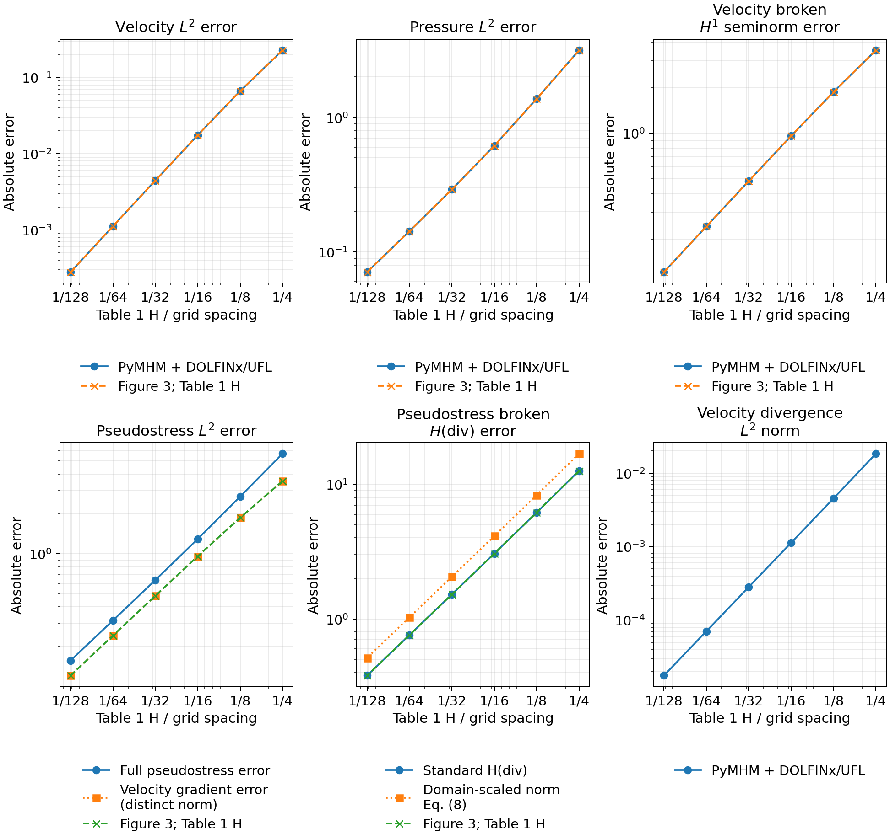
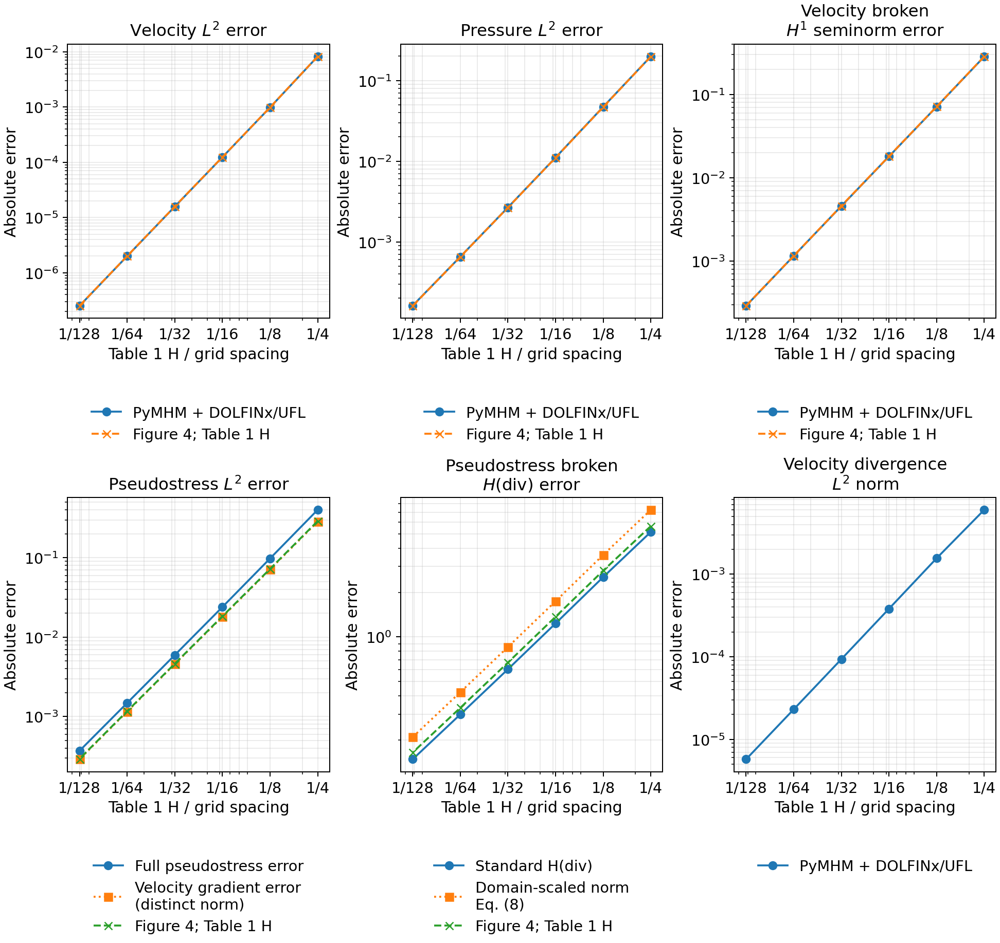

# Comparisons with published results

The four Darcy error curves in Figure 5 of
[Harder, Paredes and Valentin (2013)](https://doi.org/10.1016/j.jcp.2013.03.019)
are matched at five resolutions by classical RT0/P0 fluxes and their integrated quadratic
potentials: the largest discrepancy from the digitized figure is **0.20%**.
The primal P1 discretization gives different values. The comparisons below
distinguish these local approximations on the same meshes. The separate
[analytical MHM campaign](analytic.md) retains the source correction in equation
(42) and reconstructs the nonconstant-source Neumann lifting. Its coarse
pressures differ from classical RT0. Agreement with the classical curve does
not establish reproduction of the full-source MHM formulation.

Stokes P2/P2 locals with constant traces match four Figure 3 curves at six
levels within **0.14%**. P3/P3 with linear traces matches three Figure 4 curves
at six levels within **0.70%**. The full pseudostress L2 diagnostic remains
inconsistent with the plotted ordinate; both the evidence and the distinct
H(div) norm conventions are reported below. Published Brinkman conservation
data and a flux-reconstruction table are reported with their comparison scope.

The numerical fields on this page are computed by pyMHM: native RT0/P1
operators for Darcy and DOLFINx/UFL local assembly for the higher-order Stokes
examples. The comparison values come from the articles' tables or digitized
figures. These runs do not execute the historical programs that produced those
figures. The separate [MSL code comparison](reference-comparison.md) and
[NeoPZ code comparison](neopz.md) compare independently executed implementations.

## Published datasets and digitization

Numerical tables retain their printed precision. For the three digitized
figures, vector path coordinates are calibrated against logarithmic axis ticks;
visible markers and legends identify the series. Rendered pages provide the
visual reference for table and figure transcription. The chosen
comparison tolerance is **1%** for these digitized ordinates. It is an analyst's
allowance for figure extraction, not a statistical confidence interval or a
statement about the authors' solver accuracy.

The repository's `examples/results/published/` directory contains:

| Dataset | Source and location | Nature of the numbers |
| --- | --- | --- |
| `harder2013_figure5.csv` | JCP 245, Figure 5, printed p. 117; PDF p. 11 | Four curves, five digitized points each |
| `araya2017_figure3.csv` | CMAME 324, Figure 3, printed p. 42; PDF p. 14 | Five Stokes error curves, six digitized points each |
| `araya2017_figure4.csv` | CMAME 324, Figure 4, printed p. 42; PDF p. 14 | Five Stokes error curves for linear traces, six digitized points each |
| `araya2017_table1.csv` | CMAME 324, Table 1, printed p. 43; PDF p. 15 | Stokes macrocell mass defects |
| `araya2017_table2.csv` | CMAME 324, Table 2, printed p. 44; PDF p. 16 | Brinkman macrocell mass defects |
| `barrenechea_reconstruction_manuscript_table2.csv` | Author manuscript, Table 2, printed/PDF p. 23 | Energy error and estimator components |

`provenance.json` records titles, authors, DOI identifiers, source-version
checksums, extraction methods, norm definitions and unresolved parameters.
Decimal places in digitized CSV files preserve the extraction output; they
must not be interpreted as equally many significant experimental digits.

## Darcy 2013: Figure 5

### Problem and spaces

Section 5.1 prescribes, on \(\Omega=(0,1)^2\),

$$
K=I,\qquad p=\cos(2\pi x)\cos(2\pi y),\qquad
f=8\pi^2p,\qquad q=-\nabla p.
$$

The entire boundary has homogeneous outward Neumann flux, and the pressure has
zero mean. These conditions differ from the cosine-\(\pi\) Dirichlet problem in
the [other Darcy gallery](darcy.md).

Figure 5 uses degree-zero face traces. The text specifies structured triangular
meshes. Page 119 states that second-level computations use one element with
polynomial degree \(\ell+1\), which gives P1 for \(\ell=0\). However, equation
(40), page 114, gives **exact quadratic radial lifts** for this same constant
coefficient, degree-zero case; their gradients are RT0 fields. Section 4.1.1 and
the discussion immediately preceding Figure 5 invoke this RT0 equivalence.
Consequently, the paper supplies two different local-space descriptions relevant
to this experiment. The numerical evidence below discriminates between them,
but cannot identify the original code path by itself.

Our declared mesh consists of \(n\times n\) equal squares, each split from its
lower-left corner to its upper-right corner. It contains \(2n^2\) triangles.
The grid spacing is \(s=1/n\), while the maximum geometric triangle diameter is
\(H=\sqrt{2}/n\). The paper formally defines its mesh parameter as a maximum
diameter, yet the graph's five abscissas are approximately
\(1/4,1/8,1/16,1/32,1/64\); its exact connectivity and relation to a grid count
are not supplied. We therefore pair these labels with the declared grid spacing
for the comparison and retain **both** spacing and diameter in the result files.
The P1 and RT0 comparisons use the same mesh.

Both runs use one fine triangle per macrocell, constant face traces, source
integration with Duffy order 10, and error integration with order 12. Increasing
these to orders 12 and 14 on the coarsest grid changes the measured norms by
less than \(2\times10^{-13}\) relatively. The article does not specify its
quadrature rules.

### Four separate norms

Let \(p_0\) be the coarse constant in each macrocell and let \(\Pi_0p\) be the
cell-average projection of the analytical pressure. The four curves are

$$
\|p-p_h\|_{L^2},\quad \|q-q_h\|_{L^2},\quad
\|p-p_0\|_{L^2},\quad \|\Pi_0p-p_0\|_{L^2}.
$$

The coarse coefficients are taken directly from the hybrid solution and checked
against reconstructed cell means. All norms are absolute, not divided by the
corresponding exact-solution norm. Equation (34) and the Figure 5 legend use
\(\sigma(p_h)=-K\nabla p_h\); no separate flux-averaging step is specified for
this figure. The vertex averaging mentioned in Section 5.2 concerns a different
five-spot visualization.

| Published nominal h | Updated pressure L2 | Flux L2 | Coarse pressure L2 | Projected coarse pressure L2 |
| ---: | ---: | ---: | ---: | ---: |
| 1/4 | 0.122294 | 2.03857 | 0.249585 | 0.0576425 |
| 1/8 | 0.0316637 | 1.01279 | 0.129654 | 0.0178403 |
| 1/16 | 0.00799107 | 0.504787 | 0.0653440 | 0.00470828 |
| 1/32 | 0.00199988 | 0.252003 | 0.0327241 | 0.00119070 |
| 1/64 | 0.000500474 | 0.125997 | 0.0163621 | 0.000299251 |

### Primal P1 approximation

Primal P1 pressure gives the expected asymptotic orders, but its gradient is
constant on each triangle. Its values differ systematically from the published
curves, beyond the digitization tolerance.


At \(n=64\), relative differences from the digitized ordinates are −2.87% for
updated pressure, +28.98% for flux, −0.025% for coarse pressure and −55.36% for
projected coarse pressure. The last observed refinement orders are respectively
1.998, 0.999, 0.999 and 1.991. Correct orders alone therefore do not demonstrate
numerical reproduction. The [full P1 record](../figures/reproduction/darcy-2013-comparison.json)
preserves all five levels and the discrepancies.

### Classical RT0 and quadratic pressure

For unit permeability, an RT0 flux on one triangle has the form

$$
q_h(x)=q_h(c_T)+b_T(x-c_T),\qquad
b_T=\frac12\nabla\cdot q_h,
$$

where \(c_T\) is its centroid. Integrating this field and imposing the same
coarse mean \(p_{0,T}\) gives the unique quadratic radial potential

$$
p_T^\star(x)=p_{0,T}-q_h(c_T)\cdot(x-c_T)
-\frac{b_T}{2}\left(|x-c_T|^2-
\frac1{|T|}\int_T|z-c_T|^2\,dz\right).
$$

It satisfies \(-\nabla p_T^\star=q_h\) and
\(\Pi_0p_T^\star=p_{0,T}\). The second moment used here is
\(\frac1{12}\sum_{i=1}^3|v_i-c_T|^2\), for triangle vertices \(v_i\).
This construction uses the computed RT0 flux and mean pressure; it contains no
fitted constants or adjustment to the published errors. Its polynomial form is
the one identified by the exact lift in equation (40).

The native mixed pressure remains P0. The updated-pressure curve below uses
\(p_T^\star\), explicitly distinguished from that native P0 variable.



| n | Quadratic pressure L2 | Flux L2 | Coarse pressure L2 | Projected coarse pressure L2 |
| ---: | ---: | ---: | ---: | ---: |
| 4 | 0.122537 | 2.03845 | 0.249615 | 0.0576301 |
| 8 | 0.0317066 | 1.01311 | 0.129650 | 0.0178377 |
| 16 | 0.00799234 | 0.504483 | 0.0653054 | 0.00470480 |
| 32 | 0.00200216 | 0.251935 | 0.0327073 | 0.00119201 |
| 64 | 0.000500793 | 0.125927 | 0.0163603 | 0.000298999 |

Across all five levels, maximum absolute relative discrepancies are **0.199%**,
**0.0602%**, **0.0591%** and **0.1102%**, respectively. All twenty comparisons
pass the declared 1% digitization tolerance. The
[mixed comparison record](../figures/reproduction/mixed/darcy-2013-comparison.json)
also retains the native P0 pressure error, separate from the quadratic one.

The source lifting also distinguishes the discrete formulations. This
single-cell RT0 field has
\(\nabla\cdot q_h=\Pi_0f\), and its quadratic potential satisfies
\(-\Delta p_T^\star=\Pi_0f\). The exact source lifting in equation (29) instead
solves for \(f-\Pi_0f\) with zero normal flux. It vanishes for a cellwise constant
source, but the cosine source is not cellwise constant. Moreover, equation (42)
contains a source-dependent load correction relative to the classical RT0
method. The native RT0/P0 solve does not insert that extra correction. The
observed match concerns the plotted numerical values within figure resolution.
The [full-source analytical MHM](analytic.md) provides the separate six-level
comparison using the source term as written in equation (42). The original
treatment of that term and the precise mesh-parameter convention remain
unconfirmed.

### Darcy numerical records

The five-level records are preserved in
`examples/results/darcy_2013_comparison.json` and
`examples/results/darcy_2013_mixed_comparison.json`.
The notebook `11_published_darcy_2013.ipynb` presents the archived levels and
figures alongside their discretization and interpretation. The public plotting
command at the end of the Stokes comparison renders both Darcy and Stokes
records.

## Stokes 2017: equal-order local spaces and direct figure comparison

[Araya et al. (2017)](https://doi.org/10.1016/j.cma.2017.05.027),
Section 3.1.1, uses **one triangle per local problem** and USFEM equal-order
spaces \(P_{\ell+2}^2/P_{\ell+2}\). The comparison assembled these
spaces through DOLFINx/UFL using `from_ufl`, and solved the skeleton problem
through pyMHM's `HybridSystem`.
The preserved results cover P2/P2 with constant traces at six levels and P3/P3 with linear traces
at six levels. Refined P1/P1 USFEM and Taylor–Hood P2/P1 are different
approximations and are not substituted for these published spaces.

The Stokes data are \(\nu=1\), \(\gamma=0\),

$$
\begin{aligned}
u_1&=-256x^2(x-1)^2y(y-1)(2y-1),\\
u_2(x,y)&=-u_1(y,x),\\
p&=150(x-1/2)(y-1/2).
\end{aligned}
$$

The velocity vanishes on the square boundary; pressure has zero mean.
The forcing is \(-\Delta u+\nabla p\). Using the streamfunction
\(\psi=-128x^2(x-1)^2y^2(y-1)^2\) and
\(u=(\partial_y\psi,-\partial_x\psi)\) preserves exact incompressibility.

### Discretization, geometry and stabilization

Each of the \(n^2\) squares is split into four triangles by its center. The
resulting crisscross mesh has \(4n^2\) triangles, maximum diameter \(H=1/n\)
and shorter triangle sides \(H/\sqrt2\). The same mesh family is generated by
MSL's `msl_core` and exercised by its `msl_mhm` Darcy driver in the
[MSL code comparison](reference-comparison.md). This supports the mesh choice
but does not identify the exact connectivity used for the Stokes article.
The paper does not supply
its connectivity explicitly. Figure 3's abscissas are approximately
\(H/\sqrt2\), whereas Table 1 and Figure 4 use \(H\). Both coordinates are
retained in the digitized datasets; the comparisons below pair the ordered
levels with Table 1. No horizontal translation is optimized against the errors.

A separate comparison uses two triangles per square.
It produces different errors, including pressure L2 error 4.60146 at \(n=4\),
versus 3.15562 on the crisscross mesh. Replacing one connectivity by the other
changes the experiment; matching local degree alone is insufficient.

For the Stokes limit of equations (41)–(42), the local stabilization coefficient
is

$$
\tau_T=\frac{m_T h_T^2}{8\nu},\qquad
m_T=\min(1/3,C_T),\qquad
C_T h_T^2\|\Delta v_h\|_T^2\leq\|\nabla v_h\|_T^2.
$$

The example calculates the largest admissible \(C_T\) from the generalized
eigenproblem for the polynomial Laplacian and gradient matrices, after
quotienting constants. This gives \(C_T=1/96\) for P2 and
\(C_T=0.003353888994497343\) for P3 on the right isosceles triangles.
For P2 the value also follows analytically: the two eigenvalues of the triangle's
coordinate covariance are \(h_T^2/24\) and \(h_T^2/72\), so the sharp
Laplacian-to-gradient ratio is \(96/h_T^2\). These constants are derived from
the inequality; they are not fitted to published errors. The paper's numerical
subsection does not state the constant used by its implementation.

The UFL forms implement

$$
\begin{aligned}
a_T((u,p),(v,q))={}&(\nabla u,\nabla v)_T-(p,\nabla\!\cdot v)_T
 -(q,\nabla\!\cdot u)_T\\
 &-\tau_T(-\Delta u+\nabla p,-\Delta v+\nabla q)_T,\\
L_T(v,q)={}&(f,v)_T-\tau_T(f,-\Delta v+\nabla q)_T.
\end{aligned}
$$

The pressure-test sign is the symmetric convention obtained by changing
\(q\) to \(-q\) in the article's mixed form. The local nullspace contains the
two velocity translations; zero local velocity means fix those modes. A single
global mean-pressure constraint fixes the pressure gauge. Degree-16 quadrature
integrates the polynomial data and squared errors; a separate degree-18 check
at \(n=4\) agrees to floating-point precision.

### P2/P2, constant trace: six levels

| n | Triangles | Velocity L2 | Velocity H1 seminorm | Pressure L2 | Standard broken stress H(div) |
| ---: | ---: | ---: | ---: | ---: | ---: |
| 4 | 64 | 0.227692 | 3.53312 | 3.15562 | 12.6128 |
| 8 | 256 | 0.0665358 | 1.87579 | 1.37434 | 6.18796 |
| 16 | 1024 | 0.0175635 | 0.960272 | 0.615813 | 3.06202 |
| 32 | 4096 | 0.00446662 | 0.483943 | 0.291503 | 1.52462 |
| 64 | 16384 | 0.00112246 | 0.242571 | 0.142683 | 0.761191 |
| 128 | 65536 | 0.000281046 | 0.121376 | 0.0708286 | 0.380414 |

All **24 ordinates across these four curves** agree with digitized Figure 3
within the declared 1% extraction tolerance. Maximum discrepancies are 0.1392%
for velocity L2, 0.1324% for its H1 seminorm, 0.1107% for pressure L2, and 0.0519%
for the standard broken H(div) norm. All six published levels are included.
Its stress L2 curve and the written H(div) weighting require the
separate qualification immediately below.




The pressure is plotted independently on each macrotriangle, preserving jumps.
Outlined edges identify the actual macro partition on every field panel.
The smooth-looking analytical pressure is not used to interpolate the numerical
solution. The last panel shows sampled pointwise errors; it is not the integrated
L2 error in the table. [Download the scalar results and all published-value comparisons](../figures/reproduction/stokes/crisscross-p2/results.json).

### P3/P3, linear trace: six levels

| n | Velocity L2 | Velocity H1 seminorm | Pressure L2 | Standard broken stress H(div) |
| ---: | ---: | ---: | ---: | ---: |
| 4 | 0.00822259 | 0.284419 | 0.198787 | 5.14833 |
| 8 | 0.000982929 | 0.0711466 | 0.0471099 | 2.5453 |
| 16 | 0.000123603 | 0.0180124 | 0.0110797 | 1.235 |
| 32 | 1.57303e-05 | 0.00456664 | 0.00266962 | 0.604656 |
| 64 | 1.9916e-06 | 0.00115218 | 0.000653952 | 0.298658 |
| 128 | 2.50777e-07 | 0.000289530 | 0.000161735 | 0.148347 |

The three velocity/pressure curves of Figure 4 agree at all eighteen compared
points: the maximum discrepancy is 0.6935%, below the same 1% digitization
allowance. The observed reductions are approximately third order for velocity
L2 and second order for pressure L2 and velocity H1. All six published levels are included. The stress H(div) curve
differs by up to 10.03%; that difference is retained, together with the unknown
historical inverse constant and stress diagnostic convention.




At \(n=16\), changing the complete discretization from P2/P2 with constant
trace to P3/P3 with linear trace reduces the pressure L2 error from 0.615813 to
0.0110797. Both local and trace spaces change in that comparison; the reduction
cannot be attributed to either one in isolation.
[Download P3/P3 results and comparison values](../figures/reproduction/stokes/crisscross-p3/results.json).

### Stress norms and published values

Equation (55) defines \(\sigma=-\nu\nabla u+pI\). At \(\nu=1\), its full
Frobenius L2 error obeys the exact identity

$$
\|\sigma_h-\sigma\|^2
 =\|\nabla e_u\|^2+2\|e_p\|^2-2(e_p,\nabla\!\cdot e_u),
\qquad e_u=u_h-u,\quad e_p=p_h-p.
$$

At \(n=4\), P2/P2 gives full stress error **5.69316**, while the published
stress L2 ordinate is approximately **3.53636**. Direct quadrature gives
\((e_p,\nabla\!\cdot e_u)=-0.00664421\) and an identity defect below
\(4.6\times10^{-15}\). Cauchy–Schwarz bounds the full stress error between
5.68177 and 5.70220 using the measured pressure, gradient and divergence norms;
3.53636 lies outside that interval. The published ordinate is close to the
velocity gradient error 3.53312. These bounds apply to the reconstructed fields
in this comparison. The available MSL and `mhm-mfem` revisions do not supply
the article's coefficient arrays or stress diagnostic; `mhm-mfem` also uses a different local formulation. The
article's legend labels the ordinate stress L2 without specifying a deviatoric
or gradient-only convention. The full-stress curve is therefore **not
reproduced** under the stated definition. The plot reports the velocity gradient
error as a separate quantity.

There is also a distinction between norm conventions. Equation (8) equips the
conforming space H(div;Ω), used in the analysis, with a norm whose squared
divergence term is weighted by the domain diameter squared:

$$
\|\sigma\|_{\operatorname{div},\Omega}^2
 =\|\sigma\|_\Omega^2+d_\Omega^2\|\nabla\!\cdot\sigma\|_\Omega^2,
\qquad d_\Omega=\sqrt2.
$$

The numerical section instead names a broken H(div;T_H) norm, without
explicitly repeating its weight. Figure 3 agrees with the **standard broken
H(div) norm**, whose divergence weight is 1. The example reports and plots both
weights. This is evidence for the diagnostic convention matching that curve,
not a demonstrated contradiction between the conforming and broken norms.
For P3/P3, neither weight reproduces the published stress curve within the
extraction tolerance.

For P2/P2, the discrete pressure equation supplies a further consistency
condition. Equation (47) gives zero mean divergence on every macroelement, so
$q_h=\nabla\cdot u_h\in P_1(T)$ is an admissible pressure test, including the
pressure gauge. On the right isosceles triangles used here,

$$
\begin{aligned}
 \lVert\nabla q_h\rVert_T
   &\le \frac{\sqrt{72}}{h_T}\lVert q_h\rVert_T,\\
 \lVert\nabla\cdot u_h\rVert
   &\le \frac{h_T\sqrt{72}}{768}
             \lVert\nabla\cdot(\sigma_h-\sigma)\rVert.
\end{aligned}
$$

The second inequality follows from equations (41)–(42), the first inverse
inequality, $\tau_T=m_T h_T^2/8$ and the admissible bound $m_T\le1/96$.
Let $E_g,E_p,E_\sigma,E_d$ denote the four published gradient, pressure,
stress L2 and stress H(div) errors. The stress identity and this pressure test
then require both bounds

$$
\begin{aligned}
 \frac{\lvert E_g^2+2E_p^2-E_\sigma^2\rvert}{2E_p}
   &\le \lVert\nabla\cdot u_h\rVert,\\
 \lVert\nabla\cdot u_h\rVert
   &\le \frac{h_T\sqrt{72}}{768}
       \sqrt{\frac{E_d^2-E_\sigma^2}{w}},
 \qquad w\in\{1,2\}.
\end{aligned}
$$

Using $h_T=1/n$ and the standard broken weight $w=1$ gives:

| n | Required divergence lower bound | USFEM divergence upper bound |
| ---: | ---: | ---: |
| 4 | 3.14606 | 0.0334321 |
| 8 | 1.37141 | 0.00814188 |
| 16 | 0.616745 | 0.00200776 |
| 32 | 0.291128 | 0.000499449 |
| 64 | 0.143047 | 0.000124501 |

The intervals remain disjoint when every digitized ordinate varies
independently by 1%; their smallest separation factor is 89.7. The domain
weight $w=2$ makes the upper bound smaller. Thus changing the admissible
stabilization constant cannot reconcile all four ordinates **under the stated
geometry, spaces and stress conventions**. This does not identify the
historical connectivity or diagnostic. The
[Araya et al. (2016)](https://www.ci2ma.udec.cl/pdf/pre-publicaciones2/2016/pp16-15.pdf)
uses the same full-stress definition. The
[consistency record](../figures/reproduction/stokes/stokes2017-stress-consistency.json)
preserves the assumptions, inverse constants, digitized inputs, interval
calculation and source digests.

Orthogonal source projection has a definite effect on the divergence residual.
Here \(d_h=\nabla\!\cdot\sigma_h\in P_2(T)^2\).
For the orthogonal projection \(\Pi_2\),

$$
\|f-d_h\|_T^2=\|f-\Pi_2f\|_T^2+\|\Pi_2f-d_h\|_T^2.
$$

Replacing \(f\) by \(\Pi_2f\), or by an orthogonal projection onto a larger
polynomial space, **reduces** the divergence residual. It cannot explain a
larger published H(div) error when the published stress L2 component is also
smaller. Lower-degree projections or interpolation define other diagnostics;
no such convention has been established for the historical calculation.

The exact forcing has degree five, so the squared divergence residual has
degree ten; the degree-16 rule integrates this polynomial exactly. The
article's diagnostic quadrature and coefficient arrays are unavailable, so the
origin of the discrepancy is undetermined.

### High-order numerical records

The complete numerical records are preserved in
`examples/results/stokes_2017_ufl_crisscross.json` for P2/P2 and
`examples/results/stokes_2017_ufl_p3.json` for P3/P3.
`examples/results/stokes_2017_ufl.json` contains the diagonal-mesh comparison.
All field samples are saved independently of plotting. Render the archived
Darcy and Stokes comparisons with:

```bash
pixi run --locked -e notebooks python -m examples.plot_reproductions
```

The notebook `13_published_stokes_2017.ipynb` presents the archived comparisons,
the stress identity and both H(div) conventions without repeating FEM solves.

## Stokes/Brinkman 2017: published conservation tables

For the Brinkman problem in Section 3.1.2, \(\nu=10^{-2}\), \(\gamma=1\), and

$$
u_1=y-\frac{1-e^{y/\nu}}{1-e^{1/\nu}},\qquad
u_2=x-\frac{1-e^{x/\nu}}{1-e^{1/\nu}},\qquad p=x-y.
$$

The source is \(-\nu\Delta u+u+\nabla p\), and exact velocity is prescribed.
A numerically stable evaluation uses shifted exponentials, for example
\((e^{(y-1)/\nu}-e^{-1/\nu})/(1-e^{-1/\nu})\) for the quotient. The Stokes
calculations above do not cover the high-order Brinkman error curves for this
boundary-layer problem.

### Published mass-balance tables

The reported quantity is the **unnormalized integrated** defect
\(\max_K|\int_K\nabla\cdot u_h\,dx|\), not a divergence L2 norm.

| H in Table 1 | Stokes, trace degree 0 | Stokes, degree 1 | Stokes, degree 2 |
| ---: | ---: | ---: | ---: |
| 1/4 | 5.056e-17 | 1.4801e-16 | 1.1266e-16 |
| 1/8 | 2.4720e-17 | 7.0998e-17 | 7.1869e-17 |
| 1/16 | 1.3487e-17 | 3.3093e-17 | 4.6540e-17 |
| 1/32 | 7.2352e-18 | 1.8744e-17 | 2.3442e-17 |
| 1/64 | 3.5950e-18 | 9.2944e-18 | 1.4982e-17 |
| 1/128 | 2.1444e-18 | 5.4785e-18 | 7.9874e-18 |

| H in Table 2 | Brinkman, degree 0 | Brinkman, degree 1 | Brinkman, degree 2 | Monolithic USFEM P2/P2 |
| ---: | ---: | ---: | ---: | ---: |
| 1/4 | 7.7325e-16 | 9.3133e-16 | 1.1205e-15 | 1.8075e-2 |
| 1/8 | 5.8102e-16 | 1.3263e-15 | 1.4134e-15 | 5.5736e-3 |
| 1/16 | 8.5168e-16 | 1.1898e-15 | 9.2654e-16 | 1.1326e-3 |
| 1/32 | 1.0468e-15 | 1.2779e-15 | 1.3535e-15 | 1.4290e-4 |
| 1/64 | 1.2984e-15 | 1.3951e-15 | 1.2610e-15 | 1.3626e-5 |
| 1/128 | 1.2571e-15 | 1.2575e-15 | 1.3137e-15 | 1.1620e-6 |

These roundoff-scale MHM entries establish a conservation target; individual
digits are not portable solver acceptance thresholds. The executed P2/P2 Stokes
series has integrated macrocell defects from 1.46e-16 at n=4 to 4.82e-18 at
n=128. P3/P3 gives 1.04e-16 to 3.59e-18 at n=4..128. These values confirm
macrocell balance to solver precision, while the pointwise divergence L2 norms
remain nonzero. Neither statement implies exactly divergence-free local fields.

## Flux-reconstruction manuscript: Table 2

The author manuscript associated with
[Barrenechea et al. (2026)](https://doi.org/10.1137/24M1673073)
provides a further numerical table on printed page 23. These values are
identified by manuscript version; identity with the final journal table has
not been asserted.

The problem is \(u=\sin(2\pi x)\sin(2\pi y)\), \(A=I\),
\(f=8\pi^2u\), homogeneous Dirichlet data on the unit square. Table 2 uses
skeletal degree \(\ell=0\), continuous local degree \(k=2\), reconstruction
degree \(m=2\), and fine diameter equal to half the macro diameter.

| Printed macro diameter | Broken energy error | Estimator η | Effectivity |
| ---: | ---: | ---: | ---: |
| 0.353 | 1.860 | 2.724 | 1.463 |
| 0.176 | 0.986 | 1.293 | 1.311 |
| 0.088 | 0.501 | 0.644 | 1.287 |
| 0.044 | 0.251 | 0.323 | 1.285 |
| 0.022 | 0.125 | 0.162 | 1.287 |

The energy norm is \(\|A^{1/2}\nabla(u-u_{Hh})\|_{L^2(\mathcal P)}\), and
effectivity is \(\eta\) divided by that norm. The CSV retains the separate
estimator components and printed rounding. The published moment reconstruction
of equation (5.1) uses RT2; the native minimum-energy RT0 correction is a
different construction and is not a reproduction of this table. Exact mesh
connectivity, unrounded diameters and quadrature remain necessary inputs for a
fully specified comparison.

## References

- Christopher Harder, Diego Paredes, and Frédéric Valentin (2013). *A family of Multiscale Hybrid-Mixed finite element methods for the Darcy equation with rough coefficients*, Journal of Computational Physics 245, 107–130. [DOI: 10.1016/j.jcp.2013.03.019](https://doi.org/10.1016/j.jcp.2013.03.019).

- Rodolfo Araya, Christopher Harder, Abner H. Poza, and Frédéric Valentin (2017). *Multiscale hybrid-mixed method for the Stokes and Brinkman equations—The method*, Computer Methods in Applied Mechanics and Engineering 324, 29–53. [DOI: 10.1016/j.cma.2017.05.027](https://doi.org/10.1016/j.cma.2017.05.027).

- Rodolfo Araya, Christopher Harder, Abner H. Poza, and Frédéric Valentin (2016). *Multiscale hybrid-mixed method for the Stokes and Brinkman equations—The method*. Universidad de Concepción, CI²MA, Preprint 2016-15. [Institutional preprint](https://www.ci2ma.udec.cl/pdf/pre-publicaciones2/2016/pp16-15.pdf). The journal publication is Computer Methods in Applied Mechanics and Engineering 324, 29–53 (2017), [DOI: 10.1016/j.cma.2017.05.027](https://doi.org/10.1016/j.cma.2017.05.027).

- Gabriel R. Barrenechea, Larissa Martins, Weslley Pereira, and Frédéric Valentin (2026). *An H(div; Ω)-Conforming Flux Reconstruction for the Multiscale Hybrid-Mixed Method*, Multiscale Modeling & Simulation 24(2), 399–428. [DOI: 10.1137/24M1673073](https://doi.org/10.1137/24M1673073).
