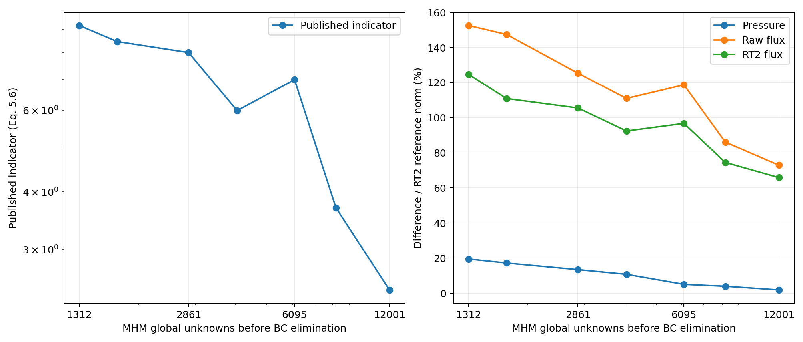
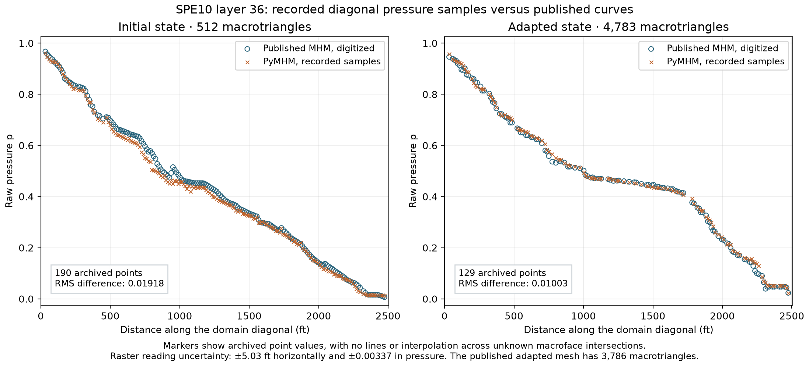

# Adaptive Darcy and flux reconstruction in SPE10

This case evaluates the triangular P2/P0 MHM formulation, RT2 moment
reconstruction and the published numerical indicators on SPE10 Model 2,
layer 36. The published adaptive experiment is §6.2 of
[Barrenechea et al. (2026)](https://doi.org/10.1137/24M1673073).
It is distinct from the quadrilateral Q1/continuous-P1
[66-square experiment](spe10.md) and its [flux comparisons](spe10-flux.md).

## Problem and approximation spaces

The adopted boundary-value problem is

$$
q=-K\nabla p,\qquad\nabla\cdot q=0,
 \qquad\Omega=(0,1200)\times(0,2200),
$$

with bottom pressure one, top pressure zero, and zero normal flux on both
vertical boundaries. Layer numbering is one based. Coordinates retain ft and
\(K=\operatorname{diag}(K_x,K_y)\) retains the dataset's mD values; pressure
has the prescribed numerical scale. No additional viscosity or SI conversion
is introduced. Flux labels therefore describe mD/ft per unit of the prescribed
pressure scale, rather than a calibrated physical velocity. The paper's SPE10
subsection and the public remeshing note do not specify a global permeability
multiplier, a viscosity conversion or a normalization. The present calculation
uses the pinned dataset values directly: \(K_x=K_y\), with range
0.002163–8412.63 mD. Matching a pressure profile cannot determine this global
scale: for the prescribed zero-source pressure problem, replacing \(K\) by
\(cK\) leaves pressure unchanged and multiplies flux by \(c\). It also scales
\(\eta_1\) and \(\eta_3\) by \(c\), and \(\eta_2\) by \(\sqrt c\);
therefore the printed adaptive indicator is sensitive to that convention.
No scale factor is inferred from the published colorbar.

The article's adaptive sequence begins with 512 macrotriangles and four local
triangles per macro, uses local continuous P2 pressure and constant normal-flux
traces, and finishes with 3,786 macroelements and 9,559 reported global unknowns.
Its geometry adaptation uses FreeFEM remeshing. The present initial mesh is a
16×16 rectangular grid with southwest–northeast diagonals. A
[public implementation note by Martins](https://community.freefem.org/t/adaptmesh-chaging-boundary-labels/3201)
identifies the residual-metric routine and coefficient one, as well as the bottom
and top pressure data. Its modified six-argument wrapper and historical
connectivity are not supplied. The campaign uses the documented metric with
FreeFEM/BAMG 4.13; agreement of remeshing policy does not establish identical meshes.

The three physical fields remain distinct:

- The raw primal flux is the one-sided field \(-K\nabla p_h\).
- The RT2 reconstruction prescribes exterior moments from the MHM trace,
  averages interior one-sided normal moments, and matches interior volume moments.
- The classical RT2/P2 reference solves an unrestricted globally H(div)-conforming
  mixed problem on its own refined triangular mesh.

The reconstruction has the continuous-P2 test equilibrium identity. This does
not imply a separate source balance on every fine triangle. The classical mixed
reference instead imposes all discontinuous-P2 divergence moments. See the
[moment-reconstruction definitions](https://github.com/ipes-lncc/pymhm/blob/main/docs/cases/reconstruction-moments.md).

## Published indicator and four-triangle local spaces

The principal campaign retains four uniformly subdivided local triangles per
macroelement, continuous P2 local pressure and a single P0 normal-flux unknown
per macroface. Permeability discontinuities split integration regions, without
introducing pressure nodes at those cuts. Reconstruction uses mathematical RT2.
The indicator follows the printed definitions (5.3)–(5.7):

$$
\begin{aligned}
\eta_{1,K}&=\|K\nabla p_h+q_h^{\rm rec}\|_K,\\
\eta_{2,K}&=\|K^{1/2}\nabla(p_h-I_{\rm OS}p_h)\|_K,\\
\eta_{3,K}&=\frac{H_K}{\pi}
\|\Pi_2\operatorname{div}q_h^{\rm rec}-\operatorname{div}q_h^{\rm rec}\|_K.
\end{aligned}
$$

The source is zero, so its oscillation term vanishes. Local marking values are
\((\eta_{1,K}+\eta_{3,K})^2+\eta_{2,K}^2\). The printed flux and divergence
terms contain neither an inverse-material weight nor an ellipticity factor.
They are retained as numerical indicators for this heterogeneous case, without
asserting a coefficient-independent bound in the physical energy norm.
The [two normalization conventions](https://github.com/ipes-lncc/pymhm/blob/main/docs/cases/weighted-estimator.md#published-and-energy-normalized-conventions)
are separate API choices.

The remeshing input is the square root of each local marking value. Its
area-weighted P1 projection is compared with the arithmetic mean of the cell
indicators. The current nodal edge size is divided by the resulting factor,
clipped to \( [1/3,3] \). FreeFEM/BAMG then generates an isotropic mesh from
this size field; see the [metric and dependency contract](../meshing.md#isotropic-residual-metric-remeshing).
The coefficient is one and the vertex cap is 10,000. These parameters remain
fixed throughout the sequence. No exact/reference field enters the metric.
The campaign targets at least 3,786 macrotriangles to compare against the
reported mesh budget. Reaching that budget is not an accuracy criterion, and
the historical wrapper's additional argument is not inferred from its name.

A nested local solve at unchanged skeletal flux measures
\(\delta_{\rm loc}\) at every state. This is a resolution diagnostic only:
it does not silently add local refinement to the four-triangle campaign.
The physical pressure and both flux errors are integrated against the separate
classical reference below.

## Independent assembly of the same MHM discretization

The initial and final states are also solved independently with
[FEniCS/DOLFINx 0.9.0](https://github.com/FEniCS/dolfinx/tree/6443e3b27d29aec04ce83d8424b57c339e35f865).
This comparison keeps the exact archived macro connectivity, four local
triangles, P2 pressure, one P0 trace per macroface, raw permeability pixels,
and boundary data. DOLFINx/Basix supplies native triangular P2 elements and
UFL volume forms. An explicit independent interface assembly couples them
into the full, uncondensed MHM saddle system, solved with PETSc/MUMPS.
It is the same MHM discretization, with a separately assembled implementation;
DOLFINx does not provide the MHM macro coupling as a built-in formulation.

Independent Cartesian clipping integrates the permeability-weighted quadratic
moments needed by the P2 gradient products. A discontinuous quadratic
coefficient representation preserves these volume moments; physical flux
evaluation still uses the unchanged raw permeability. Exact Simpson moments
couple native P2 facet values to the P0 trace. The maximum relative pixel-area
partition discrepancy is below \(2.0\times10^{-15}\).

| State | Macrotriangles | Full saddle unknowns | Relative pressure difference | Relative raw-flux difference |
|---|---:|---:|---:|---:|
| Initial | 512 | 8,448 | 2.772e−12 | 1.868e−11 |
| Final | 4,783 | 78,912 | 8.550e−11 | 6.209e−10 |

These physical L2 differences use the independent native field norm as
denominator, with integration on the same fine-triangle/material-pixel
intersections. Orders 6 and 8 give consistent results. The native
original-equation residuals divided by the load norm are
\(3.87\times10^{-14}\) and \(6.49\times10^{-13}\), respectively.
The [numerical records and verified code provenance](../figures/spe10-adaptive/native-system-verification.json)
also report broken-gradient and energy differences, coefficient digests,
and the executed DOLFINx build separately from its verified upstream release.


Each component shares a color scale between the two codes. Signed flux uses
an explicitly nonlinear asinh scale, with linear width equal to one thousandth
of the shared maximum absolute component, to resolve weak flow; difference panels
use their own linear scales. Fields are sampled at raster-cell centers without
averaging across interfaces, and the actual macro mesh is outlined on every
panel. These displays are separate from the quadrature-based norms above.
Agreement of these independently assembled fields verifies the selected MHM
calculation. It does not reduce its discretization error or establish the
historical adaptive connectivity; those questions require the refined baseline
and the published-result comparisons below.

## Independently refined classical mixed baseline

The reference uses mathematical RT2 flux and discontinuous P2 pressure.
RT2 has 15 flux degrees of freedom per triangle: three normal moments per edge
and six interior moments. Counts below include both flux and pressure before
essential-boundary elimination. They are not directly comparable to the article's
1,314,000 count, which is consistent with a flux-only RT2 count on 125,000
triangles; [the counting distinction is explained here](spe10-flux.md#rt2-is-distinct-from-bdm2).

| Rectangular divisions | Triangles | Mixed unknowns | Bottom inflow | Successive pressure difference (%) | Successive flux difference (%) |
|---:|---:|---:|---:|---:|---:|
| 15×55 | 1,650 | 27,435 | 0.0840648 | — | — |
| 30×110 | 6,600 | 109,320 | 0.128297 | 12.3151 | 75.8989 |
| 60×220 | 26,400 | 436,440 | 0.149436 | 4.92353 | 51.3012 |
| 120×440 | 105,600 | 1,744,080 | 0.150187 | 0.0662865 | 8.63576 |
| 240×880 | 422,400 | 6,972,960 | 0.150499 | 0.0322622 | 5.73973 |
| 480×1760 | 1,689,600 | 27,885,120 | 0.150636 | 0.0163573 | 3.86719 |

Each difference is an integrated physical L2 norm divided by the finer field's
norm. The first two grids intersect the coefficient pixels and use exact cut
integration; the last four fit every material edge. The final mixed system uses
Intel MKL PARDISO through `pypardiso`, with residual \(5.79\times10^{-17}\).
The source/flux imbalance is at most \(8.93\times10^{-15}\) per fine cell.

For the last refinement, direct integration gives
\(\|q_{480}-q_{240}\|_{K^{-1}}=0.0117027102\), or **3.01524%** of the finer
energy norm \(0.388118599\). This also agrees with the nested mixed energy
identity \(\|q_{480}-q_{240}\|_{K^{-1}}^2=Q_{480}-Q_{240}\), where \(Q\) is
the bottom inflow for these unit-pressure data. The remaining variation is
significant: the final field is a numerical baseline, not an exact solution or
an error bound for the adaptive MHM field.

## Published diagonal pressure profile


Figure 9 of [Barrenechea et al. (2026)](https://doi.org/10.1137/24M1673073), accepted manuscript p.26, reports pressure
along the domain diagonal. Its caption identifies the MHM field as the raw
pressure \(u_{Hh}\), not the Oswald potential. The image is the unchanged embedded raster;
[extraction provenance](../figures/reservoir-papers/l09-figure-9-source.json)
identifies its manuscript and checksum. It contains three pressure curves,
not flux samples.

At 167 visible samples digitized from the red reference curve, the separately
refined classical RT2 pressure has an RMS difference of **0.00415** and a maximum
absolute difference of **0.01589** on the prescribed pressure scale. The estimated
raster reading uncertainties are ±5.03 ft horizontally and ±0.00337 in pressure;
horizontal uncertainty also affects a comparison along steep portions. These
sampled differences support a quantitative profile comparison but are neither
an integrated field error nor a certificate of identical historical data or
meshes. The [digitized samples and reference provenance](../figures/spe10-adaptive/published-profile.json)
are archived independently of the adaptive marking.

## Physical comparison norms

Pressure differences use the physical L2 norm. Each of the raw and reconstructed
fluxes is compared separately through

$$
\frac{\|q_h-q_{\mathrm{ref}}\|_{L^2(\Omega)}}
      {\|q_{\mathrm{ref}}\|_{L^2(\Omega)}},
 \qquad
 \frac{\|K^{-1/2}(q_h-q_{\mathrm{ref}})\|_{L^2(\Omega)}}
      {\|K^{-1/2}q_{\mathrm{ref}}\|_{L^2(\Omega)}}.
$$

The integration partition intersects the adaptive local triangles, classical
reference triangles and permeability pixels. It preserves the incident local
field on each integration piece, rather than interpolating across macrofaces.
On these affine pieces, a squared RT2 flux difference has polynomial degree at
most six; positive Duffy quadrature of order four integrates those polynomial
terms. A separate order-five evaluation agrees with the final order-four norms within
relative **1.34×10⁻¹⁴**; the [quadrature record](../figures/spe10-adaptive/quadrature-check.json)
preserves the individual comparisons.
These are integrated field norms, not norms of image pixels or point samples.

## Adaptive sequence and measured accuracy

The seven-state sequence reaches 4,783 macrotriangles and 12,001 global
unknowns, exceeding the article's 3,786 / 9,559 budget. Every local problem
still has four triangles. The macro minimum angles range from 20.66° to
28.61°; remeshing changes both the number and location of the cells.
The following percentages use the final classical RT2 field as denominator.

| Macrotriangles | Global unknowns | Printed indicator | Pressure L2 (%) | Raw-flux L2 (%) | Reconstructed-flux L2 (%) | Bottom inflow |
|---:|---:|---:|---:|---:|---:|---:|
| 512 | 1,312 | 9.16691 | 19.48425 | 152.51741 | 124.65786 | 0.136641779 |
| 678 | 1,718 | 8.46274 | 17.21002 | 147.43583 | 110.90783 | 0.137832893 |
| 1,137 | 2,861 | 8.01080 | 13.43286 | 125.35705 | 105.52340 | 0.152618580 |
| 1,608 | 4,045 | 5.99516 | 10.76998 | 110.98248 | 92.40878 | 0.141754209 |
| 2,425 | 6,095 | 6.99509 | 5.06943 | 118.72976 | 96.74700 | 0.160804023 |
| 3,260 | 8,188 | 3.69626 | 3.98598 | 86.11918 | 74.53375 | 0.156385219 |
| 4,783 | 12,001 | 2.45076 | 1.89717 | 72.95467 | 65.90930 | 0.157769106 |

Pressure differences decrease from 19.48% to **1.89717%**. The final
reconstruction reduces the L2 flux difference from 72.95% for the raw gradient
to **65.9093%**, but both remain large. The last reference refinement changes
flux by 3.87%, which does not account for that discrepancy. In the inverse-
permeability energy norm, final raw and reconstructed flux differences are
**56.8719%** and **169.649%**, respectively. A polynomial RT reconstruction
spanning a permeability jump can carry flux through low-permeability portions
of that triangle; the inverse-material norm weights this behavior strongly.
The reconstruction is H(div)-conforming, but this property alone does not
guarantee better approximation in every norm.

The final bottom inflow is 0.157769106, versus 0.150636047 for the refined
classical field. The maximum macro source/flux imbalance over all seven states
is 3.17e-14; these balances verify the discrete equations
and do not certify the field accuracy. The indicator decreases overall but
increases at one remeshing step, so no monotone-contraction claim is made.
The [state and norm records](../figures/spe10-adaptive/comparison.json) preserve
the geometry, spaces, conventions, component indicators and field digests.






At the visible blue and green samples of Figure 9, the RMS differences between
PyMHM and the published initial/adapted MHM curves are 0.01918 (190 samples)
and 0.01003 (129 samples), respectively; their maximum absolute differences
are 0.06548 and 0.03619. The same raster uncertainty stated above applies.
The final mesh is different and larger. These [sampled comparisons](../figures/spe10-adaptive/published-profile-mhm.json)
demonstrate pressure-profile agreement at the stated resolution; they do not
establish identical fields or a quantitative reproduction of the flux plots.

## Normal-trace approximation diagnostic

On the interior macrofaces, counted once each, the arclength L2 difference
between the actual constant MHM trace and the reference normal flux decreases
from 95.6573% to 60.1862%. The best P0 projection on the same faces has
differences 90.6626% and 40.2606%. The orthogonal decomposition into projection
error and coefficient error agrees within relative 7×10⁻¹⁷.
Thus even the best one-constant-per-face trace remains a restricted
approximation of the reference flux on this mesh. The final fixed-trace
nested local energy difference is 0.183906, compared with the raw-flux
reference difference 0.220730 in that norm. This also detects substantial local
resolution sensitivity while leaving the macro trace unchanged. It is not an
error decomposition or a saturation-based bound: both the restricted trace and
the four-triangle local approximation require separate consideration. Exact
material integration does not supply basis functions for the internal gradient
jumps. Projecting independently
onto two and four P0 segments gives 29.7379% and 22.0399% on the final
mesh; those are projection diagnostics, not additional MHM solves.
The [normal-trace record](../figures/spe10-adaptive/trace-comparison.json)
states its orientation and quadrature. This skeleton norm is distinct from
both volume norms and provides no automatic bound for either one.

Spatial plots retain the actual adaptive macro boundaries, including on the
classical-reference panels. Each display triangle carries its own centroid
sample; the reported norms instead integrate the full polynomial fields.
Pressure uses a common linear scale. Flux magnitudes
and signed components use a common asinh color mapping with fixed linear width
\(10^{-6}\) mD/ft on the prescribed pressure scale, while retaining each
comparison's complete displayed minimum and maximum.
Colorbar labels remain physical values; the mapping changes only visualization,
not the archived fields or their norms. Profile segments retain independent
one-sided MHM values at macro interfaces. The classical discontinuous-P2
pressure profile also separates its limits at every reference-triangle crossing.
Adaptive global counts include prescribed skeletal coefficients before boundary
elimination; the same counting convention is used throughout its refinement plots.

## Separating local resolution and skeletal restriction

All nine resolution controls and all seven adaptive states use the same
classical **480×1760 RT2/P2 reference** and its physical norm denominators.
Each comparison record identifies the reference and candidate field digests;
the original MHM acquisitions are unchanged.

The following controls keep the **same final 4,783 macrotriangles**, layer,
boundary conditions, P2 local pressure and RT2 reconstruction. The local
subdivision count is denoted by \(r\); \(s\) is the number of independent P0
segments on each macroface. Thus \(r=2,s=1\) is the four-triangle published-space
configuration, whereas \(s>1\) is an explicitly enriched skeletal space.
The first three rows change only the local approximation. The last three
rows of this table use identical local meshes and change only the skeleton.

| Local subdivisions \(r\) | P0 segments \(s\) | Fine triangles | Global unknowns | Pressure L2 (%) | Raw-flux L2 (%) | Reconstructed-flux L2 (%) | Bottom inflow |
|---:|---:|---:|---:|---:|---:|---:|---:|
| 2 | 1 | 19,132 | 12,001 | 1.89717 | 72.95467 | 65.90930 | 0.157769106 |
| 4 | 1 | 76,528 | 12,001 | 2.01605 | 74.46884 | 70.32345 | 0.139137642 |
| 8 | 1 | 306,112 | 12,001 | 2.55965 | 66.79527 | 65.16262 | 0.128307250 |
| 8 | 2 | 306,112 | 19,219 | 0.77076 | 40.63372 | 39.13785 | 0.148779109 |
| 8 | 4 | 306,112 | 33,655 | 0.33453 | 26.85838 | 24.89591 | 0.155832439 |

These are solved MHM systems, unlike the best-trace projections in the preceding
section. Increasing local resolution alone leaves a large skeletal restriction.
At fixed \(r=8\), enrichment from one to four P0 segments reduces the reconstructed
flux difference from 65.16% to 24.90%. This remains larger than the reference's
3.87% last flux increment; it is not a resolved-flux accuracy claim. The pressure
difference from the numerical reference and inflow need not vary monotonically
under local refinement because the local and skeletal approximations exert
different constraints.

The signs of their energy changes are verified directly. Write
\(E_h=\int_\Omega K^{-1}q_h^{\rm raw}\cdot q_h^{\rm raw}\).
For these zero-source, unit-pressure data, \(E_h\) equals the bottom inflow.
Nested local enrichment at fixed skeleton releases primal approximation
constraints, whereas skeletal enrichment imposes additional pressure moments.
The corresponding Galerkin identities are

$$
\begin{aligned}
\|q_{r'}^{\rm raw}-q_r^{\rm raw}\|_{K^{-1}}^2
 &=E_r-E_{r'} &&\text{(local enrichment)},\\
\|q_{s'}^{\rm raw}-q_s^{\rm raw}\|_{K^{-1}}^2
 &=E_{s'}-E_s &&\text{(skeletal enrichment)}.
\end{aligned}
$$

The four measured increments are 0.0186314647, 0.0108303914,
0.0204718594 and 0.00705332947; their relative identity defects are at most
\(3.55\times10^{-13}\). These checks verify the nesting and variational
relations independently of a small linear-system residual. They are not an
orthogonal decomposition of the error relative to the separate classical mesh.

Local polynomial resolution of material jumps remains a separate issue.
At \(r=2,4,8\), triangles crossing pixel interfaces occupy respectively
98.58%, 93.97% and 82.56% of the physical area. Those are geometric area
fractions, not energy fractions. Exact integration of their discontinuous
coefficient does not create a gradient jump inside a P2 triangle. In particular,
the \(r=8,s=4\) reconstructed-flux difference is still 104.71% in the
inverse-permeability norm, compared with 26.27% for its raw flux. L2 improvement
of a polynomial H(div) reconstruction across a material jump therefore does
not imply improvement in this material-weighted norm.

### Material alignment on the same macro mesh

A second control keeps the initial subdivision \(r=4\), then triangulates its
intersections with the permeability pixels. It has 371,810 fine triangles,
with no positive-area triangle crossing a material interface. The material,
macro mesh, local degree and reconstruction degree remain unchanged. Fitting
increases the local space; it does not itself add skeletal coefficients.

| Local mesh | P0 segments | Pressure L2 (%) | Raw-flux L2 (%) | Reconstructed-flux L2 (%) | Raw-flux inverse-K (%) | Reconstructed-flux inverse-K (%) |
|---|---:|---:|---:|---:|---:|---:|
| Unfitted, r=4 | 1 | 2.01605 | 74.46884 | 70.32345 | 51.14061 | 159.26756 |
| Material-fitted, r=4 | 1 | 3.41018 | 62.52721 | 62.66830 | 46.45087 | 48.38926 |
| Unfitted, r=4 | 4 | 1.03677 | 32.29363 | 27.67207 | 34.61648 | 138.20749 |
| Material-fitted, r=4 | 4 | 0.38920 | 21.09923 | 22.86859 | 16.15129 | 21.49948 |
| Material-fitted, r=8 | 8 | 0.11371 | 11.70349 | 13.29238 | 9.06770 | 14.69486 |

At fixed initial subdivision \(r=4\), the material-fitted control with four P0
segments improves both flux norms. Its reconstructed flux remains **22.87%** away
from the classical field in L2 and **21.50%** in the inverse-permeability norm.
The raw flux has smaller differences in this control; reconstruction enforces
its stated moments and conformity, without guaranteeing a smaller error.
The inflow is 0.147883651, compared with 0.150636047 for the reference.
Fitting alone, with one P0 segment, leaves a 62.67% reconstructed-flux L2
difference. Thus both the local approximation of material interfaces and the
restricted macro trace affect this configuration.

The final row is a **joint refinement control**, with 869,028 fitted fine
triangles and 62,527 global unknowns. It changes both the initial subdivision
and the number of P0 segments, so its improvement is not attributed to either
change separately. The reconstructed-flux difference decreases to **13.29238%**
in L2 and **14.69486%** in the inverse-permeability norm; the raw-flux differences
are **11.70349%** and **9.06770%**. Its inflow is 0.150146559. The reference's
own final refinement increments are 3.87% in flux L2 and 3.02% in its weighted
norm. The enriched MHM field is closer to that reference, but this single joint
step establishes neither asymptotic convergence nor an exact error bound.

Fitting the material preserves every pixel interface but produces thin local
triangles: the minimum angles are 0.0007601° at \(r=4\) and 0.0007958° at \(r=8\).
These records use explicit extended-precision local residual refinement, which
requires a NumPy real type wider than float64. No uniform shape-regularity or
conditioning guarantee is inferred from the successful solves.

The additional raw-flux squared energy differences are 0.0201404445 for fitting
at fixed \(s=1\), and 0.0288864543 for enriching the fitted trace from
\(s=1\) to \(s=4\). Their respective Galerkin identity defects are
\(1.25\times10^{-13}\) and \(3.70\times10^{-13}\). These are independent
checks of the two changes, rather than an attribution based on visual plots.
Every control uses the same physical reference and integration intersections.
The two norm quadratures agree to within \(5.1\times10^{-11}\) relatively,
including the thin triangles produced by material fitting. Global residuals
are at most \(3.27\times10^{-13}\), and macro balances at most
\(9.44\times10^{-14}\). The largest absolute continuous-test reconstruction
moment defect in the fitted controls is \(1.07\times10^{-9}\); the normal
moments agree at floating-point precision. These discrete checks do not replace
the measured field differences.

These enriched and fitted controls are **resolution studies of the same physical
problem**, not reproductions of the article's P2/four-local-triangle/P0
configuration. They preserve that original row explicitly. The reference's own
3.87% last L2 flux increment remains part of the interpretation; none of the
percentages above is an exact error or a certified bound.


The component maps report RT2 reconstructed flux in mD/ft, with the same signed
asinh color scale within each row. The reference and MHM panels retain the actual
macro edges. These one-sided cell samples are visualizations; the reported L2
differences use physical volume integration.

The [control records](../figures/spe10-adaptive/resolution/comparison.json) include
archive checksums, physical norms, quadrature checks and geometric crossing
fractions. The two energy identities are independently verified from the raw
pressure gradients. Reproduce an individual control and its comparison with:

```bash
pixi run --locked -e test-core python -m examples.solve_spe10_resolution --refinement 4 --segments 4 --fit-material
pixi run --locked -e test-core python -m examples.compare_spe10_resolution examples/results/spe10-adaptive/resolution/mhm-fitted-r4-s4.npz --reference examples/results/spe10-adaptive/reference-rt2-480x1760.npz --orders 4 5 --workers 8
pixi run --locked -e notebooks python -m examples.plot_spe10_resolution
```

The final joint control uses `--refinement 8 --segments 8 --fit-material`.
Its two-order norm record is required before the replay includes it.

## Material-fitted energy-normalized alternative

Exact material-cut quadrature integrates the discontinuous coefficient; it does
not allow a single pressure polynomial to represent a gradient jump inside an
element. The fitted study triangulates all macrotriangle/pixel intersections,
then uses nested uniform red refinement of those local partitions. Material
interfaces remain fine edges. The macro trace remains constant on each whole
macroface; fitting the local mesh does not enrich that trace.

In this separate study, the [weighted estimator](https://github.com/ipes-lncc/pymhm/blob/main/docs/cases/adaptive-darcy.md) supplies the macro marking values,
and Dörfler marking uses \(\theta=0.5\). Local-resolution decisions use a
separate quantity:

$$
\delta_{\mathrm{loc}}^2
 =\sum_K\|K^{1/2}\nabla(p_{h/2}^{\lambda}-p_h^{\lambda})\|_K^2.
$$

Both local solves use the same current skeletal flux, source, degree and
permeability. Their pressure means need not agree because the norm contains only
gradients. `estimate_darcy_local_refinement` uses exact child-to-parent ancestry
and material-cut quadrature for this difference. Without a justified saturation
constant, it is a refinement indicator rather than a certified local-error bound.

The declared balance policy refines local meshes uniformly when
\(\delta_{\mathrm{loc}}>0.25\sqrt{\|\eta_1\|^2+\|\eta_2\|^2}\), and otherwise
refines the bulk-selected macroelements by longest-edge propagation. The
initial macro minimum angle is 28.6105°; terminal-edge bisections preserve the
macro shape-regularity condition of the [refinement algorithm](https://github.com/ipes-lncc/pymhm/blob/main/docs/cases/adaptive-darcy.md),
and every recorded state reports its actual minimum angle. Material-intersection
triangles form a different mesh family: their small edges and angles are measured
separately, and the macro guarantee does not apply to them. These geometric
conditions are checked separately from convergence of the numerical fields.
The policy does not interpret the reconstructed
divergence term \(\eta_3\) alone as local approximation error: that term includes
a macro-diameter Poincaré factor and can increase when only the fine mesh changes.
The paper itself discusses submesh-dependent effectivity at the end of §6.1.
Its local efficiency estimate (5.8) contains the ratios
\(H_F/\min_{f\subset F}h_f\) and \(H_K^2/h_T^2\). Consequently, material
fitting can enlarge an estimator component through small local cells even when
the physical energy difference is small. The energy-normalized SPD estimator
also uses the declared ellipticity lower bound; no contrast-independent
effectivity estimate is inferred from these recorded indicators.
No contraction or optimal-complexity theorem is inferred for this policy.

Local direct factors remain in double precision; the explicitly selected
extended-accumulation mode retains correction digits in the local lifts and
pressure coefficients. The original residual threshold is unchanged. This mode
requires a platform on which NumPy's long double is wider than double.
Local energy comparisons run independently through portable process workers;
results are collected in macrocell order. Each validated adaptive state is
archived before the next refinement step.

## Reproduction and evidence

The classical hierarchy and the adaptive campaign are separate from light CI:

```bash
pixi run --locked -e notebooks python -m examples.spe10_adaptive_aligned --resolutions 15 30 60 120
pixi run --locked -e intel python -m examples.spe10_adaptive_aligned --resolutions 240 --solver pypardiso --previous-archive examples/results/spe10-adaptive/reference-rt2-120x440.npz
pixi run --locked -e remeshing python -m examples.solve_spe10_published --target-cells 3786 --executable FreeFem++-nw
pixi run --locked -e intel python -m examples.spe10_adaptive_aligned --resolutions 480 --solver pypardiso --previous-archive examples/results/spe10-adaptive/reference-rt2-240x880.npz
pixi run --locked -e notebooks python -m examples.spe10_adaptive_norms --data examples/results/spe10-adaptive/published --reference examples/results/spe10-adaptive/reference-rt2-480x1760.npz
pixi run --locked -e notebooks python -m examples.plot_spe10_adaptive
```

The separate fitted, energy-normalized policy can be acquired and continued
to a larger total number of solved states:

```bash
pixi run --locked -e notebooks python -m examples.solve_spe10_balanced --levels 10
pixi run --locked -e notebooks python -m examples.solve_spe10_balanced --resume examples/results/spe10-adaptive/longest-edge --levels 12
```

Continuation verifies the material, approximation spaces, marking policy and
archive digests. It retains every completed field and its original source hashes,
then applies the declared next remeshing decision. New states retain the sources
actually used for their solves. Timing fields measure their producer invocation;
separate resumed invocations do not share a cumulative clock.

The source and field records reside in `examples/results/spe10-adaptive`.
The final reference required about 1,640.3 seconds for assembly/solve and a recorded
peak process resident memory of 105.3 GiB on the acquisition machine; those values
are resource observations rather than portable performance guarantees.
Light tests independently check nested energy differences, physical moment
preservation, geometric ancestry and polynomial exactness of common-overlay norms.
[Notebook 40](../tutorials/notebooks.md) reads the recorded campaign and illustrates the
local-resolution indicator on a small affine patch. Archive and numerical-source
digests identify the fields used for each integrated comparison.
Extended coefficients use three portable float64 arrays: the principal value,
its rounding correction and a remaining tail. `examples.archive_precision`
reconstructs their sum in the consumer's native extended precision; the records
do not depend on a platform-specific binary long-double representation.

## References

- Gabriel R. Barrenechea, Larissa Martins, Weslley Pereira, and Frédéric Valentin (2026). *An H(div; Ω)-Conforming Flux Reconstruction for the Multiscale Hybrid-Mixed Method*, Multiscale Modeling & Simulation 24(2), 399–428. [DOI: 10.1137/24M1673073](https://doi.org/10.1137/24M1673073).
