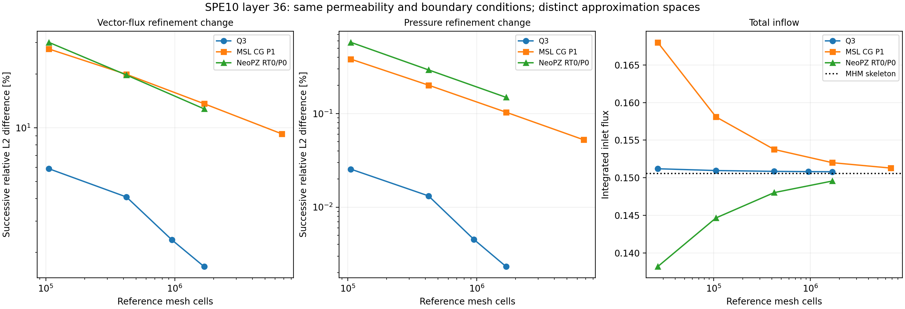

# Darcy flux in SPE10 layer 36

The layer-36 Darcy experiment has a published **flux-magnitude comparison**
in [Barrenechea, Martins, Pereira and Valentin (2026)](https://doi.org/10.1137/24M1673073),
§6.2, Figure 6. This complements the pressure maps and profiles of
[Paredes, Valentin and Versieux (2024)](https://doi.org/10.1016/j.cam.2023.115415),
§5.2. The two articles use different approximation spaces. Their figures
therefore provide distinct comparisons for the [66-square Darcy example](spe10.md#darcy-the-66-square-face-based-experiment).

## Physical field and material convention

The calculation uses

$$
\Omega=(0,1200)\times(0,2200),\qquad
q=-K\nabla p,\qquad \nabla\cdot q=0,
$$

with \(p=1\) on the bottom, \(p=0\) on the top, and
\(q\cdot n=0\) on the vertical sides. Both articles specify these boundary
conditions for SPE10 Model 2, layer 36. The 2024 article explicitly sets
the volume source to zero. The 2026 subsection does not separately restate
its source value.

The distributed material is the horizontal tensor
\(K=\operatorname{diag}(K_x,K_y)\) from the
[pinned OPM dataset](https://github.com/OPM/opm-data/tree/eaa2261683a97027e057c2bc49612ad1c86390b3/spe10model2).
Layer numbers are one based. There are 60×220 material cells, each 20×10 ft;
the arrays retain the original x/y orientation. On this layer, \(K_x=K_y\)
exactly, with range 0.002163–8412.63 mD. Thus the in-plane tensor also equals
\(K_x I\). The vertical component \(K_z\) and porosity do not enter this
steady two-dimensional pressure equation.

The numerical fields retain permeability in mD, coordinates in ft, and the
prescribed pressure values 1 and 0. The plotted flux is exactly
\(-K\nabla p\) in this convention. Neither the pressure unit nor a viscosity
conversion is specified in the article's flux experiment, so the published
scale cannot be identified as an SI velocity scale. The 2026 subsection
also does not state which tensor components were loaded. The component
selection and units above describe the present calculation explicitly.

## What Figure 6 publishes


| Panel | Published field and discretization |
| --- | --- |
| Left | Magnitude of a standard mixed Raviart–Thomas order-2 reference flux; 125,000 triangles and 1,314,000 reported degrees of freedom |
| Middle | Magnitude of the raw flux \(-A\nabla u_{Hh}\), with local continuous P2 pressure and skeletal degree \(\ell=0\) |
| Right | Magnitude of the RT2 moment reconstruction from that MHM pressure, using \(m=2\) |

All three colorbars have visible endpoints \(7.0\times10^{-9}\) and
\(2.5\times10^{-2}\). Intermediate labels overlap in the original image.
The paper does not specify the color transfer function, field-sampling
locations, display interpolation, or whether the displayed endpoints are
global extrema. These labels therefore do not define flux error norms.
No vector-component maps, numerical flux profile, inlet flow rate, or field
arrays accompany this figure in the inspected manuscript and repository
record.

The MHM macroelement count and local refinement of Figure 6 are not stated
explicitly. The subsequent adaptive experiment starts from 512 macroelements
and four local elements per macroelement, and ends with 3,786 macroelements
and 9,559 global unknowns. Those counts describe Figures 7–9; they cannot
be assigned to Figure 6 without additional information. Figure 8 also
shows flux magnitude, while Figure 9 shows a **pressure** profile along the
diagonal from (0,0) to (1200,2200).

### RT2 is distinct from BDM2

The article defines

$$
\mathrm{RT}_m(T)=[\mathbb P_m(T)]^2+x\mathbb P_m(T),
\qquad \operatorname{div}\mathrm{RT}_m(T)=\mathbb P_m(T).
$$

In two dimensions, RT2 has 15 local flux degrees of freedom: nine edge
moments and six interior moments. BDM2 instead equals
\([\mathbb P_2(T)]^2\), has 12 local degrees of freedom, and has divergence
in P1. The [BDM2/P1 Darcy solver](https://github.com/ipes-lncc/pymhm/blob/main/docs/cases/darcy-bdm.md) consequently represents a
different mixed pair from the published RT2 reference.

The paper does not identify whether its 1,314,000 count includes pressure.
For illustration, a 250×250 rectangular grid split into 125,000 triangles
has 188,000 edges, giving
\(3(188000)+6(125000)=1314000\) RT2 **flux** coefficients. Adding independent
P2 pressure would give 2,064,000 coefficients before boundary elimination.
This arithmetic is consistent with a flux-only count; it does not establish
the unpublished connectivity or pressure-space details of the reference.

## Fixed MHM field and conforming Q3 comparison

The computed MHM field retains the 2024 face-based configuration:

| Quantity | Configuration |
| --- | --- |
| Macrogrid | 6×11 squares, each of side 200 |
| Local pressure | Continuous Q1 on 120×120 quadrilaterals per macrocell |
| Skeleton | Continuous P1 on 32 segments of each macroface |
| Reduced global dimension | 4,191 free trace coefficients plus 66 retained constants: 4,257 |
| Material integration | Local cells aligned with the permeability pixels |

Continuity of the skeletal basis is imposed within each macroface; values
on different macrofaces are independent. The local refinement 120 is a
declared choice because the 2024 article does not report that count.
This quadrilateral Q1/continuous-P1 configuration is distinct from the
triangular P2/P0 configuration in the flux-reconstruction figure.

The conforming comparison uses continuous Q3 pressure on a pixel-aligned
960×1760 quadrilateral grid: 1,689,600 elements and 15,214,561 coefficients.
It solves the same declared material and boundary-value problem. This is
a separate conforming assembly using PyMHM's basis and integration kernels,
not an independent implementation or the article's mixed RT2 reference.


Flux magnitude shows the conductive channels; signed components additionally
resolve the direction of flow. A difference of magnitudes,
\(\lvert q_{\mathrm{MHM}}\rvert-\lvert q_{\mathrm{Q3}}\rvert\), is not the
vector difference \(q_{\mathrm{MHM}}-q_{\mathrm{Q3}}\). Likewise, a finite
set of displayed samples does not define an integrated L2 norm. The actual
66-square macrogrid supplies the common spatial partition for the maps;
it is an overlay on the conforming reference, which has no MHM interfaces.

Component maps use a blue–white–red diverging palette with zero at white.
The color coordinate is \(\operatorname{asinh}(100q/M)/\operatorname{asinh}(100)\),
where \(M\) is the common maximum absolute component value in the MHM and
reference panels. This symmetric scale resolves small fluxes without clipping
extrema; colorbar labels retain physical flux values. Signed differences use
their own maximum absolute value. Magnitude maps retain linear scales.

The displayed MHM flux is the raw one-sided field \(-K\nabla p_h\).
Its normal component can jump across fine and macro interfaces. Macro
conservation instead follows from the skeletal flux: for every macrocell
\(K\), the oriented integral of that flux equals \(\int_K f\).
Small macro balance defects do not imply that the raw gradient field is
H(div)-conforming or pointwise divergence-free.

The [RT moment reconstruction](https://github.com/ipes-lncc/pymhm/blob/main/docs/cases/reconstruction-moments.md) is a separate
algorithm on triangular submeshes. Its continuous-test-space conservation
identity must not be strengthened to independent balance on every fine
cell. Neither that reconstruction nor the published RT2 convergence
estimate is implied by the raw quadrilateral Q1 flux comparison above.

## Independent classical references

Two further comparisons use finite-element operators assembled by independent
codes. Both retain the same layer, physical coordinates, coefficient pixels,
source and boundary conditions. Their meshes fit the material pixels, and
their approximation spaces differ from the MHM spaces and the article's RT2
reference.

| Reference | Finest mesh | Unknowns before boundary elimination | Linear solver |
| --- | --- | ---: | --- |
| PyMHM conforming Q3 | 960×1760 quadrilaterals | 15,214,561 | Intel MKL PARDISO through `pypardiso` |
| MSL_CG conforming P1 | 960×3520 rectangles split southwest–northeast; 6,758,400 triangles | 3,383,681 | Native MSL `LocalLinearSystem`, Eigen SparseLU |
| NeoPZ mixed RT0/P0 | 480×1760 rectangles split southwest–northeast; 1,689,600 triangles | 4,226,240 | Intel MKL PARDISO through `pypardiso` |

The MSL execution uses `msl_cg` revision
`afb76d14c1baf50f0b9e69f7bcac675749ef4458` and `msl_core` revision
`7f15f455717173d29080d411a7e732c72c1e87f8`, with unchanged numerical libraries.
It solves a global conforming P1 problem through `DiffusionCGProblem`;
no MHM condensation is used in this reference. Pressure is prescribed
strongly at the horizontal boundaries, and sidewall zero flux is natural.
The reported physical field is its raw flux \(-K\nabla p_h\).

The [NeoPZ revision](https://github.com/labmec/neopz/tree/4c6b6d277ce097b97bfc8dea1b6725860f4fe05a)
uses `TPZMixedDarcyFlow`, triangular `EHDivConstant` order zero, and
discontinuous constant pressure. Prescribed pressure enters the mixed
boundary functional; sidewall normal-flux coefficients are eliminated
exactly, without a penalty. Native NeoPZ supplies element assembly and
physical-field evaluation. The sparse system is equilibrated and solved
through `pypardiso` 0.4.7 with MKL 2026.1; its final residual is checked in
the unscaled equations. This is the classical RT0/P0 method, not an
execution of the NeoPZ MHM controller.


### MSL P1 fields


### NeoPZ RT0/P0 fields


These maps use the same 60×220 material-pixel centers and overlay the actual
66-square MHM partition on every panel. A deterministic one-sided value
is used when a sample lies on a fine-element interface. The partition
overlay on each classical reference provides spatial correspondence;
those global reference methods have no MHM interfaces.

## Integrated differences

For a reference field \((p_R,q_R)\), the relative differences are

$$
\begin{aligned}
E_p&=\frac{\|p_{\mathrm{MHM}}-p_R\|_{L^2(\Omega)}}
{\|p_R\|_{L^2(\Omega)}},\\
E_q&=\frac{\|q_{\mathrm{MHM}}-q_R\|_{L^2(\Omega)^2}}
{\|q_R\|_{L^2(\Omega)^2}}.
\end{aligned}
$$

The flux norm integrates both vector components. It is not the difference
of magnitudes or the RMS of the plotted pixel-center samples.

| Reference for the fixed MHM field | Pressure difference, % | Vector-flux difference, % |
| --- | ---: | ---: |
| Pixel-aligned Q3, 960×1760 | 0.208602 | 12.6093 |
| MSL_CG P1, 960×3520 | 0.207577 | 12.6230 |
| NeoPZ RT0/P0, 480×1760 | 0.257654 | 17.1396 |

For the Q3 comparison, integration uses the exact common rectangular
partition of the two finite-element grids and the permeability pixels.
On each intersection, pressure differences have coordinate degree at most
three, and their squared gradients have coordinate degree at most six.
A 4×4 Gauss rule therefore integrates the required polynomials exactly,
up to floating-point arithmetic. Increasing this rule to 5×5 changes the
pressure, flux and energy differences relatively by
\(1.50\times10^{-14}\), \(1.53\times10^{-12}\) and
\(5.30\times10^{-14}\), respectively.

Comparisons with the triangular references use exact rectangle–triangle
polygon intersections and positive Gauss–Duffy integration. Monomial tests
through total degree four have relative defects below
\(8.6\times10^{-16}\). This degree suffices for the squared Q1/P1/P0
pressure differences and the squared physical-flux differences on each
constant-material intersection. Evaluation uses the actual finite-element
coefficients, independently of the display samples.

The Q3 comparison also records the relative weighted flux norm

$$
E_K=
\frac{\|K^{-1/2}(q_{\mathrm{MHM}}-q_R)\|_{L^2(\Omega)^2}}
{\|K^{-1/2}q_R\|_{L^2(\Omega)^2}}=8.43491\%.
$$

Because both fields are raw Darcy gradients with the same \(K\), this
quantity is also the relative broken pressure energy seminorm against
that Q3 reference. It weights errors differently from the unweighted
physical-flux L2 norm.

The Q3 grid matching the 2024 article has 768×1408 elements and cuts the
material pixels. With exact material-intersection integration, the same
MHM field differs from that reference by **0.201069% in pressure and
18.1979% in flux**. This result belongs to the article-grid comparison;
it is separate from the pixel-aligned refinement family above. Exact
integration resolves the coefficient integral, while each Q3 polynomial
still spans any permeability jump inside its element. The pressure
figures on the [main SPE10 page](spe10.md) retain this article-grid
reference.

## Refinement of each reference

The following differences compare successive fields within each reference
family, with the finer field's norm in the denominator. A dash marks the
first level, for which no preceding field is included. Grid dimensions
denote quadrilaterals for Q3 and rectangles before diagonal splitting for
the two triangular methods.

| Method | Grid | Pressure change, % | Vector-flux change, % |
| --- | --- | ---: | ---: |
| Q3 | 120×220 | — | — |
| Q3 | 240×440 | 0.0254712 | 5.89070 |
| Q3 | 480×880 | 0.0131907 | 4.08951 |
| Q3 | 720×1320 | 0.00451483 | 2.35216 |
| Q3 | 960×1760 | 0.00231264 | 1.66621 |
| MSL P1 | 60×220 | — | — |
| MSL P1 | 120×440 | 0.382024 | 27.5918 |
| MSL P1 | 240×880 | 0.201336 | 19.8883 |
| MSL P1 | 480×1760 | 0.103393 | 13.6163 |
| MSL P1 | 960×3520 | 0.0524286 | 9.23462 |
| NeoPZ RT0/P0 | 60×220 | — | — |
| NeoPZ RT0/P0 | 120×440 | 0.577601 | 30.0518 |
| NeoPZ RT0/P0 | 240×880 | 0.293161 | 19.7074 |
| NeoPZ RT0/P0 | 480×1760 | 0.149064 | 12.7416 |



The final Q3 step refines each coordinate by 4/3, whereas the MSL and NeoPZ
steps double each coordinate. For a doubling comparison, **Q3 480×880 to
960×1760 changes by 2.83993% in flux** and 0.00681954% in pressure. The
terminal 1.66621% change therefore must not be compared as if it used the
same refinement ratio as the other two families.

Successive differences measure observed refinement sensitivity; they are
not certified errors against the exact reservoir solution. In particular,
the terminal MSL and NeoPZ flux changes remain substantial. Their
differences from MHM combine the errors of both discrete fields. Agreement
of the MHM/Q3 and MHM/MSL percentages alone does not establish that either
reference has converged to the exact flux.

### Total inflow and conservation

| Method | Positive total inflow |
| --- | ---: |
| MHM skeletal flux | 0.1505654992 |
| Conforming Q3, 960×1760 | 0.1508016962 |
| MSL P1, 960×3520 | 0.1512890604 |
| NeoPZ RT0/P0, 480×1760 | 0.1495695509 |

The sign convention is \(-\int_{y=0}q\cdot n\): upward flow enters at
the bottom. For MHM this integral uses the skeletal normal flux. For Q3
and MSL P1 it uses the boundary reactions of the uneliminated variational
operator. These reactions need not equal integrals of the raw gradient
field on the boundary. For NeoPZ it is the integral of the H(div)-conforming
mixed flux itself.

The maximum MHM macro balance defect is \(1.25\times10^{-15}\). NeoPZ
has maximum fine-cell balance defect \(5.42\times10^{-18}\), interior
normal-flux jump \(6.21\times10^{-18}\), and divergence L2 norm
\(1.30\times10^{-16}\). These conservation measurements concern the
specified discrete fields; they do not replace the flux-accuracy comparisons.

The direct Q3/RT0 comparison gives **0.132602% pressure difference and
12.3004% vector-flux difference**, using the Q3 norms as denominators.
Writing \(\mathcal E(q)=\int_\Omega q^{\mathsf T}K^{-1}q\) and \(I\)
for positive inflow, the divergence-free RT0 field and prescribed Q3
pressure trace, together with the mixed variational equation, give
\(\mathcal E(q_{\mathrm{RT0}})=I_{\mathrm{RT0}}\) and
\((K^{-1}q_{\mathrm{Q3}},q_{\mathrm{RT0}})=I_{\mathrm{RT0}}\).
The nested RT0 refinements also satisfy
\(\mathcal E(q_f-q_c)=I_f-I_c\), with measured relative defects at most
\(3.16\times10^{-11}\). For Q3 versus RT0, the directly integrated
\(\mathcal E(q_{\mathrm{Q3}}-q_{\mathrm{RT0}})\) is
\(1.2321475083\times10^{-3}\), while the archived
inlet-reaction difference is \(1.2321452913\times10^{-3}\).
Their absolute discrepancy, \(2.22\times10^{-9}\), corresponds to the
finite algebraic-work defect between the Q3 energy and its inlet reaction.
The resulting relative discrepancy \(1.80\times10^{-6}\) exceeds the
recorded \(10^{-7}\) identity criterion, which therefore remains **not
satisfied**. These measurements quantify energy consistency and reaction
precision; they are not a certified error bound.

## Inspect the records and redraw the figures

```sh
pixi run -e notebooks gallery-spe10-flux
```

This command reads the archived fields and norms without executing the
reference codes. Download the
[case index and aggregated measurements](../figures/spe10/darcy-flux-comparison.json).
Integrated comparisons are recorded in `darcy-flux-q3-norms.json`,
`msl-cg-mhm-960x3520-q3.json` and `neopz-mhm-480x1760-order3.json`, all in
`examples/results/spe10`. The direct classical-field
energy comparison is `neopz-q3-480x1760-order7.json`, also included in
`neopz-convergence.json`. `msl-cg-convergence.json` and `neopz-provenance.json`
record reference revisions, solver conventions and artifact digests.
The [notebook guide](../tutorials.md) includes notebook 23 for inspection
of the reservoir results. Reference-code sources and comparison execution
programs are not part of this distribution.
