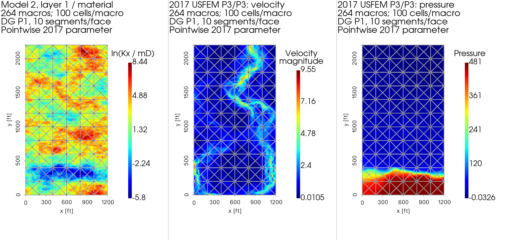
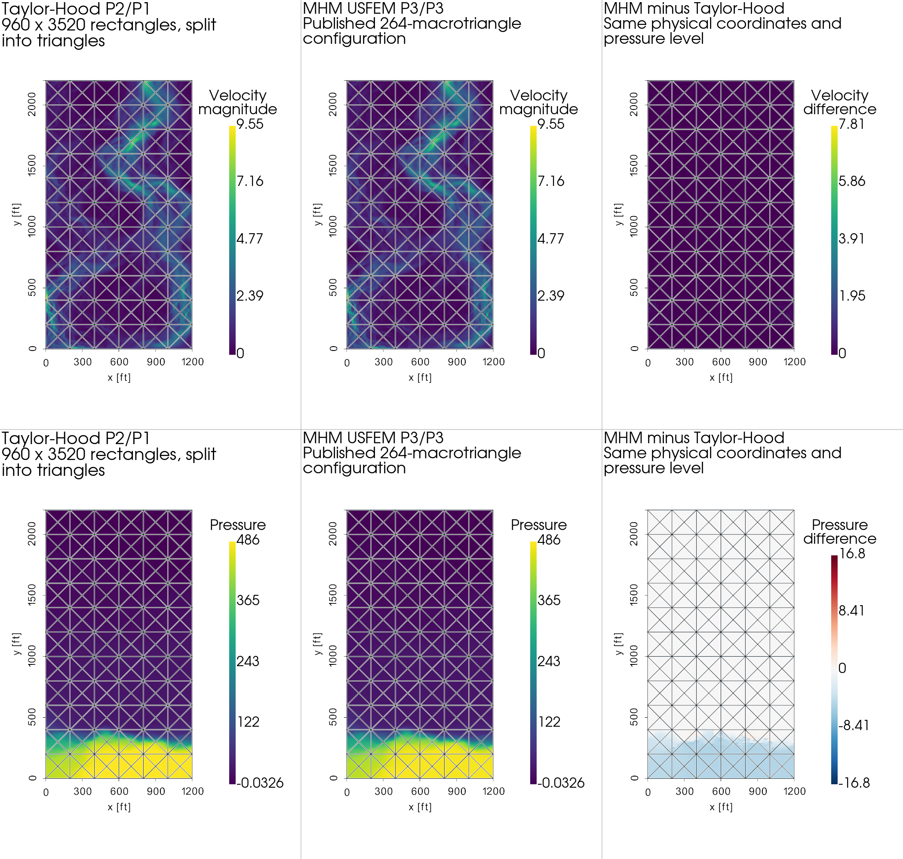
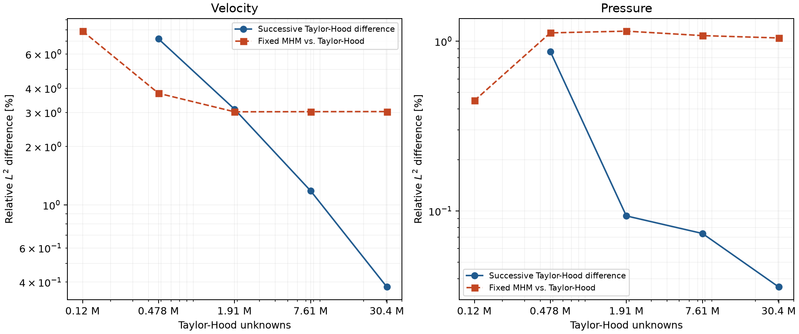

# SPE10 reservoir: data, Darcy and Brinkman

The MHM reservoir examples use **horizontal slices of SPE10 Model 2**, not
SPE10 Model 1. Model 2 has 60×220×85 cells with dimensions 20×10×2 ft.
Its horizontal domain is therefore 1200×2200 in the numerical coordinates
used by the articles. The [OPM data](https://github.com/OPM/opm-data/tree/eaa2261683a97027e057c2bc49612ad1c86390b3/spe10model2)
are pinned by revision and SHA-256 checksums. The
[MRST SPE10 documentation](https://www.sintef.no/contentassets/2551f5f85547478590ceca14bc13ad51/spe10.html)
describes the two models and their unit conventions.


The volume panel uses the true geometric aspect ratio. Only the slices are
computational domains in these experiments. Their dark contours show the
66-square Darcy macrogrid; the material grid is the finer 60×220 pixel grid.
Neither material values nor finite-element fields are smoothed across cells.

## Which layer is in each article?

| Article and figure | Layer, one based | Kx minimum–maximum, mD | Evidence |
| --- | --- | --- | --- |
| [Paredes, Valentin and Versieux (2024)](https://doi.org/10.1016/j.cam.2023.115415), Figures 5–8 | 36 | 0.002163–8412.63 | Layer explicitly specified; channel geometry matches |
| [Araya et al. (2017)](https://doi.org/10.1016/j.cma.2017.05.027), Figures 18–20 | 1 | 0.003033–4647.5 | Text says top layer; both extrema match Figure 18 |
| [Araya et al. (2025)](https://doi.org/10.1137/24M1649368), Figures 4–5 | 36 | 0.002163–8412.63 | Layer explicitly specified |
| [Araya, Rebolledo and Valentin (2021)](https://doi.org/10.1093/imanum/drz053), Figure 4 | Figure supports 36; text says 85 | Figure: approximately 0.0022–8400 | Text/figure discrepancy; layer 85 reaches 20000 |

The following common-scale comparison makes the layer choice inspectable.
Kx equals Ky in these slices. Kz is preserved in the archived data, but is not
used as an in-plane component.


The plots use the natural logarithm of the numerical permeability in mD.
For layer 36, its range is approximately −6.14 to 9.04, consistent with the
colorbar of the published Darcy figure. The x/I index varies fastest in the
original include files; the reader retains x/y orientation and does not
transpose or reverse the slice.

**Expected behavior.** Connected high-permeability channels carry concentrated
Darcy flux, while pressure varies weakly along a conductive channel and more
strongly across barriers. Porosity correlates with part of this geological
structure but does not enter the steady, incompressible single-phase pressure
equation. These tests do not solve multiphase saturation or reservoir transport.
OPM's porosity file documents a zero-to-1e-7 replacement; those source values
are retained in the dataset used here.

## Darcy: the 66-square face-based experiment

[Paredes, Valentin and Versieux (2024)](https://doi.org/10.1016/j.cam.2023.115415),
§5.2, solve

$$
q=-K\nabla p,\qquad \nabla\cdot q=0,
$$

with bottom pressure 1, top pressure 0 and zero normal flux on both vertical
sides. Their Figure 5 supplies the material and reference-pressure images:


Their Figure 6 uses 6×11 square macrocells of side 200, bilinear Q1 local
problems, and continuous piecewise P1 traces on 32 segments per macroface.
After imposing the two sidewall fluxes, the global system has

$$
127\,(32+1)+66=4257
$$

unknowns: free trace coefficients plus retained cell constants. Continuous
here means within a macroface; it does not identify values at vertices of
different macrofaces. The package's Cartesian solver preserves this geometry
and trace convention.


The article does not specify the MHM local refinement count in §5.2. It does
specify the independent reference: Q3 on 1,081,344 quadrilaterals, with
9,738,625 unknowns. Those counts describe a 768×1408 reference grid, and must
not be treated as a statement about the local Q1 mesh. Local and skeleton
refinement are therefore varied separately in the executable comparison.

### Computed fields and direct article comparison

The calculation below keeps the published 66-square macrogrid, Q1 local
pressure and continuous P1 trace on 32 segments. Its local grid has 120×120
quadrilaterals per macrocell. That last count is a declared computational
choice, since the article does not report it. It must not be confused with
the degree, macrogrid or skeleton resolution, which do match the article.


**Expected result.** Pressure drops across low-permeability bands and follows
the conducting channels. The flow is upward, with equal total inflow and
outflow. Raw local Q1 gradients may jump at a macro boundary; the separately
computed skeletal flux provides macro conservation. Small nodal overshoots
are retained in the figure and records rather than clipped to [0,1].

The [Darcy flux comparison](spe10-flux.md) relates this fixed MHM field to
the published RT2 flux image and a pixel-aligned conforming Q3 calculation.

The conforming comparison uses **Q3 on 768×1408 quadrilaterals**, giving
exactly the article's 1,081,344 cells and 9,738,625 unknowns. This is a
separate conforming assembly in PyMHM, sharing its basis and quadrature
kernels; it is not an independent-code comparison. Each element is intersected
with the material pixels before integration. For constant permeability on
each intersection, the selected rule integrates the Q3 stiffness polynomial
exactly. The free-system relative residual is 6.82×10⁻¹² and the total
boundary-reaction imbalance is 1.34×10⁻¹⁰.


All three panels show the same 66-square partition, even though the conforming
reference has no MHM interfaces. Values in this comparison are sampled at
the 60×220 material-cell centers. Their RMS difference is a sampling diagnostic,
not an integrated finite-element error norm.


The black dots are 221 coordinates digitized from the article's Q3 curve,
providing the published profile values for comparison. The estimated raster
placement uncertainty is ±0.0021 in pressure and ±2.1 in the y coordinate. The conforming Q3
calculation has pressure RMS 0.00124 and maximum difference 0.00549 at those
coordinates. This supports close profile agreement, not coefficient-level
identity with the historical calculation. In particular, steep regions
amplify uncertainty in the horizontal placement of a raster sample.

### Local and face refinement


Solid curves use local cell edges aligned with the material pixels. Dashed
curves use cells that cross permeability jumps, integrated by geometric
intersection. Exact integration does not enrich the Q1 approximation space:
a single polynomial still cannot reproduce a gradient jump inside its cell.
These two grid families therefore must not be combined into a claimed
monotone convergence sequence. Likewise, refining the local mesh at fixed
trace resolution need not eliminate the skeleton error.

For the aligned r=120, 32-segment calculation, the integrated inlet flux is
0.1505654992 and the maximum macro balance defect is 1.25×10⁻¹⁵.
The Q3 comparison on the article's grid gives inlet flux 0.1520449209.
The independently refined, pixel-aligned Q3 grid of 480×880 cells gives
0.1508512216. Their difference also measures the effect of the reference
space's alignment; it must not be attributed entirely to MHM error.

The archived numerical coordinates retain the paper's numerical mD/ft
convention. `ReservoirData.to_si()` converts both K and lengths explicitly.
Uniform scaling of K leaves this pressure-driven Darcy pressure invariant and
rescales its flux; it does not leave a Brinkman solution invariant when the
viscosity and drag prefactors are held fixed.

## Brinkman: the boundary conditions matter

The reservoir experiments of
[Araya et al. (2017)](https://doi.org/10.1016/j.cma.2017.05.027) use

$$
-0.3\Delta u+0.3K^{-1}u+\nabla p=0,\qquad \nabla\cdot u=0.
$$

Bottom velocity is (0,1), top pseudotraction is zero, and each vertical wall
has zero normal velocity and zero tangential pseudotraction. These are **slip
walls**. Imposing both velocity components as zero would define a different
problem. The multiplier and traction conventions follow the grad–grad
pseudostress, not the symmetric Cauchy stress.


The 2017 calculation uses the following configuration. The 2025 experiment
has a separate layer and macro mesh, described below.

| Item | Article and calculation |
| --- | --- |
| Material | Model 2, top layer (one-based layer 1), Kx=Ky |
| Domain | [0,1200]×[0,2200], source numerical mD/ft convention |
| Operator | Vector Laplacian, viscosity 0.3, drag 0.3/K, zero body force |
| Macrogrid | 6×11 square blocks split through their centers: 264 triangles |
| Local grid | Uniform subdivision into 100 triangles in every macrotriangle |
| Local spaces | Continuous P3 velocity and P3 pressure, USFEM residual formulation |
| Skeleton | Vector discontinuous P1 on ten segments of every macroface |
| Boundary | Bottom u=(0,1); side ux=0 and tangential traction=0; top full traction=0 |
| Raw trace dimension | 16,520 |

The implementation retains two local constant velocity modes algebraically
before global condensation. With positive drag they are not physical kernels;
their exact retained-mode elimination preserves the discrete equations. After
prescribing 680 traction components, the 15,840 free trace coefficients and
528 retained coefficients form a 16,368-unknown solve. The 16,520 count quoted
in the article counts the raw trace space and must be compared with that
same count, not with the boundary-reduced system dimension.

The residual parameter is also part of the formulation. Equation (43) uses

$$
\kappa_\tau=\frac{h_\tau^2}
{\max(\gamma_{\min}h_\tau^2,4\nu/m_\tau)+4\nu/m_\tau},
\quad m_\tau=\min(1/3,C_\tau).
$$

The article names the minimum eigenvalue but does not specify its spatial
evaluation for heterogeneous permeability or a numerical value of the
admissible inverse constant. Here C is computed from the local polynomial
inverse inequality, and the chosen coefficient evaluation is recorded with
the result. The 2025 maximum-eigenvalue rule is separately selectable; it
must not be silently used as the 2017 parameter. See [theory](../theory.md)
for these distinctions and the stability limitation of a global minimum.



This calculation uses `stabilization="pointwise-2017"`: the minimum
eigenvalue expression is evaluated separately on each material pixel. The
local triangles are geometrically intersected with those pixels, preserving
the same P3/P3 approximation space. Increasing the integration order from
5 to 8 changes the integrated relative L2 velocity and pressure fields by
1.85×10⁻¹¹ and 7.42×10⁻¹², respectively. Thus material quadrature is resolved
for this declared interpretation.


The cut x=199 is an additional integration diagnostic, not a profile specified
by the 2017 article. The broken values on opposite macrofaces are retained.

**Expected and observed results.** Flow concentrates in the connected channels,
and most pressure loss occurs across the low-permeability lower band, as in
Figures 19–20. The published MHM colorbars reach 9.090 for velocity magnitude and 478.9
for pressure; the computed nodal maxima are 9.54968 and 481.45149. These
extrema are not field error norms, and the original colorbar sampling is not
specified. These differences mean that the calculation **does not establish
quantitative reproduction of the published figures**. The reported spaces
agree, while the article leaves coefficient evaluation, the inverse constant
and output sampling unspecified.

Independent DOLFINx/UFL assembly verifies all three selectable residual
parameters on twelve P3/P3 tensor-resistance cases: relative matrix and load
differences are at most 1.94×10⁻¹⁵ and 3.54×10⁻¹⁵. This verifies the
implemented operators, not the unavailable historical parameter choices.
The layer-1 run has maximum macro balance defect 8.30×10⁻⁹ on total inlet
flow 1200. Its broken divergence L2 norm is 21.425; macro conservation does
not imply pointwise incompressibility of these primal local fields.

### Classical Taylor–Hood baseline

A separately assembled **global conforming Taylor–Hood P2/P1** calculation
provides a classical reference for this problem without an exact solution.
It uses DOLFINx/UFL with PETSc/MUMPS, continuous quadratic velocity and
continuous linear pressure, without residual stabilization or MHM traces.
This is an additional verification baseline; the article's reference uses
USFEM, so the Taylor–Hood result is not attributed to its reference figures.
All reference levels are compared with the same MHM configuration above.

Both calculations use the same layer, numerical units, viscosity, drag,
body force and componentwise boundary conditions. The natural top
pseudotraction fixes the pressure level: no mean-pressure adjustment is
applied when comparing the fields. Every reference mesh resolves all
60×220 permeability pixels. The resistance is exactly piecewise constant
on each triangle, and degree-four quadrature exactly integrates the P2
velocity mass term. Refinement therefore changes the approximation space
without changing the material integration.



All six maps show the actual 264-macrotriangle partition. The conforming
reference itself has no macro interfaces. The third velocity panel shows
the Euclidean norm of the **vector difference**, not the difference of
velocity magnitudes. The pressure difference is signed. Both fields are
evaluated at the same broken display vertices and rendered with linear
display triangles; coincident values from opposite MHM sides remain
independent. These visualization samples are not used to compute error norms.



| Reference rectangles | Unknowns | Successive velocity L2 [%] | Successive pressure L2 [%] | MHM/TH velocity L2 [%] | MHM/TH pressure L2 [%] |
| --- | ---: | ---: | ---: | ---: | ---: |
| 60×220 | 120,203 | — | — | 7.8702 | 0.44687 |
| 120×440 | 478,003 | 7.1783 | 0.87045 | 3.7635 | 1.1199 |
| 240×880 | 1,906,403 | 3.1166 | 0.093575 | 3.021 | 1.1465 |
| 480×1760 | 7,614,403 | 1.182 | 0.073736 | 3.0263 | 1.0792 |
| 960×3520 | 30,435,203 | 0.37789 | 0.035721 | 3.0299 | 1.0452 |

The finest baseline contains **6,758,400 triangles and 30,435,203 unknowns**.
Its original free-equation relative residual is 2.07×10⁻¹²; the net boundary
flux defect is 4.32×10⁻¹¹ on an inflow of 1200. The last reference change
is 0.378% in velocity and 0.0357% in pressure, compared with MHM/reference
distances of 3.030% and 1.045%. Thus the final refinement changes are about
12.5% and 3.4% of those distances, respectively. They quantify remaining
reference sensitivity, not a rigorous bound on its error. Increasing the
comparison quadrature from order 24 to 32 changes the relative differences
by less than 0.0002 percentage point.

Successive-reference differences are integrated on the nested fine
Taylor–Hood triangles with polynomial-exact quadrature. MHM/reference
differences are integrated over each MHM fine triangle, preserving all
broken interfaces; the reference interfaces can cross these triangles,
so increasing quadrature orders checks the comparison integral separately.
Successive differences use the finer Taylor–Hood field in the denominator;
MHM comparisons use the corresponding Taylor–Hood field. A small
linear-system residual verifies the algebraic solve, not the spatial
discretization error. The finest computed reference is a numerical baseline,
not an exact solution or a certified error bound.
The orange curve changes only the reference resolution: it is not an MHM
convergence study. A coarse reference can lie closer to MHM through partial
cancellation of their discretization errors, as the pressure comparison
demonstrates. Closeness to that coarse field is not evidence of greater accuracy.


The black curve is the finest Taylor–Hood reference, the gray curve is the
preceding reference level, and the orange segments are the fixed MHM solution.
Dotted lines locate actual macroface crossings. The expected channel flow and
pressure drop through the lower barrier occur in both methods. The close full-domain pressure profiles do not eliminate local
velocity differences, which remain visible in the component profiles and
in the independently integrated norms.

The 2025 experiment uses layer 36 and 528 macrotriangles, with the square
blocks split into eight triangles. Its text specifies continuous P1 traces,
whereas the reported 33,040 count equals the raw discontinuous-trace count.
These conventions are not silently identified with one another. Likewise,
the x coordinate of its pressure profile is not reported; x=199 belongs to
the separate Darcy experiment.

## Reproduce the data visualization

```bash
pixi run -e notebooks python examples/plot_spe10_data.py --download
```

The download is explicit and checksum verified. To redraw the distributed
slices without downloading the complete reservoir:

```bash
pixi run -e notebooks python examples/plot_spe10_data.py --layers-only
```

Use `pymhm.io.reservoir` for strict include-file reading and piecewise constant
coefficient evaluation, and [the PyVista adapter](../visualization.md) for
VTK grids, export and composed views. The numerical records include layer
indices, physical units, material extrema, source hashes and file provenance.

To compute and redraw the Darcy comparison from the distributed layer:

```bash
pixi run python -m examples.solve_spe10
pixi run -e intel python -m examples.solve_spe10_reference --shape 768 1408 --order 5
pixi run -e notebooks gallery-spe10-darcy
```

The reference solve is optional for replaying the figures; its sampled fields,
profile and residual diagnostics are archived with the example results.

For the declared 2017 Brinkman calculation and its integration check:

```bash
pixi run -e notebooks python examples/solve_spe10_brinkman.py --stabilization pointwise-2017 --order 5 --output build/spe10-brinkman
pixi run -e notebooks python examples/solve_spe10_brinkman.py --stabilization pointwise-2017 --order 8 --output build/spe10-brinkman
pixi run -e notebooks gallery-spe10-brinkman
```

The first two commands write numerical records in the build directory.
The gallery command replays the archived, checked records distributed with the example.

For the independent conforming baseline, first verify the constant-drag
patch and then double both mesh directions successively:

```bash
pixi run -e fem python examples/solve_spe10_taylor_hood.py --patch --shape 12 22
pixi run -e fem python examples/solve_spe10_taylor_hood.py --shape 60 220
pixi run -e fem python examples/solve_spe10_taylor_hood.py --shape 120 440 --previous build/results/spe10/taylor-hood/taylor-hood-60x220.npz
```

Continue with the mesh levels recorded in the refinement table, passing
the preceding coefficient archive to `--previous`. The driver records
original free-equation residuals, boundary fluxes, integration conventions,
library versions and input/output checksums. `--mhm` selects the archived
MHM field for physical L2 comparisons; `--comparison-orders` controls the
independent integration check. Full coefficients are retained as build
outputs, while display samples and diagnostics accompany the case.

```bash
pixi run -e notebooks python examples/plot_spe10_taylor_hood.py --sample
pixi run -e notebooks gallery-spe10-taylor-hood
```

The first command refreshes display samples from the finest coefficient
archive. The second replays the checked samples without rerunning the large
reference solves. The source notebook verifies the archived provenance,
reported spaces, residuals and refinement comparisons.

## References

- Diego Paredes, Frédéric Valentin, and Henrique M. Versieux (2024). *Revisiting the robustness of the multiscale hybrid-mixed method: The face-based strategy*, Journal of Computational and Applied Mathematics 436, 115415. [DOI: 10.1016/j.cam.2023.115415](https://doi.org/10.1016/j.cam.2023.115415).

- Rodolfo Araya, Christopher Harder, Abner H. Poza, and Frédéric Valentin (2017). *Multiscale hybrid-mixed method for the Stokes and Brinkman equations—The method*, Computer Methods in Applied Mechanics and Engineering 324, 29–53. [DOI: 10.1016/j.cma.2017.05.027](https://doi.org/10.1016/j.cma.2017.05.027).

- Rodolfo Araya, Christopher Harder, Abner H. Poza, and Frédéric Valentin (2025). *Multiscale Hybrid-Mixed Methods for the Stokes and Brinkman Equations—A Priori Analysis*, SIAM Journal on Numerical Analysis 63(2), 588–618. [DOI: 10.1137/24M1649368](https://doi.org/10.1137/24M1649368).

- Rodolfo Araya, Ramiro Rebolledo, and Frédéric Valentin (2021). *On a multiscale a posteriori error estimator for the Stokes and Brinkman equations*, IMA Journal of Numerical Analysis 41(1), 344–380. [DOI: 10.1093/imanum/drz053](https://doi.org/10.1093/imanum/drz053). An earlier version is [HAL: hal-01945934v1](https://hal.science/hal-01945934v1).
