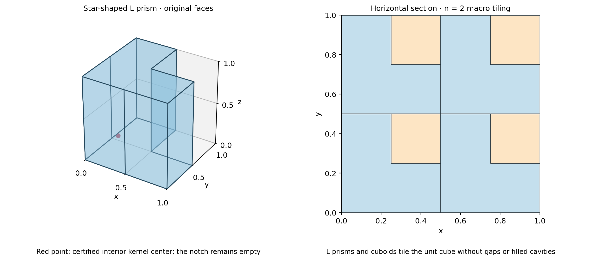
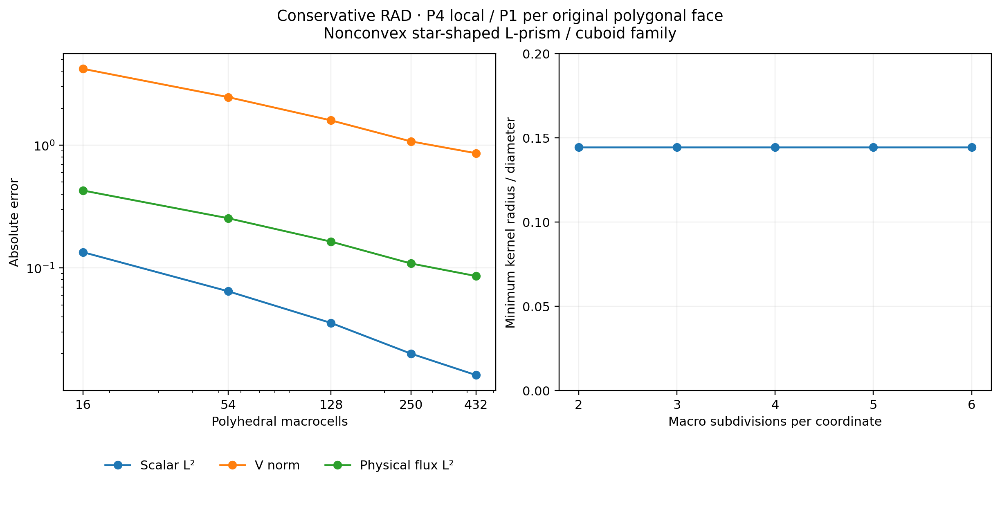

# Nonconvex star-shaped polyhedral RAD

`PolyhedralMesh` accepts nonconvex cells whose closed, connected boundary is
star-shaped with respect to a certified interior ball. The original planar
polygonal faces remain the skeletal entities, including concave faces. The
local tetrahedra partition the physical cell: reentrant notches are preserved.

This is the geometric class in §4.1(iii) of
[Araya et al. (2024)](https://doi.org/10.1016/j.cma.2024.117089).
The campaign uses their smooth three-dimensional PDE and $P_4/P_1$ degrees on
an original nonconvex mesh family. It does not identify these meshes with the
article's historical realization.

## Geometry and local spaces

Each face is a simple planar polygon with cyclic vertex order. Boundary-edge
incidence determines consistent outward orientation. The kernel calculation
maximizes the radius of an interior ball constrained by every oriented face
plane; the returned point is checked against those planes. Cones from this
point to a conforming face triangulation give positive tetrahedra. A complete
separating-axis test rejects overlapping cone interiors. Face ordering and
cyclic reversal do not change the physical fields.

Empty kernels, disconnected cavity shells, open boundaries and nonorientable
surfaces are rejected. Acceptance of one cell is not a claim of uniform
regularity for an arbitrary sequence of cells: the ratio of kernel radius to
cell diameter must remain bounded below for the cited geometric hypothesis.
Convex cells retain their established geometry and local ordering.



The unit cube is tiled by L prisms and cuboids. For resolution $n$, there are
$2n^3$ macrocells, half nonconvex. Each layer repeats a conforming L/square
partition. The minimum kernel-radius/diameter ratio is
$1/(4\sqrt{3})\approx0.144338$ throughout this family.

Local potentials are continuous $P_4$ on the cone tetrahedra. Each original
macroface has one complete affine polynomial, with three coefficients even
when that face is concave or has more than three vertices. The triangulation
introduces integration and local-mesh entities, not additional global traces.

## Analytical problem and norms

The conservative operator, exact solution and load are

$$
\begin{aligned}
-\nabla\cdot(0.1\nabla u)+\nabla\cdot(\beta u)&=f,
&\beta&=(1,0,0),\\
u&=\sin(6\pi x)\sin(4\pi y)\sin(2\pi z),\\
f&=5.6\pi^2u+\partial_xu.
\end{aligned}
$$

All exterior Dirichlet values are zero. The multiplier is the Robin quantity
$(-0.1\nabla u+\beta u/2)\cdot n$; the physical flux shown in the maps is
$q=-0.1\nabla u+\beta u$. Their distinction is retained in the diagnostics.
The reported $V$ norm is

$$
\|e\|_V^2=\|\nabla e\|_{L^2(\Omega)}^2+
\frac{1}{3}\|e\|_{L^2(\Omega)}^2,
$$

because the squared diameter of the cube is three. All norms use physical
volume quadrature. Positive Duffy rules are increased on coarse cells to
resolve the oscillatory analytical source, and each error is recomputed at a
higher quadrature order. Exact geometry, algebraic residual and quadrature
agreement are distinct checks from the approximation errors.

## Numerical results

The five resolutions retain the same local and skeletal degrees. Errors
are absolute physical norms, with the higher of the two recorded integration
orders. The source and geometric hypotheses are identical at every level.

| Macrocells | Trace coefficients | $\|u-u_h\|_{L^2}$ | $\|u-u_h\|_V$ | $\|q-q_h\|_{L^2}$ |
|---:|---:|---:|---:|---:|
| 16 | 264 | 0.13424938 | 4.18300328 | 0.42701004 |
| 54 | 810 | 0.06456435 | 2.46169235 | 0.25405799 |
| 128 | 1824 | 0.03563548 | 1.59155957 | 0.16372333 |
| 250 | 3450 | 0.02005473 | 1.07381084 | 0.10876389 |
| 432 | 5832 | 0.01340481 | 0.85968920 | 0.08589671 |

All three errors decrease over this sequence. The finest scalar error is
about 3.79% of the exact scalar norm $1/\sqrt{8}$. These observations
characterize this mesh family; they do not establish an asymptotic rate for
arbitrary star-shaped cells. The largest change under increased error
quadrature is below $3\times10^{-14}$, and all global relative residuals
are below $2\times10^{-15}$.



The geometry and convergence figures above use the retained geometric
certificates and physical norm records. The original finest local coefficient
archive is not available in the published dataset; these records do not
determine a spatial field. Full scalar and flux sections require acquiring
the original $P_4$ problem with the commands below. The physical flux includes
both diffusive and advective terms.

## Independent verification

Portable tests check volumes, areas, affine Gauss identities, positive kernel
balls, local conformity and geometric rejection contracts. A two-cell L-prism
patch checks affine and quadratic anisotropic diffusion with Dirichlet,
mixed and Neumann data. Additional tests cover conservative RAD, variable
coefficients, physical means, nonaffine field invariance under reordered
faces and preserved convex-mesh replay. Native VTU exchange preserves concave
faces, kernel radii, physical volumes and material tags.

A native DOLFINx/UFL test assembles the complete uncondensed saddle system on
two reentrant macrocells independently. It uses local $P_3$, one $P_1$ trace
per original face, polynomial forcing and inhomogeneous boundary data. The
local polynomial maps, physical face integration and full-system solution
are compared with PyMHM. This is an operator and discrete-solution check,
not a separate convergence theorem for every nonconvex geometry.

## Reproduction

```bash
pixi run --locked -e notebooks python -m examples.solve_star_polyhedra --workers 4
pixi run --locked -e notebooks python -m examples.plot_star_polyhedra
```

The acquisition writes source snapshots, geometry certificates, complete local
coefficients and SHA256 digests. With those coefficient archives available,
the plotter evaluates spatial sections without solving another PDE. Slice
values belong to independent fine tetrahedra; actual macro boundaries are
overlaid without averaging interface values. Notebook 67 checks the retained
records and requires these additional archives for its spatial sections.

## References

- Rodolfo Araya, Fabrice Jaillet, Diego Paredes, and Frédéric Valentin (2024). *Generalizing the multiscale hybrid-mixed method for reactive-advective-diffusive equations*, Computer Methods in Applied Mechanics and Engineering 428, 117089. [DOI: 10.1016/j.cma.2024.117089](https://doi.org/10.1016/j.cma.2024.117089).
