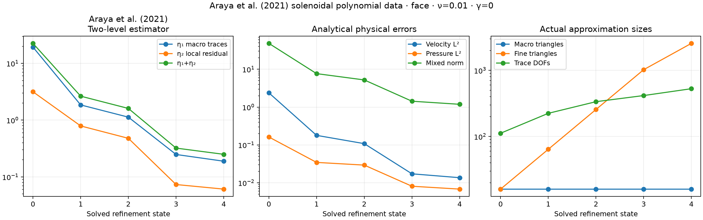
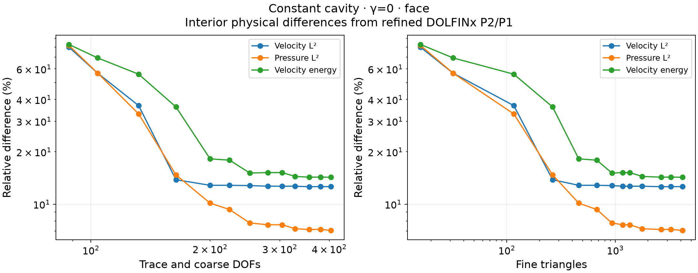

# Stokes–Brinkman estimation and adaptive meshes

This case evaluates the two-level estimator and both refinement strategies of
[L14](../literature.md), Araya, Rebolledo and Valentin's Stokes–Brinkman analysis.
The local formulation uses the velocity-gradient viscous operator,
continuous equal-order velocity and pressure, and residual stabilization. The
first and second levels of the estimator are recorded separately; their sum is
not asserted to be a numerical upper bound with constant one.

## Estimator and two distinct marking rules

For a macroface \(F\), split into segments \(\widetilde F\), define

$$
\eta_{1,F}^2=\sum_{\widetilde F\subset F}
\frac{\|R_F\|_{0,\widetilde F}^2}{H_F},\qquad
R_F=\begin{cases}-[u_h]/2,&F\text{ interior},\\g-u_h,&F\subset\partial\Omega.\end{cases}
$$

The denominator is the **original macroface** length. Interior faces appear
in both adjacent macrocell boundary sums. The second level contains fine-cell
momentum residuals, divergence, and complete pseudotraction jumps or mismatch
with the skeletal field. The pseudotraction is
\(\nu\nabla u_h n-p_hn\). Unlike the Oseen estimator, the Stokes–Brinkman
estimator has no factor \(2^{-2\ell}\):

$$
\eta_2=\Big(\sum_K\eta_{2,K}^2\Big)^{1/2},\qquad \eta=\eta_1+\eta_2.
$$

`adapt_flow_macros` implements Algorithm 1. It computes
\(\eta_K=\eta_{2,K}+\sum_{F\subset\partial K}\eta_{1,F}\), marks
\(\eta_K\geq\theta\max_T\eta_T\), and refines the selected macrotriangles.
Conforming red–green closure is explicit. Each child retains its parent's local
subdivision count: no independent local refinement accompanies this step.
The optional `macro_refiner="longest-edge"` uses conforming longest-edge
propagation with the same indicator and inherited local resolution. This
choice controls shape deterioration during repeated local marking; numerical
records identify the closure and the minimum macro angle.

`adapt_flow(..., estimator_variant="stokes-brinkman-2021")` implements
Algorithm 2. Its face indicator is
\(\eta_F=\eta_{1,F}+\sum_{K\in\omega_F}\eta_{2,K}\). It marks faces above
\(\theta\max_E\eta_E\), then bisects only the segment or tied segments
attaining the maximum first-level indicator **within each marked face**.
If \(\eta_{1,F}<\sum_{K\in\omega_F}\eta_{2,K}\), every adjacent local mesh
is also refined. Uniform rational-grid closure resolves all new trace
breakpoints. This closure, the threshold and the stopping limit are declared
parameters; the paper does not specify its historical mesh connectivity.
An alternative `local_refiner="longest-edge"` closes each new trace vertex
by refining only the necessary local boundary triangles and their conforming
neighbors. By default, local-error dominance refines all triangles of the
selected local mesh once. With `local_error_marking="maximum"`, the fine-cell
contributions to \(\eta_{2,K}^2\) instead select cells whose contribution norm
is at least \(\theta\) times its local maximum. An interior fine-face residual
is split equally between its two adjacent cells; their sum preserves the
published local indicator. Every triggered local mesh is refined. L14 does
not prescribe this within-local selection, which is an explicit implementation
choice. This avoids imposing a uniform grid throughout a macrocell
solely to resolve a small boundary segment. The actual local meshes replace
uniform subdivision counts, and `max_local_cells` supplies an explicit cap.

Both APIs require full Dirichlet data for this estimator. They preserve the
original linear-system tolerances and expose a separate stop reason when a
requested resolution exceeds the configured memory cap.

`solve_flow` and `solve_brinkman` also accept `local_meshes`, an explicit tuple
of conforming triangular partitions, one per macrocell. Each partition must
cover its macrocell; the adaptive closure additionally resolves new skeletal
breakpoints. Supplying these meshes replaces uniform `local_refinement`;
the returned solution retains the
actual local meshes for evaluation, residual integration and visualization.
`local_refiner` controls their adaptive closure, while `macro_refiner` controls
the distinct operation of changing the macro partition.

## Polynomial problem and viscosity

On the unit square, the campaign uses

$$
\psi=128x^2(x-1)^2y^2(y-1)^2,\qquad
u=(\partial_y\psi,-\partial_x\psi),\qquad
p=150(x-1/2)(y-1/2),
$$

with \(f=-\nu\Delta u+\nabla p\), zero velocity boundary data, and zero
mean pressure. Here the symbol \(\nu\) denotes viscosity; the vector field
in the display is \(u\). The two viscosities are 1 and \(10^{-2}\).
Derivatives and forces are computed analytically from the polynomial.

The printed component ordering in §5.3 is not solenoidal. This experiment
states the divergence-free streamfunction convention explicitly. Consequently,
it is a verification with the published pressure, amplitudes and approximation
families, rather than an assertion that an incompatible printed component pair
solves the incompressible equations.

Six uniform series use local P3/P3, skeletal degrees 0, 1 and 2, and
\(H=1/2,1/4,1/8,1/16,1/32\). Each macrotriangle contains one local triangle.
The macro grid is a declared structured crisscross mesh. The physical velocity
and pressure L2 errors and the paper's mixed norm are integrated independently
of the discrete residual. Adaptive experiments use \(\theta=0.5\), four
refinement steps, and keep the two marking strategies separate.

The effectivity reported here is always \((\eta_1+\eta_2)/\text{error}\).
The preprint's Tables 1–2 contain entries whose printed effectivity instead
matches \(\eta_1/\text{error}\), while Tables 3–4 contain sum-based entries.
That printed column is therefore not a universal numerical equality check.
The individual errors and estimator components remain the quantities used for
comparison.


At \(H=1/32\), the measured mixed errors and effectivities are:

| Viscosity | Trace degree | Mixed error | η / mixed error |
|---:|---:|---:|---:|
| 1 | 0 | 0.568624 | 0.8280 |
| 1 | 1 | 0.00528972 | 4.2709 |
| 1 | 2 | 0.000163361 | 16.5335 |
| 0.01 | 0 | 39.1393 | 0.5613 |
| 0.01 | 1 | 0.192249 | 0.4600 |
| 0.01 | 2 | 0.000125147 | 0.3722 |

The curves resolve approximation order and viscosity sensitivity, but do not
coincide in every component with the printed tables. The solenoidal component
convention, declared mesh and computable polynomial inverse constant are part
of this experiment's specification. Identical historical inputs are not
established, and no estimator factor is adjusted to fit the tabulated values.
Effectivity below one is compatible with an estimate having an unspecified
reliability constant; it is not a guaranteed unit-constant upper bound.

The two adaptive campaigns start from different trace spaces: Algorithm 1 uses
P0 and Algorithm 2 uses P1 for this polynomial test. Their work counts and
accuracy therefore describe separate configurations, rather than an efficiency
ranking of the marking rules. After four refinement steps:

| Viscosity | Strategy | Macro / fine triangles | Velocity L2 error | Pressure L2 error | Mixed error |
|---:|---|---:|---:|---:|---:|
| 1 | Macro, P0 trace | 1,124 / 1,124 | 0.0199278 | 0.636720 | 1.21186 |
| 1 | Face, P1 trace | 16 / 4,096 | 0.000909202 | 0.0448634 | 0.0760168 |
| 0.01 | Macro, P0 trace | 1,832 / 1,832 | 1.38933 | 0.469148 | 73.1837 |
| 0.01 | Face, P1 trace | 16 / 2,560 | 0.0136072 | 0.00679364 | 1.18485 |





## Regularized cavity and independent classical reference

The cavity uses \(ν=1\), \(γ=0\) or \(10^4 I\), zero volume force and zero mean
pressure. On the top wall its velocity is \((16x^2(1-x)^2,0)\); the other walls
are stationary. This continuous corner-compatible lid is a declared variation
of the cavity in §5.4, whose corner convention and adaptive threshold are not
specified. It is not presented as an identical reconstruction of Figures 2–3.
Both adaptive strategies use local P2/P2 and P0 traces in this test.

The independently assembled conforming P2/P1 reference uses DOLFINx 0.9.0 and
PETSc/MUMPS on seven nested grids, from \(8\times8\) through
\(512\times512\) squares, each split into two triangles. The final system has
2,364,419 unknowns. The residual includes every pressure equation after the
zero-mean gauge is restored. The reference's own last refinement differences
are separate from the MHM differences:

| Drag | Relative velocity L2 change | Relative pressure L2 change | Relative velocity H1 seminorm change |
|---:|---:|---:|---:|
| 0 | 0.0000260% | 0.002027% | 0.005415% |
| 10,000 | 0.03491% | 0.002316% | 0.5481% |


Comparison norms integrate over every actual MHM fine triangle, including
independent values at macro interfaces. Gaussian orders 12, 20 and 28 check
intersections with the continuous reference. The maximum order-20 to order-28
change in the relative energy difference is 0.00060 percentage point. For
\(e=u_h-u_{\rm ref}\), the velocity energy norm here is
\(\big(\|\nabla e\|^2+\gamma\|e\|^2\big)^{1/2}\). After four adaptive
steps, the differences relative to the corresponding reference norm are:

| Drag | Strategy | Macro / fine triangles | Velocity L2 | Pressure L2 | Velocity energy |
|---:|---|---:|---:|---:|---:|
| 0 | Macro | 570 / 570 | 5.904% | 8.996% | 18.692% |
| 0 | Face/local | 16 / 808 | 13.272% | 19.071% | 25.846% |
| 10,000 | Macro | 146 / 146 | 28.000% | 70.231% | 30.688% |
| 10,000 | Face/local | 16 / 1,576 | 17.378% | 45.150% | 15.856% |

For the high-drag reference, its last relative energy increment is about
0.395%, well below the smallest MHM energy difference in the table. This
distinguishes reference sensitivity from the remaining coarse-trace and local
approximation error; it does not make the numerical reference exact. Neither
the estimator nor its divergence component decreases monotonically in every
adaptive sequence. Four steps are a finite verification campaign, not an
assertion that the chosen meshes have reached a prescribed accuracy.


## Constant lid and corner singularities

The separate constant-lid case uses \(u=(1,0)\) on the open top edge and zero
velocity on the other open edges, as in the cavity model of L14 §5.4. The
MHM boundary functional integrates that discontinuous trace directly. Values
at the two isolated corners have zero boundary measure. The conforming
Taylor–Hood sequence sets corner nodes to zero and interior top-edge nodes
to one, giving a mesh-dependent continuous approximation to the same trace.
Finite-element approximation of nonsmooth Stokes boundary data, including
the lid-driven cavity, is analyzed by
[Durán, Gastaldi and Lombardi (2019)](https://arxiv.org/abs/1912.04962).

The jumps at the upper corners do not belong to the global H1/2 trace space.
Global velocity-gradient energy and pressure L2 norms therefore cannot be
used as convergent finite-error targets for this singular problem. The
comparison retains the global velocity L2 norm and evaluates pressure,
velocity-gradient and energy differences on a fixed interior domain: the
unit square with two upper corner boxes of side 1/32 removed. Every MHM fine
triangle is intersected geometrically with that domain before quadrature;
points are not merely filtered from an uncut rule. The pressure gauge is
the same zero mean on the entire square in both methods.

The estimator remains a computable refinement indicator, but the usual
global-energy reliability assumptions do not automatically extend to this
discontinuous datum. Increasing or noncontracting global indicators and
growing corner peaks are consequently not interpreted as error convergence.
The constant and regularized lid records remain separate configurations.

The constant-lid DOLFINx reference uses five meshes, from 32×32 to
512×512 rectangles split into triangles. Its final refinement increments
are listed separately from any MHM difference; they are numerical reference
checks, not exact error estimates.

| Drag | Global velocity L2 | Interior velocity L2 | Interior pressure L2 | Interior velocity H1 seminorm |
|---:|---:|---:|---:|---:|
| 0 | 0.4902% | 0.001465% | 0.07148% | 0.1642% |
| 10⁴ | 1.823% | 0.03543% | 0.01044% | 0.5456% |


The fixed-topology Stokes series with \(\theta=0.5\) and selective local
refinement contains 25 solved states. Its global size increases from 88 to
404 trace-plus-coarse unknowns. Interior velocity differences decrease from
80.0% to 13.8% by 164 unknowns, then remain near 12.6%; the final pressure
and velocity-energy differences are 7.06% and 14.28%. Increasing the local
resolution to 4,152 fine triangles therefore does not, by itself, remove the
remaining approximation error. These physical norms distinguish
error reduction from concentration of the mesh near singular corners.



A second face/local configuration uses \(\theta=0.1\) for 21 solved
states. It reaches 520 global unknowns and 26,552 fine triangles on the same
16 macrotriangles, retaining a minimum angle of 45 degrees. Its interior
differences are 5.010% in velocity L2, 3.723% in pressure L2 and 6.979% in
velocity energy. The global velocity L2 difference is 5.003%; pressure
and gradient comparisons remain restricted to the interior domain. Changing
the final norm quadrature from order 20 to 28 changes the relative energy
difference by 0.000054 percentage point. The different maximum-marking
threshold and the local resolution are explicit parts of this configuration;
the two sequences are not interchangeable accuracy claims based only on
global unknown counts.


For macro adaptation, conforming longest-edge closure retains a minimum angle
of 45 degrees in the recorded constant-lid series. With \(\theta=0.1\),
the Stokes configuration reaches 5,776 trace-plus-coarse unknowns and 1,126
macrotriangles. Its final interior differences are 7.103% in velocity L2,
10.482% in pressure L2 and 22.319% in velocity energy. The physical history
also reaches a plateau while refinement continues around the two singular
corners. Thus a small geometric scale at those corners does not establish
that the remaining interior field is resolved.


For constant-lid Brinkman flow, the macro sequence reaches 19,382 global
unknowns and 3,798 macrotriangles. Relative interior differences are 9.407%
in velocity L2, 33.966% in pressure L2 and 12.214% in velocity energy.
The final four refinement steps leave these interior quantities essentially
unchanged while resolving smaller corner scales. The result documents the
behavior of the stated maximum-marking rule for singular data; it does not
establish that the interior pressure is accurately resolved.


The Brinkman face/local strategy with \(\theta=0.5\) contains 25 solved
states. Its final 664 global unknowns and 11,246 fine triangles give interior
differences of 5.008% in velocity L2, 9.177% in pressure L2 and 5.034% in
velocity energy. The order-20 to order-28 energy comparison changes by
0.000028 percentage point. The physical history records the substantial
reduction after local and trace refinement, including its nonmonotone
intermediate steps; it is distinct from a claim that the global indicator
contracts for discontinuous lid data.


The component profiles use independent fine-cell pieces, including both
values wherever a profile coincides with a macro interface. Gray rug ticks
identify actual macroface intersections. Upper-layer maps enlarge the vertical
axis; they do not use an equal horizontal-to-vertical aspect ratio. For
\(γ=10^4\), the window is \(0.96\leq y\leq1\), four viscous-layer
lengths at \(ν=1\). Common velocity-magnitude limits are used for the reference
and MHM panels, with a separate scale for the vector difference.

## Reproducible numerical records

`examples/solve_stokes_adaptive.py` writes digested field archives, actual
macro meshes, both estimator components, mixed errors and physical L2 norms.
The uniform and adaptive campaigns run separately from CI:

```sh
pixi run --locked -e test-core python examples/solve_stokes_adaptive.py \
  --strategy uniform --viscosity 0.01 --trace-degree 1
pixi run --locked -e test-core python examples/solve_stokes_adaptive.py \
  --strategy macro --viscosity 0.01 --iterations 4
pixi run --locked -e test-core python examples/solve_stokes_adaptive.py \
  --strategy face --viscosity 0.01 --trace-degree 1 --iterations 4
pixi run -e fem python examples/solve_cavity_reference.py --levels 8 16 32 64 128 256 512
pixi run -e notebooks python examples/compare_stokes_cavity.py
pixi run -e notebooks python examples/plot_stokes_adaptive.py
```

The regression suite checks the element and face formulas independently,
including sums outside square roots, ties, zero indicators, inherited local
resolution and actual solves. These tests establish discrete contracts;
adaptive contraction and optimality are not inferred from them.
