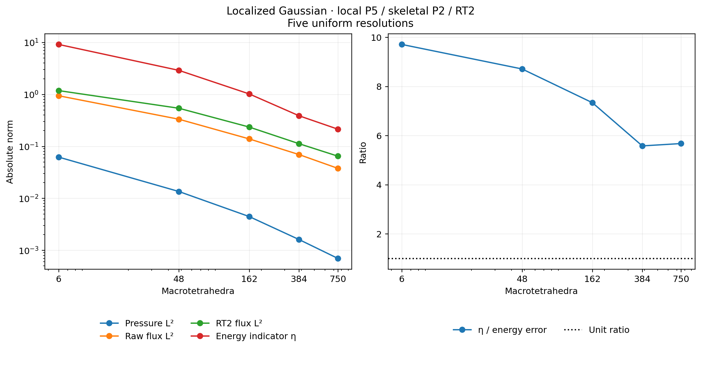
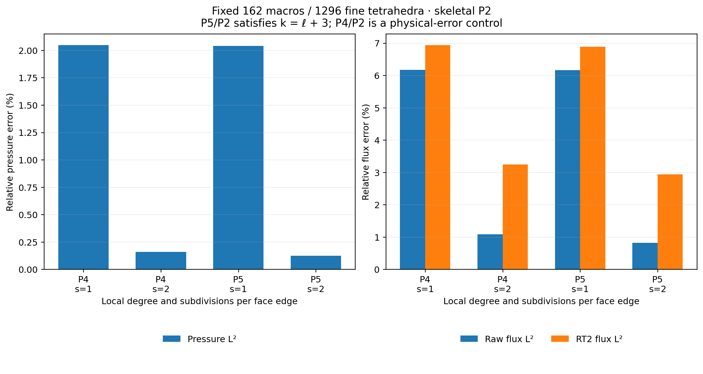
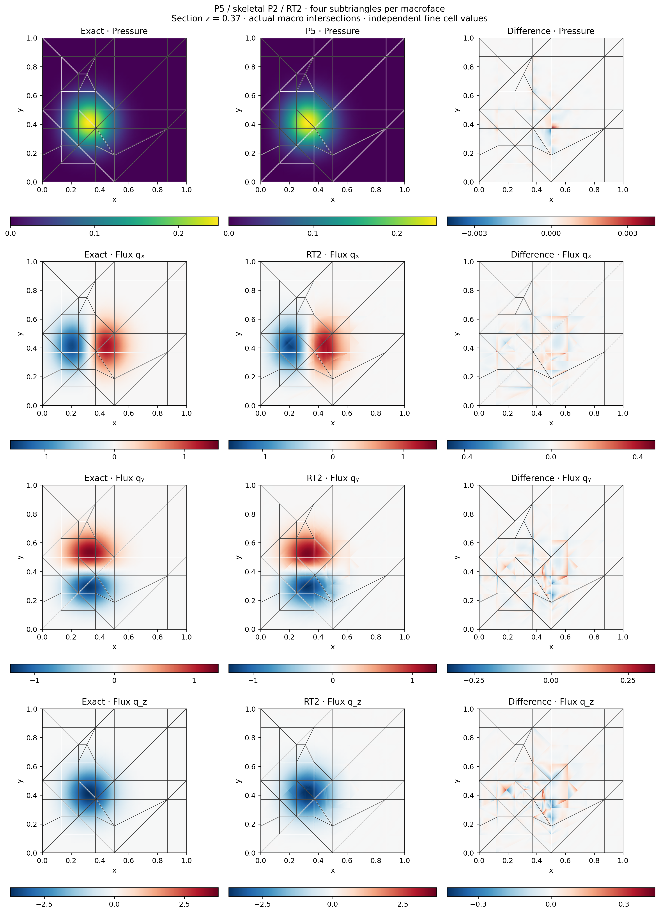
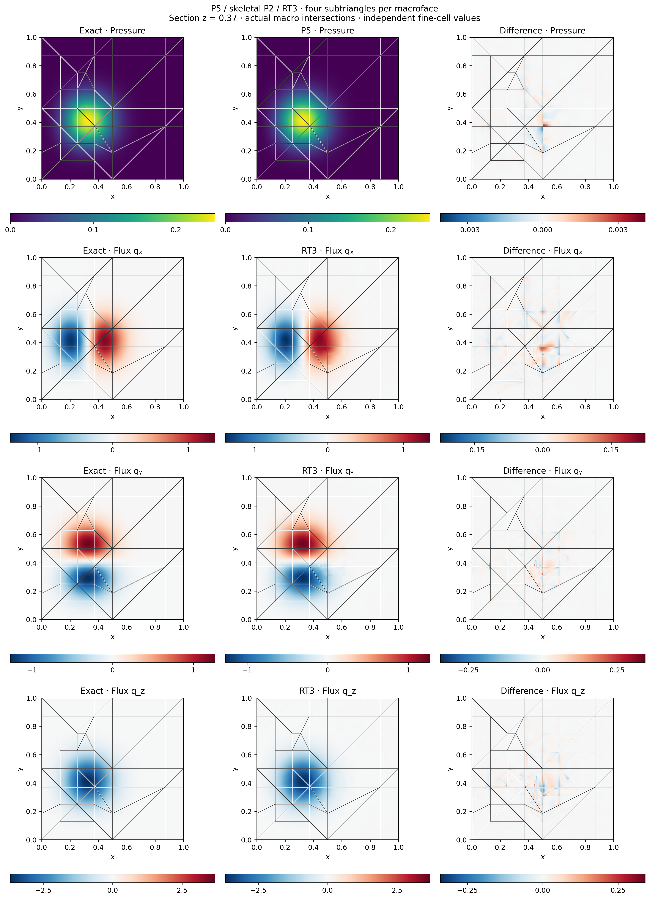
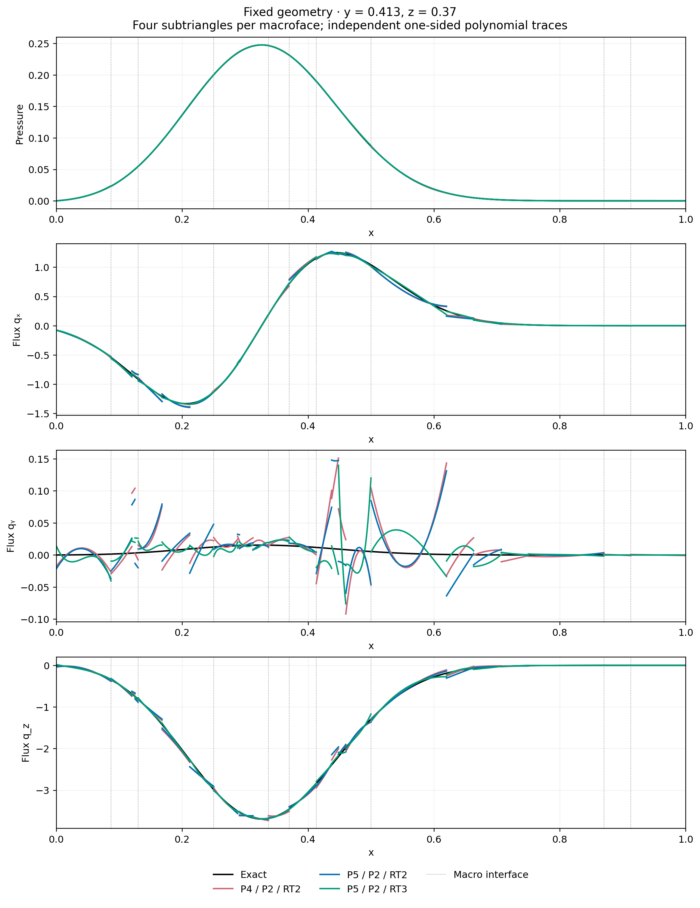

# General tetrahedral degree and admissible P5/P2 estimation

The tetrahedral scalar basis accepts every positive polynomial degree. Its
nodes are the equispaced barycentric lattice, ordered by vertices, edges,
faces and cell interior. The P1–P4 ordering and arithmetic are preserved.
Higher degrees use a falling-factor recurrence for values, gradients and
Hessians, without constructing expanded monomial coefficients. This avoids
that additional source of cancellation; it does not remove the intrinsic
conditioning of high-degree equispaced interpolation.

For a barycentric coordinate \(x\), the one-dimensional factors satisfy

$$
F_0(x)=1,\qquad F_j(x)=F_{j-1}(x)\frac{kx-j+1}{j}.
$$

Differentiating this recurrence once and twice gives the tabulated derivatives.
Physical gradients and Hessians use the affine tetrahedron map. The
value/gradient-only path does not allocate Hessians. A general-degree basis
is distinct from a formulation's own degree and compatibility contracts.

## Independent operator checks

P5 and P6 values, first derivatives and all Hessian entries agree with native
Basix tabulation after matching physical nodes. Independent DOLFINx/UFL forms
check the anisotropic stiffness, nonconstant source and every degree-two face
coupling on a sheared tetrahedron. Additional tests cover cardinality,
partition of unity, exact polynomial derivatives, positive mass, the single
constant stiffness null mode, shared-node permutations and P8/P12 evaluation.
Complete P5/P2 and P6/P2 quadratic Darcy patches include nonzero sources and
inhomogeneous boundary data.

Assembly quadrature must resolve the selected polynomial products and data.
The shared tetrahedral diffusion operator uses at least \(k+2\) Duffy points
per coordinate. This exactness statement concerns polynomial products;
nonpolynomial sources and error norms require separate checks.

## Localized analytical problem

On the unit cube, use \(A=I\), homogeneous exterior pressure and

$$
\begin{aligned}
p(x)&=100\prod_{i=1}^3x_i(1-x_i)
       \exp[-30(x_i-c_i)^2],\\
c&=(0.3,0.4,0.6),\qquad q=-\nabla p,\qquad f=-\Delta p.
\end{aligned}
$$

Analytical differentiation supplies the source and flux. Relative errors use
the independently integrated volume norms
\(\lVert p\rVert_{L^2}=0.121655888888664\) and
\(\lVert q\rVert_{L^2}=1.25833145735624\). These are the same fields as the
[three-dimensional reconstruction study](reconstruction3d.md).

The sufficient degree condition for the estimator of
[Barrenechea, Martins, Pereira and Valentin](https://doi.org/10.1137/24M1673073)
is \(k\geq\ell+d\), together with \(\ell\leq m\leq k\).
The present local P5 / skeletal P2 configuration satisfies the three-dimensional
boundary case \(5=2+3\). Both RT2 and RT3 reconstructions satisfy the stated
range for \(m\). This is an original analytical verification, not a historical
figure reproduction.

## Five macro resolutions

The uniform sequence has \(6n^3\) macrotetrahedra for \(n=1,\ldots,5\),
one fine tetrahedron per macrocell, and one P2 normal-flux polynomial per
macroface. Coarse Gaussian integration uses assembly orders 34 and 18 for
\(n=1,2\); subsequent levels use 12. Error checks use 34/38, 18/22 and
12/14, respectively. Every reported pressure, raw-flux and RT-flux norm is
checked at both orders. The largest absolute change is below
\(5.1\times10^{-10}\).

| Macrocells | Pressure L2 (%) | Raw flux L2 (%) | RT2 flux L2 (%) | Effectivity |
|---:|---:|---:|---:|---:|
| 6 | 50.969092 | 74.664683 | 93.823207 | 9.70686 |
| 48 | 11.113485 | 26.410964 | 42.937140 | 8.70914 |
| 162 | 3.664716 | 11.044784 | 18.676529 | 7.33559 |
| 384 | 1.322437 | 5.514690 | 8.927786 | 5.57765 |
| 750 | 0.575218 | 3.001290 | 5.149386 | 5.67315 |




The errors decrease over all five recorded levels. The indicator-to-energy-error
ratio remains greater than one in this sequence, but this finite set is not a
proof of reliability for arbitrary meshes or data. The measured ratio includes
flux defect, nonconformity, divergence defect and data oscillation.

## Fixed geometry and reconstruction order

A separate control fixes 162 macrotetrahedra and 1,296 fine tetrahedra. Subdivision
\(s=1\) assigns one P2 polynomial per original macroface; \(s=2\) assigns
independent P2 polynomials to its four subtriangles. P4/P2 records are retained
as physical-error comparisons only: they do not satisfy \(k\geq\ell+3\).

| Local degree | Subdivision | Reconstruction | Pressure L2 (%) | Raw flux L2 (%) | Reconstructed flux L2 (%) |
|---:|---:|---:|---:|---:|---:|
| 4 | 1 | RT2 | 2.046996 | 6.173829 | 6.936656 |
| 4 | 2 | RT2 | 0.159770 | 1.087139 | 3.242354 |
| 5 | 1 | RT2 | 2.040548 | 6.165486 | 6.888199 |
| 5 | 2 | RT2 | 0.124447 | 0.816917 | 2.936305 |
| 5 | 2 | RT3 | 0.124447 | 0.816917 | 1.472781 |




RT3 in the final row reconstructs the **same** P5 pressure and skeletal field
as RT2; it does not solve another primal system. The canonical normal moments
and continuous-test equilibrium residuals are below \(2.7\times10^{-15}\).
The corresponding indicator ratios are 22.6545 for RT2 and 15.4024 for RT3.
Canonical reconstruction is not an unconstrained L2 projection of the raw
flux, so increasing its degree does not imply monotonic error reduction.
Here the raw P5 gradient has degree four and is not generally contained in RT3.







The slice is \(z=0.37\); profiles use \(y=0.413\). Every point is evaluated
in its owning fine tetrahedron using the archived RT basis. Disconnected
triangles and profile intervals preserve separate interface values. Exact and
numerical component panels share limits, while signed differences have their
own symmetric limits. Volume norms, rather than slice samples, quantify error. The chosen profile lies
near the zero of the exact transverse component; its signed absolute deviations
remain visible even when the combined vector norm is small.
The continuous local moment conditions do not impose separate DG0 source
balances on each fine tetrahedron; those residuals are recorded separately.

## Reproduction

```bash
pixi run --locked -e test-core python -m examples.solve_tetra_pk uniform --workers 4
pixi run --locked -e test-core python -m examples.solve_tetra_pk fixed --workers 4
pixi run --locked -e test-core python -m examples.tetra_pk_reconstruction
pixi run -e notebooks python -m examples.plot_tetra_pk
```

Records in `examples/results/tetra-pk` include quadrature checks, source and
archive digests, physical moments and the executed reconstruction basis.
Notebook 64 checks the archived data and displays the figures without rerunning
the numerical campaign. Run these commands from a repository checkout containing
the generated field archives. Release archives contain installation and build
sources; scientific examples, records and notebook resources remain in the
repository.
