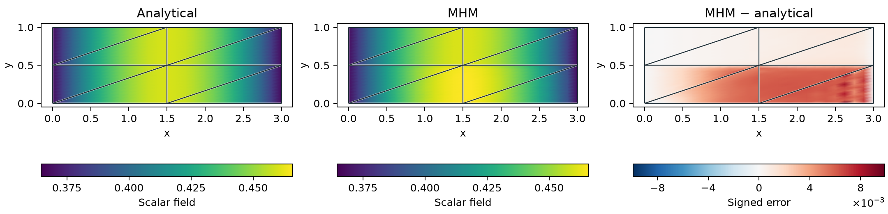
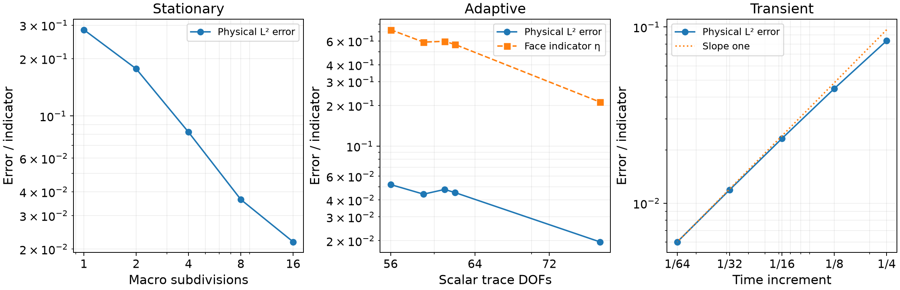

# Darcy-coupled transient transport

`solve_transient_transport` advances

$$
\rho\,\partial_t u-\nabla\!\cdot(D\nabla u)
       +\nabla\!\cdot(\beta u)+cu=f
$$

with backward Euler, continuous local Pk fields, and the conservative hybrid
Robin trace. Capacity is positive, and the spatial coefficients are stationary;
sources and boundary data may depend on time. Both Galerkin and consistent SUPG
testing include the time residual. In particular, the previous solution enters
through the same weighted mass form as the current time derivative.

`OfflineHybridSystem` prepares local and global factors once per distinct time
increment. Changes in sources and boundary values only rebuild loads. The
reported `operator_builds` counts these prepared time-step operators; it is not
a performance speedup measurement.

For long trajectories, `output_steps` selects the one-based step indices retained
in the result. Every time step is computed; `integration_times` records the entire
grid, while `times`, `solutions` and balance records refer to the selected outputs.
The optional `on_step(step, time, solution, balance)` callback receives read-only
numerical arrays after each computed step, including steps omitted from the
returned history. This permits checkpointing without keeping every state in RAM.
Callback exceptions close the prepared local and global factorizations.

With `check_original=True`, every time step also passes the shared verification
of the original local equations, free weak trace equations and physical moments,
with tolerance $10^{-10}$ relative to the physical right-hand side. Prescribed
trace values are moved to that right-hand side. This check leaves the executed
solution unchanged and performs no correction. `original_residual_norms` and
`original_rhs_norms` record all computed steps in `integration_times[1:]` order,
including steps omitted from the retained field history. Algebraic satisfaction
does not establish approximation accuracy or inf-sup stability.

## Conservative Darcy velocity and dispersion

Section 5.4 of [Harder, Paredes and Valentin (2015)](https://doi.org/10.1137/130938499)
couples a stationary Darcy field to transport with hydrodynamic dispersion.
`solve_darcy_transport` accepts locally H(div)-conforming RT and BDM Darcy
solutions, including RT moment reconstructions. It evaluates their actual
physical vector polynomials without changing the Darcy approximation:

$$
\beta=q_h,\qquad
 D(q_h)=(\alpha_m+\alpha_t|q_h|)I+
     (\alpha_l-\alpha_t)\frac{q_h\otimes q_h}{|q_h|}.
$$

At zero flux the tensor equals \(\alpha_m I\). The coefficients satisfy
\(\alpha_m>0\) and \(\alpha_l\ge\alpha_t\ge0\). Within a two-dimensional RT0
triangle, \(\nabla q_h=bI\), where \(b=\nabla\!\cdot q_h/2\), so its broken
tensor divergence away from zero flux is

$$
\nabla\!\cdot D=(2\alpha_l-\alpha_t)b\frac{q_h}{|q_h|}.
$$

This derivative is included in SUPG. At isolated zero-flux points the formula is
understood almost everywhere; no derivative across a material interface is
inserted into a fine-element residual.

The transport fine triangulation matches the Darcy fine triangulation.
The coupling passes the actual Darcy partitions to every transport operator;
matching cell counts alone is insufficient. An explicit mesh override must
preserve their points and connectivity. Standalone heat and transient transport
also accept validated `local_meshes`, which take precedence over uniform
refinement and define both the old-state interpolation and the new-state forms.
`MacroCoefficient` and `RT0DarcyVelocity` preserve the macro side when evaluating
broken coefficients. A barycentric membership check validates each fine-cell
location; nearest-centroid selection alone is insufficient. Raw primal Darcy
gradients are not silently substituted for a conservative velocity.

With `velocity_representation="primal"`, the coupling instead retains the raw
Darcy volume vector \(q_h=-K\nabla p_h\) and the Darcy skeletal multiplier
\(\lambda_D\) as numerical normal flux. It integrates the Galerkin advection
form directly:

$$
a_{\mathrm{adv},K}(u,w)
=-\int_K q_hu\cdot\nabla w
+\frac12\int_{\partial K}\lambda_Duw.
$$

This pair preserves separate volume and skeleton approximations. It is not
asserted to be H(div)-conforming: replacing its interface distributions by a
broken divergence would give a different operator. The material's broken tensor
derivative must be supplied explicitly as `permeability_gradient`; use `0.0`
for a piecewise constant field. Darcy and transport face partitions and degrees
may differ. Strong-residual stabilization is supported for the H(div) path and
is rejected for the primal volume/numerical-normal pair.

Exterior `diffusive_flux` data prescribe \((-D\nabla u)\cdot n\). This permits
strong inflow concentration together with homogeneous diffusive outflow and
wall conditions, as in the published transport configuration. The package also
supports explicitly prescribed Robin data through `neumann`.

## A selected heterogeneous realization

`examples/transport_random_campaign.py` declares the first heterogeneous
configuration from Section 5.4 on the full domain: 512 macrotriangles, 64 fine
P3 triangles per macro, Darcy P2 traces on two segments, and transport P2 traces
on eight segments. It uses unit capacity, zero initial concentration and source,
strong concentration one at the left boundary, and zero diffusive flux on the
other exterior faces. Backward Euler uses a time increment of 0.001 up to time
seven, with the dispersion parameters stated above.

The saved permeability array has 64 by 16 values. Its selected realization uses
PCG64 seed 20261003 with independent base-ten logarithms uniform on [-2,1].
The selected Darcy drive prescribes pressure three and zero on the left and
right sides, with zero normal flux on the horizontal sides. The article does
not supply its array, probability law, seed or exterior Darcy drive; these
declared inputs do not identify its historical realization. Acquisition reads
the actual saved array rather than regenerating it from the seed.

```bash
pixi run --locked -e test python -m examples.transport_random_campaign
```

Each observed field retains its physical nodal coefficients, executed basis
matrices and orientation maps. Interior transport multipliers use half the
Darcy numerical normal velocity, natural exterior multipliers represent
diffusive flux, and removed strong-inflow trace coefficients prescribe no
physical flux. The initial archive is an interpolation. These archives replay
observed fields; they do not restart the integrator. Every computed step records
its original-equation checks and nodal extrema, including steps omitted from
the field history. The Galerkin method does not enforce concentration positivity.

The verified acquisition and replay pilot uses 32 macrotriangles and five time
steps on the same domain and saved material. An independent full assembly using
[Basix 0.9.0](https://github.com/FEniCS/basix/tree/19555f5b629b4090b14014f9db5f2c9ac80984f9),
modules `basix.finite_element` and `basix.polynomials`, agrees at the first and
fifth steps within 7.44e-13 relative in concentration L2 and broken gradient
norms. The interior Robin norm differs by at most 3.53e-12 relative; the natural
diffusive multiplier is zero in both fields. Both executed bases are evaluated
on the same physical norm points. Candidate fields inserted into the independent
original augmented equations have relative residual at most 1.29e-13, with the
physical mass/source and strong-data right-hand side. The native homogeneous
constant-state control preserves concentration one within 1.21e-13 through
five steps. The separate control with the archived heterogeneous Darcy field
and initial concentration one preserves this state within 3.37e-12. This
verifies the original macro weak coupling; it does not make the primal
volume velocity an H(div) field. The reference is an independently
instrumented adapter, separate from the article authors' application and
from a refined continuum reference.

The complete 512-macro trajectory,
quadrature and space/time controls, and independently refined conforming
references remain pending. A classical RT0 velocity is a separate approximation
from the declared primal Darcy volume and skeletal pair.

An independently assembled classical reference uses conforming RT0/P0 for
Darcy and continuous P3 with consistent mass for conservative transport.
The saved material, pressure drive, initial and boundary data, dispersion
law and time step are identical to the selected problem. Five-step pilots
cover the whole domain on 2048 and 8192 triangles. They retain the executed
Basix bases, physical operators, normal orientations, portable coefficients
and strong-boundary dual reactions. The checkpoint contract includes the
executed backward-Euler matrix and predecessor coefficients; replay with one
and two native threads is identical without a fresh field solve. Native
tests independently verify polynomial fields, RT normal integrals, the
physical gauge, constant-state conservation and positive-quadrature norms.

At time 0.005, the 2048-to-8192-triangle increment is 36.15% in Darcy-flux
L2 and 52.72% in concentration H1, using the finer computed norm as denominator.
Same-space q8-to-q10 sensitivity is approximately 1e-15 in that pilot. These
increments leave reference accuracy unresolved; the five steps do not
establish a baseline for the full trajectory to time 7. Nodal undershoots are
retained without clipping. The adapter executes Basix 0.9.0 at the verified
[project revision](https://github.com/FEniCS/basix/tree/19555f5b629b4090b14014f9db5f2c9ac80984f9);
its module is `classical_reference.py`, independently instrumented for this
selected realization. The original classical application's source and
32000-triangle connectivity are unavailable.

The initial temporal control uses the same 2048-triangle spatial discretization
with time steps 0.001, 0.0005 and 0.00025. At the common physical time 0.005,
the concentration H1 increments are 0.5955% and 0.3141%, respectively, using
the finer computed field as denominator. Positive q6/q8 integration gives
the same norms, and all archived checkpoints replay identically with one
and two native threads. These measurements concern one initial time; they
do not establish a resolved full-trajectory reference or the convergence
rate of a smooth analytical problem.

## A five-level temporal verification

The recorded test is an original manufactured problem using the article's
coupling and dispersion law. It does not reproduce the article's unspecified
random permeability realization. On \([0,3]\times[0,1]\), set

$$
K(y)=\begin{cases}1,&y<1/2,\\10,&y\ge1/2,\end{cases}\qquad
 p=3-x,\qquad q=(K(y),0),
$$

and

$$
\begin{aligned}
u&=e^{-t}b(x),\qquad b(x)=1+\frac{x(3-x)}9,\\
f&=e^{-t}\left[-b(x)+\frac{2(\alpha_m+\alpha_lK)}9
                          +\frac{K(3-2x)}9\right].
\end{aligned}
$$

The concentration is prescribed strongly on \(x=0,3\); the remaining exterior
sides have zero diffusive flux. Initial data are \(b\). The layer interface
aligns with the fine and macro meshes, and normal advective and diffusive fluxes
across it are zero. The parameters are \(\alpha_m=10^{-6}\),
\(\alpha_l=10^{-2}\), \(\alpha_t=10^{-3}\), unit capacity, and zero reaction.

Darcy uses RT0/P0 on sixteen fine triangles per macrotriangle. Transport uses
local P3 and degree-two macroface multipliers, with SUPG. Five uniform time grids
contain 4, 8, 16, 32 and 64 steps up to \(t=1\). The exact concentration and
independent error quadratures distinguish temporal truncation from algebraic
residuals.

| Steps | Time increment | L² error at t=1 | Prepared operators |
|---:|---:|---:|---:|
| 4 | 1/4 | 0.08350081 | 1 |
| 8 | 1/8 | 0.04469750 | 1 |
| 16 | 1/16 | 0.02328481 | 1 |
| 32 | 1/32 | 0.01190523 | 1 |
| 64 | 1/64 | 0.00602688 | 1 |

The last doubling gives an observed temporal order of 0.982. The computed Darcy
flux has L² error \(4.79\times10^{-15}\) for this exactly representable field.
The largest discrete balance residual is \(2.19\times10^{-14}\). Error
quadratures of orders 10 and 12 differ by less than \(7\times10^{-17}\).

The [current-source replay](../figures/transport/local-mesh-verification.json)
identifies the campaign and field archive by SHA-256 and reproduces all five
temporal records and all seven saved field arrays bitwise. Its source hashes
describe this replay, separately from the original acquisition. The same
record documents the custom-partition regressions and independent UFL checks
of the backward-Euler Galerkin and SUPG operators.




`total_mass()` integrates \(\rho u_h\) using the capacity-weighted mass moments.
`balance_residuals` sums the original local scalar equations, including reaction
forces from strongly imposed data. It is a discrete weak balance diagnostic;
it is not a claim of fine-element conservation, an independent physical error,
or a positivity certificate.

The source is available as `examples/transport_campaign.py`. Run
`pixi run -e notebooks python -m examples.transport_campaign --collect` to recompute
all levels, or omit `--collect` to render the archived results. The lightweight
test suite separately checks a linear-in-time variable-coefficient patch,
mass preservation with closed boundaries, the heat limit, exact RT0 evaluation,
and the dispersion derivative.
